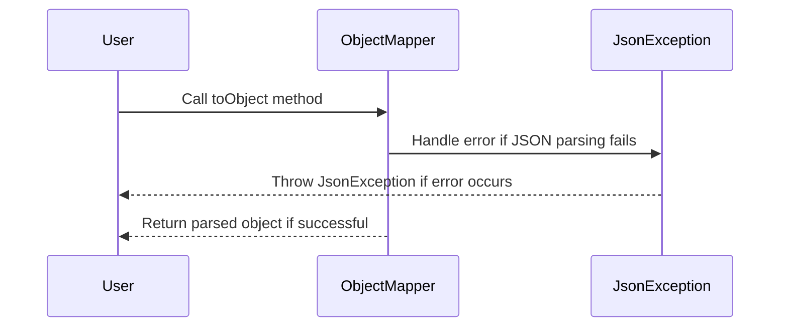

# com.bouqs.json

## Class: JsonException

**com.bouqs.json.JsonException**

```java
public class JsonException extends RuntimeException 
```
The `JsonException` class is a custom exception class that extends the `RuntimeException` class. It is designed to handle runtime exceptions specifically related to JSON parsing and manipulation. This exception can be thrown whenever there is an error encountered during JSON processing, providing developers with a convenient way to handle and propagate such exceptions. The class does not introduce any additional methods or fields beyond those inherited from `RuntimeException`.
## Class: Json

**com.bouqs.json.Json**

```java
public class Json 
```
The `Json` class is a utility class designed for working with JSON data. It provides methods for converting Java objects into JSON strings, parsing JSON strings into Java objects, and working with JSON nodes. 

The class utilizes an `ObjectMapper` instance, which is a powerful library for converting objects to and from JSON. The `Json` class, being a wrapper around `ObjectMapper`, simplifies the process of JSON serialization and deserialization.

The `toJson` method allows you to convert a Java object to its corresponding JSON string representation. It takes an object of any type and returns a JSON string.

The `toNode` method allows you to parse a JSON string and obtain its corresponding JSON node representation. This is useful for accessing specific fields or properties of a JSON document.

The `toObject` methods are used for deserializing JSON strings or files into Java objects. They accept a JSON string or file as input and return an instance of the specified class or type reference.

Overall, the `Json` class provides a convenient way to work with JSON data in a Java application, making serialization, deserialization, and manipulation of JSON objects seamless and straightforward.
### Method: toJson
```java
public String toJson(Object src) {
    try {
        return getMapper().writeValueAsString(src);
    } catch (JsonProcessingException e) {
        throw new JsonException(e);
    }
}
```

### toJson Overview 

The `toJson` method in `com.bouqs.json.Json` class is used to convert an object into its JSON representation. It takes an `Object` as an argument and uses the `getMapper()` method to obtain a mapper object. This mapper object is then used to serialize the `src` object into a JSON string using the `writeValueAsString` method. If any error occurs during the serialization process, a `JsonException` is thrown. Overall, this method allows the software engineer to easily convert an object into a JSON string for further processing or transmission.


### toJson Step by Step  

### Method Explanation: `toJson`

The `toJson` method, defined within the `com.bouqs.json.Json` class, is responsible for converting an object into a JSON string.

#### Step-by-step Description

1. The method takes an `Object` called `src` as input, representing the object to be converted to JSON.
2. It then attempts to convert the `src` object into a JSON string by calling the `writeValueAsString` method on the `getMapper()` object.
3. If the conversion is successful, the resulting JSON string is returned.
4. However, if an exception occurs during the conversion process (e.g., if the `src` object is not serializable to JSON), a `JsonProcessingException` is caught.
5. In this case, a `JsonException` is thrown, which wraps the original exception and provides better error handling and messaging for the caller.

Please note that the `getMapper()` method, mentioned in the `toJson` method, is not defined in the provided code snippet. It is assumed to be a method that retrieves the appropriate JSON mapper configured within the `com.bouqs.json.Json` class.

sequenceDiagram
    participant src
    participant getMapper()
    participant JsonProcessingException
    participant JsonException
    
    src->>getMapper(): Get mapper
    getMapper()-->>src: Return mapper
    src->>JsonProcessingException: Handle exception
    JsonProcessingException-->>JsonException: Throw JsonException
    JsonException-->>src: Throw JsonException

### Method: toNode
```java
public JsonNode toNode(String json) {
    try {
        return getMapper().readTree(json);
    } catch (JsonProcessingException e) {
        throw new JsonException(e);
    }
}
```

### toNode Overview 

The `toNode` method, defined in the `com.bouqs.json.Json` class, takes a `String` parameter named `json` and returns a `JsonNode`. This method is responsible for converting a JSON string into a `JsonNode` object.

The method body consists of a try-catch block. Within the try block, the `getMapper().readTree(json)` statement is used to parse and convert the JSON string into a `JsonNode` object. If the parsing is successful, the converted `JsonNode` is returned.

If an exception of type `JsonProcessingException` is caught during the JSON parsing, a `JsonException` is thrown. This allows the method caller to handle any JSON processing errors that may occur.

Thus, the `toNode` method is essential for parsing JSON strings and converting them into `JsonNode` objects, which can be further processed or utilized in the application.


### toNode Step by Step  

# Method: toNode

The `toNode` method is a functionality provided by the `com.bouqs.json.Json` class. Its purpose is to convert a given JSON string into a `JsonNode` object. 

## Signature
```java
public JsonNode toNode(String json)
```

## Parameters
- `json` (String): The JSON string to be converted into a `JsonNode` object.

## Return Value
- `JsonNode`: The converted `JsonNode` object representing the input JSON.

## Usage

1. Create an instance of the `com.bouqs.json.Json` class.
2. Call the `toNode` method on the instance, passing the JSON string as a parameter.
3. The method will internally use a mapper object (previously instantiated) to read the JSON string and convert it into a `JsonNode` object.
4. If the conversion is successful, the method will return the `JsonNode` object.
5. If any error occurs during the conversion process, a `JsonException` will be thrown.

---
title: toNode (Json)
---

sequenceDiagram
    participant Caller
    participant JsonNode
    participant ObjectMapper
    participant JsonException

    Caller->>ObjectMapper: readTree(json)
    alt Success
        ObjectMapper-->>JsonNode: Return JsonNode
    else Error
        ObjectMapper-->>JsonException: Throw JsonException
    end

### Method: toObject
```java
public <T> T toObject(String content, Class<T> valueType) {
    try {
        return getMapper().readValue(content, valueType);
    } catch (JsonProcessingException e) {
        throw new JsonException(e);
    }
}
```

### toObject Overview 

The `toObject` method in the `com.bouqs.json.Json` class is used to convert a JSON string (`content`) into an object of the specified type (`valueType`). It utilizes a JSON mapper to deserialize the JSON content into the specified object type. If any exception occurs during the deserialization process, a `JsonException` is thrown.


### toObject Step by Step  

# toObject Method

The `toObject` method is a utility method defined in the `com.bouqs.json.Json` class. It takes in two parameters: `content` and `valueType`. The purpose of this method is to convert the given `content` string into an instance of the specified `valueType` class.

Here are the steps involved in the `toObject` method:

1. **Read JSON Content**: The method takes the `content` string and tries to read it as a JSON. The content should be a valid JSON representation.

2. **Create Object**: Using the `valueType` parameter, the method creates a new instance of the specified class. This class should have a corresponding structure that matches the structure of the JSON content.

3. **Map JSON to Object**: The method then maps the JSON content to the newly created object. It assigns the values from the JSON to the corresponding fields or properties of the object.

4. **Return Object**: Finally, the method returns the populated object of type `T`. This object represents the JSON data in the form of a Java object, ready to be used in the application.

It's important to note that this method also handles any exceptions that may occur during the conversion process. If there is an error while processing the JSON content, a `JsonException` is thrown, encapsulating the original exception for further analysis.

With the `toObject` method, you can easily convert JSON data into Java objects within your business domain, enabling you to work with the data in a more convenient and meaningful way.

sequenceDiagram
    participant User
    participant ObjectMapper
    participant JsonException
    
    User->>ObjectMapper: Call toObject method
    ObjectMapper->>JsonException: Handle error if JSON parsing fails
    JsonException-->>User: Throw JsonException if error occurs
    ObjectMapper-->>User: Return parsed object if successful

### Method: toObject
```java
public <T> T toObject(String content, TypeReference<T> valueType) {
    try {
        return getMapper().readValue(content, valueType);
    } catch (JsonProcessingException e) {
        throw new JsonException(e);
    }
}
```

### toObject Overview 

The `toObject` method in the `com.bouqs.json.Json` class is used to deserialize JSON content into an instance of a specified type. 

It takes two parameters: `content`, which is the JSON content to be deserialized, and `valueType`, which is a `TypeReference` object representing the desired type of the deserialized object.

Inside the method, it uses a Jackson `ObjectMapper` (referred to as `getMapper()`) to perform the deserialization by calling the `readValue` method. The deserialized object is then returned.

If an exception occurs during the deserialization process (specifically a `JsonProcessingException`), it is caught and re-thrown as a `JsonException` to handle any errors that may occur during deserialization.


### toObject Step by Step  

## Method: toObject

The `toObject` method is a part of the `Json` class in the `com.bouqs.json` package. It is responsible for converting JSON content into an object of a specified type.

### Parameters:
- `content` (String): The JSON content that needs to be converted into an object.
- `valueType` (TypeReference<T>): The type reference of the object that the JSON content should be converted to.

### Return Value:
The `toObject` method returns an object of the specified type `T`. The type is determined by the `valueType` parameter.

### Steps:

1. Call the `getMapper` method to obtain the JSON mapper.
2. Use the JSON mapper's `readValue` method to convert the `content` string into an object of the specified `valueType`.
3. If any error occurs during the conversion process, a `JsonProcessingException` is caught.
4. If a `JsonProcessingException` is caught, it is wrapped in a `JsonException`. This exception is then thrown.

### Example Usage:

```
Json json = new Json();
String jsonString = "{\"name\":\"John\", \"age\":30}";
TypeReference<Person> valueType = new TypeReference<Person>() {};
Person person = json.toObject(jsonString, valueType);
```

In the example above, the `toObject` method is used to convert a JSON string into an object of type `Person`. The resulting `person` object will have the properties `name` and `age` as defined in the JSON string.




### Method: toObject
```java
public <T> T toObject(File file, Class<T> valueType) {
    try {
        return getMapper().readValue(file, valueType);
    } catch (IOException e) {
        throw new JsonException(e);
    }
}
```

### toObject Overview 

The `toObject` method in class `com.bouqs.json.Json` is responsible for converting a JSON file into a Java object of a specific type. 

It takes two parameters: `file`, which represents the JSON file to be converted, and `valueType`, which is the class of the Java object into which the JSON will be mapped.

Inside the method, it uses the `getMapper()` method to retrieve a `Mapper` object, which is responsible for mapping the JSON data to Java objects. It then uses the `readValue` method of the `Mapper` object to read the JSON file and map it to an object of the specified `valueType` class.

If any IOException occurs during this process, it is caught and rethrown as a `JsonException`.


### toObject Step by Step  

# toObject Method Documentation

This document provides a concise yet comprehensive description of the method `toObject` defined in the `com.bouqs.json.Json` class. The purpose of this method is to convert JSON data stored in a file into an object of a specific type.

## Signature

```java
public <T> T toObject(File file, Class<T> valueType)
```

## Parameters

- `file` (Type: File): The file object representing the JSON data file to be read.
- `valueType` (Type: Class): The class object representing the desired type of the converted object.

## Return Value

- The method returns an object of the specified type (`T`) which represents the deserialized JSON data.

## Exceptions

- `JsonException`: If an IOException occurs during the deserialization process, it will be encapsulated in a `JsonException` and thrown.

## Usage

1. Create an instance of the `com.bouqs.json.Json` class.
2. Call the `toObject` method by providing the following arguments:
   - `file`: A file object representing the JSON data file to be read.
   - `valueType`: A class object representing the desired type of the converted object.
3. Capture the returned object and use it as per your application's requirements.

## Example

```java
// Create an instance of the com.bouqs.json.Json class
Json json = new Json();

// Define the File object representing the JSON data file
File jsonFile = new File("path/to/json/file.json");

// Define the class object representing the desired type of the converted object
Class<MyData> desiredType = MyData.class;

// Call the toObject method to convert the JSON data to the desired object type
MyData convertedData = json.toObject(jsonFile, desiredType);

// Process the converted data as per your application's requirements
// ... 
```

Please note that in the above example, you need to replace `MyData` with the actual class name representing the desired type of the converted object.


### Method: toObject
```java
public <T> T toObject(File file, TypeReference<T> valueType) {
    try {
        return getMapper().readValue(file, valueType);
    } catch (IOException e) {
        throw new JsonException(e);
    }
}
```

### toObject Overview 

The `toObject` method, defined in the `com.bouqs.json.Json` class, is used to deserialize a JSON file into an object of the specified type.

**Parameters:**
- `file` - The JSON file to be deserialized.
- `valueType` - A `TypeReference` object representing the type of the object to be deserialized into.

**Return type:**
- The deserialized object of type `T`.

**Functionality:**
1. The method uses the `getMapper()` method to obtain a JSON object mapper, which is responsible for converting JSON data into Java objects.
2. The `getMapper().readValue(file, valueType)` line of code reads the JSON content from the specified file and deserializes it into an object of the specified type.
3. If any IO error occurs during the deserialization process, an `IOException` is caught and wrapped in a `JsonException` before being thrown.

In summary, the `toObject` method reads a JSON file and converts its content into a Java object of the specified type, providing a convenient way to deserialize JSON data.


### toObject Step by Step  

The `toObject` method, defined in the `com.bouqs.json.Json` class, is responsible for converting a JSON file into an object of a specified type.

Here's how the method works:

1. It takes two parameters: `file` and `valueType`.
   - `file` represents the JSON file that needs to be converted.
   - `valueType` represents the type of object that the JSON should be converted to.

2. Inside the method, it uses a method called `getMapper()` to retrieve an instance of the JSON mapper.
   - The JSON mapper is responsible for converting the JSON file into an object of the specified type.

3. The `readValue` method is then called on the JSON mapper, passing in the `file` and `valueType` parameters.
   - This method reads the JSON file and converts it into an object of the specified type.

4. If an exception occurs during the conversion process, specifically an `IOException`, it is caught and a custom `JsonException` is thrown.
   - This custom exception is a simplified way of reporting any issues that arise during the conversion process.

To summarize, the `toObject` method takes a JSON file and converts it into an object of the specified type using a JSON mapper. It handles any potential issues that may occur during the conversion process.


## Class: JsonFactory

**com.bouqs.json.JsonFactory**

```java
public class JsonFactory 
```
# Class Description: JsonFactory

The `JsonFactory` class is responsible for creating and managing instances of JSON objects. It provides methods and fields that enable efficient JSON object creation and manipulation.

The class includes a public static method `createObjectMapper`, which is used to create and initialize an instance of the `ObjectMapper` class. This method returns the created `ObjectMapper` object.

Additionally, the class has a private static field `defaultJson`, of type `Json`, which is initialized with an instance of `Json` using the `createObjectMapper` method. This `defaultJson` field represents the default JSON object for the factory.

Overall, the `JsonFactory` class serves as a factory for creating and managing JSON objects, providing a convenient interface for working with JSON data.
### Method: createObjectMapper
```java
public static ObjectMapper createObjectMapper() {
    ObjectMapper mapper = new ObjectMapper();
    mapper.findAndRegisterModules();
    mapper.disable(DeserializationFeature.FAIL_ON_UNKNOWN_PROPERTIES);
    mapper.setVisibility(VisibilityChecker.Std.defaultInstance().withFieldVisibility(JsonAutoDetect.Visibility.ANY));
    return mapper;
}
```

### createObjectMapper Overview 

The method `createObjectMapper` defined in the `com.bouqs.json.JsonFactory` class is used to create and configure an instance of the `ObjectMapper` class from the `Jackson` JSON library. 

The method performs the following actions:

1. Creates a new instance of `ObjectMapper`.
2. Automatically scans for and registers any modules present on the classpath.
3. Disables the feature that throws an exception when encountering unknown properties during deserialization.
4. Sets the field visibility to `ANY` for serialization and deserialization.
5. Returns the configured `ObjectMapper` instance.

This method allows for convenient configuration and initialization of the `ObjectMapper` class, which is commonly used for JSON (de)serialization in software development.


### createObjectMapper Step by Step  

## Method Description: createObjectMapper()

The `createObjectMapper()` method is defined in the class `com.bouqs.json.JsonFactory`. It is responsible for creating and configuring an object mapper instance from the Jackson library. 

### Steps:

1. Create a new instance of `ObjectMapper` named `mapper`.
2. Find and register all available Jackson modules with the `mapper`.
3. Disable the feature that throws an exception when encountering unknown properties during deserialization.
4. Set the field visibility for the object mapper to include all fields using the default visibility checker.
5. Return the configured `mapper` instance.

With these steps, the `createObjectMapper()` method ensures that the object mapper is properly initialized and configured to handle JSON serialization and deserialization operations.

---
title: createObjectMapper (JsonFactory)
---

sequenceDiagram
    participant ObjectMapper
    participant DeserializationFeature
    participant VisibilityChecker
    participant JsonAutoDetect
    
    Note over ObjectMapper: Create ObjectMapper instance
    ObjectMapper->>DeserializationFeature: Disable FAIL_ON_UNKNOWN_PROPERTIES
    ObjectMapper->>VisibilityChecker: Set field visibility to ANY
    VisibilityChecker->>JsonAutoDetect: Set default field visibility
    JsonAutoDetect-->>VisibilityChecker: Return updated field visibility
    VisibilityChecker-->>ObjectMapper: Return updated field visibility
    DeserializationFeature-->>ObjectMapper: Return disabled feature
    Note over ObjectMapper: Register modules
    ObjectMapper-->>ObjectMapper: Return configured ObjectMapper

