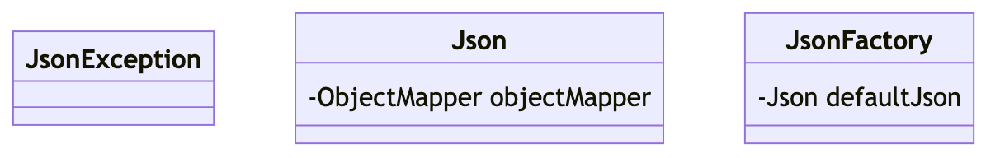
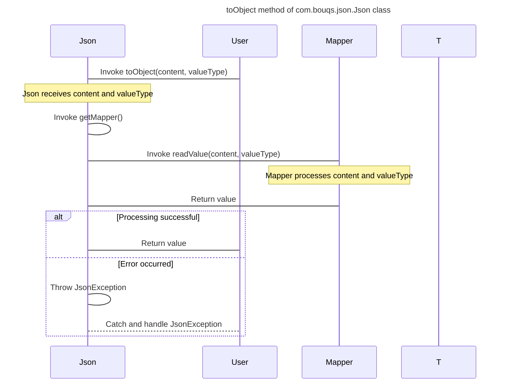
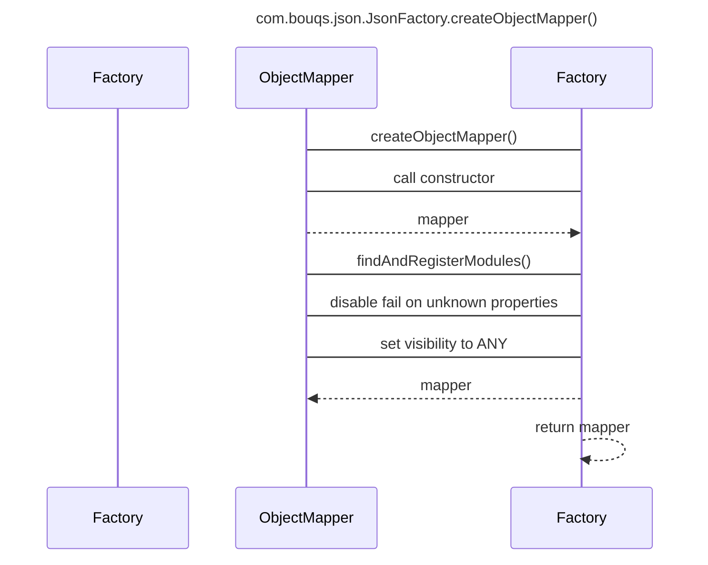

# com.bouqs.json

## Class: JsonException

**com.bouqs.json.JsonException**
# Class Description: `JsonException`

The `JsonException` class is a custom exception that extends the `RuntimeException` class. It is specifically designed to handle exceptions related to JSON (JavaScript Object Notation) processing in a software application.

Instances of the `JsonException` class can be thrown when errors occur during the parsing, generation, or manipulation of JSON data. This class provides a convenient way to handle and propagate JSON-related exceptions in the software code.

Developers can catch instances of `JsonException` and utilize the information within the exception to handle errors gracefully, log necessary details, and take appropriate actions, such as notifying the user or rolling back the current operation.

The `JsonException` class encapsulates common and unique behaviors and properties specific to JSON exceptions, making it a reusable and centralized point for handling such exceptions within a software system.

Despite the lack of specific methods and fields mentioned, the `JsonException` class inherits all the methods and fields from its superclass, `RuntimeException`, which provides access to general exception handling capabilities.

JavaDoc documentation for the `JsonException` class should be included, providing detailed information about the purpose, behavior, and usage of the class for developers who will be using or extending it.## Class: Json

**com.bouqs.json.Json**
The `Json` class is a utility class that provides methods to convert Java objects to JSON representation and vice versa. It uses the ObjectMapper class from the Jackson library for JSON parsing and serialization.

The class offers various methods for converting Java objects to JSON. The `toJson` method takes an object as input and returns its JSON representation as a string. The `toNode` method takes a JSON string as input and returns a JsonNode object representing the JSON structure.

There are also methods for converting JSON back to Java objects. The `toObject` method can be used to convert a JSON string or file to a Java object of a specified class. It also supports conversion to a Java object using a `TypeReference` for complex object types.

Internally, the `Json` class has a private field named `objectMapper` of type `ObjectMapper`. This field is used to configure and perform the JSON serialization and deserialization operations.

Overall, the `Json` class provides a convenient and efficient way to work with JSON data in a Java application.### Method: toJson
```java
public String toJson(Object src) {
    try {
        return getMapper().writeValueAsString(src);
    } catch (JsonProcessingException e) {
        throw new JsonException(e);
    }
}
```

### toJson Overview 

The `toJson` method in the `Json` class, located in the `com.bouqs.json` package, is responsible for converting an object into its corresponding JSON representation.

It takes an input parameter `src`, which can be any Java object. The method internally calls the `getMapper()` function, which retrieves an instance of a JSON mapper (the specific implementation is not mentioned).

The `writeValueAsString()` function of the mapper is then called with the `src` object as the parameter. This function converts the object into a JSON string representation.

If any issues occur during the conversion process, such as JSON processing exceptions, a `JsonProcessingException` is caught. In this case, it is wrapped inside a `JsonException` and rethrown.

The method returns the resulting JSON string representation of the input object.

### toJson Step by Step  

The `toJson` method defined in the `com.bouqs.json.Json` class is responsible for converting an object to its JSON representation. Here is a step-by-step description of what the method does:

1. The method takes an `Object` parameter named `src`, which represents the object to be converted to JSON.
2. Inside the method, there is a `try-catch` block to handle any `JsonProcessingException` that may occur during the JSON serialization process.
3. The `getMapper()` method is called to retrieve a configured `ObjectMapper` instance, which is responsible for converting Java objects to JSON.
4. The `writeValueAsString(src)` method is invoked on the `ObjectMapper` instance to serialize the `src` object to a JSON string.
5. If the serialization is successful, the JSON string representation is returned by the `toJson` method.
6. If a `JsonProcessingException` occurs during the serialization process, it is caught by the `catch` block.
7. The caught exception is wrapped into a custom `JsonException` and then thrown to indicate that an error occurred during the JSON serialization process.

```mermaid
sequenceDiagram
    title toJson method for class com.bouqs.json.Json

    participant src
    participant Json
    participant getMapper()
    participant JsonProcessingException
    participant JsonException

    src->>Json: toJson(src)
    alt Json.getMapper()
        Json->>getMapper(): getMapper()
        alt getMapper().writeValueAsString()
            getMapper()-->>Json: writeValueAsString(src)
        else JsonProcessingException
            note over JsonProcessingException: Catch Exception
            JsonProcessingException->>JsonException: JsonException(e)
        end
    else JsonProcessingException
        note over JsonProcessingException: Catch Exception
        JsonProcessingException->>JsonException: JsonException(e)
    end

    Json-->>src: return valueAsString
```
### Method: toNode
```java
public JsonNode toNode(String json) {
    try {
        return getMapper().readTree(json);
    } catch (JsonProcessingException e) {
        throw new JsonException(e);
    }
}
```

### toNode Overview 

The `toNode` method from the `com.bouqs.json.Json` class is used to convert a JSON string into a `JsonNode` object. It takes a `json` string as input and uses the `readTree` method from the `getMapper()` object (presumably an instance of `com.fasterxml.jackson.databind.ObjectMapper`) to parse the `json` string and return a `JsonNode` object. If an exception occurs during the parsing process, a `JsonException` is thrown with the original exception `e` as the cause.

### toNode Step by Step  

The `toNode` method in the `com.bouqs.json.Json` class is responsible for converting a JSON string into a `JsonNode` object. Here's a step-by-step description of what it does:

1. Receives a `String` parameter named `json`. This parameter represents the JSON string that needs to be converted.

2. In the `try` block, the method calls the `getMapper()` method, which is not shown here. This method likely retrieves an instance of an object mapper used for JSON processing.

3. The `readTree` method is then called on the object mapper, passing in the `json` parameter. This method parses the JSON string and returns a `JsonNode` object.

4. If an exception of type `JsonProcessingException` occurs during the parsing of the JSON string, the `catch` block is executed.

5. Inside the `catch` block, a `JsonException` is thrown, wrapping the caught exception `e`. This `JsonException` likely represents a custom exception used for handling JSON parsing errors.

Note: The details of the `getMapper()` and `JsonException` methods are not provided here.

```mermaid
sequenceDiagram
    participant com.bouqs.json.Json
    participant getMapper()
    participant JsonProcessingException
    participant JsonException
    participant JsonNode
    
    Note over com.bouqs.json.Json: Create Json object
    
    com.bouqs.json.Json->>getMapper(): Retrieve mapper
    getMapper()-->>com.bouqs.json.Json: Return mapper
    
    Note over com.bouqs.json.Json: Parse JSON to JsonNode
    
    com.bouqs.json.Json->>getMapper(): Read JSON tree
    getMapper()-->>JsonNode: Return JsonNode
    alt Successful parsing
        JsonNode-->>com.bouqs.json.Json: Return JsonNode
    else Parsing error
        JsonProcessingException-->>JsonException: Throw JsonException
    end
```
### Method: toObject
```java
public <T> T toObject(String content, Class<T> valueType) {
    try {
        return getMapper().readValue(content, valueType);
    } catch (JsonProcessingException e) {
        throw new JsonException(e);
    }
}
```

### toObject Overview 

The `toObject` method is defined in the `com.bouqs.json.Json` class and is used to deserialize a JSON string into a Java object. 

The method takes in two parameters: `content`, which is the JSON string to be deserialized, and `valueType`, which is the class type of the object to be created.

Inside the method, the `readValue` method from a mapper (assumed to be defined elsewhere) is called to perform the deserialization. The `readValue` method takes in the JSON string and the class type and returns the deserialized object.

If an exception occurs during the deserialization process, a `JsonProcessingException` is caught and re-thrown as a `JsonException`.

### toObject Step by Step  

## Method `toObject`

The `toObject` method, defined in the `com.bouqs.json.Json` class, is responsible for deserializing JSON content into an object of a given type.

### Parameters

1. `content` - A string representing the JSON content to be deserialized.
2. `valueType` - A class object representing the type of the object to be deserialized into.

### Return Type

The method returns an object of the specified type.

### Steps

1. Obtain the ObjectMapper by calling the `getMapper()` method.
2. Use the ObjectMapper to deserialize the JSON content (`content`) into an object of the specified type (`valueType`).
3. If deserialization fails and throws a `JsonProcessingException`, wrap the exception in a `JsonException` and throw it.

Note: The `getMapper()` method is not defined in the given code snippet, but it is assumed to provide an instance of `ObjectMapper` to handle JSON processing.


### Method: toObject
```java
public <T> T toObject(String content, TypeReference<T> valueType) {
    try {
        return getMapper().readValue(content, valueType);
    } catch (JsonProcessingException e) {
        throw new JsonException(e);
    }
}
```

### toObject Overview 

The method `toObject` defined in the class `com.bouqs.json.Json` takes a JSON content string and a `TypeReference` object as input parameters and returns an object of the specified type.

The method uses the ObjectMapper from the Jackson library to parse the JSON content and map it to the specified type. If the mapping fails due to an exception, the method catches the `JsonProcessingException` and throws a custom `JsonException` with the original exception as the cause.

### toObject Step by Step  

The `toObject` method in the `com.bouqs.json.Json` class is used to convert a JSON string into a Java object. Here is a step-by-step description of what the method does:

1. The method takes two parameters: `content` (which is a JSON string) and `valueType` (which is a `TypeReference` representing the desired type of the result).
2. Inside the method, it calls the `getMapper()` method, which returns a configured ObjectMapper object. The ObjectMapper is responsible for converting the JSON string into a Java object.
3. The `readValue` method of the ObjectMapper is called, passing in the `content` and `valueType` parameters. This method performs the actual deserialization of the JSON string into a Java object.
4. If the deserialization is successful, the method returns the resulting object of type `T`.
5. If an exception occurs during the deserialization process (e.g., if the JSON string is invalid or does not match the expected type), a JsonProcessingException is caught.
6. In case of an exception, a new JsonException is thrown, wrapping the original JsonProcessingException.

So, in summary, the `toObject` method reads a JSON string and converts it into a Java object of the specified type. If any error occurs during this process, it throws a JsonException.


### Method: toObject
```java
public <T> T toObject(File file, Class<T> valueType) {
    try {
        return getMapper().readValue(file, valueType);
    } catch (IOException e) {
        throw new JsonException(e);
    }
}
```

### toObject Overview 

The `toObject` method in the `com.bouqs.json.Json` class is used to convert a JSON file into an object of the specified `valueType`. 

Here's how the method works:
- It takes two parameters: `file`, which is the JSON file to be converted, and `valueType`, which defines the target type of the converted object.
- Inside the method, it uses the `getMapper()` method to retrieve the JSON mapper object responsible for deserialization.
- The `getMapper().readValue(file, valueType)` line reads the contents of the `file` and converts it to an instance of the specified `valueType`.
- If any exception occurs during the conversion process, an `IOException` is caught and wrapped in a `JsonException`, which is then thrown.

Overall, this method provides a convenient way to deserialize a JSON file into a Java object of a specified type.

### toObject Step by Step  

The `toObject` method, defined in the `com.bouqs.json.Json` class, is designed to deserialize a JSON file into a Java object of a specified type.

Here is a step-by-step explanation of what this method does:

1. The method expects two parameters: a `File` object representing the JSON file to be deserialized, and a `Class<T>` object representing the type of the Java object that the JSON should be deserialized into.

2. The method tries to read the contents of the JSON file and deserialize it into the specified Java object type using `getMapper().readValue(file, valueType)`. The `getMapper()` method returns an instance of the Jackson `ObjectMapper` class, which is responsible for mapping between JSON and Java objects.

3. If the deserialization is successful, the method returns the deserialized Java object.

4. If an `IOException` occurs during the deserialization process, which could happen if there is an issue reading the file, the method catches the exception and throws a `JsonException` with the original exception as the cause. The `JsonException` is a custom exception class that wraps any exception related to JSON parsing or handling.

In summary, the `toObject` method takes a JSON file and a target Java object type, deserializes the file into the specified Java object, and returns the deserialized object. If there are any issues during the process, it throws a `JsonException`.


### Method: toObject
```java
public <T> T toObject(File file, TypeReference<T> valueType) {
    try {
        return getMapper().readValue(file, valueType);
    } catch (IOException e) {
        throw new JsonException(e);
    }
}
```

### toObject Overview 

The `toObject` method, defined in the `com.bouqs.json.Json` class, converts a JSON file into a Java object of type `T`. 

It takes two parameters: a `File` object representing the JSON file to be converted, and a `TypeReference<T>` object representing the type of the Java object to be created. 

Inside the method, it uses the `getMapper().readValue(file, valueType)` method from an unspecified mapper class to read the JSON file and convert it into a Java object of the specified type. If any IO exception occurs during this process, it throws a `JsonException`, wrapping the original exception.

### toObject Step by Step  

The `toObject` method, defined in the `com.bouqs.json.Json` class, is used to convert a JSON file into a Java object of the specified type. 

Here is a step-by-step description of what the method does based on its body:

1. The method takes two parameters: a `File` object representing the JSON file to be converted, and a `TypeReference<T>` object specifying the type of the resulting Java object.
2. Inside a `try` block, the method calls the `getMapper()` method to obtain a `ObjectMapper` object. The `ObjectMapper` class is provided by the Jackson library and is used for reading and writing JSON.
3. The `ObjectMapper` object's `readValue()` method is called with the `file` and `valueType` parameters. This method reads the JSON file and converts it into an instance of the specified Java type.
4. The resulting Java object is returned from the method.

If any `IOException` occurs during the reading and conversion process, a `JsonException` is thrown, wrapping the original exception.

In summary, the `toObject` method reads a JSON file and converts it into a Java object of the specified type using the Jackson library's `ObjectMapper` class.


## Class: JsonFactory

**com.bouqs.json.JsonFactory**
# JsonFactory

The `JsonFactory` class is responsible for providing a factory method to create an instance of the `ObjectMapper` class for JSON processing. It is used to create and configure objects that can read and write JSON data.

The class has a single public static method `createObjectMapper()`, which returns an instance of `ObjectMapper`. This method can be called to create an `ObjectMapper` object with the desired configuration for JSON handling.

Additionally, the class has a private static final field `defaultJson` of type `Json`. This field is initialized with a `Json` object, which is constructed using the `createObjectMapper()` method. The `defaultJson` object can be used as a convenient default instance for JSON processing.### Method: createObjectMapper
```java
public static ObjectMapper createObjectMapper() {
    ObjectMapper mapper = new ObjectMapper();
    mapper.findAndRegisterModules();
    mapper.disable(DeserializationFeature.FAIL_ON_UNKNOWN_PROPERTIES);
    mapper.setVisibility(VisibilityChecker.Std.defaultInstance().withFieldVisibility(JsonAutoDetect.Visibility.ANY));
    return mapper;
}
```

### createObjectMapper Overview 

The `createObjectMapper` method defined in the `com.bouqs.json.JsonFactory` class is used to create and configure an instance of the `ObjectMapper` class from the Jackson library. 

In the method body, an `ObjectMapper` object is created. This object is responsible for converting JSON data to Java objects and vice versa. 

The `findAndRegisterModules` method is called on the `ObjectMapper` instance to enable the registration of any Jackson modules that are present in the classpath. These modules can provide additional functionality or support for handling specific types of data.

The `disable` method is called to disable the feature of failing on unknown properties during the deserialization process. This means that if the JSON data contains unknown properties that do not exist in the corresponding Java class, the deserialization process will not throw an exception.

The `setVisibility` method is used to set the visibility rules for the `ObjectMapper` instance. In this case, the visibility checker is configured to allow any field to be serialized and deserialized, regardless of their visibility modifiers.

Finally, the configured `ObjectMapper` object is returned. This instance can then be used throughout the software to perform serialization and deserialization of JSON data.

### createObjectMapper Step by Step  

The `createObjectMapper` method in the `JsonFactory` class is responsible for creating and configuring an object mapper for JSON serialization and deserialization. 

Here is a step-by-step breakdown of what the method does:

1. Create a new instance of the `ObjectMapper` class.
2. Call the `findAndRegisterModules` method on the mapper to automatically find and register any modules that are on the classpath. These modules may provide additional functionality for handling specific types of data.
3. Call the `disable` method on the mapper and pass in the `DeserializationFeature.FAIL_ON_UNKNOWN_PROPERTIES` feature to disable the behavior where the mapper throws an exception if it encounters unknown properties during deserialization. This allows the mapper to deserialize objects even if they contain properties that are not defined in the target class.
4. Configure the visibility of fields using the `setVisibility` method on the mapper. The `VisibilityChecker.Std.defaultInstance()` returns an instance of the `VisibilityChecker.Std` class with default visibility settings, and the `withFieldVisibility` method is called to set the field visibility to `JsonAutoDetect.Visibility.ANY`, which means all fields will be visible during serialization and deserialization.
5. Return the configured mapper.

By using this `createObjectMapper` method, you can obtain an object mapper that is ready to handle JSON serialization and deserialization with the desired configuration settings.


