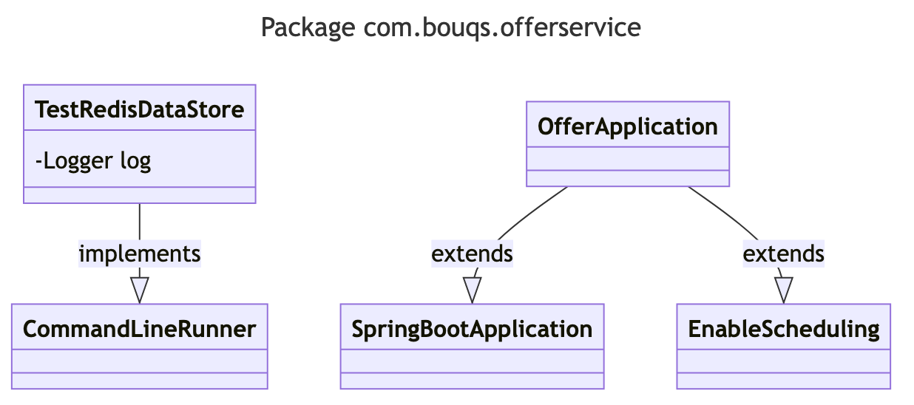

# com.bouqs.offerservice

## Class: OfferApplication

**com.bouqs.offerservice.OfferApplication**

```java
@SpringBootApplication
@EnableScheduling
public class OfferApplication 
```
The `OfferApplication` class is a software engineering class that represents a Spring Boot application. It is annotated with `@SpringBootApplication` and `@EnableScheduling`, indicating that it is a Spring Boot application and that it can perform scheduled tasks. The class contains various methods and fields, which are not specified in the given context.
