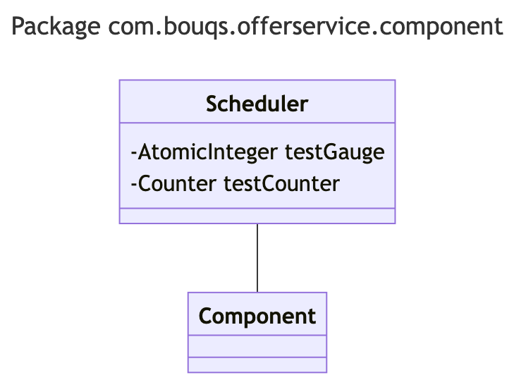

# com.bouqs.offerservice.component

## Class: Scheduler

**com.bouqs.offerservice.component.Scheduler**

```java
@Component
public class Scheduler 
```
# Scheduler

The `Scheduler` class is a component that belongs to a software engineering project. This class is annotated with `@Component`, suggesting that it is part of the dependency injection framework.

The purpose of this class is to schedule and execute tasks or actions at specific intervals or periods. It serves as a central control point for managing and coordinating timed operations within the system.

While the specific implementation details are not given, the class contains a few fields which are not described in detail. These include a `testGauge` field of type `AtomicInteger` and a `testCounter` field of type `Counter`. These fields likely serve as metrics or monitoring instruments, helping to track and measure the performance or behavior of the scheduled tasks.

Overall, the `Scheduler` class plays a vital role in the software engineering project, ensuring that tasks are executed on time and providing metrics for performance evaluation.
