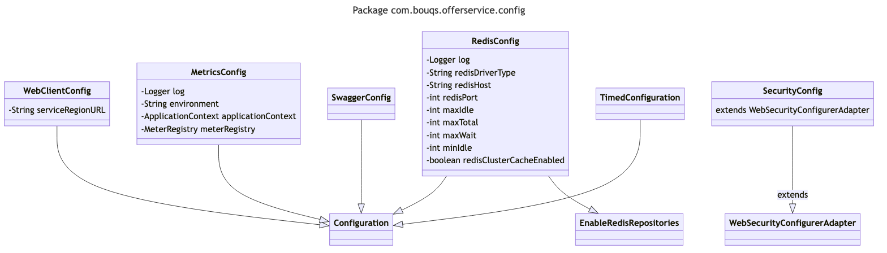

# com.bouqs.offerservice.config

## Class: WebClientConfig

**com.bouqs.offerservice.config.WebClientConfig**

```java
@Configuration
public class WebClientConfig 
```
# WebClientConfig

The `WebClientConfig` class is a configuration class that is used in software engineering to configure and create instances of the `WebClient` class. 

This class is annotated with `@Configuration`, indicating that it is responsible for defining and providing beans to the Spring application context. 

The `WebClientConfig` class includes a method `webClient()`, which is used to create and configure a `WebClient` instance. It returns the configured `WebClient` bean.

In addition to the methods, the `WebClientConfig` class includes a single field `serviceRegionURL`. This field is annotated with `@Value("${service.region.url}")`, indicating that its value is taken from the application's property file. This field holds the URL of the service region.
### Method: webClient
```java
@Bean
public WebClient webClient() {
    HttpClient httpClient = HttpClient.create().option(ChannelOption.CONNECT_TIMEOUT_MILLIS, 10000).doOnConnected(conn -> conn.addHandlerLast(new ReadTimeoutHandler(10)).addHandlerLast(new WriteTimeoutHandler(10)));
    ;
    ClientHttpConnector connector = new ReactorClientHttpConnector(httpClient.wiretap(true));
    return WebClient.builder().baseUrl(serviceRegionURL).clientConnector(connector).defaultHeader(HttpHeaders.CONTENT_TYPE, MediaType.APPLICATION_JSON_VALUE).build();
}
```

### webClient Overview 

The `webClient` method in the `WebClientConfig` class is responsible for creating and configuring a `WebClient` instance. 

This method creates an instance of `HttpClient` with a `CONNECT_TIMEOUT_MILLIS` option set to 10000 milliseconds. It also adds two event handlers, `ReadTimeoutHandler` and `WriteTimeoutHandler`, to the connection. 

Next, it creates a `ReactorClientHttpConnector` with the configured `HttpClient`. The `wiretap` method is called with `true` as a parameter, enabling wiretap logging for debugging purposes.

Finally, a `WebClient` instance is built using the specified `baseUrl`, `clientConnector`, and `defaultHeader`. The `baseUrl` is set to `serviceRegionURL`, and the `clientConnector` is set to the previously created `connector`. The `defaultHeader` is set to `CONTENT_TYPE` with the value `MediaType.APPLICATION_JSON_VALUE`.

Overall, this method configures and builds a `WebClient` with the necessary settings to make HTTP requests to the specified `serviceRegionURL`.


### webClient Step by Step  

The `webClient` method in the `WebClientConfig` class, located in the `com.bouqs.offerservice.config` package, is responsible for creating and configuring a `WebClient` instance.

Here are the steps that this method performs:

1. It creates an instance of `HttpClient` using the `HttpClient.create()` method.
2. It sets a connection timeout of 10 seconds using the `option()` method with the `ChannelOption.CONNECT_TIMEOUT_MILLIS` argument.
3. It adds a `ReadTimeoutHandler` and a `WriteTimeoutHandler` to the connection using the `doOnConnected()` method with lambda expressions to define the handlers.
4. It creates an instance of `ReactorClientHttpConnector` with the previously created `httpClient` object as an argument.
5. It creates and configures a `WebClient` instance using the `WebClient.builder()` method.
6. It sets the base URL of the web client to `serviceRegionURL`, which can be specified elsewhere in the code.
7. It sets the `ClientHttpConnector` to the previously created `connector` object.
8. It sets the `Content-Type` header of the requests sent by the web client to `application/json` using the `defaultHeader()` method with the `HttpHeaders.CONTENT_TYPE` argument.
9. Finally, it builds and returns the `WebClient` instance using the `build()` method.

The `WebClient` instance created by this method can be used to make HTTP requests to the specified service region URL.

sequenceDiagram
    participant WebClientConfig
    participant HttpClient
    participant ChannelOption
    participant ReadTimeoutHandler
    participant WriteTimeoutHandler
    participant ReactorClientHttpConnector
    participant WebClient
    participant HttpHeaders
    participant MediaType
    
    WebClientConfig->>HttpClient: Create HttpClient
    HttpClient->>ChannelOption: Set CONNECT_TIMEOUT_MILLIS option
    ChannelOption-->>HttpClient: Return configured HttpClient
    HttpClient->>ReadTimeoutHandler: Add ReadTimeoutHandler to connection
    HttpClient->>WriteTimeoutHandler: Add WriteTimeoutHandler to connection
    HttpClient-->>WebClientConfig: Return configured HttpClient
    WebClientConfig->>ReactorClientHttpConnector: Create ReactorClientHttpConnector
    ReactorClientHttpConnector->>HttpClient: Use configured HttpClient
    ReactorClientHttpConnector-->>WebClientConfig: Return configured ReactorClientHttpConnector
    WebClientConfig->>WebClient: Create WebClient
    WebClient->>WebClientConfig: Set baseUrl and clientConnector
    WebClientConfig->>WebClient: Set default headers
    WebClientConfig-->>WebClient: Return configured WebClient

## Class: SecurityConfig

**com.bouqs.offerservice.config.SecurityConfig**

```java
@Configuration
@EnableGlobalMethodSecurity(prePostEnabled = true)
@EnableWebSecurity
public class SecurityConfig extends WebSecurityConfigurerAdapter 
```
The `SecurityConfig` class is a Java class that is annotated with `@Configuration`, `@EnableGlobalMethodSecurity(prePostEnabled = true)`, and `@EnableWebSecurity`. This class extends the `WebSecurityConfigurerAdapter` class. 

The purpose of this class is to provide security configuration for a web application. It includes methods such as `configure(HttpSecurity http)` and `corsConfigurationSource()`, which are used to configure the security settings for HTTP requests and handle Cross-Origin Resource Sharing (CORS) configurations, respectively. 

By extending `WebSecurityConfigurerAdapter`, this class allows for customization of the security settings based on the application's specific requirements.
### Method: configure
```java
@Override
protected void configure(HttpSecurity http) throws Exception {
    http.authorizeRequests().anyRequest().permitAll();
    // CSRF Token
    http.csrf().disable();
}
```

### configure Overview 

The `configure` method in the `SecurityConfig` class is responsible for configuring the security settings for the `OfferService` application. 

The method overrides the `configure` method from the parent class `HttpSecurity`. It takes an `HttpSecurity` object as a parameter and throws an exception if an error occurs during configuration.

Inside the method, the `http` object is used to configure the security settings. 

The `authorizeRequests().anyRequest().permitAll()` statement allows unrestricted access to all requests, meaning that all users, whether authenticated or not, have permission to access any request made to the application.

The next statement, `http.csrf().disable()`, disables Cross-Site Request Forgery (CSRF) protection. CSRF is a security vulnerability that allows an attacker to trick a victim into performing unwanted actions on a web application where the victim is authenticated. By disabling CSRF protection, the application becomes vulnerable to this type of attack.

Overall, the `configure` method in the `SecurityConfig` class sets up the security configuration for the `OfferService` application by allowing unrestricted access to all requests and disabling CSRF protection.


### configure Step by Step  

# Security Configuration

The **configure** method in the `SecurityConfig` class (located in the **com.bouqs.offerservice.config** package) is responsible for setting up the security configuration for the offer service. This method ensures that the appropriate access permissions are applied to all incoming HTTP requests.

Here's a breakdown of what this method does:

1. **Override the configure method**: The `@Override` annotation indicates that we are overriding the `configure` method from the parent class, in this case, the `HttpSecurity` class.

2. **Set up request authorization**: The `authorizeRequests().anyRequest().permitAll()` code snippet configures the authorization rules for incoming HTTP requests. It allows all requests to be authorized, meaning that no specific authentication or permission checks are required to access any resource.

3. **Disable CSRF token generation**: The `http.csrf().disable()` code snippet disables the generation and handling of CSRF (Cross-Site Request Forgery) tokens. CSRF protection is a security measure used to prevent malicious actions by attackers, but in this case, it is disabled to simplify the security configuration.

By following these steps, the `configure` method ensures that all requests to the offer service are authorized and allows them to pass through without any additional restrictions or checks.

---
title: Configure Security
---

sequenceDiagram
    participant HttpSecurity
    participant authorizeRequests
    participant csrf
    
    Note over HttpSecurity: configure(HttpSecurity http)
    
    HttpSecurity->>authorizeRequests: authorizeRequests()
    authorizeRequests->>HttpSecurity: anyRequest().permitAll()
    HttpSecurity->>csrf: csrf()
    csrf->>HttpSecurity: disable()

### Method: corsConfigurationSource
```java
@Bean
CorsConfigurationSource corsConfigurationSource() {
    CorsConfiguration configuration = new CorsConfiguration();
    configuration.setAllowedOrigins(Arrays.asList("*"));
    configuration.setAllowedMethods(Arrays.asList("*"));
    configuration.setAllowedHeaders(Arrays.asList("*"));
    // <- ALLOW THIS HEADER
    configuration.addAllowedHeader("Content-Type");
    configuration.setAllowCredentials(true);
    UrlBasedCorsConfigurationSource source = new UrlBasedCorsConfigurationSource();
    source.registerCorsConfiguration("/**", configuration);
    return source;
}
```

### corsConfigurationSource Overview 

The `corsConfigurationSource` method, defined in the `com.bouqs.offerservice.config.SecurityConfig` class, is responsible for creating and configuring the CORS (Cross-Origin Resource Sharing) configuration for the application's security.

In this method, a new `CorsConfiguration` object is created and configured. The `setAllowedOrigins`, `setAllowedMethods`, and `setAllowedHeaders` methods are used to specify the allowed origins, methods, and headers, respectively. In this case, the `*` wildcard is used to allow all origins, methods, and headers. Additionally, the `addAllowedHeader` method is used to specifically allow the "Content-Type" header.

The `setAllowCredentials` method is then called to enable support for credentials, meaning that the client-side JavaScript code can include credentials (such as cookies or authorization headers) in the CORS requests.

Finally, a `UrlBasedCorsConfigurationSource` object is created and the previously configured `CorsConfiguration` object is registered by calling the `registerCorsConfiguration` method, passing in the "/*" pattern to specify that the CORS configuration should apply to all URLs.

The method then returns the created `UrlBasedCorsConfigurationSource`, which will be used by the application to enforce the CORS policy.


### corsConfigurationSource Step by Step  

The `corsConfigurationSource` method defined in the `SecurityConfig` class is responsible for configuring Cross-Origin Resource Sharing (CORS). CORS allows web applications running on different domains to interact with each other securely.

Here is a step-by-step breakdown of what this method does:

1. Creates a new `CorsConfiguration` object, which will define the CORS configuration.
2. Sets the allowed origins to `*`, meaning that the web application can accept requests from any domain.
3. Sets the allowed methods to `*`, allowing all HTTP methods (GET, POST, DELETE, etc.).
4. Sets the allowed headers to `*`, meaning that any custom headers sent by the client will be accepted.
5. Adds an additional allowed header, specifically the "Content-Type" header, ensuring that requests specifying this header are not blocked.
6. Sets `allowCredentials` to `true`, allowing the client to send cookies and authentication headers in the cross-origin request.
7. Creates a new `UrlBasedCorsConfigurationSource` object, which will hold the mapping between URLs and their respective CORS configurations.
8. Registers the previously created `CorsConfiguration` object with the `UrlBasedCorsConfigurationSource`, specifically mapping it to the "/**" URL pattern.
9. Finally, returns the `UrlBasedCorsConfigurationSource` object.

In summary, this method sets up a CORS configuration that allows requests from any domain, with any HTTP method, and with any custom header. It also specifically allows requests with the "Content-Type" header and allows the client to include credentials. The configuration is then mapped to all URLs in the application, represented by the "/**" pattern.

---
title: corsConfigurationSource (SecurityConfig)
---

sequenceDiagram
    participant SecurityConfig
    participant CorsConfigurationSource
    participant CorsConfiguration
    participant UrlBasedCorsConfigurationSource
    
    SecurityConfig->>CorsConfigurationSource: corsConfigurationSource()
    CorsConfigurationSource->>CorsConfiguration: Create CorsConfiguration
    CorsConfiguration-->>CorsConfigurationSource: Return CorsConfiguration
    CorsConfigurationSource->>UrlBasedCorsConfigurationSource: Create UrlBasedCorsConfigurationSource
    UrlBasedCorsConfigurationSource->>UrlBasedCorsConfigurationSource: Register CorsConfiguration
    UrlBasedCorsConfigurationSource-->>CorsConfigurationSource: Return UrlBasedCorsConfigurationSource
    CorsConfigurationSource-->>SecurityConfig: Return CorsConfigurationSource

## Class: MetricsConfig

**com.bouqs.offerservice.config.MetricsConfig**

```java
@Configuration
public class MetricsConfig 
```
# MetricsConfig

The `MetricsConfig` class is a Java class that is annotated with `@Configuration`, indicating that it is a configuration class. This class is used for configuring metrics-related functionality in a software application.

The class has several fields and methods that are used for configuring and setting up metrics in the application. Some of the key fields include:

- `log`: a field of type `Logger` from the `LogManager` class, used for logging metric-related information. It is private and final, indicating that it cannot be modified once initialized.

- `environment`: a field of type `String` that is annotated with `@Value("${spring.profiles.active}")`. This field holds the active environment for the application, which is used for metrics configuration.

- `applicationContext`: a field of type `ApplicationContext`, representing the application's Spring application context. This field is used for accessing and managing application resources.

- `meterRegistry`: a field of type `MeterRegistry`, representing the metrics registry for the application. This field is used for collecting and storing metric data.

The class also includes a `init()` method, which is a public void method. This method is used for initializing the metrics configuration and performing any necessary setup.

Overall, the `MetricsConfig` class provides a central location for configuring and managing metrics functionality in a software application.
### Method: init
```java
@PostConstruct
public void init() {
    meterRegistry = applicationContext.getBean(MeterRegistry.class);
    log.trace("registering metric for environment {}", environment);
    Arrays.asList(Metric.values()).stream().forEach(metric -> {
        Counter.builder(metric.label).tag("environment", environment).register(meterRegistry);
    });
}
```

### init Overview 

The init method is a post-construct method defined in the MetricsConfig class. It is responsible for initializing metrics for the offer service.

In the method body, the ApplicationContext is used to retrieve a MeterRegistry instance, which is necessary for recording and managing metrics. 

The method starts by logging a trace message, indicating that a metric is being registered for the environment.

Next, the method iterates over all the Metric values defined in the Metric enum. For each metric, a Counter builder is created, specifying the metric's label and adding a tag for the environment. Finally, the Counter is registered with the MeterRegistry.

Overall, this method ensures that all metrics defined in the Metric enum are properly initialized and registered with the MeterRegistry for the offer service in the given environment.


### init Step by Step  

## Method `init` description

The method `init` in class `com.bouqs.offerservice.config.MetricsConfig` is a post-construction method that performs some initialization tasks for metrics tracking in our system. It is executed automatically after the class is constructed.

Here are the steps performed by this method:

1. Get the instance of `MeterRegistry` from the application context. `MeterRegistry` is a component responsible for tracking and managing metrics.

2. Output a log message at trace level, indicating that a metric is being registered for the current environment. The `environment` parameter specifies the environment in which our system is running.

3. Iterate through each metric defined in the `Metric` enum class. For each metric, the following steps are executed:

    a. Create a counter metric using the `Counter.builder` method. This counter metric is used to track incremental counts of a particular event or operation.
    
    b. Set the label of the counter metric to the corresponding label defined in the `Metric` enum.
    
    c. Add a tag to the counter metric with the key "environment" and value as the current environment.
    
    d. Register the counter metric with the `meterRegistry`. This ensures that the metric will be tracked and its values can be collected for analysis.

That's it! The `init` method sets up the necessary metrics for our system by registering them with the `MeterRegistry`. These metrics can then be used to monitor and analyze the performance and behavior of our application.

---
title: init (MetricsConfig)
---

sequenceDiagram
    participant MetricsConfig
    participant applicationContext
    participant MeterRegistry
    participant log
    participant environment
    
    MetricsConfig->>applicationContext: Get MeterRegistry bean
    MetricsConfig->>log: Trace log message
    MetricsConfig->>environment: Get environment
    MetricsConfig->>Metric: Iterate over Metric values
    Metric->>MeterRegistry: Build Counter with label
    MeterRegistry-->>Metric: Register Counter

## Class: RedisConfig

**com.bouqs.offerservice.config.RedisConfig**

```java
@Configuration
@EnableRedisRepositories
public class RedisConfig 
```
The RedisConfig class is a configuration class that is used to configure and set up Redis for the software application. It is annotated with @Configuration and @EnableRedisRepositories to enable Redis repositories and provide the necessary configuration for Redis.

The class includes various methods and fields that are relevant for setting up a Redis connection and configuring the RedisTemplate. The methods public RedisConnectionFactory redisConnectionFactory() and public RedisTemplate<?, ?> redisTemplate() are responsible for creating and configuring the Redis connection factory and Redis template respectively.

Additionally, there is a method private JedisConnectionFactory jedisConnectionFactory() and private LettuceConnectionFactory lettuceConnectionFactory() which are specific implementations of RedisConnectionFactory.

The class also includes several field variables annotated with @Value, which are used to store the configuration properties for Redis. These properties include the driver type, host, port, connection pool settings, and whether Redis cluster caching is enabled.

Overall, the RedisConfig class plays a crucial role in providing the necessary configuration for integrating Redis into the software application.
### Method: redisConnectionFactory
```java
@Bean
public RedisConnectionFactory redisConnectionFactory() {
    Optional<String> ecRedisHost = Optional.ofNullable(System.getenv(Constants.ELASTICACHE_REDIS_CLUSTER_ENDPOINT));
    log.info("elasticache redis endpoint: " + ecRedisHost);
    ecRedisHost.ifPresent(s -> redisHost = s);
    Optional<String> ecRedisPort = Optional.ofNullable(System.getenv(Constants.ELASTICACHE_REDIS_CLUSTER_PORT));
    log.info("elasticache redis port: " + ecRedisPort);
    ecRedisPort.ifPresent(s -> redisPort = Integer.parseInt(s));
    return !StringUtils.isEmpty(redisDriverType) && redisDriverType.equals("Lettuce") ? lettuceConnectionFactory() : jedisConnectionFactory();
}
```

### redisConnectionFactory Overview 

The `redisConnectionFactory` method is a part of the `RedisConfig` class in the `com.bouqs.offerservice.config` package. It is responsible for creating a `RedisConnectionFactory` bean.

The method first checks for the presence of the `ELASTICACHE_REDIS_CLUSTER_ENDPOINT` environment variable. If the variable is present, it sets the `redisHost` variable to its value. It then checks for the presence of the `ELASTICACHE_REDIS_CLUSTER_PORT` environment variable and sets the `redisPort` variable to its integer value if it's present.

Finally, the method returns either a `lettuceConnectionFactory` or a `jedisConnectionFactory` based on the value of the `redisDriverType` variable. If `redisDriverType` is not empty and equal to "Lettuce", it returns a `lettuceConnectionFactory`, otherwise it returns a `jedisConnectionFactory`.


### redisConnectionFactory Step by Step  

The `redisConnectionFactory` method in the `com.bouqs.offerservice.config.RedisConfig` class is responsible for creating the connection factory for Redis, which is used to connect to a Redis server. 

Here's how the method works:

1. It first checks if there is a value for the `ELASTICACHE_REDIS_CLUSTER_ENDPOINT` environment variable. This variable contains the endpoint of the Redis cluster. If the variable is not set, the `ecRedisHost` optional will be empty.

2. The method logs the value of the endpoint using the `log.info()` method.

3. If there is a value for the `ELASTICACHE_REDIS_CLUSTER_ENDPOINT` environment variable, it is assigned to the `redisHost` variable.

4. It then checks if there is a value for the `ELASTICACHE_REDIS_CLUSTER_PORT` environment variable. This variable contains the port number for the Redis cluster. If the variable is not set, the `ecRedisPort` optional will be empty.

5. The method logs the value of the port using the `log.info()` method.

6. If there is a value for the `ELASTICACHE_REDIS_CLUSTER_PORT` environment variable, it is parsed as an integer and assigned to the `redisPort` variable.

7. Finally, the method checks if the `redisDriverType` variable is not empty and equal to "Lettuce". If that condition is true, it calls the `lettuceConnectionFactory()` method to create the Redis connection factory. Otherwise, it calls the `jedisConnectionFactory()` method.

8. The method returns the created Redis connection factory.

In summary, the `redisConnectionFactory` method creates a connection factory for Redis based on the environment variables `ELASTICACHE_REDIS_CLUSTER_ENDPOINT` and `ELASTICACHE_REDIS_CLUSTER_PORT`, as well as the `redisDriverType` variable. It uses either the Lettuce or Jedis driver, depending on the value of `redisDriverType`.

sequenceDiagram
    participant RedisConfig
    participant RedisConnectionFactory
    participant System
    participant Optional
    participant log
    participant Constants
    participant StringUtils
    
    RedisConfig->>RedisConnectionFactory: redisConnectionFactory()
    RedisConnectionFactory->>System: getenv(Constants.ELASTICACHE_REDIS_CLUSTER_ENDPOINT)
    System-->>RedisConnectionFactory: Optional<String> ecRedisHost
    RedisConnectionFactory->>log: log.info("elasticache redis endpoint: " + ecRedisHost)
    RedisConnectionFactory->>ecRedisHost: ifPresent(s -> redisHost = s)
    RedisConnectionFactory->>System: getenv(Constants.ELASTICACHE_REDIS_CLUSTER_PORT)
    System-->>RedisConnectionFactory: Optional<String> ecRedisPort
    RedisConnectionFactory->>log: log.info("elasticache redis port: " + ecRedisPort)
    RedisConnectionFactory->>ecRedisPort: ifPresent(s -> redisPort = Integer.parseInt(s))
    RedisConnectionFactory->>StringUtils: !StringUtils.isEmpty(redisDriverType) && redisDriverType.equals("Lettuce")
    StringUtils-->>RedisConnectionFactory: boolean
    RedisConnectionFactory->>lettuceConnectionFactory: lettuceConnectionFactory()
    RedisConnectionFactory-->>RedisConnectionFactory: return
    RedisConnectionFactory->>jedisConnectionFactory: jedisConnectionFactory()
    RedisConnectionFactory-->>RedisConnectionFactory: return

### Method: redisTemplate
```java
@Bean(name = "redisTemplate")
public RedisTemplate<?, ?> redisTemplate() {
    RedisTemplate<String, String> template = new RedisTemplate<>();
    template.setConnectionFactory(redisConnectionFactory());
    return template;
}
```

### redisTemplate Overview 

The `redisTemplate` method defined in the `RedisConfig` class is responsible for creating and configuring a RedisTemplate object. 

This method uses Spring's `@Bean` annotation to define a bean named "redisTemplate" that will be used for Redis operations. The return type `RedisTemplate<?, ?>` signifies that this RedisTemplate can be used with any key and value types.

Inside the method, a new RedisTemplate object is created with key and value types set to `String`. The connection factory for this template is then set using the `setConnectionFactory` method, which is obtained from the `redisConnectionFactory` method defined elsewhere in the `RedisConfig` class.

Finally, the configured RedisTemplate object is returned, and it will be available for autowiring and use throughout the application.


### redisTemplate Step by Step  

## RedisTemplate in RedisConfig

The `redisTemplate` method in the `RedisConfig` class is responsible for creating and configuring a RedisTemplate object, which is an abstraction for interacting with the Redis database.

### Syntax

```java
@Bean(name = "redisTemplate")
public RedisTemplate<?, ?> redisTemplate() {
    // Method logic goes here
    // ...
}
```

### Description

The `redisTemplate` method creates a new instance of the RedisTemplate class and configures it with the necessary connection factory to communicate with the Redis database.

### Steps

1. Create a new instance of the RedisTemplate class called `template`.
2. Set the connection factory of the `template` object by calling the `redisConnectionFactory` method.
3. Return the `template` object.

### Return Value

The method returns the configured `template` object, which can be used to interact with the Redis database.

### Usage

To use the `redisTemplate` method, simply call it in the desired location within your application code. The returned `template` object can be used to perform various operations on the Redis database.

```java
// Example usage
RedisTemplate<?, ?> myRedisTemplate = redisTemplate();
// Start using 'myRedisTemplate' to interact with Redis
```

Please note that this method assumes that the necessary Redis connection factory is already defined and configured elsewhere in the application. Ensure that the Redis connection factory is set up correctly before calling the `redisTemplate` method.

---
title: Redis Template (RedisConfig)
---

sequenceDiagram
    participant RedisConfig
    participant RedisTemplate
    participant RedisConnectionFactory
    
    RedisConfig->>RedisTemplate: Create RedisTemplate bean
    RedisTemplate->>RedisConnectionFactory: Set connection factory
    RedisTemplate-->>RedisConfig: Return RedisTemplate bean

### Method: offerRedisTemplate
```java
@Bean(name = "offerRedisTemplate")
public RedisTemplate<String, OfferEntity> offerRedisTemplate() {
    RedisTemplate<String, OfferEntity> template = new RedisTemplate<>();
    template.setConnectionFactory(redisConnectionFactory());
    return template;
}
```

### offerRedisTemplate Overview 

The `offerRedisTemplate` method in the `RedisConfig` class is responsible for configuring and returning a RedisTemplate instance to interact with the Redis server for the offers service.

This method uses the `@Bean` annotation to declare a Spring bean named "offerRedisTemplate". The method returns a `RedisTemplate<String, OfferEntity>` object.

Inside the method, a new `RedisTemplate` instance is created using the default constructor. Then, the `setConnectionFactory()` method is called on the template instance and the `redisConnectionFactory()` method is used to retrieve the connection factory, which is responsible for connecting to the Redis server.

Finally, the template instance is returned as the result of the method, allowing other parts of the application to use it for interacting with the Redis server related to offer entities.


### offerRedisTemplate Step by Step  

# Method: offerRedisTemplate

This method is defined in the class `com.bouqs.offerservice.config.RedisConfig`. It creates and configures a RedisTemplate, which is a key-value data structure stored in memory.

### Parameters

This method doesn't take any parameters.

### Return Type

The return type of this method is `RedisTemplate<String, OfferEntity>`. It is a specialized version of the RedisTemplate class, where the key is of type `String` and the value is of type `OfferEntity`.

### Description

1. The method starts by creating a new instance of RedisTemplate with the specified key-value types.
2. It then sets the connection factory for the RedisTemplate by calling the `redisConnectionFactory()` method, which returns an instance of `RedisConnectionFactory`.
3. Finally, the method returns the configured RedisTemplate.

This configured RedisTemplate can be used to interact with a Redis server and perform operations on the OfferEntities, such as storing, retrieving, or manipulating their data.

Please note that this method is annotated with `@Bean` and named as "offerRedisTemplate". This allows other parts of the application to inject and use this RedisTemplate bean when needed.

### Example Usage

```java
RedisTemplate<String, OfferEntity> template = offerRedisTemplate();
// Use the template to perform Redis operations
```

sequenceDiagram
    participant RedisConfig
    participant RedisTemplate
    participant RedisConnectionFactory
    
    RedisConfig->>RedisTemplate: Create offerRedisTemplate bean
    RedisTemplate->>RedisConnectionFactory: Set connection factory
    RedisConnectionFactory-->>RedisTemplate: Return connection factory
    RedisTemplate-->>RedisConfig: Return offerRedisTemplate bean

### Method: jedisConnectionFactory
```java
private JedisConnectionFactory jedisConnectionFactory() {
    if (this.redisClusterCacheEnabled)
        return new JedisConnectionFactory(redisClusterConfiguration());
    else
        return new JedisConnectionFactory(new RedisStandaloneConfiguration(redisHost, redisPort));
}
```

### jedisConnectionFactory Overview 

The `jedisConnectionFactory` method in the `RedisConfig` class is responsible for creating and configuring a `JedisConnectionFactory` object based on the Redis configuration. 

If the `redisClusterCacheEnabled` flag is `true`, the method returns a `JedisConnectionFactory` object initialized with a `RedisClusterConfiguration` object obtained from the `redisClusterConfiguration` method. This is used when the Redis cache is configured as a cluster.

If the `redisClusterCacheEnabled` flag is `false`, the method returns a `JedisConnectionFactory` object initialized with a `RedisStandaloneConfiguration` object created with the `redisHost` and `redisPort` values. This is used when the Redis cache is configured as a standalone instance.

Overall, this method is used to create the appropriate `JedisConnectionFactory` based on the Redis cache configuration used by the application.


### jedisConnectionFactory Step by Step  

The jedisConnectionFactory method defined in the RedisConfig class determines the appropriate connection factory object to use for connecting to a Redis server, based on the configuration settings.

Here's a breakdown of the steps performed by this method:

1. Check if the redisClusterCacheEnabled flag is set to true.
2. If the flag is true, create a new JedisConnectionFactory object using the redisClusterConfiguration() method. This method provides the configuration details for connecting to a Redis cluster.
3. If the flag is false, create a new JedisConnectionFactory object using the RedisStandaloneConfiguration class. This class is used for connecting to a single Redis server or Redis replica instance. The redisHost and redisPort variables provide the necessary connection information.

In summary, the jedisConnectionFactory method dynamically creates a JedisConnectionFactory object based on whether Redis clustering is enabled or not, allowing the application to connect to a Redis cluster or a standalone Redis server as required.

---
title: jedisConnectionFactory (RedisConfig)
---

sequenceDiagram
    participant RedisConfig
    participant JedisConnectionFactory
    participant RedisClusterConfiguration
    participant RedisStandaloneConfiguration
    
    RedisConfig->>JedisConnectionFactory: jedisConnectionFactory()
    JedisConnectionFactory->>RedisConfig: Return JedisConnectionFactory instance
    JedisConnectionFactory->>RedisClusterConfiguration: redisClusterConfiguration()
    RedisClusterConfiguration-->>JedisConnectionFactory: Return RedisClusterConfiguration instance
    JedisConnectionFactory->>RedisStandaloneConfiguration: new RedisStandaloneConfiguration(redisHost, redisPort)
    RedisStandaloneConfiguration-->>JedisConnectionFactory: Return RedisStandaloneConfiguration instance
    JedisConnectionFactory-->>RedisConfig: Return JedisConnectionFactory instance

### Method: lettuceConnectionFactory
```java
private LettuceConnectionFactory lettuceConnectionFactory() {
    if (this.redisClusterCacheEnabled) {
        ClusterTopologyRefreshOptions clusterTopologyRefreshOptions = ClusterTopologyRefreshOptions.builder().enablePeriodicRefresh(true).enablePeriodicRefresh(Duration.ofMinutes(30)).enableAllAdaptiveRefreshTriggers().build();
        GenericObjectPoolConfig poolConfig = new GenericObjectPoolConfig();
        poolConfig.setMaxIdle(maxIdle);
        poolConfig.setMinIdle(minIdle);
        poolConfig.setMaxWait(Duration.ofMillis(maxWait));
        poolConfig.setMaxTotal(maxTotal);
        LettuceClientConfiguration clientConfig = LettucePoolingClientConfiguration.builder().readFrom(ReadFrom.REPLICA_PREFERRED).clientOptions(ClusterClientOptions.builder().topologyRefreshOptions(clusterTopologyRefreshOptions).build()).poolConfig(poolConfig).build();
        return new LettuceConnectionFactory(redisClusterConfiguration(), clientConfig);
    } else
        return new LettuceConnectionFactory(redisHost, redisPort);
}
```

### lettuceConnectionFactory Overview 

The `lettuceConnectionFactory` method in the class `RedisConfig` is responsible for creating and configuring a `LettuceConnectionFactory` object. 

If the `redisClusterCacheEnabled` variable is true, it sets up a connection factory for a Redis cluster. It configures cluster topology refresh options, a generic object pool for client connections, and client options. It then creates a new `LettuceConnectionFactory` with the provided Redis cluster configuration and client configuration.

If `redisClusterCacheEnabled` is false, it creates a connection factory for a single Redis instance using the specified `redisHost` and `redisPort`.

Overall, this method is used to create a connection factory for connecting to a Redis cache, either for a Redis cluster or a single Redis instance.


### lettuceConnectionFactory Step by Step  

The `lettuceConnectionFactory` method in the `RedisConfig` class is responsible for creating and configuring a connection factory for the Redis database. This connection factory is used by the application to establish a connection with the Redis server.

Here are the steps performed by the `lettuceConnectionFactory` method:

1. First, it checks if the Redis cluster cache is enabled. If it is enabled, the method continues with the next steps. If not, it bypasses the following steps and creates a connection factory with the provided Redis host and port.

2. If the Redis cluster cache is enabled, it creates an instance of `ClusterTopologyRefreshOptions` and configures it. This includes enabling periodic refresh, setting the refresh interval to 30 minutes, and enabling all adaptive refresh triggers.

3. It creates an instance of `GenericObjectPoolConfig`, which configures the pool of connections to be used by the Redis client. It sets the maximum number of idle connections, the minimum number of idle connections, the maximum waiting time for a connection, and the maximum total number of connections.

4. It creates an instance of `LettuceClientConfiguration` using the `LettucePoolingClientConfiguration.builder()` method. It sets the read preference to `ReadFrom.REPLICA_PREFERRED`, which means it will prefer reading data from replica nodes if available. It also sets the cluster client options, including the topology refresh options created in step 2 and the connection pool configuration created in step 3.

5. Finally, it creates a `LettuceConnectionFactory` instance by passing the `redisClusterConfiguration` (which retrieves the Redis cluster configuration) and the client configuration created in step 4 as parameters. This connection factory will be used by the application to establish a connection with the Redis server.

By following these steps, the `lettuceConnectionFactory` method ensures that the application can connect to the Redis server efficiently, taking into account the cluster cache configuration and optimizing the connection handling based on the read preference and pool configuration.

sequenceDiagram
    participant RedisConfig
    participant ClusterTopologyRefreshOptions
    participant GenericObjectPoolConfig
    participant LettuceClientConfiguration
    participant LettuceConnectionFactory
    participant ClusterClientOptions
    
    RedisConfig->>ClusterTopologyRefreshOptions: Create cluster topology refresh options
    RedisConfig->>GenericObjectPoolConfig: Create generic object pool config
    RedisConfig->>LettuceClientConfiguration: Create lettuce client configuration
    RedisConfig->>LettuceConnectionFactory: Create lettuce connection factory
    RedisConfig->>ClusterClientOptions: Create cluster client options
    RedisConfig->>LettuceConnectionFactory: Return lettuce connection factory

## Class: SwaggerConfig

**com.bouqs.offerservice.config.SwaggerConfig**

```java
// ERP-5079 disable Swagger for spring-boot 2.6.6
//@Configuration
//@EnableSwagger2
public class SwaggerConfig 
```
The SwaggerConfig class is responsible for configuring and enabling Swagger documentation for a Spring Boot application. It is specifically designed to disable Swagger for Spring Boot version 2.6.6 and above. This class acts as a configuration bean and is annotated with @Configuration to indicate that it holds the configuration for the application. The @EnableSwagger2 annotation enables Swagger functionality in the application. It contains methods and fields that are used to set up and customize the Swagger documentation.
## Class: TimedConfiguration

**com.bouqs.offerservice.config.TimedConfiguration**

```java
@Configuration
public class TimedConfiguration 
```
The `TimedConfiguration` class is a configuration class in the software application. By using the `@Configuration` annotation, this class indicates that it provides configuration for the application. It contains methods and fields that are relevant for configuring the timed functionality within the application. The purpose of this class is to provide a centralized location for managing and configuring timed tasks or operations within the application.
