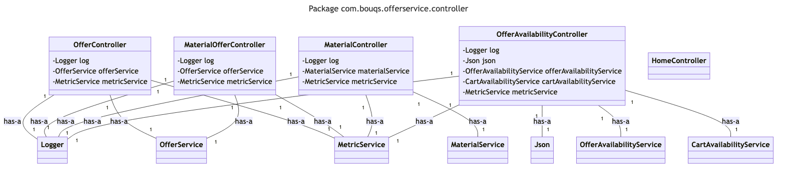

# com.bouqs.offerservice.controller

## Class: OfferController

**com.bouqs.offerservice.controller.OfferController**

```java
@RestController
@RequestMapping("/offer")
@Api(value = "offer.service", tags = "")
public class OfferController 
```
## Class Description: OfferController

The `OfferController` class is a software engineering class that serves as a RESTful API controller for managing offers. It handles various HTTP requests related to offers and provides CRUD (Create, Read, Update, Delete) operations for offers. The class is annotated with `@RestController` to denote that it is a controller class and can handle HTTP requests. 

The class is also annotated with `@RequestMapping("/offer")` to specify the base URL path for all the endpoints defined within this controller. This means that all the API endpoints related to offers will have the base URL path `/offer`.

The class is further annotated with `@Api(value = "offer.service", tags = "")` to provide additional metadata and documentation about this API endpoint. This annotation helps in generating API documentation and provides a meaningful description for the API endpoint.

The class has several methods that correspond to different HTTP operations such as creating an offer, updating an offer, deleting an offer, and syncing offer details. Each method is decorated with appropriate annotations such as `@RequestBody`, `@PathVariable`, and `@ApiParam` to define the request parameters and payload.

In addition to the methods, the class also defines several fields. There is a private logger field `log` that is used for logging purposes. The logger is initialized with the `OfferController` class as the logging context.

The class also has two dependency-injected fields: `offerService` and `metricService`. These fields are initialized with the respective services that provide functionality for managing offers and metrics. These services are typically defined as separate classes and are injected into the `OfferController` class through dependency injection.

Overall, the `OfferController` class is a key component in the software architecture for managing offers and provides a RESTful API interface for creating, updating, and deleting offers, as well as syncing offer details.
### Method: createOffer
```java
@ApiOperation(value = "Create an offer.", response = CRUDResponse.class)
@PostMapping(value = "", consumes = MediaType.APPLICATION_JSON_VALUE, produces = MediaType.APPLICATION_JSON_VALUE)
@Timed(description = "Time to create offer", value = Constants.CREATE_OFFER_TIME)
public ResponseEntity<CRUDResponse> createOffer(@ApiParam(value = "offer details", required = true) @RequestBody OfferRequest offer) throws Exception {
    log.trace("Start createOffer");
    metricService.increment(Metric.CREATE_OFFER_REQUEST.label);
    try {
        CRUDResponse offerResponse = offerService.createOffer(offer);
        metricService.increment(Metric.CREATE_OFFER_SUCCESS.label);
        return new ResponseEntity<>(offerResponse, HttpStatus.OK);
    } catch (Exception ex) {
        metricService.increment(Metric.CREATE_OFFER_FAIL.label);
        throw ex;
    } finally {
        MDC.clear();
    }
}
```

### createOffer Overview 

The method `createOffer` is defined in the `OfferController` class in the `com.bouqs.offerservice.controller` package. This method is responsible for creating an offer. It takes in an `OfferRequest` object as a request body, which contains the details of the offer to be created. 

The method is annotated with `@ApiOperation` to provide a description for the API documentation. It specifies that the method creates an offer and the response will be of type `CRUDResponse`.

The method is also annotated with `@PostMapping` to indicate that it handles HTTP POST requests. It specifies the media types that the method consumes and produces as JSON.

The method is timed using the `@Timed` annotation, which measures the time taken to create the offer. The description for the timing is set as "Time to create offer" and the value is defined as `Constants.CREATE_OFFER_TIME`.

Inside the method, it starts by tracing the log with the message "Start createOffer". It then increments a metric using the `metricService.increment` method to track the number of create offer requests.

Next, it tries to create the offer by calling the `offerService.createOffer` method, passing in the `offer` object. If the creation is successful, it increments the success metric and returns a response entity with the created offer response and HTTP status OK.

If an exception occurs during the creation of the offer, it catches the exception, increments the fail metric, and rethrows the exception.

Finally, it clears the MDC (Mapped Diagnostic Context) to prevent any potential memory leaks.

Overall, the `createOffer` method in the `OfferController` class is responsible for handling a POST request to create an offer, logging relevant information, tracking metrics, and returning a response entity.


### createOffer Step by Step  

## Method: createOffer

The `createOffer` method in the `OfferController` class is responsible for creating a new offer. 

### Request

The method expects a JSON payload containing the details of the offer. The payload should be in the following format:
```json
{
  "offerId": "string",
  "offerName": "string",
  "price": "number"
}
```

### Response

The method will return a JSON response in the following format:
```json
{
  "status": "string",
  "message": "string",
  "data": { }
}
```

### Step-by-step process

1. The method starts by logging the start of the `createOffer` operation.

2. The request is recorded as a metric to track the number of `createOffer` requests.

3. The method attempts to create the offer using the provided offer details.

4. If the offer creation is successful, the response is logged as a metric to track the number of successful `createOffer` operations, and a `200 OK` response is returned with the offer details.

5. If an exception occurs during offer creation, the response is logged as a metric to track the number of failed `createOffer` operations, and the exception is re-thrown.

6. Finally, the method clears the diagnostic context to ensure clean execution and prevent any leakage of sensitive information.

Please note that the `createOffer` method follows the specified API documentation standards.

sequenceDiagram
    participant User
    participant OfferController
    participant OfferRequest
    participant CRUDResponse
    participant MetricService
    participant Metric
    participant OfferService
    participant MDC
    
    User->>OfferController: Send create offer request
    OfferController->>MetricService: Increment create offer request metric
    OfferController->>OfferService: Create offer
    OfferService-->>OfferController: Return offer response
    OfferController->>MetricService: Increment create offer success metric
    OfferController->>User: Return offer response
    User->>OfferController: Handle create offer failure
    OfferController->>MetricService: Increment create offer fail metric
    OfferController->>User: Throw exception
    OfferController->>MDC: Clear MDC

### Method: updateOffer
```java
@ApiOperation(value = "Update an offer.", response = CRUDResponse.class)
@PutMapping(value = "/{offerId}", consumes = MediaType.APPLICATION_JSON_VALUE, produces = MediaType.APPLICATION_JSON_VALUE)
@Timed(description = "Time to update offer", value = Constants.UPDATE_OFFER_TIME)
public ResponseEntity<CRUDResponse> updateOffer(@PathVariable("offerId") @ApiParam(value = "offerId") String offerId, @ApiParam(value = "offer details", required = true) @RequestBody OfferRequest offer) throws OptimisticLockingException {
    log.trace("Start updateOffer");
    offer.setId(offerId);
    MDC.put(Constants.LOG_ATTR_REQ_ID, offerId);
    CRUDResponse offerResponse;
    metricService.increment(Metric.UPDATE_OFFER_REQUEST.label);
    try {
        offerResponse = offerService.updateOffer(offer);
        metricService.increment(Metric.UPDATE_OFFER_SUCCESS.label);
    } catch (OptimisticLockingException ex) {
        metricService.increment(Metric.UPDATE_OFFER_EXCEPTION.label);
        metricService.increment(Metric.UPDATE_OFFER_FAIL.label);
        throw ex;
    } finally {
        MDC.clear();
    }
    return new ResponseEntity<>(offerResponse, HttpStatus.OK);
}
```

### updateOffer Overview 

### Method Description

The `updateOffer` method is defined in the `OfferController` class in the `com.bouqs.offerservice.controller` package. It is responsible for updating an offer based on the provided offer ID and request body.

#### Method Details

- **HTTP Method:** PUT
- **URL:** `/{offerId}`
- **Consumes:** MediaType.APPLICATION_JSON_VALUE
- **Produces:** MediaType.APPLICATION_JSON_VALUE

#### Parameters

- `offerId`: The ID of the offer to be updated (path variable)
- `offer`: The offer details to be updated (request body)

#### Response

The method returns a `ResponseEntity` containing a `CRUDResponse` object representing the updated offer. The HTTP status code of the response is `200` (OK).


### updateOffer Step by Step  

### Method: updateOffer

This method updates an offer in the Offer Service.

#### Request

- Method: PUT
- URL: /offers/{offerId}
- Content Type: application/json

#### Parameters

- offerId: The ID of the offer to be updated.
- offer: The details of the offer to be updated.

#### Response

- Status: 200 OK
- Body: CRUDResponse object containing the updated offer details.

#### Steps

1. Set the ID of the offer to be updated.
2. Set the request ID in the logging context.
3. Increment the "UPDATE_OFFER_REQUEST" metric.
4. Call the offerService.updateOffer() method to update the offer.
5. If the offer update is successful, increment the "UPDATE_OFFER_SUCCESS" metric.
6. If an OptimisticLockingException occurs during the update, increment the "UPDATE_OFFER_EXCEPTION" and "UPDATE_OFFER_FAIL" metrics, and rethrow the exception.
7. Clear the logging context.
8. Return a ResponseEntity object with the updated offer details and a status code of 200 OK.

Note: This method is timed using the "UPDATE_OFFER_TIME" metric.

---
title: Update Offer (OfferController)
---

sequenceDiagram
    participant User
    participant OfferController
    participant OfferService
    participant MetricService
    participant OptimisticLockingException
    participant ResponseEntity
    participant CRUDResponse
    participant HttpStatus
    
    User->>OfferController: Update offer
    OfferController->>OfferService: Update offer
    OfferService->>MetricService: Increment update offer request metric
    MetricService-->>OfferService: Return success status
    OfferService->>OfferService: Update offer
    OfferService->>MetricService: Increment update offer success metric
    MetricService-->>OfferService: Return success status
    OfferService-->>OfferController: Return offer response
    OfferController->>ResponseEntity: Create response entity
    ResponseEntity-->>OfferController: Return response entity
    OfferController-->>User: Return response entity
    User->>OptimisticLockingException: Handle optimistic locking exception
    OptimisticLockingException-->>OfferController: Throw optimistic locking exception
    OfferController->>MetricService: Increment update offer exception metric
    MetricService-->>OfferController: Return success status
    OfferController->>MetricService: Increment update offer fail metric
    MetricService-->>OfferController: Return success status
    OfferController-->>User: Throw optimistic locking exception

### Method: deleteOffer
```java
@ApiOperation(value = "Delete an offer.", response = CRUDResponse.class)
@DeleteMapping(value = "/{offerId}", produces = MediaType.APPLICATION_JSON_VALUE)
@Timed(description = "Time to delete offer", value = Constants.DELETE_OFFER_TIME)
public ResponseEntity<CRUDResponse> deleteOffer(@ApiParam(value = "offerId", required = true) @PathVariable("offerId") String offerId) {
    log.trace("Start deleteOffer");
    metricService.increment(Metric.DELETE_OFFER_REQUEST.label);
    MDC.put(Constants.LOG_ATTR_REQ_ID, offerId);
    CRUDResponse offerResponse;
    try {
        offerResponse = offerService.deleteByOfferId(offerId);
        metricService.increment(Metric.DELETE_OFFER_SUCCESS.label);
    } catch (ResourceNotFoundException ex) {
        metricService.increment(Metric.DELETE_OFFER_EXCEPTION.label);
        metricService.increment(Metric.DELETE_OFFER_FAIL.label);
        throw ex;
    } finally {
        MDC.clear();
    }
    return new ResponseEntity<>(offerResponse, HttpStatus.OK);
}
```

### deleteOffer Overview 

The `deleteOffer` method is responsible for deleting an offer by its offerId. 

The method is annotated with `@ApiOperation` to provide a description of the operation, specifying that it deletes an offer and returns a `CRUDResponse`.

The method is mapped to a DELETE request with the URL pattern `/{offerId}` using `@DeleteMapping`. It produces a response in JSON format.

The method is also annotated with `@Timed` to measure the time taken to delete an offer, using the value `Constants.DELETE_OFFER_TIME`.

The method takes a `@PathVariable` named `offerId`, which represents the offerId to be deleted.

Inside the method, it starts by logging a trace message and incrementing a metric using a `metricService`.

Then, it sets the offerId in the MDC (Mapped Diagnostic Context) for logging purposes.

It attempts to delete the offer by calling `offerService.deleteByOfferId(offerId)`. If the offerId is not found, it catches a `ResourceNotFoundException`, increments metrics for exceptions and failed deletion, and rethrows the exception.

Finally, it clears the MDC and returns a `ResponseEntity` containing the `offerResponse` and the HTTP status OK.


### deleteOffer Step by Step  

The `deleteOffer` method defined in the `OfferController` class is used to delete an offer. 

Here are the steps that this method performs based on its BODY:

1. It takes in a `offerId` as a path variable, which represents the ID of the offer to be deleted.

2. The method begins by tracing the start of the `deleteOffer` operation.

3. It increments a metric to track the number of delete offer requests.

4. The `offerId` is logged as a request ID attribute in the logging context.

5. The method calls the `offerService.deleteByOfferId(offerId)` method to delete the offer with the provided `offerId`. If the offer is successfully deleted, the method increments a metric to track the number of successful delete offers.

6. If the `deleteByOfferId` operation throws a `ResourceNotFoundException`, indicating that the offer with the specified `offerId` was not found, the method increments metrics to track the number of delete offer exceptions and failures, and rethrows the exception.

7. Finally, the logging context attributes are cleared.

8. The method returns a `ResponseEntity` object containing the response body, which is a `CRUDResponse` object representing the result of the delete operation. The HTTP status code of the response is set to 200 (OK).

sequenceDiagram
    participant OfferController
    participant log
    participant metricService
    participant MDC
    participant offerService
    participant ResourceNotFoundException
    participant CRUDResponse
    participant HttpStatus
    
    OfferController->>log: Start deleteOffer
    OfferController->>metricService: Increment DELETE_OFFER_REQUEST metric
    OfferController->>MDC: Put LOG_ATTR_REQ_ID
    OfferController->>offerService: deleteByOfferId(offerId)
    offerService->>CRUDResponse: Delete offer
    offerService->>metricService: Increment DELETE_OFFER_SUCCESS metric
    offerService-->>OfferController: Return offerResponse
    OfferController->>HttpStatus: Return ResponseEntity
    ResourceNotFoundException->>metricService: Increment DELETE_OFFER_EXCEPTION metric
    ResourceNotFoundException->>metricService: Increment DELETE_OFFER_FAIL metric
    ResourceNotFoundException-->>OfferController: Throw exception
    OfferController->>MDC: Clear

### Method: syncUpdaterOffer
```java
//    @RequestMapping("reindex-data")
//    public String reindexData() {
//        log.trace("Start reindexData");
//        offerService.reindexData();
//        return "Success!";
//    }
@ApiOperation(value = "Sync updater offer.", response = SyncUpdaterResponse.class)
@PostMapping(value = "updater/offer", consumes = MediaType.APPLICATION_JSON_VALUE, produces = MediaType.APPLICATION_JSON_VALUE)
@Timed(description = "Time to sync updater offer", value = Constants.SYNC_UPDATER_OFFER_TIME)
public ResponseEntity<List<SyncUpdaterResponse>> syncUpdaterOffer(@ApiParam(value = "Updater offer details", required = true) @RequestBody List<OfferUpdateRequest> offerUpdateRequests) throws Exception {
    log.trace("Start syncUpdaterOffer");
    metricService.increment(Metric.SYNC_UPDATER_OFFER_REQUEST.label);
    MDC.put("request-updater-offer", "");
    try {
        List<SyncUpdaterResponse> responses = offerUpdateRequests.stream().map(offerUpdateRequest -> offerUpdateRequest.handleUpdate(offerService)).collect(Collectors.toList());
        metricService.increment(Metric.SYNC_UPDATER_OFFER_SUCCESS.label);
        return new ResponseEntity<>(responses, HttpStatus.OK);
    } catch (Exception ex) {
        metricService.increment(Metric.SYNC_UPDATER_OFFER_EXCEPTION.label);
        metricService.increment(Metric.SYNC_UPDATER_OFFER_FAIL.label);
        throw ex;
    } finally {
        MDC.clear();
    }
}
```

### syncUpdaterOffer Overview 

The `syncUpdaterOffer` method in the `OfferController` class is responsible for synchronizing offers with an external updater. 

The method is annotated with `@PostMapping` to indicate that it handles HTTP POST requests. It consumes JSON data (`MediaType.APPLICATION_JSON_VALUE`) and produces JSON data (`MediaType.APPLICATION_JSON_VALUE`). The method takes a list of `OfferUpdateRequest` objects as the request body.

Inside the method, it logs the start of the synchronization process and increments a metric to track the number of sync updater offer requests. It also sets a value in the Mapped Diagnostic Context (MDC) for logging purposes.

The method then tries to handle each `OfferUpdateRequest` in the list by calling the `handleUpdate` method on each request and passing in the `offerService` as an argument. The results of the updates are collected into a list of `SyncUpdaterResponse` objects.

If the synchronization process is successful, the method increments a metric for successful sync updater offer requests and returns a `ResponseEntity` containing the list of responses with a status of OK.

If an exception occurs during the synchronization process, the method catches the exception, increments metrics for both the exception and failed sync updater offer requests, and rethrows the exception.

Finally, the MDC is cleared to clean up any set values.


### syncUpdaterOffer Step by Step  

### Method: syncUpdaterOffer

This method is used to sync an updater offer. It receives a list of updater offer details as input.

#### Request

- URL: `/updater/offer`
- Method: `POST`
- Headers:
  - Content-Type: `application/json`
- Body:
  - Parameter: `offerUpdateRequests` (required)
    - Type: `List` of `OfferUpdateRequest` objects
    - Description: Contains the details of the updater offers to be synced.

#### Response

- Type: `List` of `SyncUpdaterResponse` objects
- HTTP Status:
  - `200 OK` if successful
  - Other error codes if there was an issue

#### Implementation

1. Log the start of the method.
2. Increment a metric to track the number of sync updater offer requests.
3. Set a request identifier in the Mapped Diagnostic Context (MDC).
4. Try to perform the sync operation.
   - For each offer update request in the input list:
     - Call the `handleUpdate` method of the `OfferUpdateRequest` object, passing the `offerService`.
   - Collect the responses from the handleUpdate calls into a list.
   - Increment a metric to track the number of successful sync updater offer requests.
   - Return the list of sync updater responses as the response entity with status `200 OK`.
5. If an exception occurs during the sync operation:
   - Increment metrics to track the number of exceptions and failed sync updater offer requests.
   - Rethrow the exception.
6. Finally, clear the MDC.

sequenceDiagram
    participant OfferController
    participant OfferUpdateRequest
    participant offerService
    participant SyncUpdaterResponse
    participant metricService
    participant MDC
    participant Exception
    
    OfferController->>OfferUpdateRequest: Handle update
    OfferUpdateRequest->>offerService: Update offer
    offerService-->>OfferUpdateRequest: Return response
    OfferUpdateRequest-->>OfferController: Return response
    OfferController->>metricService: Increment metric
    metricService->>ResponseEntity: Create response entity
    ResponseEntity-->>OfferController: Return response entity
    OfferController->>HttpStatus: Return HTTP status
    HttpStatus-->>OfferController: Return HTTP status
    OfferController->>Exception: Handle exception
    Exception-->>OfferController: Throw exception
    OfferController->>metricService: Increment metric
    metricService->>metricService: Increment metric
    metricService->>Exception: Increment metric
    Exception-->>Exception: Throw exception
    Exception-->>OfferController: Throw exception
    OfferController->>MDC: Clear MDC
    MDC-->>OfferController: Clear MDC

### Method: syncUpdaterUsage
```java
@ApiOperation(value = "Sync updater usage.", response = SyncUpdaterResponse.class)
@PostMapping(value = "updater/usage", consumes = MediaType.APPLICATION_JSON_VALUE, produces = MediaType.APPLICATION_JSON_VALUE)
@Timed(description = "Time to sync updater usage", value = Constants.SYNC_UPDATER_USAGE_TIME)
public ResponseEntity<List<SyncUpdaterResponse>> syncUpdaterUsage(@ApiParam(value = "Updater usage details", required = true) @RequestBody List<UsageUpdateRequest> usageUpdateRequests) {
    log.trace("Start syncUpdaterUsage");
    metricService.increment(Metric.SYNC_UPDATER_USAGE_REQUEST.label);
    MDC.put("request-updater-usage", "");
    try {
        List<SyncUpdaterResponse> responses = usageUpdateRequests.stream().map(usageUpdateRequest -> usageUpdateRequest.handleUpdate(offerService)).collect(Collectors.toList());
        metricService.increment(Metric.SYNC_UPDATER_USAGE_SUCCESS.label);
        return new ResponseEntity<>(responses, HttpStatus.OK);
    } catch (Exception ex) {
        metricService.increment(Metric.SYNC_UPDATER_USAGE_EXCEPTION.label);
        metricService.increment(Metric.SYNC_UPDATER_USAGE_FAIL.label);
        throw ex;
    } finally {
        MDC.clear();
    }
}
```

### syncUpdaterUsage Overview 

The `syncUpdaterUsage` method defined in the `OfferController` class is used to synchronize updater usage. It accepts a list of `UsageUpdateRequest` objects in the request body and returns a list of `SyncUpdaterResponse` objects as the response.

The method starts by tracing the execution with a log statement and increments a metric related to the sync updater usage request. The `MDC` (Mapped Diagnostic Context) is used to put a marker on the request for updater usage.

Inside a try block, the method processes each `UsageUpdateRequest` in the list by invoking its `handleUpdate` method with the `offerService` parameter. The responses from each request are collected into a list of `SyncUpdaterResponse` objects. 

If the operation is successful, a metric related to sync updater usage success is incremented and the list of responses is returned in a `ResponseEntity` with the HTTP status code `200 OK`.

If an exception occurs during the processing, a metric related to sync updater usage exception and failure is incremented, and the exception is re-thrown.

Finally, the `MDC` is cleared to remove the marker from the request.


### syncUpdaterUsage Step by Step  

The `syncUpdaterUsage` method in the `OfferController` class is responsible for synchronizing updater usage. This method accepts a list of `UsageUpdateRequest` objects as its request body.

Here is a step-by-step overview of what the `syncUpdaterUsage` method does:

1. An HTTP POST endpoint is defined for the URL path `/updater/usage`. This endpoint consumes JSON data and produces JSON data.
2. The method is annotated with `@ApiOperation` to provide a description of the operation and specify the expected response type.
3. The method is also annotated with `@Timed` to measure the time it takes to sync updater usage.
4. The method takes in a list of `UsageUpdateRequest` objects as a parameter, annotated with `@RequestBody`.
5. The method starts by tracing the execution using a log statement.
6. The `MetricService` increments a metric to track the number of requests for syncing updater usage.
7. The `MDC` (Mapped Diagnostic Context) is used to store information related to the updater usage request.
8. The method then handles the updates for each `UsageUpdateRequest` in the input list by calling the `handleUpdate` method on each object, passing in the `offerService`. This operation is performed using Java 8 Stream API and results in a new list of `SyncUpdaterResponse` objects.
9. The `MetricService` increments a success metric for syncing updater usage.
10. Finally, the method returns a `ResponseEntity` object containing the list of `SyncUpdaterResponse` objects as the response body with an HTTP status code of 200 (OK).
11. If an exception occurs during the processing of the requests, the `MetricService` increments exception and failure metrics, and rethrows the exception.
12. Finally, the `MDC` is cleared.

This method handles the synchronization of updater usage requests by processing a list of `UsageUpdateRequest` objects and returning a list of `SyncUpdaterResponse` objects as the response. It measures the time taken for synchronization and increments metrics for tracking the number of requests and the success or failure of the synchronization process.

sequenceDiagram
    participant User
    participant OfferController
    participant UsageUpdateRequest
    participant OfferService
    participant SyncUpdaterResponse
    participant MetricService
    participant MDC
    participant ResponseEntity
    participant HttpStatus

    User->>OfferController: Send sync updater usage request
    OfferController->>UsageUpdateRequest: Handle update request
    UsageUpdateRequest->>OfferService: Update offer usage
    OfferService-->>UsageUpdateRequest: Return sync updater response
    UsageUpdateRequest-->>OfferController: Return sync updater response
    OfferController->>MetricService: Increment sync updater usage request metric
    MetricService-->>OfferController: Return success status
    OfferController->>ResponseEntity: Create response entity
    ResponseEntity-->>OfferController: Return response entity
    OfferController-->>User: Return response entity

## Class: MaterialOfferController

**com.bouqs.offerservice.controller.MaterialOfferController**

```java
@RestController
@RequestMapping("/materialOffer")
@Api(value = "materialOffer.service", tags = "")
public class MaterialOfferController 
```
# MaterialOfferController 

The `MaterialOfferController` class is a controller class used in a software application. It is annotated as a `RestController` which means it handles incoming HTTP requests and returns HTTP responses with a representation of the requested resource in the HTTP body. 

The class defines various methods to handle different HTTP endpoints that are related to materials offers. These methods are responsible for processing the requests, executing the necessary business logic, and returning the appropriate responses.

The class also defines several fields that are used within the class. These fields include:

- `log`: This field is an instance of the `Logger` class from the Apache Log4j library. It is used for logging purposes, allowing for the logging of various information, warnings, and errors related to the `MaterialOfferController` class.
- `offerService`: This field is an instance of the `OfferService` class, which is a service class responsible for handling the business logic related to material offers. It is likely used within the methods of the `MaterialOfferController` class to interact with the underlying data and perform CRUD operations on material offers.
- `metricService`: This field is an instance of the `MetricService` class, which is a service class responsible for handling metrics related to material offers. It is likely used within the methods of the `MaterialOfferController` class to capture and track various metrics related to material offers.

Overall, the `MaterialOfferController` class plays a crucial role in handling HTTP requests related to material offers in the software application. It interacts with the `OfferService` and `MetricService` classes to execute the necessary business logic and provide the desired functionality.
## Class: MaterialController

**com.bouqs.offerservice.controller.MaterialController**

```java
@RestController
@RequestMapping("/material")
@Api(value = "material.service", tags = "")
public class MaterialController 
```
# MaterialController Class

The `MaterialController` class is a REST controller that handles requests related to materials. It contains methods for creating, updating, and deleting materials and material offers.

This class uses the `@RestController` annotation to designate it as a controller for handling HTTP requests. The `@RequestMapping` annotation is used to specify the base URI ("/material") for all the API endpoints defined in this class.

The `@Api` annotation is used to provide a description for the Swagger documentation of this class. The value parameter is set to "material.service" to identify this class in the Swagger documentation.

The class has various methods for performing CRUD (create, read, update, delete) operations on materials and material offers. These methods return a `ResponseEntity` object which represents the HTTP response sent back to the client.

The class also defines several fields, such as a `Logger` field for logging, a `MaterialService` field for handling material-related business logic, and a `MetricService` field for handling metrics related to materials.

Overall, the `MaterialController` class acts as an intermediary between the client and the material service, providing API endpoints for managing materials and material offers.
### Method: createMaterial
```java
@ApiOperation(value = "Create an material.", response = CRUDResponse.class)
@PostMapping(value = "", consumes = MediaType.APPLICATION_JSON_VALUE, produces = MediaType.APPLICATION_JSON_VALUE)
@Timed(description = "Time to create material", value = Constants.CREATE_MATERIAL_TIME)
public ResponseEntity<CRUDResponse> createMaterial(@ApiParam(value = "material details", required = true) @RequestBody MaterialRequest materialRequest) {
    log.trace("Start createMaterial");
    metricService.increment(Metric.CREATE_MATERIAL_REQUEST.label);
    CRUDResponse materialCRUDResponse = materialService.createMaterial(materialRequest);
    metricService.increment(Metric.CREATE_MATERIAL_SUCCESS.label);
    return new ResponseEntity<>(materialCRUDResponse, HttpStatus.OK);
}
```

### createMaterial Overview 

The `createMaterial` method in the `MaterialController` class is used to create a new material. It is an HTTP POST method that expects a JSON payload representing the material details (`MaterialRequest`) in the request body.

The method starts by logging a trace message and then increments a metric to track the number of create material requests. It then calls the `createMaterial` method of the `materialService` to actually create the material. 

After the material is created, another metric is incremented to track the success of the create operation. Finally, the method returns a `ResponseEntity` object containing the response body (`materialCRUDResponse`) and an HTTP status code of 200 (OK).


### createMaterial Step by Step  

The `createMaterial` method in the `MaterialController` class is used to create a new material. It accepts a JSON object containing the details of the material to be created. 

To use this method, you need to send an HTTP POST request to the endpoint `/material` with the `Content-Type` header set to `application/json`. The JSON object should include the necessary properties for creating the material.

Upon receiving the request, the method begins by logging a trace message to indicate the start of the operation. It then increments a metric to track the number of create material requests.

The method delegates the creation of the material to the `materialService.createMaterial()` method, passing in the `materialRequest` object. This method is responsible for actually creating the material and returning a response.

After the `materialService.createMaterial()` method returns, the method increments another metric to track the success of the operation. It then wraps the response received from the `materialService.createMaterial()` method in a `CRUDResponse` object and returns it along with an HTTP status code of 200 (OK).

In summary, the `createMaterial` method is a straightforward implementation that handles the creation of a material by delegating the task to the `materialService` and returning a response. It also includes logging and metric tracking for monitoring and analysis purposes.

---
title: Create Material
---

sequenceDiagram
    participant MaterialController
    participant MaterialRequest
    participant MaterialService
    participant CRUDResponse
    participant MetricService
    participant Metric
    participant ResponseEntity
    participant HttpStatus
    
    MaterialController->>MaterialService: createMaterial(materialRequest)
    MaterialService->>CRUDResponse: createMaterial(materialRequest)
    MaterialService->>MetricService: increment(Metric.CREATE_MATERIAL_REQUEST.label)
    MetricService->>Metric: increment(Metric.CREATE_MATERIAL_REQUEST.label)
    MaterialService->>MetricService: increment(Metric.CREATE_MATERIAL_SUCCESS.label)
    MetricService->>Metric: increment(Metric.CREATE_MATERIAL_SUCCESS.label)
    MaterialService-->>MaterialController: Return materialCRUDResponse
    MaterialController->>ResponseEntity: new ResponseEntity<>(materialCRUDResponse, HttpStatus.OK)
    ResponseEntity-->>MaterialController: Return ResponseEntity

### Method: updateMaterial
```java
@ApiOperation(value = "Update an material.", response = CRUDResponse.class)
@PutMapping(value = "/{id}", consumes = MediaType.APPLICATION_JSON_VALUE, produces = MediaType.APPLICATION_JSON_VALUE)
@Timed(description = "Time to update material", value = Constants.UPDATE_MATERIAL_TIME)
public ResponseEntity<CRUDResponse> updateMaterial(@PathVariable("id") @ApiParam(value = "id") String id, @ApiParam(value = "material details", required = true) @RequestBody MaterialRequest materialRequest) throws ResourceNotFoundException, OptimisticLockingException {
    log.trace("Start updateMaterial");
    materialRequest.setId(id);
    CRUDResponse materialCRUDResponse;
    metricService.increment(Metric.UPDATE_MATERIAL_REQUEST.label);
    try {
        materialCRUDResponse = materialService.updateMaterial(materialRequest);
    } catch (OptimisticLockingException | ResourceNotFoundException ex) {
        metricService.increment(Metric.UPDATE_MATERIAL_EXCEPTION.label);
        metricService.increment(Metric.UPDATE_MATERIAL_FAIL.label);
        throw ex;
    }
    metricService.increment(Metric.UPDATE_MATERIAL_SUCCESS.label);
    return new ResponseEntity<>(materialCRUDResponse, HttpStatus.OK);
}
```

### updateMaterial Overview 

The `updateMaterial` method in the `MaterialController` class is responsible for updating a material. It takes in the following parameters:

- `id`: The ID of the material to be updated.
- `materialRequest`: An object that contains the updated material details.

The method first sets the `id` in the `materialRequest` object. It then increments a metric to track the number of update material requests.

Next, it tries to update the material using the `materialService.updateMaterial` method. If an `OptimisticLockingException` or `ResourceNotFoundException` occurs during the update, it increments metrics to track the number of exceptions and failed updates, and then rethrows the exception.

Finally, it increments a metric to track the number of successful material updates and returns a `ResponseEntity` object containing the response from updating the material.


### updateMaterial Step by Step  

The method `updateMaterial` in the `MaterialController` class is responsible for updating a material. Here is a breakdown of what it does based on its body:

1. Defines the method as a PUT request with the endpoint `/{id}` and consumes and produces JSON data.
2. Retrieves the material ID from the path variable `id`.
3. Gets the material details from the request body in the form of a `MaterialRequest`.
4. Throws a `ResourceNotFoundException` or `OptimisticLockingException` if they occur during the execution of the method.
5. Logs a trace message indicating the start of the `updateMaterial` method.
6. Sets the material ID in the `materialRequest`.
7. Increments a metric for tracking the number of `updateMaterial` requests.
8. Attempts to update the material using the `materialService`.
9. If an `OptimisticLockingException` or `ResourceNotFoundException` occurs during the update, increments metrics for the exception and failure, and rethrows the exception.
10. Increments metrics for a successful update.
11. Returns a JSON response containing a `CRUDResponse` object and an HTTP status code of 200 (OK).

This method provides an efficient way to update material information, and it ensures that any exceptions are properly handled and metrics are recorded for monitoring purposes.

sequenceDiagram
    participant MaterialController
    participant MaterialService
    participant CRUDResponse
    participant ResourceNotFoundException
    participant OptimisticLockingException
    participant MetricService
    participant HttpStatus
    
    MaterialController->>MaterialService: updateMaterial(id, materialRequest)
    MaterialService->>CRUDResponse: updateMaterial(materialRequest)
    alt Success
        MaterialService-->>MaterialController: Return CRUDResponse
        MaterialController-->>HttpStatus: Return ResponseEntity with CRUDResponse and HttpStatus.OK
    else Exception
        MaterialService-->>ResourceNotFoundException: Throw ResourceNotFoundException
        ResourceNotFoundException-->>MaterialController: Throw ResourceNotFoundException
        MaterialController-->>HttpStatus: Return ResponseEntity with ResourceNotFoundException and HttpStatus.INTERNAL_SERVER_ERROR
    else Exception
        MaterialService-->>OptimisticLockingException: Throw OptimisticLockingException
        OptimisticLockingException-->>MaterialController: Throw OptimisticLockingException
        MaterialController-->>HttpStatus: Return ResponseEntity with OptimisticLockingException and HttpStatus.INTERNAL_SERVER_ERROR

### Method: deleteMaterial
```java
@ApiOperation(value = "Delete an material.", response = CRUDResponse.class)
@DeleteMapping(value = "/{id}", produces = MediaType.APPLICATION_JSON_VALUE)
@Timed(description = "Time to delete material", value = Constants.DELETE_MATERIAL_TIME)
public ResponseEntity<CRUDResponse> deleteMaterial(@ApiParam(value = "id", required = true) @PathVariable("id") String id) {
    log.trace("Start deleteMaterial");
    metricService.increment(Metric.DELETE_MATERIAL_REQUEST.label);
    CRUDResponse materialCRUDResponse;
    try {
        materialCRUDResponse = materialService.deleteById(id);
    } catch (ResourceNotFoundException ex) {
        metricService.increment(Metric.DELETE_MATERIAL_EXCEPTION.label);
        metricService.increment(Metric.DELETE_MATERIAL_FAIL.label);
        throw ex;
    }
    metricService.increment(Metric.DELETE_MATERIAL_SUCCESS.label);
    return new ResponseEntity<>(materialCRUDResponse, HttpStatus.OK);
}
```

### deleteMaterial Overview 

The `deleteMaterial` method in the `MaterialController` class is used to delete a material. It takes an `id` as a required parameter and returns a `CRUDResponse` object.

The method is annotated with `@ApiOperation` to provide a description for the API documentation. It is also annotated with `@DeleteMapping` to specify that it should handle the DELETE HTTP method. 

Inside the method, it starts by tracing the deletion process. It then increments a metric to track the number of delete material requests received. 

A `CRUDResponse` object is created to hold the response from the material service's `deleteById` method. If a `ResourceNotFoundException` is thrown during the deletion process, the appropriate metrics are incremented and the exception is re-thrown.

Finally, the success metric is incremented and a `ResponseEntity` containing the `materialCRUDResponse` object and an HTTP status of OK is returned.


### deleteMaterial Step by Step  

# Method: deleteMaterial

The `deleteMaterial` method is a part of the `MaterialController` class in the `com.bouqs.offerservice.controller` package. It is responsible for deleting a material from the system.

## Request Details:

- **HTTP Method:** DELETE
- **Endpoint:** /{id}
- **Produces:** JSON

## Parameters:

- **id (path variable):** The ID of the material to be deleted.

## Response:

The method returns a `ResponseEntity` object that contains a `CRUDResponse` object. The HTTP status of the response is set to 200 (OK) if the deletion is successful.

## Business Logic:

1. The method starts by tracing the execution using the `log.trace` statement.
2. The `metricService` is used to increment the `DELETE_MATERIAL_REQUEST` metric, which tracks the number of delete material requests.
3. A `CRUDResponse` object named `materialCRUDResponse` is created.
4. The `materialService` is called to delete the material with the specified ID. The `materialCRUDResponse` is assigned the result of the deletion operation.
5. If a `ResourceNotFoundException` occurs during the deletion process, the `metricService` increments the `DELETE_MATERIAL_EXCEPTION` and `DELETE_MATERIAL_FAIL` metrics and rethrows the exception.
6. If the deletion is successful, the `metricService` increments the `DELETE_MATERIAL_SUCCESS` metric.
7. Finally, the `materialCRUDResponse` is returned in a `ResponseEntity` object with an HTTP status of 200 (OK).

sequenceDiagram
    participant MaterialController
    participant log
    participant metricService
    participant materialService
    participant ResourceNotFoundException
    participant CRUDResponse
    participant HttpStatus
    
    MaterialController->>log: Start deleteMaterial
    MaterialController->>metricService: Increment DELETE_MATERIAL_REQUEST metric
    MaterialController->>materialService: Delete material by id
    alt Material found and deleted
        materialService->>CRUDResponse: Return CRUDResponse
        MaterialController->>metricService: Increment DELETE_MATERIAL_SUCCESS metric
        MaterialController->>HttpStatus: Return ResponseEntity with CRUDResponse and HttpStatus.OK
    else Material not found
        materialService->>ResourceNotFoundException: Throw ResourceNotFoundException
        MaterialController->>metricService: Increment DELETE_MATERIAL_EXCEPTION metric
        MaterialController->>metricService: Increment DELETE_MATERIAL_FAIL metric
        ResourceNotFoundException-->>MaterialController: Throw ResourceNotFoundException
    end

### Method: createMaterialOffer
```java
@ApiOperation(value = "Create an material offer.", response = CRUDResponse.class)
@PostMapping(value = "/offer", consumes = MediaType.APPLICATION_JSON_VALUE, produces = MediaType.APPLICATION_JSON_VALUE)
@Timed(description = "Time to create material offer", value = Constants.CREATE_MATERIAL_TIME)
public ResponseEntity<CRUDResponse> createMaterialOffer(@ApiParam(value = "material details", required = true) @RequestBody MaterialOfferRequest materialOfferRequest) {
    log.trace("Start createMaterialOffer");
    metricService.increment(Metric.CREATE_MATERIAL_REQUEST.label);
    CRUDResponse materialCRUDResponse = materialService.createMaterialOffer(materialOfferRequest);
    metricService.increment(Metric.CREATE_MATERIAL_SUCCESS.label);
    return new ResponseEntity<>(materialCRUDResponse, HttpStatus.OK);
}
```

### createMaterialOffer Overview 

The `createMaterialOffer` method is a POST endpoint in the `MaterialController` class in the `com.bouqs.offerservice.controller` package. It is used to create a new material offer.

The method accepts a `MaterialOfferRequest` object as a request body parameter, which contains the details of the material offer to be created.

The method starts by logging a trace message, indicating the start of the operation. The method then increments a metric named `CREATE_MATERIAL_REQUEST` using a metric service.

Next, the method calls the `createMaterialOffer` method of the `materialService` to create the material offer. The result of this operation is stored in a `CRUDResponse` object.

Finally, the method increments another metric named `CREATE_MATERIAL_SUCCESS` using the metric service and returns a `ResponseEntity` object with the `materialCRUDResponse` and an HTTP status code of `OK`.


### createMaterialOffer Step by Step  

## **createMaterialOffer** Method Description

The `createMaterialOffer` method is a part of the `MaterialController` class in the `com.bouqs.offerservice.controller` package. This method is responsible for creating a new material offer.

### Request Details

- **HTTP Method:** POST
- **Endpoint:** /offer
- **Consumes:** application/json
- **Produces:** application/json

### Request Body

The request body should contain the details of the material offer to be created. It should be of type `MaterialOfferRequest`.

- **Required Field:** material details

### Response

The method returns an instance of `ResponseEntity<CRUDResponse>`, with the following details:

- **HTTP Status:** OK (200)
- **Response Body:** The response body contains the details of the created material offer in the form of a `CRUDResponse` object.

### Method Flow

1. The method starts by logging a trace message to indicate that the `createMaterialOffer` method has been called.
2. It then increments a metric for tracking the number of material creation requests.
3. The `materialService.createMaterialOffer` method is called, which internally handles the creation of the material offer based on the provided `materialOfferRequest`.
4. After the material offer creation is successful, another metric is incremented to track the number of successful material creations.
5. Finally, a new `ResponseEntity` is created with the `materialCRUDResponse` object as the response body and an OK (200) status code, indicating that the material offer creation was successful.

That's it! This method provides a simple and efficient way to create a material offer through the `/offer` endpoint.

---
title: createMaterialOffer (MaterialController)
---

sequenceDiagram
    participant MaterialController
    participant MaterialOfferRequest
    participant log
    participant metricService
    participant MaterialService
    participant CRUDResponse
    participant ResponseEntity
    participant HttpStatus
    
    MaterialController->>log: Start createMaterialOffer
    MaterialController->>metricService: Increment CREATE_MATERIAL_REQUEST metric
    MaterialController->>MaterialService: Create material offer
    MaterialService->>CRUDResponse: Create material offer
    MaterialController->>metricService: Increment CREATE_MATERIAL_SUCCESS metric
    MaterialController->>ResponseEntity: Create ResponseEntity
    ResponseEntity->>HttpStatus: Set HttpStatus to OK
    ResponseEntity-->>MaterialController: Return ResponseEntity

### Method: deleteMaterialOffer
```java
@ApiOperation(value = "Delete an material offer.", response = CRUDResponse.class)
@DeleteMapping(value = "/offer/{id}", produces = MediaType.APPLICATION_JSON_VALUE)
@Timed(description = "Time to delete material offer", value = Constants.DELETE_MATERIAL_OFFER_TIME)
public ResponseEntity<CRUDResponse> deleteMaterialOffer(@ApiParam(value = "id", required = true) @PathVariable("id") String id) {
    log.trace("Start deleteMaterialOffer");
    metricService.increment(Metric.DELETE_MATERIAL_OFFER_REQUEST.label);
    CRUDResponse materialCRUDResponse;
    try {
        materialCRUDResponse = materialService.deleteMaterialOfferById(id);
    } catch (ResourceNotFoundException ex) {
        metricService.increment(Metric.DELETE_MATERIAL_OFFER_EXCEPTION.label);
        metricService.increment(Metric.DELETE_MATERIAL_OFFER_FAIL.label);
        throw ex;
    }
    metricService.increment(Metric.DELETE_MATERIAL_OFFER_SUCCESS.label);
    return new ResponseEntity<>(materialCRUDResponse, HttpStatus.OK);
}
```

### deleteMaterialOffer Overview 

The `deleteMaterialOffer` method, defined in the `MaterialController` class of the `com.bouqs.offerservice.controller` package, is responsible for deleting a material offer.

This method is annotated with `@ApiOperation` to provide a description of the operation and the expected response type (`CRUDResponse`). It is also annotated with `@DeleteMapping` to specify that it handles HTTP DELETE requests with the URL pattern "/offer/{id}" and produces JSON responses.

Upon receiving a request, the method starts by logging a trace message and incrementing a metric to track the number of delete material offer requests. It then attempts to delete the material offer by calling the `deleteMaterialOfferById` method of the `materialService` object, passing the `id` as a parameter.

If the material offer with the specified `id` is not found, a `ResourceNotFoundException` is caught. In this case, the method increments metrics for the exception and failure, and rethrows the exception.

If the deletion is successful, a metric for the success is incremented. Finally, the method returns an `HttpStatus.OK` response with the `materialCRUDResponse` as the body.

Overall, this method handles the deletion of a material offer by calling the appropriate service method and returns a response indicating the success or failure of the operation.


### deleteMaterialOffer Step by Step  

## Method: deleteMaterialOffer

### Description:
This method is used to delete a material offer from the system.

### Parameters:
- id: the unique identifier of the material offer to be deleted

### Response:
- CRUDResponse: the response containing information about the delete operation

### Request URL:
- DELETE /offer/{id}

### Response Format:
- JSON

### Usage:
1. Send a DELETE request to the above URL with the specific material offer id in the path variable.
2. The method will log the start of the deletion process.
3. The metric service will increment the count of delete material offer requests.
4. The material service will attempt to delete the material offer by its id.
5. If the material offer is not found, an exception will be thrown and the metric service will increment the count of delete material offer exceptions and failures.
6. If the material offer is successfully deleted, the metric service will increment the count of successful delete material offers.
7. The method will return a JSON response with status code 200 (OK) containing information about the deletion operation.

---
title: deleteMaterialOffer (MaterialController)
---

sequenceDiagram
    participant User
    participant MaterialController
    participant MetricService
    participant MaterialService
    participant ResourceNotFoundException
    participant ResponseEntity
    participant CRUDResponse
    participant HttpStatus

    User->>MaterialController: DELETE /offer/{id}
    MaterialController->>MetricService: increment(Metric.DELETE_MATERIAL_OFFER_REQUEST.label)
    MaterialController->>MaterialService: deleteMaterialOfferById(id)
    MaterialService->>ResourceNotFoundException: throw ex
    ResourceNotFoundException-->>MaterialController: throw ex
    MaterialController->>MetricService: increment(Metric.DELETE_MATERIAL_OFFER_EXCEPTION.label)
    MaterialController->>MetricService: increment(Metric.DELETE_MATERIAL_OFFER_FAIL.label)
    MaterialController-->>User: HTTP 404 Not Found
    MaterialController->>MetricService: increment(Metric.DELETE_MATERIAL_OFFER_SUCCESS.label)
    MaterialController->>ResponseEntity: new ResponseEntity<>(materialCRUDResponse, HttpStatus.OK)
    ResponseEntity-->>User: HTTP 200 OK

## Class: OfferAvailabilityController

**com.bouqs.offerservice.controller.OfferAvailabilityController**

```java
@RestController
@CrossOrigin
@RequestMapping("/offer/availability/v3")
@Api(value = "offer.availability.service", tags = "")
public class OfferAvailabilityController 
```
## OfferAvailabilityController

The OfferAvailabilityController class is a software component that handles the validation of cart availability for offers. It is responsible for managing the availability of products in a cart.

This class is annotated with `@RestController`, indicating that it handles HTTP requests and returns HTTP responses. It also has the `@CrossOrigin` annotation, allowing cross-origin resource sharing. The base URL for accessing this controller is "/offer/availability/v3".

The class is also annotated with `@Api`, providing a tag value for API documentation purposes.

The class has the following methods:

- `validateCart`: This method takes in a `CartRequest` object, which represents the products to check for availability. It returns a `ResponseEntity` containing a `CartAvailabilityResponse`, which provides the validation result for the cart.

The class has the following fields:

- `log`: This is an instance of the Logger class from the LogManager, used for logging purposes.
- `json`: This is a static instance of the Json class from the JsonFactory, used for JSON-processing operations.
- `offerAvailabilityService`: This is an instance of the OfferAvailabilityService class, used for handling offer availability-related operations.
- `cartAvailabilityService`: This is an instance of the CartAvailabilityService class, used for handling cart availability-related operations.
- `metricService`: This is an instance of the MetricService class, used for metric-related operations.
### Method: validateCart
```java
@ApiOperation(value = "Check cart availability.", response = CartAvailabilityResponse.class)
@PostMapping(value = "/validateCart", consumes = MediaType.APPLICATION_JSON_VALUE, produces = MediaType.APPLICATION_JSON_VALUE)
@Timed(description = "Time to validate cart", value = Constants.VALIDATE_CART_TIME)
public ResponseEntity<CartAvailabilityResponse> validateCart(@ApiParam(value = "The products to check", required = true) @RequestBody CartRequest cartRequest) {
    TimeRecorder timeRecorder = new TimeRecorder();
    MDC.put(Constants.LOG_ATTR_REQ_ID, cartRequest.getOrderNumber());
    metricService.increment(Metric.VALIDATE_CART_REQUEST.label);
    log.info("Receive validateCart request cartRequest: " + json.toJson(cartRequest));
    try {
        CartResponse cartResponse = cartAvailabilityService.validateCart(cartRequest);
        metricService.increment(Metric.VALIDATE_CART_SUCCESS.label);
        return new ResponseEntity<>(CartAvailabilityResponse.builder().isCartValid(cartResponse).build(), HttpStatus.OK);
    } catch (Exception ex) {
        metricService.increment(Metric.VALIDATE_CART_FAIL.label);
        log.error("error when validateCart", ex);
        throw ex;
    } finally {
        MDC.clear();
        log.info("Total time takes for validateCart response: " + timeRecorder.toDurationString());
    }
}
```

### validateCart Overview 

The `validateCart` method in the `OfferAvailabilityController` class is responsible for checking the availability of a cart. It takes a `CartRequest` object as a parameter, which contains the products to be checked for availability. 

Inside the method, it starts by creating a `TimeRecorder` object to measure the time taken to execute the method. It also sets the request ID in the Mapped Diagnostic Context (MDC) for logging purposes. 

Next, it increments the `VALIDATE_CART_REQUEST` metric using the `metricService`. It then logs the details of the `cartRequest` object.

The method then calls the `validateCart` method of the `cartAvailabilityService` to perform the validation. If the validation is successful, it increments the `VALIDATE_CART_SUCCESS` metric and returns a `CartAvailabilityResponse` object containing the result of the validation as a `ResponseEntity` with HTTP status code 200 (OK).

If an exception occurs during the validation, it catches the exception, increments the `VALIDATE_CART_FAIL` metric, logs the error, and rethrows the exception.

Finally, it cleans up the MDC and logs the total time taken for the validation response using the `timeRecorder` object.


### validateCart Step by Step  

### Method: validateCart

This method is used to check the availability of a cart. It takes a `CartRequest` object as input, which contains the products to be checked. The method returns a `CartAvailabilityResponse` object.

#### Request
- HTTP Method: POST
- Endpoint: /validateCart
- Request Body: JSON (MediaType.APPLICATION_JSON_VALUE)
- Required parameter: `cartRequest` (of type `CartRequest`)

#### Response
- HTTP Response: 200 OK
- Response Body: JSON (MediaType.APPLICATION_JSON_VALUE)
- Response object: `CartAvailabilityResponse` object

#### Steps
1. The method starts by creating a new `TimeRecorder` object to track the execution time.
2. The `orderNumber` from the `cartRequest` is added to the logging context for easier tracking.
3. A metric is incremented to track the number of `validateCart` requests.
4. The `cartRequest` object is logged for debugging purposes.
5. The `validateCart` method of the `cartAvailabilityService` is called, passing the `cartRequest` object.
6. If the validation is successful, a metric is incremented to track the number of successful `validateCart` requests.
7. A new `CartAvailabilityResponse` object is created with the `isCartValid` field set to the `cartResponse` received from the `validateCart` method.
8. The `CartAvailabilityResponse` object is returned in a `ResponseEntity` with a HTTP status code of 200 (OK).
9. If an exception occurs during the validation process, a metric is incremented to track the number of failed `validateCart` requests.
10. The exception is logged for debugging purposes and re-thrown to be handled by the caller.
11. Finally, the logging context is cleared and the total time taken for the `validateCart` method to execute is logged.

sequenceDiagram
    participant OfferAvailabilityController
    participant TimeRecorder
    participant MDC
    participant metricService
    participant log
    participant CartRequest
    participant CartResponse
    participant CartAvailabilityService
    participant CartAvailabilityResponse
    participant HttpStatus
    participant Exception
    
    OfferAvailabilityController->>TimeRecorder: Create TimeRecorder
    OfferAvailabilityController->>MDC: Put request ID in MDC
    OfferAvailabilityController->>metricService: Increment VALIDATE_CART_REQUEST metric
    OfferAvailabilityController->>log: Log validateCart request
    OfferAvailabilityController->>CartAvailabilityService: Call validateCart with CartRequest
    CartAvailabilityService->>CartResponse: Validate cart and return CartResponse
    OfferAvailabilityController->>metricService: Increment VALIDATE_CART_SUCCESS metric
    OfferAvailabilityController->>CartAvailabilityResponse: Create CartAvailabilityResponse with CartResponse
    OfferAvailabilityController->>HttpStatus: Create ResponseEntity with CartAvailabilityResponse and HttpStatus.OK
    OfferAvailabilityController->>OfferAvailabilityController: Return ResponseEntity
    OfferAvailabilityController->>MDC: Clear MDC
    OfferAvailabilityController->>log: Log total time taken for validateCart response
    OfferAvailabilityController->>Exception: Handle error and throw exception

## Class: HomeController

**com.bouqs.offerservice.controller.HomeController**

```java
@RestController
public class HomeController 
```
The `HomeController` class is a Java class defined with the `@RestController` annotation, indicating that it is used for handling HTTP requests and generating responses. This class serves as a controller in a software application, responsible for handling various routes or endpoints defined within the application.

The purpose of the `HomeController` class is to provide the necessary logic and behavior for the home page of the application. It acts as an entry point for the application and is responsible for managing the flow of data and interactions between the user interface and the backend.

As a software engineer, the `HomeController` class allows you to efficiently handle and respond to HTTP requests related to the home page. By implementing this class, you can ensure that the appropriate actions and responses are generated when users navigate to or interact with the home page of the application.
