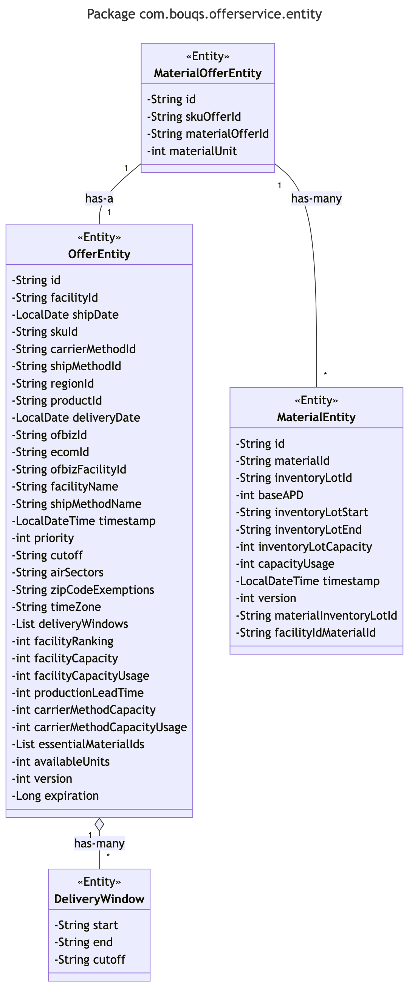

# com.bouqs.offerservice.entity

## Class: OfferEntity

**com.bouqs.offerservice.entity.OfferEntity**

```java
@RedisHash("offer")
@Getter
@Setter
@AllArgsConstructor
@NoArgsConstructor
@Builder(toBuilder = true)
@Generated
@ToString
public class OfferEntity 
```
The OfferEntity class is a representation of an offer stored in a Redis hash. It includes various methods and fields to manage and manipulate offer data. This class is annotated with various annotations like @RedisHash, @Getter, @Setter, @AllArgsConstructor, @NoArgsConstructor, @Builder, @Generated, @ToString to provide additional functionality and enhance the class's behavior. The fields in this class represent different attributes of an offer, such as facilityId, shipDate, skuId, carrierMethodId, shipMethodId, regionId, productId, deliveryDate, ofbizId, ecomId, ofbizFacilityId, facilityName, shipMethodName, timestamp, priority, cutoff, airSectors, zipCodeExemptions, timeZone, deliveryWindows, facilityRanking, facilityCapacity, facilityCapacityUsage, productionLeadTime, carrierMethodCapacity, carrierMethodCapacityUsage, essentialMaterialIds, availableUnits, version, and expiration. These fields store various information related to the offer, such as identifiers, dates, names, capacities, and other relevant data.
## Class: MaterialEntity

**com.bouqs.offerservice.entity.MaterialEntity**

```java
@RedisHash("material")
@Getter
@Setter
@AllArgsConstructor
@NoArgsConstructor
@Builder(toBuilder = true)
@Generated
@ToString
public class MaterialEntity 
```
The `MaterialEntity` class is a representation of a material in an inventory system. It is annotated with various annotations for persistence using Redis. The class provides a set of methods and fields for managing the properties of a material.

The class has fields for a unique identifier (`id`), composite keys for the material and inventory lot (`materialId` and `inventoryLotId`), base average daily production (`baseAPD`), start and end dates for the inventory lot (`inventoryLotStart` and `inventoryLotEnd`), capacity of the inventory lot (`inventoryLotCapacity`), usage of the capacity (`capacityUsage`), timestamp for tracking updates (`timestamp`), version for optimistic locking (`version`), and composite keys for material and inventory lot (`materialInventoryLotId` and `facilityIdMaterialId`).

Overall, the `MaterialEntity` class provides a convenient way to store and retrieve information about a material in an inventory system.
## Class: DeliveryWindow

**com.bouqs.offerservice.entity.DeliveryWindow**

```java
@Setter
@Getter
@Builder
@AllArgsConstructor
@NoArgsConstructor
@Generated
public class DeliveryWindow 
```
# DeliveryWindow Class

The `DeliveryWindow` class is a software entity that represents a delivery time window. It is annotated with various annotations such as `@Setter`, `@Getter`, `@Builder`, `@AllArgsConstructor`, `@NoArgsConstructor`, and `@Generated` for enhanced functionality and improved code generation.

## Methods

The `DeliveryWindow` class may have additional methods defined, which are not listed here for brevity and context independence.

## Fields

- `start` (private String): Represents the start time of the delivery window.
- `end` (private String): Represents the end time of the delivery window.
- `cutoff` (private String): Represents the cut-off time for accepting delivery orders within the window.

Please refer to the detailed documentation for any specific information regarding the purpose, behavior, and usage of these fields.
## Class: MaterialOfferEntity

**com.bouqs.offerservice.entity.MaterialOfferEntity**

```java
@RedisHash("material-offer")
@Getter
@Setter
@AllArgsConstructor
@NoArgsConstructor
@Builder(toBuilder = true)
@Generated
@ToString
public class MaterialOfferEntity 
```
The MaterialOfferEntity class is a model class representing a material offer in a software system. It is annotated with various annotations such as @RedisHash, @Getter, @Setter, @AllArgsConstructor, @NoArgsConstructor, @Builder, @Generated, and @ToString to provide various functionalities.

The class has the following methods: 

- No methods are explicitly defined in this class.

The class has the following fields:

- id: A string field representing the ID of the material offer. It is annotated with @Id.
- skuOfferId: A string field representing the ID of the SKU offer associated with the material offer. It is annotated with @Indexed.
- materialOfferId: A string field representing the ID of the material or inventory lot associated with the material offer. It is annotated with @Indexed.
- materialUnit: An integer field representing the quantity or unit of the material offer.

Overall, the MaterialOfferEntity class is a convenient and annotated representation of a material offer, allowing for easy manipulation and storage in a software system.
