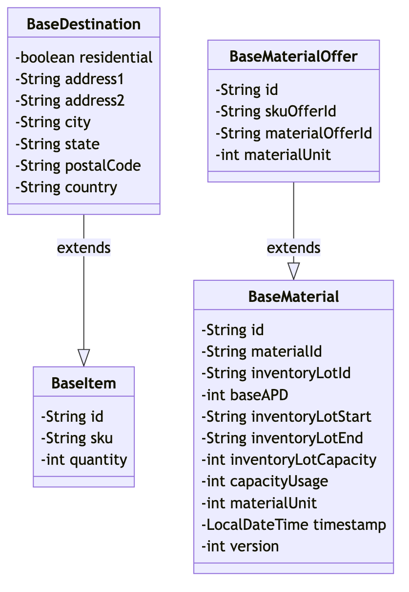

# com.bouqs.offerservice.entity.dto

## Class: BaseDestination

**com.bouqs.offerservice.entity.dto.BaseDestination**
# BaseDestination Class

The **BaseDestination** class is a software engineering class that represents a destination, typically used in a travel booking system. The class is annotated with `@Setter`, `@Getter`, `@NoArgsConstructor`, `@AllArgsConstructor`, and `@SuperBuilder`, which provide convenient methods for setting and accessing the class fields. 

The class has several fields that provide information about the destination, including:

- `residential` (boolean): Indicates whether the destination is a residential address or not.
- `address1` (String): The first line of the destination address.
- `address2` (String): The second line of the destination address.
- `city` (String): The city where the destination is located.
- `state` (String): The state where the destination is located.
- `postalCode` (String): The postal code of the destination.
- `country` (String): The country where the destination is located.

Overall, the **BaseDestination** class serves as a foundational class for representing destinations in a travel booking system, providing convenient methods for accessing and manipulating destination information.## Class: BaseItem

**com.bouqs.offerservice.entity.dto.BaseItem**
## Class Description: BaseItem

The `BaseItem` class is a software entity that represents an item in an e-commerce system or a product in a software application. This class is annotated with various annotations including `@Setter` and `@Getter` to automatically generate setters and getters for its fields. It also includes the `@NoArgsConstructor` and `@AllArgsConstructor` annotations to generate default and parameterized constructors respectively. The `@SuperBuilder` annotation is used to generate a builder pattern implementation for this class.

This class has three fields:
- `id` (String): Represents the unique identifier for the item, which can be either a product ID or an e-commerce ID.
- `sku` (String): Represents the unique identifier for the item's Stock Keeping Unit (SKU), which can be either an SKU ID or an OFBiz ID.
- `quantity` (int): Represents the quantity of this item.

The purpose of this class is to provide a foundation or a base structure for creating more specialized classes or entities related to items or products in the software system. It encapsulates common properties and behaviors that are shared among different types of items.

By using this class as a base, developers can easily extend its functionality and tailor it to specific requirements by adding more fields, methods, or annotations in the derived classes.## Class: BaseMaterial

**com.bouqs.offerservice.entity.dto.BaseMaterial**
# Class: BaseMaterial

The `BaseMaterial` class represents a base material used in manufacturing processes. It has various fields that hold information related to the material, such as its ID, inventory lot ID, capacity, and timestamp.

This class includes the following annotations:

- `@Setter`: Generates setter methods for the fields.
- `@Getter`: Generates getter methods for the fields.
- `@NoArgsConstructor`: Generates a constructor with no arguments.
- `@AllArgsConstructor`: Generates a constructor with all arguments.
- `@SuperBuilder`: Supports the builder design pattern for creating instances of the class.

The `BaseMaterial` class has no specific methods defined in it. It serves as a container for holding the data related to a base material.

Javadoc for the class can be found below:

```java
/**
 * The `BaseMaterial` class represents a base material used in manufacturing processes.
 * It contains various fields to hold information about the material, such as its ID, inventory lot ID, and capacity.
 */
```

Overall, the `BaseMaterial` class provides a basic structure to store and manage information about base materials in a manufacturing system.## Class: BaseMaterialOffer

**com.bouqs.offerservice.entity.dto.BaseMaterialOffer**
# BaseMaterialOffer Class

The `BaseMaterialOffer` class is a software engineering class that represents a material offer. This class is annotated with `@Setter`, `@Getter`, `@NoArgsConstructor`, `@AllArgsConstructor`, and `@SuperBuilder`, which provide convenient methods for accessing and setting the class's fields.

This class has the following fields:

- `id` (type: `String`) - Represents the unique identifier for this material offer.
- `skuOfferId` (type: `String`) - Represents the identifier of the SKU offer associated with this material offer.
- `materialOfferId` (type: `String`) - Represents the identifier of the material offer.
- `materialUnit` (type: `int`) - Represents the unit of the material offer.

The `BaseMaterialOffer` class is designed to be extended and provides a foundation for implementing additional functionality related to material offers.