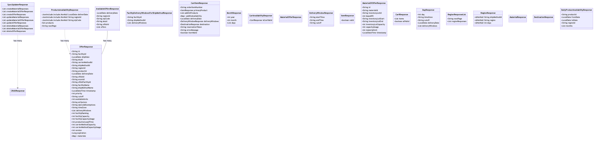

# com.bouqs.offerservice.entity.dto.response

## Class: SyncUpdaterResponse

**com.bouqs.offerservice.entity.dto.response.SyncUpdaterResponse**

```java
@Setter
@Getter
@Builder
@NoArgsConstructor
@AllArgsConstructor
public class SyncUpdaterResponse 
```
SyncUpdaterResponse class is a Java class that represents a response object for a synchronization update operation. This class is annotated with Lombok annotations like @Setter, @Getter, @Builder, @NoArgsConstructor, @AllArgsConstructor to automatically generate setter and getter methods, builder method, default constructor, and constructor with all fields respectively. This class has several private fields which are lists of CRUDResponse objects representing the responses for various CRUD operations like create, update, and delete for different types of materials, material offers, and offers. Overall, this class provides a convenient and efficient way to handle and manage the responses for synchronization update operations.
## Class: ProductsAvailabilityResponse

**com.bouqs.offerservice.entity.dto.response.ProductsAvailabilityResponse**

```java
@Setter
@Getter
@Builder
@AllArgsConstructor
@NoArgsConstructor
public class ProductsAvailabilityResponse 
```
## ProductsAvailabilityResponse Class

The `ProductsAvailabilityResponse` class is a software engineering class that represents a response for product availability. It is annotated with `@Setter`, `@Getter`, `@Builder`, `@AllArgsConstructor`, and `@NoArgsConstructor` to generate the necessary getter and setter methods, a builder pattern, and constructors with and without arguments.

### Methods:
This class does not have any additional methods.

### Fields:
- `deliverDate`: A field of type `LocalDate` that represents the delivery date. It is annotated with `@JsonInclude(JsonInclude.Include.NON_NULL)` to exclude it from the JSON output if it is null.
- `regionId`: A field of type `String` that represents the region ID. It is annotated with `@JsonInclude(JsonInclude.Include.NON_NULL)` to exclude it from the JSON output if it is null.
- `zipCode`: A field of type `String` that represents the zip code. It is annotated with `@JsonInclude(JsonInclude.Include.NON_NULL)` to exclude it from the JSON output if it is null.
- `products`: A field of type `Set<String>` that represents the available products.
- `nextPage`: A field of type `String` that represents the URL of the next page, if applicable.

This class is primarily used for handling and communicating product availability data in a structured format.
## Class: AvailableOffersResponse

**com.bouqs.offerservice.entity.dto.response.AvailableOffersResponse**

```java
@Getter
@Setter
@Builder
@AllArgsConstructor
@NoArgsConstructor
public class AvailableOffersResponse 
```
# AvailableOffersResponse

The `AvailableOffersResponse` class represents a response object that provides information about the available offers. This class is designed with the `@Getter`, `@Setter`, `@Builder`, `@AllArgsConstructor`, and `@NoArgsConstructor` annotations to generate getters, setters, builder methods, and constructors automatically.

## Methods
There are no additional methods defined in this class.

## Fields
- `deliveryDate` (type: `LocalDate`): Represents the date of delivery.
- `regionId` (type: `String`): Represents the ID of the region.
- `zipCode` (type: `String`): Represents the ZIP code.
- `skuId` (type: `String`): Represents the SKU ID.
- `ofbizId` (type: `String`): Represents the OFBIZ ID.
- `offers` (type: `List<OfferResponse>`): Represents a list of offer responses.

Please note that the field `productId` is commented out, indicating that it is not a part of this class.
## Class: FacilityDeliveryWindowsForShipMethodResponse

**com.bouqs.offerservice.entity.dto.response.FacilityDeliveryWindowsForShipMethodResponse**

```java
@Setter
@Getter
@NoArgsConstructor
@AllArgsConstructor
@Builder
public class FacilityDeliveryWindowsForShipMethodResponse 
```
**FacilityDeliveryWindowsForShipMethodResponse**

The `FacilityDeliveryWindowsForShipMethodResponse` class is a Java class that represents a response object for retrieving delivery windows for a specific ship method at a facility. The class is annotated with `@Setter`, `@Getter`, `@NoArgsConstructor`, `@AllArgsConstructor`, and `@Builder` to provide automatic generation of setter and getter methods, constructors, and a builder pattern for object instantiation.

The class has the following methods:

1. No explicit methods are mentioned in the class definition, indicating that it inherits methods from its parent classes or interfaces.

The class has the following fields:

1. `facilityId`: A private string field that stores the unique identifier of the facility for which the delivery windows are associated.

2. `shipMethodId`: A private string field that stores the unique identifier of the ship method for which the delivery windows are retrieved.

3. `deliveryWindows`: A private list of `DeliveryWindowResponse` objects that represents the available delivery windows for the specified ship method at the facility.

The purpose of this class is to provide a structured response object that contains the necessary information for retrieving and working with delivery windows for a specific ship method at a facility. It encapsulates the relevant data and follows commonly used coding conventions for easier integration and maintainability in software systems.
## Class: CartItemResponse

**com.bouqs.offerservice.entity.dto.response.CartItemResponse**

```java
@Setter
@Getter
@NoArgsConstructor
@AllArgsConstructor
@Builder
@ToString
public class CartItemResponse 
```
The `CartItemResponse` class is a representation of a cart item response in a software system. It is annotated with various annotations such as `@Setter`, `@Getter`, `@NoArgsConstructor`, `@AllArgsConstructor`, `@Builder`, and `@ToString` to automatically generate setter and getter methods, constructors, and a `toString()` method for the class.

The class has the following fields:

- `orderItemNumber`: A string representing the order item number.
- `primaryProduct`: An `ItemResponse` object representing the primary product in the cart item.
- `addOnProducts`: A list of `ItemResponse` objects representing the add-on products in the cart item.
- `addOnAvailability`: A map that stores the availability of the add-on products.
- `deliveryDate`: A `LocalDate` representing the delivery date for the cart item.
- `deliveryWindows`: A `DeliveryWindowResponse` object representing the delivery windows available for the cart item.
- `destination`: A `DestinationResponse` object representing the destination for the cart item.
- `reservationToken`: A string representing the reservation token for the cart item.
- `errorMessage`: A string representing any error message associated with the cart item.
- `itemValid`: A boolean value indicating whether the cart item is valid or not.

Overall, the `CartItemResponse` class provides a structured representation of a cart item response in the software system.
## Class: MonthResponse

**com.bouqs.offerservice.entity.dto.response.MonthResponse**

```java
@Builder
@AllArgsConstructor
@NoArgsConstructor
@Getter
@Setter
@Generated
public class MonthResponse 
```
### Class Description: MonthResponse

The `MonthResponse` class is a representation of a month, containing information about the year, the month, and a list of `DayResponse` objects representing the days within that month.

This class has been annotated with various Lombok annotations (`@Builder`, `@AllArgsConstructor`, `@NoArgsConstructor`, `@Getter`, `@Setter`, and `@Generated`) to simplify the creation of builder, constructor, getter, and setter methods.

The `MonthResponse` class serves as a response object, providing a structured way to store and retrieve information related to a specific month. It facilitates the encapsulation and access of the year, month, and the corresponding list of days associated with that month.
## Class: CartAvailabilityResponse

**com.bouqs.offerservice.entity.dto.response.CartAvailabilityResponse**

```java
@Getter
@Setter
@Builder
@NoArgsConstructor
@AllArgsConstructor
@Generated
public class CartAvailabilityResponse 
```
# CartAvailabilityResponse Class

The `CartAvailabilityResponse` class is a software engineering class that represents a response for cart availability. It is annotated with `@Getter`, `@Setter`, `@Builder`, `@NoArgsConstructor`, `@AllArgsConstructor`, and `@Generated` annotations to provide convenient getters and setters, builder pattern, default constructor, and all-arguments constructor. The class has a private field `isCartValid` of type `CartResponse` that serves as the result for checking cart validity.

Please note that this description only covers the structure and purpose of the class, and does not provide details on the implementation or behavior of its methods and fields.
## Class: MaterialOfferResponse

**com.bouqs.offerservice.entity.dto.response.MaterialOfferResponse**

```java
@Generated
@Getter
@Setter
@SuperBuilder
@NoArgsConstructor
public class MaterialOfferResponse extends BaseMaterialOffer 
```
The `MaterialOfferResponse` class is a child class of `BaseMaterialOffer` and is used to represent a material offer response in a software application. This class is annotated with various annotations such as `@Generated`, `@Getter`, `@Setter`, `@SuperBuilder`, and `@NoArgsConstructor` to provide additional functionality and control. 

The class includes methods for accessing and modifying its fields, which are inherited from the parent class. These methods allow for easy retrieval and manipulation of the material offer response data. 

The `MaterialOfferResponse` class serves as a container for storing information related to a specific material offer response and can be used to handle and process this data within the application.
## Class: DeliveryWindowResponse

**com.bouqs.offerservice.entity.dto.response.DeliveryWindowResponse**

```java
@Setter
@Getter
@Builder
@AllArgsConstructor
@NoArgsConstructor
@Generated
public class DeliveryWindowResponse 
```
The `DeliveryWindowResponse` class is a response class that represents a delivery window for a certain task or action. It is annotated with various annotations like `@Setter`, `@Getter`, `@Builder`, `@AllArgsConstructor`, `@NoArgsConstructor`, and `@Generated` to provide convenience methods and constructors.

This class has three private fields that store the start time, end time, and cutoff time for the delivery window. These fields are of type `String` and are used to represent time values.

The purpose of this class is to encapsulate the information related to a delivery window and provide getters and setters for accessing and modifying the values of these fields. It also supports the builder pattern for easy instantiation and has constructors with and without arguments for convenience.

Overall, the `DeliveryWindowResponse` class is a simple and lightweight class that represents a delivery window, providing easy access and manipulation of the start time, end time, and cutoff time.
## Class: OfferResponse

**com.bouqs.offerservice.entity.dto.response.OfferResponse**

```java
@Setter
@Getter
@SuperBuilder
@NoArgsConstructor
public class OfferResponse 
```
# OfferResponse Class

The OfferResponse class is a model class used for handling offers and responses in a software application. It is used to represent and store information related to offers and their corresponding responses. 

The class has various fields that store different pieces of information related to the offer and its response. These fields include the offer ID, facility ID, ship date, SKU ID, carrier method ID, ship method ID, region ID, product ID, delivery date, OFBIZ ID, ECOM ID, OFBIZ facility ID, facility name, ship method name, timestamp, priority, cutoff, available units, air sectors, zip code exemptions, time zone, delivery windows, facility ranking, facility capacity, facility capacity usage, production lead time, carrier method capacity, carrier method capacity usage, version, expiration, and materials.

The class also includes getter and setter methods for accessing and modifying the field values. Additionally, it includes the SuperBuilder annotation, which enables the class to be used with the builder design pattern, and the NoArgsConstructor annotation, which generates a constructor with no arguments.

Overall, the OfferResponse class serves as a container for storing and manipulating data related to offers and their responses within a software application.
## Class: ItemResponse

**com.bouqs.offerservice.entity.dto.response.ItemResponse**

```java
@Getter
@Setter
@SuperBuilder
@NoArgsConstructor
@AllArgsConstructor
public class ItemResponse extends BaseItem 
```
The `ItemResponse` class is a subclass of the `BaseItem` class and is used to represent a response for an item in a software system. This class is annotated with the `@Getter`, `@Setter`, `@SuperBuilder`, `@NoArgsConstructor`, and `@AllArgsConstructor` annotations to automatically generate getter and setter methods, a builder pattern, and constructors with and without arguments.

The `ItemResponse` class has a private field named `valid`, which is a boolean that indicates the validity of the item response.

This class provides a way to encapsulate and manipulate item response data in a convenient and efficient manner. It can be used in various software systems where item responses are essential for processing and providing feedback.
## Class: MaterialOfOfferResponse

**com.bouqs.offerservice.entity.dto.response.MaterialOfOfferResponse**

```java
@Setter
@Getter
@NoArgsConstructor
@AllArgsConstructor
@Builder
public class MaterialOfOfferResponse 
```
The MaterialOfOfferResponse class is a model class that represents the response for a material offer. It is used to provide information about a specific material, including its ID, inventory lot ID, capacity, availability, and timestamp. This class is annotated with various Lombok annotations, such as @Setter, @Getter, @NoArgsConstructor, @AllArgsConstructor, and @Builder, to automatically generate the getter and setter methods, constructors, and builder methods. It also includes Javadoc documentation to describe the purpose and usage of the class and its fields. Overall, the MaterialOfOfferResponse class is designed to encapsulate the data related to a material offer response in a convenient and reusable manner.
## Class: CartResponse

**com.bouqs.offerservice.entity.dto.response.CartResponse**

```java
@Setter
@Getter
@NoArgsConstructor
@AllArgsConstructor
@Builder
public class CartResponse 
```
The CartResponse class is a representation of the response for a cart. It contains a list of CartItemResponse objects, which represents the items in the cart. The class also has a boolean field called allValid, which indicates whether all the items in the cart are valid. This class has been annotated with the Lombok annotations @Setter, @Getter, @NoArgsConstructor, @AllArgsConstructor, and @Builder, which provide convenient methods for setting/getting fields, creating constructors, and building objects.
## Class: DayResponse

**com.bouqs.offerservice.entity.dto.response.DayResponse**

```java
@Builder
@AllArgsConstructor
@NoArgsConstructor
@Getter
@Setter
public class DayResponse 
```
**DayResponse**

The `DayResponse` class is a Java class that represents a response for a specific day. It is a data class that holds information about the day, time zone, cutoff time, delivery date, and a list of delivery windows. 

The class includes several annotations such as `@Builder`, `@AllArgsConstructor`, `@NoArgsConstructor`, `@Getter`, and `@Setter`, which provide convenient ways to construct objects, generate constructors, getters, and setters automatically, respectively.

The `DayResponse` class has the following fields:

- `day` (private int) - represents the day of the response.
- `timeZone` (private String) - represents the time zone of the response.
- `cutoff` (private String) - represents the cutoff time of the response.
- `deliveryDate` (private LocalDate) - represents the delivery date of the response.
- `deliveryWindows` (private List<DeliveryWindowResponse>) - represents a list of delivery windows associated with the response.

Overall, the `DayResponse` class encapsulates the necessary information for a specific day's response, making it easy to work with and manipulate the data.
## Class: RegionResponseList

**com.bouqs.offerservice.entity.dto.response.RegionResponseList**

```java
@Builder
@Getter
@Setter
@NoArgsConstructor
@AllArgsConstructor
@Generated
@JsonIgnoreProperties(ignoreUnknown = true)
public class RegionResponseList 
```
The RegionResponseList class is a representation of a response list for regions. It is annotated with various annotations like @Builder, @Getter, @Setter, @NoArgsConstructor, @AllArgsConstructor, @Generated, and @JsonIgnoreProperties(ignoreUnknown = true) to provide additional functionalities and for serialization purposes. 

The class contains two fields: 

1. nextPage: a private field of type String, representing the next page for pagination.

2. regionResponses: a private field of type List<RegionResponse>, which holds a list of region responses.

Overall, the RegionResponseList class is designed to provide a structured response for region-related operations in a software system.
## Class: RegionResponse

**com.bouqs.offerservice.entity.dto.response.RegionResponse**

```java
@Getter
@Setter
@NoArgsConstructor
@JsonIgnoreProperties(ignoreUnknown = true)
public class //@EqualsAndHashCode(callSuper = false)
RegionResponse 
```
## RegionResponse Class Description

The `RegionResponse` class is a representation of a region response in a software application. It is annotated with `@Getter`, `@Setter`, `@NoArgsConstructor`, and `@JsonIgnoreProperties(ignoreUnknown = true)` annotations.

The class has the following methods and fields:

**Methods:**

- None specified.

**Fields:**

- `shipMethodId`: A non-null string representing the shipping method ID for the region response.
- `region`: A non-null string representing the region for the response.
- `days`: An integer representing the number of days associated with the region response.

The `RegionResponse` class is designed to provide information about a specific region, its associated shipping method ID, and the number of days it takes for the shipping to be fulfilled.
## Class: MaterialResponse

**com.bouqs.offerservice.entity.dto.response.MaterialResponse**

```java
@Setter
@Getter
@SuperBuilder
@NoArgsConstructor
@Generated
public class MaterialResponse extends BaseMaterial 
```
The `MaterialResponse` class is a subclass of `BaseMaterial`, designed to represent a response object related to materials. This class is annotated with various annotations like `@Setter`, `@Getter`, `@SuperBuilder`, `@NoArgsConstructor`, and `@Generated`. These annotations provide convenient methods for setting and getting the fields of the class, as well as generating builders and constructors.

The class contains no specific methods or fields, as they are not specified in the provided context. However, being a subclass of `BaseMaterial`, it inherits all the methods and fields defined in the parent class.

The purpose of this class is to serve as a response object specifically related to materials in the software system. Its usage may include representing material information returned from API calls, database queries, or other data retrieval operations.
## Class: DestinationResponse

**com.bouqs.offerservice.entity.dto.response.DestinationResponse**

```java
@Getter
@Setter
@SuperBuilder
@NoArgsConstructor
public class DestinationResponse extends BaseDestination 
```
The `DestinationResponse` class is a subclass of `BaseDestination` and is designed for representing and managing response information related to destinations. It provides getter and setter methods for accessing and modifying its fields. With the help of the `SuperBuilder` annotation, this class enables the easy creation of builder patterns for constructing instances. The class also has a default constructor (`NoArgsConstructor`), allowing for the creation of objects without specifying any initial values. Overall, the `DestinationResponse` class serves as a convenient and flexible data structure for storing and manipulating destination response data.
## Class: DailyProductAvailabilityResponse

**com.bouqs.offerservice.entity.dto.response.DailyProductAvailabilityResponse**

```java
@Getter
@Setter
@Builder
@NoArgsConstructor
@AllArgsConstructor
public class DailyProductAvailabilityResponse 
```
# DailyProductAvailabilityResponse Class

The `DailyProductAvailabilityResponse` class is a Java class that represents a response for daily product availability. It is annotated with `@Getter`, `@Setter`, `@Builder`, `@NoArgsConstructor`, and `@AllArgsConstructor` to provide getter and setter methods, builder pattern for object creation, and constructors with and without arguments.

## Fields

- `productId`: Represents the ID of the product.
- `fromDate`: Represents the start date for the availability period.
- `toDate`: Represents the end date for the availability period.
- `regionId`: Represents the ID of the region (optional field).
- `months`: Represents a list of `MonthResponse` objects, which provide availability information for each month within the specified period.
## Class: CRUDResponse

**com.bouqs.offerservice.entity.dto.response.CRUDResponse**

```java
@Setter
@Getter
@Builder
@NoArgsConstructor
@AllArgsConstructor
@Generated
public class CRUDResponse 
```
The `CRUDResponse` class is a Java class designed to handle the response of a CRUD (Create, Read, Update, Delete) operation. It is annotated with `@Setter`, `@Getter`, `@Builder`, `@NoArgsConstructor`, `@AllArgsConstructor`, and `@Generated` to provide convenient getter and setter methods, a builder pattern for object creation, default and parameterized constructors, and to indicate that the source code was automatically generated.

The class has three private fields: `id`, `success`, and `message`. These fields are used to store the unique identifier of the CRUD operation, a boolean flag indicating the success of the operation, and a descriptive message about the operation respectively.

Overall, the `CRUDResponse` class provides a standardized structure for representing the response of a CRUD operation, allowing software engineers to easily handle and process the response in their applications.
