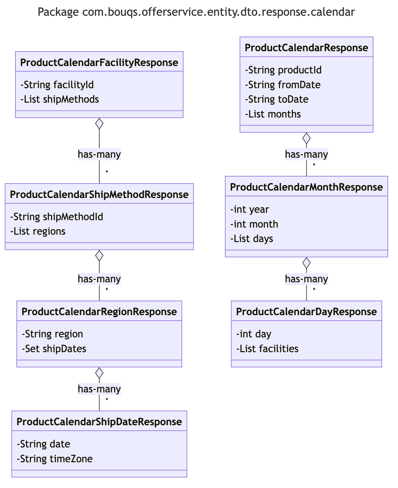

# com.bouqs.offerservice.entity.dto.response.calendar

## Class: ProductCalendarRegionResponse

**com.bouqs.offerservice.entity.dto.response.calendar.ProductCalendarRegionResponse**
## ProductCalendarRegionResponse Class

The `ProductCalendarRegionResponse` class is a public class that represents a response object for product calendar regions. It provides information about a specific region and the associated ship dates for products within that region.

This class has the following methods:

- No methods defined.

And the following fields:

- `region`: A private `String` field that contains the name or identifier of the region.
- `shipDates`: A private `Set` of `ProductCalendarShipDateResponse` objects representing the ship dates associated with the products in the region.

The purpose of this class is to encapsulate the data related to a specific product calendar region and its associated ship dates. It allows software engineers to easily work with and manipulate the response data within their applications, making it easier to manage and organize product calendar information at a regional level.## Class: ProductCalendarResponse

**com.bouqs.offerservice.entity.dto.response.calendar.ProductCalendarResponse**
# ProductCalendarResponse Class

The `ProductCalendarResponse` class represents a response object for a product calendar. It is designed to provide information about the availability and scheduling of a particular product.

This class contains fields and methods to effectively manage and manipulate product calendar data. The key fields of this class include `productId` (a unique identifier for the product), `fromDate` (the starting date of the calendar), `toDate` (the ending date of the calendar), and `months` (a list of `ProductCalendarMonthResponse` objects representing individual months within the calendar).

The `ProductCalendarResponse` class serves as a container for storing and retrieving product calendar data, making it easier for the software system to process and present the information.

Overall, this class plays a significant role in providing a structured representation of a product's availability over a specified time period.## Class: ProductCalendarDayResponse

**com.bouqs.offerservice.entity.dto.response.calendar.ProductCalendarDayResponse**
## ProductCalendarDayResponse Class

The `ProductCalendarDayResponse` class represents a response object for a specific day in a product calendar. This class is used to provide information about the availability and facilities associated with a particular day.

The class has two main components - `day`, which represents the specific day being described, and `facilities`, which is a list of `ProductCalendarFacilityResponse` objects. The `day` field holds an integer value indicating the specific day, while the `facilities` field holds a list of facility responses associated with that day.

The `ProductCalendarDayResponse` class provides a structured and organized way to store and retrieve information related to product availability and associated facilities for a specific day in a product calendar. It is a key component in building systems that require efficient handling of product scheduling and availability management.## Class: ProductCalendarFacilityResponse

**com.bouqs.offerservice.entity.dto.response.calendar.ProductCalendarFacilityResponse**
# ProductCalendarFacilityResponse

The `ProductCalendarFacilityResponse` class is a representation of a facility response in a product calendar. It contains information about the facility and the available ship methods for products.

The class has the following fields:
- `facilityId`: A private field of type `String` that represents the unique identifier of the facility.
- `shipMethods`: A private field of type `List<ProductCalendarShipMethodResponse>` that contains the available ship methods for the facility.

This class does not have any methods, as it is mainly used for data storage and retrieval. It provides a way to encapsulate and organize the information related to a facility response in a product calendar.

Overall, the `ProductCalendarFacilityResponse` class plays a crucial role in managing and representing facility information in a product calendar application.## Class: ProductCalendarMonthResponse

**com.bouqs.offerservice.entity.dto.response.calendar.ProductCalendarMonthResponse**
## ProductCalendarMonthResponse class description

The `ProductCalendarMonthResponse` class represents a response object for a calendar month in a product system. It contains information about the year, month, and a list of days with their corresponding details.

This class is designed to provide a convenient way to organize and retrieve data for a specific month in a product calendar. It encapsulates the necessary information, allowing other parts of the software system to manipulate and display the calendar month data effectively.

The `ProductCalendarMonthResponse` class is not intended to perform complex operations or calculations. Instead, it serves as a data carrier, storing the relevant attributes required for representing a product calendar month.

It is important to note that this class does not specify any behavior or functionality beyond storing and accessing the provided fields. The actual processing and manipulation of the calendar month data would typically be performed by other classes or components in the system.

The key fields of the `ProductCalendarMonthResponse` class include:
- `year`: An `int` field representing the year of the calendar month.
- `month`: An `int` field representing the month number.
- `days`: A `List<ProductCalendarDayResponse>` field containing a list of `ProductCalendarDayResponse` objects representing the individual days in the calendar month.

Overall, the `ProductCalendarMonthResponse` class serves as a container for organizing and representing the data associated with a product calendar month, providing easy access and retrieval of the required information.## Class: ProductCalendarShipMethodResponse

**com.bouqs.offerservice.entity.dto.response.calendar.ProductCalendarShipMethodResponse**
# Class: ProductCalendarShipMethodResponse

This class represents a response object for the product calendar ship method. It encapsulates information related to a ship method for a product calendar.

This class has two main components:

1. Fields: 
   - `shipMethodId` (private String): Represents the unique identifier of the ship method.
   - `regions` (private List<ProductCalendarRegionResponse>): Represents a list containing the regions associated with the ship method.

2. Methods: 
   - No methods are described in the context of this class.

Overall, the ProductCalendarShipMethodResponse class provides a convenient and structured way to organize ship method information, allowing software engineers to efficiently manage and process ship methods within a product calendar context.## Class: ProductCalendarShipDateResponse

**com.bouqs.offerservice.entity.dto.response.calendar.ProductCalendarShipDateResponse**
# ProductCalendarShipDateResponse

The `ProductCalendarShipDateResponse` class represents a response containing ship date information for a product calendar. 

This class has two private fields, `date` and `timeZone`, which hold the ship date and the corresponding time zone, respectively. These fields provide the necessary information to determine when a product is expected to be shipped.

There are no specific methods defined in this class. It serves as a data container to encapsulate and transport the ship date response from one part of the software system to another.

Overall, the `ProductCalendarShipDateResponse` class plays a crucial role in providing ship date details for product calendars and facilitating communication between different components of the software system.