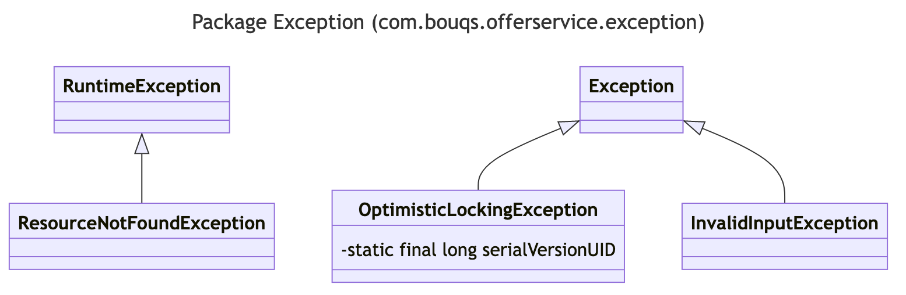

# com.bouqs.offerservice.exception

## Class: OptimisticLockingException

**com.bouqs.offerservice.exception.OptimisticLockingException**

```java
@ResponseStatus(value = HttpStatus.HTTP_VERSION_NOT_SUPPORTED, reason = "Optimistically Locking")
public class OptimisticLockingException extends Exception 
```
**Class Description:**

The `OptimisticLockingException` class defines an exception that is thrown in cases where optimistic locking is used and a concurrency issue occurs. This exception indicates that a transaction was unable to proceed due to a conflicting update that was made by another transaction. 

This class extends the `Exception` class, which is a base class for all exceptions in Java. The `ResponseStatus` annotation is used to indicate the HTTP status code and reason that should be returned when this exception is encountered. In this case, the status code is set to `HTTP_VERSION_NOT_SUPPORTED` and the reason is set to "Optimistically Locking".

The only field in this class is a private static final field `serialVersionUID`, which is used for serialization purposes.
## Class: ResourceNotFoundException

**com.bouqs.offerservice.exception.ResourceNotFoundException**

```java
@ResponseStatus(code = HttpStatus.NOT_FOUND)
public class ResourceNotFoundException extends RuntimeException 
```
The ResourceNotFoundException class is a custom exception class designed to handle situations where a requested resource is not found. It extends the RuntimeException class and is annotated with @ResponseStatus(code = HttpStatus.NOT_FOUND) to indicate that it should be treated as a HTTP 404 (Not Found) error. This class includes no additional methods or fields, serving solely as a container for the exception itself. This allows developers to easily throw and handle this exception when a resource is not found in order to provide clear and meaningful error messages to users.
## Class: InvalidInputException

**com.bouqs.offerservice.exception.InvalidInputException**

```java
@ResponseStatus(code = HttpStatus.NOT_FOUND)
public class InvalidInputException extends Exception 
```
The InvalidInputException class is a custom exception class in the software engineering domain. It is annotated with @ResponseStatus(code = HttpStatus.NOT_FOUND), indicating that it represents a resource not found exception. This class extends the general Exception class provided by Java.

As a custom exception, InvalidInputException allows developers to handle and raise exceptions specifically related to invalid inputs in the system. This could be useful when validating user inputs or when processing data from external sources. 

By extending the Exception class, InvalidInputException inherits all the exception handling capabilities provided by Java. This includes the ability to capture and propagate exceptions, as well as the ability to handle them using try-catch blocks.

Overall, the InvalidInputException class provides a convenient way to handle and manage errors caused by invalid inputs in a software system.
