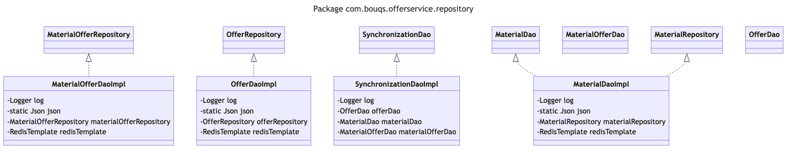

# com.bouqs.offerservice.repository

## Class: MaterialDaoImpl

**com.bouqs.offerservice.repository.MaterialDaoImpl**

```java
@Repository
public class MaterialDaoImpl implements MaterialDao 
```
# MaterialDaoImpl Class

The `MaterialDaoImpl` class is a repository class that implements the `MaterialDao` interface. It provides methods for accessing and manipulating `MaterialEntity` objects.

This class is annotated with `@Repository`, indicating that it is a data access object and can be used to perform CRUD (Create, Read, Update, Delete) operations on material entities.

The class includes the following methods:
- `findById(String id)`: Returns an optional `MaterialEntity` object based on the provided ID.
- `saveAll(Iterable<MaterialEntity> materialEntities)`: Saves multiple `MaterialEntity` objects in the database and returns an iterable collection of saved entities.
- `save(MaterialEntity materialEntity)`: Saves a single `MaterialEntity` object in the database and returns the saved entity.
- `deleteById(String materialId)`: Deletes a `MaterialEntity` object from the database based on the provided ID.
- `findByMaterialInventoryLotId(String materialId, String inventoryLotId)`: Returns a list of `MaterialEntity` objects that match the provided material ID and inventory lot ID.

The class also includes the following fields:
- `log` (private final `Logger`): A logger instance used for logging purposes.
- `json` (private static final `Json`): A JSON utility instance.
- `materialRepository` (Autowired `MaterialRepository`): An instance of the `MaterialRepository` interface, which allows access to the underlying data source/repository for material entities.
- `redisTemplate` (Autowired `RedisTemplate<String, String>`): An instance of `RedisTemplate`, used for interacting with a Redis cache.

Overall, the `MaterialDaoImpl` class provides the necessary functionality to interact with and manipulate material entities in a data storage system.
### Method: findById
```java
@Override
public Optional<MaterialEntity> findById(String id) {
    log.trace("Start findById");
    log.debug("id: {}", id);
    return materialRepository.findById(id);
}
```

### findById Overview 

The `findById` method in the `MaterialDaoImpl` class, located in the `com.bouqs.offerservice.repository` package, is used to retrieve a `MaterialEntity` object from the database based on its ID. 

Upon invocation, the method first logs a trace message indicating the start of the operation, followed by logging the ID of the entity being searched for in the debug level. 

The method then makes use of a `materialRepository` (assuming it's an instance of an object that implements the functionality of finding by ID) to actually perform the retrieval operation by calling its `findById` method and passing the provided ID as a parameter. 

The method ultimately returns an `Optional` object wrapping the found `MaterialEntity`, which allows for better handling of null values if the entity is not found.


### findById Step by Step  

## findById Method Description

The `findById` method is a component of the `MaterialDaoImpl` class, located in the `com.bouqs.offerservice.repository` package. 

This method is used to find a material entity using its unique identifier (`id`). It returns an optional material entity, which means it may or may not find a match for the specified `id`.

### Method Implementation

Here is a step-by-step breakdown of how the `findById` method is implemented:

1. Log a trace message to indicate the start of the `findById` method.
2. Log a debug message to display the `id` parameter value that was passed to the method.
3. Call the `findById` method on the `materialRepository`, passing the `id` as a parameter.
4. Return an optional material entity. This can either be an empty optional (indicating that no match was found for the `id`) or an optional containing the material entity that matches the `id`.

Note: The `findById` method is used to retrieve a specific material entity by its unique identifier (`id`). It is commonly used for fetching material details from a database or any storage system.

---
title: findById (MaterialDaoImpl)
---

sequenceDiagram
    participant MaterialDaoImpl
    participant log
    participant materialRepository
    
    MaterialDaoImpl->>log: Start findById
    MaterialDaoImpl->>log: id: {id}
    MaterialDaoImpl->>materialRepository: findById(id)
    materialRepository-->>MaterialDaoImpl: Return Optional<MaterialEntity>

### Method: saveAll
```java
@Override
public Iterable<MaterialEntity> saveAll(Iterable<MaterialEntity> materialEntities) {
    log.trace("Start saveAll");
    log.trace("materialEntities: {}", () -> json.toJson(materialEntities));
    return materialRepository.saveAll(materialEntities);
}
```

### saveAll Overview 

The `saveAll` method in the `MaterialDaoImpl` class is used to save a collection of `MaterialEntity` objects. It takes in an iterable of `MaterialEntity` objects as a parameter and returns an iterable of `MaterialEntity` objects. 

Within the method, it first logs a trace message indicating the start of the `saveAll` process. It then logs another trace message, including the JSON representation of the `materialEntities` parameter. Finally, it calls the `saveAll` method of the `materialRepository` object, passing in the `materialEntities` parameter, and returns the result.

Overall, this method provides a way to efficiently save a collection of `MaterialEntity` objects to the material repository.


### saveAll Step by Step  

The `saveAll` method in the class `com.bouqs.offerservice.repository.MaterialDaoImpl` is responsible for saving multiple material entities at once. It takes an iterable collection of material entities as its input.

Here's a step-by-step breakdown of what the method does:

1. The method begins by logging a trace message, indicating that the `saveAll` process has started.

2. It then logs another trace message with the details of the material entities being saved. This message is generated using JSON serialization to convert the material entities into a readable format.

3. Finally, the method calls the `saveAll` method of the `materialRepository` object with the `materialEntities` parameter. This is the actual step where the material entities are saved.

The method then returns the result of the save operation, which is an iterable collection of the saved material entities.

In summary, the `saveAll` method in the `MaterialDaoImpl` class saves multiple material entities by calling the `saveAll` method of the `materialRepository` object, after logging some trace information.

sequenceDiagram
    participant MaterialDaoImpl
    participant Logger
    participant MaterialRepository
    
    MaterialDaoImpl->>Logger: Log start of saveAll
    MaterialDaoImpl->>Logger: Log materialEntities
    MaterialDaoImpl->>MaterialRepository: Save all materialEntities
    MaterialRepository-->>MaterialDaoImpl: Return saved materialEntities

### Method: save
```java
@Override
public MaterialEntity save(MaterialEntity materialEntity) {
    log.trace("Start save");
    log.trace("materialEntity: {}", () -> json.toJson(materialEntity));
    return materialRepository.save(materialEntity);
}
```

### save Overview 

The `save` method is a part of the `MaterialDaoImpl` class in the `com.bouqs.offerservice.repository` package. 

This method takes a `MaterialEntity` object as a parameter and returns a `MaterialEntity` object. 

First, it logs a trace message "Start save" to mark the start of the method execution. 

Then, the method serializes the `materialEntity` object into JSON format and logs a trace message containing the serialized JSON.

Finally, the method calls the `save` method of the `materialRepository` object, passing in the `materialEntity` object, and returns the result.


### save Step by Step  

## Save Material

The `save()` method in the `MaterialDaoImpl` class is used to save a material entity in the material repository. 

### Method Signature
```java
public MaterialEntity save(MaterialEntity materialEntity)
```

### Steps

1. The method starts by logging a trace message to indicate the beginning of the save process.
2. It then logs the `materialEntity` object in JSON format for debugging purposes.
3. Finally, the method calls the `save()` method on the `materialRepository` with the `materialEntity` as the parameter to persist the entity in the material repository. 
4. The method returns the saved `MaterialEntity` object.

Please note that the `MaterialEntity` represents a material in the business domain and the `materialRepository` is responsible for persisting and retrieving material entities.

---
title: Save MaterialEntity
---

sequenceDiagram
    participant MaterialDaoImpl
    participant log
    participant json
    participant materialEntity
    participant materialRepository
    
    MaterialDaoImpl->>log: Start save
    MaterialDaoImpl->>log: materialEntity: {materialEntity}
    MaterialDaoImpl->>materialRepository: save(materialEntity)
    materialRepository-->>MaterialDaoImpl: Return saved materialEntity

### Method: deleteById
```java
@Override
public void deleteById(String materialId) {
    log.trace("Start deleteById");
    log.debug("materialId: {}", materialId);
    materialRepository.deleteById(materialId);
}
```

### deleteById Overview 

The `deleteById` method in the `MaterialDaoImpl` class, located in the `com.bouqs.offerservice.repository` package, is responsible for deleting a material from the database based on its ID. 

The method starts by tracing the execution with a log message and then logs the provided material ID as debug information. Finally, it calls the `deleteById` method on the `materialRepository` to perform the deletion operation.


### deleteById Step by Step  

## Method deleteById Description

The `deleteById` method is defined in the `MaterialDaoImpl` class and is responsible for deleting a material based on the provided `materialId`.

### Steps:

1. The method begins by logging a trace statement to indicate the start of the `deleteById` operation.

2. Next, a debug log statement is recorded, capturing the value of the `materialId` parameter that was passed to the method.

3. Finally, the `materialRepository.deleteById` method is called, passing in the `materialId` parameter. This method, presumably provided by a material repository, performs the actual deletion of the material with the specified `materialId`.

That's it! The `deleteById` method is a concise implementation that efficiently deletes a material by its unique identifier within the material repository.

---
title: deleteById (MaterialDaoImpl)
---

sequenceDiagram
    participant MaterialDaoImpl
    participant log
    participant materialRepository
    
    MaterialDaoImpl->>log: Start deleteById
    MaterialDaoImpl->>log: materialId: {materialId}
    MaterialDaoImpl->>materialRepository: deleteById(materialId)

### Method: findByMaterialInventoryLotId
```java
@Override
public List<MaterialEntity> findByMaterialInventoryLotId(String materialId, String inventoryLotId) {
    String materialInventoryLotId = String.join("-", materialId, inventoryLotId);
    log.trace("Start findByMaterialInventoryLotId");
    log.debug("materialInventoryLotId: {}", materialInventoryLotId);
    return materialRepository.findByMaterialInventoryLotId(materialInventoryLotId);
}
```

### findByMaterialInventoryLotId Overview 

The method `findByMaterialInventoryLotId` is implemented in the class `MaterialDaoImpl` in the `com.bouqs.offerservice.repository` package. 

This method takes two parameters, `materialId` and `inventoryLotId`, which represent the IDs of a material and an inventory lot. It concatenates these IDs with a hyphen to form the `materialInventoryLotId`.

The method logs a trace message indicating the start of the operation and a debug message that shows the value of `materialInventoryLotId`. 

The method then calls another method, `findByMaterialInventoryLotId`, in the `materialRepository`, and passes the `materialInventoryLotId` as an argument. 

Finally, the method returns a list of `MaterialEntity` objects, which is the result obtained from the `findByMaterialInventoryLotId` method in the `materialRepository`.


### findByMaterialInventoryLotId Step by Step  

## Method: findByMaterialInventoryLotId

The `findByMaterialInventoryLotId` method is defined in the `MaterialDaoImpl` class in the `com.bouqs.offerservice.repository` package. It is used to retrieve a list of `MaterialEntity` objects based on the provided `materialId` and `inventoryLotId`.

### Steps:

1. Combine the `materialId` and `inventoryLotId` into a single string called `materialInventoryLotId` using a hyphen as a separator.
2. Log a trace message indicating the start of the `findByMaterialInventoryLotId` method.
3. Log a debug message indicating the value of the `materialInventoryLotId` parameter.
4. Return the result of calling the `findByMaterialInventoryLotId` method on the `materialRepository` object, passing in the `materialInventoryLotId` parameter.

The method returns a list of `MaterialEntity` objects that match the provided `materialId` and `inventoryLotId`.

sequenceDiagram
    participant MaterialDaoImpl
    participant MaterialRepository
    participant Logger
    
    MaterialDaoImpl->>Logger: Start findByMaterialInventoryLotId
    MaterialDaoImpl->>Logger: materialInventoryLotId: {materialId}-{inventoryLotId}
    MaterialDaoImpl->>MaterialRepository: findByMaterialInventoryLotId(materialInventoryLotId)
    MaterialRepository-->>MaterialDaoImpl: Return list of MaterialEntity

## Class: OfferDaoImpl

**com.bouqs.offerservice.repository.OfferDaoImpl**

```java
@Repository
public class OfferDaoImpl implements OfferDao 
```
The OfferDaoImpl class is an implementation of the OfferDao interface. It is marked with the @Repository annotation, indicating that it is a repository class responsible for handling data access operations for OfferEntity objects.

This class provides methods for performing CRUD (Create, Read, Update, Delete) operations on OfferEntity objects. It includes methods for finding offers by id, saving offers, updating offers, and deleting offers. Additionally, it provides methods for finding offers by productId, facilityId and shipMethodId, as well as methods for finding offers by various combinations of deliveryDate, regionId, and offset and count values.

Internally, the class uses a logger to log information, a Json object for JSON serialization and deserialization, an OfferRepository object for accessing the data store, and a RedisTemplate object for accessing Redis.

Overall, the OfferDaoImpl class serves as a data access class for OfferEntity objects, providing methods to interact with the data store and perform common data manipulation operations.
### Method: findById
```java
@Override
public Optional<OfferEntity> findById(String offerId) {
    log.trace("Start findById");
    log.debug("offerId: {}", offerId);
    return offerRepository.findById(offerId);
}
```

### findById Overview 

The `findById` method is implemented in the `OfferDaoImpl` class and is used to find an `OfferEntity` by its `offerId`. The method starts by logging a trace message and then logs the `offerId` value for debugging purposes. Finally, the method calls the `findById` method of the `offerRepository` object to retrieve the `OfferEntity` with the specified `offerId` and returns it as an `Optional` object.


### findById Step by Step  

### Method: findById

This method is defined in the `OfferDaoImpl` class in the `com.bouqs.offerservice.repository` package. It retrieves an offer entity from the offer repository based on the provided `offerId`.

#### Description

The `findById` method takes in a `String` parameter `offerId`, which represents the unique identifier of the offer. It uses this identifier to search for the corresponding offer entity in the offer repository.

#### Steps

1. The method starts by logging a trace message to indicate the start of the `findById` operation.
2. It then logs a debug message to display the value of the `offerId` parameter.
3. Finally, the method calls the `findById` method of the `offerRepository`, passing in the `offerId` parameter. This method returns an `Optional` containing the offer entity if it exists, or an empty `Optional` if no offer entity with the provided `offerId` is found.

#### Return Value

The method returns an `Optional` of type `OfferEntity`, which either contains the offer entity if it exists or an empty `Optional` if no offer entity is found with the provided `offerId`.

---
title: findById (OfferDaoImpl)
---

sequenceDiagram
    participant OfferDaoImpl
    participant log
    participant offerRepository
    participant Optional<OfferEntity>
    
    OfferDaoImpl->>log: Start findById
    OfferDaoImpl->>log: offerId: {offerId}
    OfferDaoImpl->>offerRepository: findById(offerId)
    offerRepository-->>Optional<OfferEntity>: Return Optional<OfferEntity>
    Optional<OfferEntity]-->>OfferDaoImpl: Return Optional<OfferEntity>

### Method: saveAll
```java
//    @Override
//    public Iterable<OfferEntity> findAll() {
//        log.trace("Start findAll");
//        return offerRepository.findAll();
//    }
@Override
public Iterable<OfferEntity> saveAll(Iterable<OfferEntity> offerEntities) {
    log.trace("Start saveAll");
    List<OfferEntity> offers = StreamSupport.stream(offerEntities.spliterator(), false).filter(offer -> {
        try {
            ZonedDateTime.parse(offer.getCutoff());
            return true;
        } catch (Exception e) {
            log.error(String.format("invalid cutoff format, skip adding %s to redis", offer.getId()), e);
        }
        return false;
    }).peek(Utils::populateDataToDB).collect(Collectors.toList());
    return offerRepository.saveAll(offers);
}
```

### saveAll Overview 

The `saveAll` method in the `OfferDaoImpl` class is responsible for saving a collection of `OfferEntity` objects to the database. 

Here's what the method does:

1. It starts by logging a trace message: "Start saveAll".

2. It filters the input `Iterable<OfferEntity>` by checking the format of the `cutoff` field in each `OfferEntity` object. If the format is valid, the object is included in the filtered collection. Otherwise, an error message is logged.

3. For each valid `OfferEntity` object, a method called `populateDataToDB` is called to populate the object with data.

4. The filtered and populated `OfferEntity` objects are then saved to the database using the `offerRepository.saveAll` method.

5. Finally, the method returns an iterable of the saved `OfferEntity` objects.


### saveAll Step by Step  

## `saveAll` method description

The `saveAll` method in the `OfferDaoImpl` class is responsible for saving multiple `OfferEntity` objects to the database.

Here is a step-by-step explanation of what this method does:

1. It logs a trace message to indicate the start of the method.

2. It loops through each `OfferEntity` object in the `offerEntities` iterable.

3. For each `OfferEntity`, it checks if the `cutoff` date is in the correct format by attempting to parse it using the `ZonedDateTime.parse()` method. If the parsing is successful, it returns `true`, indicating that the `OfferEntity` should be included in the final list of offers to be saved.

4. If the parsing of the `cutoff` date fails, it logs an error message with details about the invalid format and skips adding that particular `OfferEntity` to the database.

5. After filtering out the invalid offers, the `Utils.populateDataToDB` method is called to populate any necessary data to the database for each remaining `OfferEntity`.

6. The filtered and populated `OfferEntity` objects are then collected into a List called `offers`.

7. Finally, the `offerRepository.saveAll()` method is called with the `offers` List to save all the valid `OfferEntity` objects to the database.

The `saveAll` method returns an iterable of the saved `OfferEntity` objects.

sequenceDiagram
    participant OfferDaoImpl
    participant Iterable<OfferEntity>
    participant log
    participant List<OfferEntity>
    participant StreamSupport
    participant OfferEntity
    participant ZonedDateTime
    participant Utils
    participant Collectors
    participant offerRepository
    
    OfferDaoImpl->>log: Start saveAll
    OfferDaoImpl->>Iterable<OfferEntity>: offerEntities
    Iterable<OfferEntity->>StreamSupport: spliterator()
    StreamSupport->>StreamSupport: filter offers
    StreamSupport->>ZonedDateTime: parse cutoff
    ZonedDateTime-->>StreamSupport: return true
    StreamSupport->>Utils: populateDataToDB
    Utils-->>StreamSupport: return offer
    StreamSupport->>Collectors: toList()
    Collectors-->>StreamSupport: return offers
    StreamSupport->>List<OfferEntity>: offers
    List<OfferEntity->>offerRepository: saveAll(offers)
    offerRepository-->>List<OfferEntity>: return saved offers
    List<OfferEntity-->>Iterable<OfferEntity>: return saved offers
    Iterable<OfferEntity-->>OfferDaoImpl: return saved offers

### Method: save
```java
@Override
public OfferEntity save(OfferEntity insertingOfferEntity) {
    log.trace("Start save");
    log.debug("insertingOfferEntity: {}", () -> json.toJson(insertingOfferEntity));
    try {
        ZonedDateTime.parse(insertingOfferEntity.getCutoff());
        Utils.populateDataToDB(insertingOfferEntity);
        return offerRepository.save(insertingOfferEntity);
    } catch (Exception e) {
        log.error(String.format("invalid cutoff format, skip adding %s to redis", insertingOfferEntity.getId()), e);
    }
    return null;
}
```

### save Overview 

The `save` method defined in the `OfferDaoImpl` class, located in the `com.bouqs.offerservice.repository` package, is responsible for saving an `OfferEntity` object to the database. 

The method starts by logging a trace message and the details of the `insertingOfferEntity` using the `log` and `json` objects respectively. 

Inside a try-catch block, the method attempts to parse the cutoff date of the `insertingOfferEntity` using the `ZonedDateTime` class. If the parsing is successful, the method calls the `populateDataToDB` method from the `Utils` class to populate data to the database. Finally, the method saves the `insertingOfferEntity` to the database using the `offerRepository.save` method and returns the saved entity.

If an exception occurs during the execution of the try block, an error message is logged stating that the cutoff format is invalid, and the offer is skipped from adding to Redis. If no exception occurs or the parsing fails, the method returns null.


### save Step by Step  

The `save` method in the `OfferDaoImpl` class is responsible for saving an `OfferEntity` object to the database. Here is a concise step-by-step description of what this method does:

1. The method begins by logging a trace message to indicate that the save process has started.

2. A debug message is logged to display the details of the `insertingOfferEntity` object in JSON format.

3. The method then attempts to parse the `cutoff` field of the `insertingOfferEntity` object as a `ZonedDateTime`. This is done to validate the format of the `cutoff` value.

4. If parsing is successful, the `Utils.populateDataToDB` method is called to populate additional data to the database based on the `insertingOfferEntity`.

5. Finally, the `insertingOfferEntity` is saved to the database using the `offerRepository.save` method, and the saved object is returned.

6. If any exception occurs during the process of saving or parsing the `cutoff` value, an error message is logged, indicating that the `insertingOfferEntity` cannot be added to Redis.

7. If an exception occurs, the method returns null.

That concludes the description of the `save` method in the `OfferDaoImpl` class.

---
title: Save OfferEntity
---

sequenceDiagram
    participant OfferEntity
    participant log
    participant ZonedDateTime
    participant Utils
    participant offerRepository

    OfferEntity->>log: Log start of save
    OfferEntity->>log: Log insertingOfferEntity
    OfferEntity->>ZonedDateTime: Parse cutoff date
    ZonedDateTime-->>OfferEntity: Return parsed date
    OfferEntity->>Utils: Populate data to DB
    Utils-->>OfferEntity: Return populated data
    OfferEntity->>offerRepository: Save insertingOfferEntity
    offerRepository-->>OfferEntity: Return saved OfferEntity
    OfferEntity-->>: Return saved OfferEntity

### Method: update
```java
@Override
public OfferEntity update(OfferEntity upsertingOfferEntity, OfferEntity existedOfferEntity) {
    log.trace("Start update");
    log.debug("upsertingOfferEntity: {}", () -> json.toJson(upsertingOfferEntity));
    log.debug("existedOfferEntity: {}", () -> json.toJson(existedOfferEntity));
    return save(upsertingOfferEntity);
}
```

### update Overview 

The `update` method in the `OfferDaoImpl` class is used to update an offer in the offer service's repository. 

This method takes two parameters: `upsertingOfferEntity`, which is the offer entity containing the updated information, and `existedOfferEntity`, which is the offer entity that already exists in the repository. 

Inside the method, it first logs a trace message indicating the start of the update process. Then, it logs the details of the `upsertingOfferEntity` and `existedOfferEntity` using JSON format. Finally, it calls the `save` method, passing the `upsertingOfferEntity` as the argument, and returns the result of the save operation.


### update Step by Step  

The `update` method in the `OfferDaoImpl` class is used to update an existing offer entity in the offer service repository. Here's a step-by-step description of what this method does based on its body:

1. The method begins by logging a trace message to indicate that the update process has started.
2. It then logs the details of the `upsertingOfferEntity` parameter by converting it to JSON format and including it in the debug log message.
3. Similarly, it logs the details of the `existedOfferEntity` parameter in the debug log message.
4. Finally, the method calls the `save` method, passing the `upsertingOfferEntity` as an argument, and returns the result of this method call.

That's it! The `update` method allows for updating an offer entity by replacing it with the `upsertingOfferEntity` parameter and saving the updated entity in the repository.

---
title: Update Offer
---

sequenceDiagram
    participant OfferDaoImpl
    participant log
    participant json
    participant OfferEntity

    OfferDaoImpl->>log: Start update
    OfferDaoImpl->>log: upsertingOfferEntity: {JSON}
    OfferDaoImpl->>log: existedOfferEntity: {JSON}
    OfferDaoImpl->>OfferDaoImpl: save(upsertingOfferEntity)
    OfferDaoImpl-->>OfferEntity: Return updated offer

### Method: deleteAll
```java
@Override
public void deleteAll(Iterable<OfferEntity> entities) {
    log.trace("Start deleteById");
    log.debug("entities: {}", () -> json.toJson(entities));
    offerRepository.deleteAll(entities);
}
```

### deleteAll Overview 

The `deleteAll` method in the class `com.bouqs.offerservice.repository.OfferDaoImpl` is an overridden method that takes an iterable of `OfferEntity` objects as input. 

Upon execution, the method first logs a trace message indicating the start of the deletion process. Next, it logs a debug message that includes a JSON representation of the `entities` parameter using a lambda expression. 

Finally, the `deleteAll` method of the `offerRepository` is called, passing the `entities` parameter. This method is responsible for deleting all the corresponding entities from the repository.


### deleteAll Step by Step  

# deleteAll Method Description

The `deleteAll` method, defined in the `com.bouqs.offerservice.repository.OfferDaoImpl` class, is responsible for deleting multiple instances of `OfferEntity` objects from the database.

### Method Signature
```java
public void deleteAll(Iterable<OfferEntity> entities)
```

### Steps

1. Start by logging a trace message to indicate the start of the method execution.
2. Log a debug message to display the `entities` parameter in a JSON format.
3. Call the `deleteAll` method from the `offerRepository` to delete all the `entities` passed as an argument. This operation will permanently remove these entities from the database.

That's it! The `deleteAll` method will delete all the specified `OfferEntity` objects from the database.

---
title: deleteAll (OfferDaoImpl)
---

sequenceDiagram
    participant OfferDaoImpl
    participant log
    participant offerRepository
    
    OfferDaoImpl->>log: Start deleteById
    OfferDaoImpl->>log: entities: [OfferEntity1, OfferEntity2, ...]
    OfferDaoImpl->>offerRepository: deleteAll(entities)

### Method: findAllById
```java
@Override
public Iterable<OfferEntity> findAllById(Iterable<String> ids) {
    log.trace("Start findAllById");
    log.debug("ids: {}", () -> json.toJson(ids));
    return offerRepository.findAllById(ids);
}
```

### findAllById Overview 

The method `findAllById` is defined in the `OfferDaoImpl` class and is used to find all `OfferEntity` objects based on a given list of IDs. 

The method starts by tracing the start of the execution using the `log.trace` statement, followed by printing the IDs being passed to the method using the `log.debug` statement.

The method then calls the `findAllById` method on the `offerRepository` object, passing the list of IDs. The `offerRepository` is assumed to be an object of a type that provides the `findAllById` functionality.

The method returns an iterable of `OfferEntity` objects that match the provided IDs.


### findAllById Step by Step  

## Method: findAllById

The `findAllById` method, defined in the `OfferDaoImpl` class of the `com.bouqs.offerservice.repository` package, is used to retrieve multiple offers from the offer repository based on a given list of offer IDs.

### Parameters

- `ids`: An iterable object containing the IDs of the offers to retrieve.

### Return Value

The method returns an iterable object of `OfferEntity` which represents the collection of offers retrieved from the offer repository matching the provided IDs.

### Steps of Execution

1. The method starts by logging a trace message indicating the start of the `findAllById` operation.

2. Then, a debug log message is generated, displaying the list of offer IDs in a JSON format, using the `json.toJson()` method.

3. Finally, the `findAllById` method of the `offerRepository` is invoked with the provided `ids`.

4. The `offerRepository` retrieves all the offers that match the IDs from the offer repository and returns them as an iterable object.

Note: This method assumes that the `offerRepository` is an instance of a class or interface that provides the necessary functionality to access the offer repository and retrieve offers based on their IDs.

---
title: findAllById (OfferDaoImpl)
---

sequenceDiagram
    participant OfferDaoImpl
    participant log
    participant json
    participant offerRepository
    
    OfferDaoImpl->>log: Start findAllById
    OfferDaoImpl->>log: ids: [id1, id2, id3, ...]
    OfferDaoImpl->>offerRepository: findAllById(ids)
    offerRepository-->>OfferDaoImpl: Return Iterable<OfferEntity>

### Method: findByProductId
```java
@Override
public List<OfferEntity> findByProductId(String productId) {
    log.trace("Start findByProductId");
    log.debug("productId: {}", productId);
    return offerRepository.findByProductId(productId);
}
```

### findByProductId Overview 

The `findByProductId` method, which is defined in the `OfferDaoImpl` class in the `com.bouqs.offerservice.repository` package, is used to retrieve a list of `OfferEntity` objects based on a given `productId`. 

The method logs a trace message indicating the start of the method execution and a debug message displaying the value of the `productId` parameter. 

The method then calls the `findByProductId` method of the `offerRepository` object, passing the `productId` parameter as an argument, to retrieve the desired list of `OfferEntity` objects. 

The retrieved list is then returned by the method.


### findByProductId Step by Step  

## Method: findByProductId

This method is used to retrieve a list of offer entities based on a specific product ID.

### Parameters
- `productId`: The unique identifier of the product for which the offers need to be retrieved.

### Steps

1. The method starts by logging a trace message to indicate that the execution of `findByProductId` has started.
2. A debug message is then logged, with the value of `productId` provided as a parameter. This allows for easier troubleshooting and auditing.
3. The method then delegates the execution to the `offerRepository.findByProductId` method, passing the `productId` parameter as an argument.
4. The resulting list of offer entities is returned as the result of the method.

### Example Usage

```java
String productId = "myProductId";
List<OfferEntity> offers = offerDao.findByProductId(productId);
```

---
title: findByProductId (OfferDaoImpl)
---

sequenceDiagram
    participant OfferDaoImpl
    participant log
    participant offerRepository

    OfferDaoImpl->>log: Start findByProductId
    OfferDaoImpl->>log: productId: {productId}
    OfferDaoImpl->>offerRepository: findByProductId(productId)
    offerRepository-->>OfferDaoImpl: Return List<OfferEntity>

### Method: findByFacilityIdAndShipMethodId
```java
//    @Override
//    public Set<String> findByDeliveryDate(LocalDate fromDate, LocalDate toDate, long ... offsetAndCount) {
//        log.trace("Start findByDeliveryDate");
//        log.debug("fromDate: {}; toDate: {}", fromDate, toDate);
//        Set<String> offerIds;
//        if (offsetAndCount.length == 0) {
//                offerIds = redisTemplate.opsForZSet().rangeByScore(OfferIndex.OFFER_ID.with(), fromDate.toEpochDay(),
//                    toDate.toEpochDay());
//        } else {
//            offerIds = redisTemplate.opsForZSet().rangeByScore(OfferIndex.OFFER_ID.with(), fromDate.toEpochDay(),
//                    toDate.toEpochDay(), offsetAndCount[0], offsetAndCount[1]);
//        }
//        return Optional.ofNullable(offerIds)
//                .map(ids -> StreamSupport.stream(offerRepository.findAllById(ids).spliterator(), false)
//                        .collect(Collectors.toList())).orElse(Collections.emptyList());
//    }
@Override
public List<OfferEntity> findByFacilityIdAndShipMethodId(String facilityId, String shipMethodId) {
    log.trace("Start findByFacilityIdAndShipMethodId");
    log.debug("facilityId: {}; shipMethodId: {}", facilityId, shipMethodId);
    return Optional.ofNullable(redisTemplate.opsForSet().members(OfferIndex.FACILITY_SHIPMETHOD_ID.with(facilityId, shipMethodId))).map(ids -> {
        Set<String> offerIds = ids.stream().map(id -> id.split("\\|")[0]).collect(Collectors.toSet());
        return StreamSupport.stream(offerRepository.findAllById(offerIds).spliterator(), false).collect(Collectors.toList());
    }).orElse(Collections.emptyList());
}
```

### findByFacilityIdAndShipMethodId Overview 

The `findByFacilityIdAndShipMethodId` method in the `OfferDaoImpl` class is used to retrieve a list of `OfferEntity`s based on the provided facility ID and ship method ID. It first retrieves a set of offer IDs from a Redis cache using the `redisTemplate`. Then, it maps these offer IDs to the corresponding `OfferEntity` objects by calling the `findAllById` method of `offerRepository`. The method returns the list of `OfferEntity`s found, or an empty list if no offers are found.


### findByFacilityIdAndShipMethodId Step by Step  

### Method: findByFacilityIdAndShipMethodId

This method is defined in the class `com.bouqs.offerservice.repository.OfferDaoImpl` and is responsible for retrieving a list of `OfferEntity` objects based on the given facility ID and ship method ID.

#### Parameters:
- facilityId: The unique identifier for the facility.
- shipMethodId: The unique identifier for the shipping method.

#### Return Value:
- List of `OfferEntity` objects that match the provided facility ID and ship method ID.

#### Steps:
1. Logs the start of the method execution.
2. Logs the values of the `facilityId` and `shipMethodId` parameters.
3. Retrieves a set of strings (offer IDs) using the `redisTemplate` to access a Redis database.
4. If the set of offer IDs is not found, returns an empty list.
5. If the set of offer IDs is found, converts the set of strings to a set of offer IDs by splitting each string on the `|` character.
6. Retrieves the `OfferEntity` objects from the `offerRepository` based on the offer IDs.
7. Collects the `OfferEntity` objects into a list and returns it.

Note: If the facility ID and ship method ID provided do not have any matching offers, an empty list will be returned.

sequenceDiagram
    participant OfferDaoImpl
    participant RedisTemplate
    participant OfferIndex
    participant Optional
    participant StreamSupport
    participant Collectors
    participant Collections
    participant Log
    
    OfferDaoImpl->>RedisTemplate: opsForSet()
    RedisTemplate->>OfferIndex: FACILITY_SHIPMETHOD_ID.with(facilityId, shipMethodId)
    OfferIndex-->>RedisTemplate: Return offerIds
    RedisTemplate-->>OfferDaoImpl: Return offerIds
    OfferDaoImpl->>Optional: ofNullable(offerIds)
    Optional->>StreamSupport: stream(offerRepository.findAllById(ids).spliterator(), false)
    StreamSupport->>Collectors: toList()
    Collectors-->>StreamSupport: Return offerEntities
    StreamSupport-->>Optional: Return offerEntities
    Optional-->>OfferDaoImpl: Return offerEntities
    OfferDaoImpl-->>OfferDaoImpl: Return offerEntities

### Method: findByOfbizIdDeliveryDateRegionId
```java
@Override
public Map<LocalDate, Set<String>> findByOfbizIdDeliveryDateRegionId(String ofbizId, LocalDate fromDate, LocalDate toDate, String regionId, long... offsetAndCount) {
    log.trace("Start findByOfbizIdAndDeliveryDateAndRegionId");
    log.debug("ofbizId: {}; fromDate: {}; toDate: {}; regionId: {}", ofbizId, fromDate, toDate, regionId);
    return queryZSet(OfferIndex.REGION_OFBIZ_ID.with(regionId, ofbizId), fromDate.toEpochDay(), toDate.toEpochDay(), LocalDateTime.now(), offsetAndCount);
}
```

### findByOfbizIdDeliveryDateRegionId Overview 

The method `findByOfbizIdDeliveryDateRegionId` in the class `OfferDaoImpl` is used to retrieve a map of delivery dates and sets of strings that correspond to a given `ofbizId`, `fromDate`, `toDate`, and `regionId`. 

The method takes in the parameters `ofbizId` (representing a unique identifier), `fromDate` (representing the starting date), `toDate` (representing the ending date), `regionId` (representing the identifier for a specific region), and `offsetAndCount` (representing the pagination information).

Within the method, a log trace is created, followed by debug logs to display the values of the parameters. The method then executes a query using a `queryZSet` function, passing in the appropriate parameters to retrieve the desired data. 

The method returns a map where the keys are `LocalDate` objects representing delivery dates and the values are sets of strings associated with each delivery date.


### findByOfbizIdDeliveryDateRegionId Step by Step  

The method `findByOfbizIdDeliveryDateRegionId` is a part of the class `com.bouqs.offerservice.repository.OfferDaoImpl`. This method is used to retrieve a set of offers based on the provided parameters: `ofbizId`, `fromDate`, `toDate`, `regionId`, and `offsetAndCount`.

First, the method logs a trace message to indicate the start of the execution. Then, it logs a debug message with the values of the parameters: `ofbizId`, `fromDate`, `toDate`, and `regionId`.

Next, the method calls a `queryZSet` method, passing the necessary arguments. This method queries an offer index (`OfferIndex.REGION_OFBIZ_ID`) with the specified `regionId` and `ofbizId` values. It also uses `fromDate` and `toDate` to limit the results to a specific date range. Finally, it includes the current date and time (`LocalDateTime.now()`) along with the `offsetAndCount` values for pagination purposes.

The returned result is a map, where the key is a LocalDate object representing the delivery date, and the value is a set of Strings representing the offers associated with that delivery date.

Overall, this method provides a convenient way to retrieve offers based on the combination of `ofbizId`, delivery date, and `regionId`, while also supporting pagination.

sequenceDiagram
    participant OfferDaoImpl
    participant log
    participant OfferIndex
    participant LocalDate
    participant String
    participant Map
    participant Set
    participant long
    participant LocalDateTime
    
    OfferDaoImpl->>log: log.trace("Start findByOfbizIdAndDeliveryDateAndRegionId")
    OfferDaoImpl->>log: log.debug("ofbizId: {}; fromDate: {}; toDate: {}; regionId: {}", ofbizId, fromDate, toDate, regionId)
    OfferDaoImpl->>OfferIndex: queryZSet(OfferIndex.REGION_OFBIZ_ID.with(regionId, ofbizId), fromDate.toEpochDay(), toDate.toEpochDay(), LocalDateTime.now(), offsetAndCount)
    OfferIndex-->>OfferDaoImpl: Return result
    OfferDaoImpl-->>Map: Return result

### Method: findByEcomIdDeliveryDateRegionId
```java
@Override
public Map<LocalDate, Set<String>> findByEcomIdDeliveryDateRegionId(String ecomId, LocalDate fromDate, LocalDate toDate, String regionId, long... offsetAndCount) {
    log.trace("Start findByEcomIdDeliveryDateRegionId");
    log.debug("ecomId: {}; fromDate: {}; toDate: {}; regionId: {}", ecomId, fromDate, toDate, regionId);
    return queryZSet(OfferIndex.REGION_ECOM_ID.with(regionId, ecomId), fromDate.toEpochDay(), toDate.toEpochDay(), LocalDateTime.now(), offsetAndCount);
}
```

### findByEcomIdDeliveryDateRegionId Overview 

The method `findByEcomIdDeliveryDateRegionId` in class `OfferDaoImpl` is used to retrieve a map of delivery dates and corresponding offer IDs for a given e-commerce ID, delivery date range, and region ID. 

The method first logs the start of the operation and then logs the values of the input parameters: `ecomId`, `fromDate`, `toDate`, and `regionId`.

It then calls the `queryZSet` method with the appropriate arguments. This method is likely responsible for executing a database query and retrieving the desired results. The `OfferIndex.REGION_ECOM_ID` parameter suggests that there is an index or table storing offers by region and e-commerce ID.

The method finally returns the result obtained from the `queryZSet` method as a `Map<LocalDate, Set<String>>`, where the keys are delivery dates and the values are sets of offer IDs.

Overall, this method provides a way to retrieve offer IDs for a given e-commerce ID, delivery date range, and region ID.


### findByEcomIdDeliveryDateRegionId Step by Step  

The `findByEcomIdDeliveryDateRegionId` method in the `OfferDaoImpl` class, located in the `com.bouqs.offerservice.repository` package, is used to retrieve offers based on several criteria: `ecomId`, `deliveryDate`, `regionId`, and `offsetAndCount`.

Here is a concise step-by-step explanation of what this method does:

1. It starts by logging a trace message to indicate the beginning of the method execution.
2. Next, it logs the values of the input parameters `ecomId`, `fromDate`, `toDate`, and `regionId` for debugging purposes.
3. The method then calls a `queryZSet` method with the following parameters:
   - `OfferIndex.REGION_ECOM_ID.with(regionId, ecomId)`: This is a predefined index that combines the `regionId` and `ecomId` to query the offers specific to a certain region and ecommerce platform.
   - `fromDate.toEpochDay()`: This converts the `fromDate` to the number of days since the epoch.
   - `toDate.toEpochDay()`: This converts the `toDate` to the number of days since the epoch.
   - `LocalDateTime.now()`: This provides the current date and time for query purposes.
   - `offsetAndCount`: This variable-length parameter allows specifying the offset and count for pagination.

4. Finally, the method returns the result of the `queryZSet` method call, which is a map that contains dates (`LocalDate`) as keys and a set of strings as values. Each date is associated with the set of offers available on that date.

In summary, the `findByEcomIdDeliveryDateRegionId` method retrieves offers based on the given `ecomId`, `deliveryDate` range, and `regionId`. It uses a specific index to fetch offers for a particular region and ecommerce platform. The result is returned as a map, where each date is mapped to a set of offers.

---
title: findByEcomIdDeliveryDateRegionId (OfferDaoImpl)
---

sequenceDiagram
    participant OfferDaoImpl
    participant log
    participant OfferIndex
    participant LocalDateTime
    participant queryZSet

    OfferDaoImpl->>log: Start findByEcomIdDeliveryDateRegionId
    OfferDaoImpl->>log: Debug ecomId, fromDate, toDate, regionId
    OfferDaoImpl->>OfferIndex: Query OfferIndex with regionId, ecomId
    OfferDaoImpl->>LocalDateTime: Get current LocalDateTime
    OfferDaoImpl->>queryZSet: Query ZSet with fromDate, toDate, LocalDateTime, offsetAndCount
    queryZSet-->>OfferDaoImpl: Return result

### Method: findByEcomIdDeliveryDate
```java
@Override
public Map<LocalDate, Set<String>> findByEcomIdDeliveryDate(String ecomId, LocalDate fromDate, LocalDate toDate, long... offsetAndCount) {
    log.trace("Start findByEcomIdDeliveryDate");
    log.debug("ecomId: {}; fromDate: {}; toDate: {}", ecomId, fromDate, toDate);
    return queryZSet(OfferIndex.ECOM_ID.with(ecomId), fromDate.toEpochDay(), toDate.toEpochDay(), LocalDateTime.now(), offsetAndCount);
}
```

### findByEcomIdDeliveryDate Overview 

The method `findByEcomIdDeliveryDate` in the class `OfferDaoImpl` is used to retrieve a map of delivery dates and corresponding set of offer IDs based on the given e-commerce ID, from date, and to date. 

The method starts by logging a trace message and then logs the values of the e-commerce ID, from date, and to date at debug level. 

It then calls the `queryZSet` method with the e-commerce ID as the query parameter, converting the from and to dates to epoch days, the current date and time as the reference point, and the provided offset and count values. The `queryZSet` method is responsible for executing a query against the OfferIndex and returning the desired result.


### findByEcomIdDeliveryDate Step by Step  

The method `findByEcomIdDeliveryDate` is a part of the `OfferDaoImpl` class in the `com.bouqs.offerservice.repository` package. It is used to find offers based on the e-commerce ID and delivery date.

Here is a step-by-step description of what this method does:

1. It starts by logging a trace message to indicate that the method has started: "Start findByEcomIdDeliveryDate".

2. It then logs the values of the `ecomId`, `fromDate`, and `toDate` parameters using a debug message. These values are passed into the method to specify the e-commerce ID and the range of delivery dates to search for. 

3. The method then calls the `queryZSet` method, passing in the e-commerce ID, the epoch day value of the `fromDate`, the epoch day value of the `toDate`, the current date and time, and an optional `offsetAndCount` parameter.

4. The `queryZSet` method returns a `Map` object that contains delivery dates as keys and sets of associated offer IDs as values. This map represents the results of the search.

5. Finally, the `findByEcomIdDeliveryDate` method returns this map as the result of the method call.

In summary, the `findByEcomIdDeliveryDate` method finds offers based on the e-commerce ID and delivery date specified. It logs some information for debugging purposes and then calls the `queryZSet` method to fetch the results. The results are returned as a `Map` object.

sequenceDiagram
    participant OfferDaoImpl
    participant log
    participant OfferIndex
    participant LocalDateTime
    participant LocalDate
    participant Map
    participant Set
    participant String
    
    OfferDaoImpl->>log: Start findByEcomIdDeliveryDate
    OfferDaoImpl->>log: Debug ecomId, fromDate, toDate
    OfferDaoImpl->>OfferIndex: Query ZSet
    OfferIndex-->>OfferDaoImpl: Return result
    OfferDaoImpl-->>Map: Return result

### Method: findByOfbizIdDeliveryDate
```java
@Override
public Map<LocalDate, Set<String>> findByOfbizIdDeliveryDate(String ofbizId, LocalDate fromDate, LocalDate toDate, long... offsetAndCount) {
    log.trace("Start findByOfbizIdDeliveryDate");
    log.debug("ofbizId: {}; fromDate: {}; toDate: {}", ofbizId, fromDate, toDate);
    return queryZSet(OfferIndex.OFBIZ_ID.with(ofbizId), fromDate.toEpochDay(), toDate.toEpochDay(), LocalDateTime.now(), offsetAndCount);
}
```

### findByOfbizIdDeliveryDate Overview 

The method `findByOfbizIdDeliveryDate` in the class `OfferDaoImpl` is used to retrieve a Map containing delivery dates and a Set of strings for a given ofbizId. 

The method takes in parameters `ofbizId` (a string representing the id to search for), `fromDate` (a LocalDate representing the start date of the delivery date range), `toDate` (a LocalDate representing the end date of the delivery date range), and `offsetAndCount` (an optional parameter representing the offset and count for pagination).

Within the method, it logs the provided ofbizId, fromDate, and toDate for debugging purposes. It then calls the `queryZSet` method, passing in the ofbizId index, converted start and end dates to epoch days, the current date and time, and the optional offset and count. The `queryZSet` method is responsible for executing the actual query and returning the result.

The result returned by the `findByOfbizIdDeliveryDate` method is a Map where the keys are LocalDates representing delivery dates and the values are Sets of strings. This map contains the queried data based on the provided ofbizId and delivery date range.


### findByOfbizIdDeliveryDate Step by Step  

The method `findByOfbizIdDeliveryDate` in the class `com.bouqs.offerservice.repository.OfferDaoImpl` is used to retrieve a map of delivery dates and a set of corresponding offers based on a given `ofbizId`, a start date, an end date, and optional offset and count values.

Here are the steps that the method performs:

1. The method begins by logging a trace message to indicate the start of the process.

2. Next, the method logs debug information about the `ofbizId`, `fromDate`, and `toDate` parameters to provide insight into the specific values being used for the query.

3. The method then calls a separate method named `queryZSet` with the following parameters:

   - `OfferIndex.OFBIZ_ID.with(ofbizId)`: This parameter specifies the index to use for the query, based on the given `ofbizId`.
   - `fromDate.toEpochDay()`: This parameter represents the start date converted to the number of days since the epoch.
   - `toDate.toEpochDay()`: This parameter represents the end date converted to the number of days since the epoch.
   - `LocalDateTime.now()`: This parameter represents the current date and time.
   - `offsetAndCount`: These parameters provide optional offset and count values for pagination.

4. Finally, the method returns the result obtained from the `queryZSet` method, which is a map of delivery dates and a set of corresponding offers.

Please note that the `queryZSet` method is not defined in the provided code snippet and may be implemented elsewhere in the codebase. Its specific functionality is not described in this documentation.

sequenceDiagram
    participant OfferDaoImpl
    participant log
    participant OfferIndex
    participant LocalDateTime
    participant LocalDate
    participant Map
    participant Set
    participant queryZSet
    
    OfferDaoImpl->>log: Start findByOfbizIdDeliveryDate
    OfferDaoImpl->>log: Debug ofbizId, fromDate, toDate
    OfferDaoImpl->>OfferIndex: Query OfferIndex with ofbizId
    OfferDaoImpl->>LocalDate: Convert fromDate to EpochDay
    OfferDaoImpl->>LocalDate: Convert toDate to EpochDay
    OfferDaoImpl->>LocalDateTime: Get current LocalDateTime
    OfferDaoImpl->>queryZSet: Query ZSet with parameters
    queryZSet-->>OfferDaoImpl: Return Map<LocalDate, Set<String>>
    OfferDaoImpl-->>OfferDaoImpl: Return Map<LocalDate, Set<String>>

### Method: addToZSetIndexes
```java
@Override
public void addToZSetIndexes(OfferEntity offer) {
    long deliveryDateEpoch = offer.getDeliveryDate().toEpochDay();
    redisTemplate.opsForZSet().add(OfferIndex.ECOM_ID.with(offer.getEcomId()), getIndexValue(offer), deliveryDateEpoch);
    redisTemplate.opsForZSet().add(OfferIndex.OFBIZ_ID.with(offer.getOfbizId()), getIndexValue(offer), deliveryDateEpoch);
    redisTemplate.opsForZSet().add(OfferIndex.REGION_ECOM_ID.with(offer.getRegionId(), offer.getEcomId()), getIndexValue(offer), deliveryDateEpoch);
    redisTemplate.opsForZSet().add(OfferIndex.REGION_OFBIZ_ID.with(offer.getRegionId(), offer.getOfbizId()), getIndexValue(offer), deliveryDateEpoch);
    redisTemplate.opsForSet().add(OfferIndex.FACILITY_SHIPMETHOD_ID.with(offer.getFacilityId(), offer.getShipMethodId()), getIndexValue(offer));
}
```

### addToZSetIndexes Overview 

The `addToZSetIndexes` method in class `OfferDaoImpl` is used to add the indexes of an `OfferEntity` object to various Redis sorted sets and sets. It takes an `OfferEntity` object as a parameter, and extracts the delivery date epoch from it. Then, it adds the index value of the offer to multiple sorted sets and sets using the `redisTemplate.opsForZSet().add()` and `redisTemplate.opsForSet().add()` methods respectively. The specific indexes that are added include the e-commerce ID, OFBIZ ID, region e-commerce ID, region OFBIZ ID, and facility ship method ID. These indexes are used for efficient querying and retrieval of offers from the Redis database.


### addToZSetIndexes Step by Step  

The `addToZSetIndexes` method in the `OfferDaoImpl` class is responsible for adding indexes to a Redis ZSet. This method takes an `OfferEntity` object as a parameter.

Here is a step-by-step description of what this method does:

1. It retrieves the delivery date from the `offer` object and converts it to an epoch day value.
2. It adds an entry to the Redis ZSet using the `redisTemplate` object's `opsForZSet()` method.
   - The entry is added to the ZSet specified by the `OfferIndex.ECOM_ID` key, which is based on the `ecomId` value of the `offer` object.
   - The entry value is obtained from the `getIndexValue` method, passing in the `offer` object as a parameter.
   - The score for the entry is set to the `deliveryDateEpoch` value obtained in step 1.
3. It repeats the previous step for three more ZSets, each with a different key:
   - `OfferIndex.OFBIZ_ID`, based on the `ofbizId` value of the `offer` object.
   - `OfferIndex.REGION_ECOM_ID`, based on the `regionId` and `ecomId` values of the `offer` object.
   - `OfferIndex.REGION_OFBIZ_ID`, based on the `regionId` and `ofbizId` values of the `offer` object.
4. It adds an entry to the Redis Set using the `redisTemplate` object's `opsForSet()` method.
   - The entry is added to the Set specified by the `OfferIndex.FACILITY_SHIPMETHOD_ID` key, which is based on the `facilityId` and `shipMethodId` values of the `offer` object.
   - The entry value is obtained from the `getIndexValue` method, passing in the `offer` object as a parameter.

In summary, the `addToZSetIndexes` method adds multiple entries to Redis ZSets and a single entry to a Redis Set based on the properties of the `offer` object. These indexes can be used to efficiently query and retrieve offers based on different criteria.

sequenceDiagram
    participant OfferEntity
    participant redisTemplate
    participant OfferIndex
    
    OfferEntity->>redisTemplate: Get delivery date
    redisTemplate->>redisTemplate: Convert delivery date to epoch day
    redisTemplate->>redisTemplate: Add to ZSet index ECOM_ID
    redisTemplate->>redisTemplate: Add to ZSet index OFBIZ_ID
    redisTemplate->>redisTemplate: Add to ZSet index REGION_ECOM_ID
    redisTemplate->>redisTemplate: Add to ZSet index REGION_OFBIZ_ID
    redisTemplate->>redisTemplate: Add to Set index FACILITY_SHIPMETHOD_ID

### Method: removeFromZSetIndexes
```java
@Override
public void removeFromZSetIndexes(OfferEntity offer) {
    redisTemplate.opsForZSet().remove(OfferIndex.ECOM_ID.with(offer.getEcomId()), getIndexValue(offer));
    redisTemplate.opsForZSet().remove(OfferIndex.OFBIZ_ID.with(offer.getOfbizId()), getIndexValue(offer));
    redisTemplate.opsForZSet().remove(OfferIndex.REGION_ECOM_ID.with(offer.getRegionId(), offer.getEcomId()), getIndexValue(offer));
    redisTemplate.opsForZSet().remove(OfferIndex.REGION_OFBIZ_ID.with(offer.getRegionId(), offer.getOfbizId()), getIndexValue(offer));
    redisTemplate.opsForSet().remove(OfferIndex.FACILITY_SHIPMETHOD_ID.with(offer.getFacilityId(), offer.getShipMethodId()), getIndexValue(offer));
}
```

### removeFromZSetIndexes Overview 

The method `removeFromZSetIndexes` in the class `OfferDaoImpl` is used to remove entries from various sorted sets and sets in a Redis database. This method takes an `OfferEntity` object as input and uses the `redisTemplate` to remove elements from different indexes in the database. 

Specifically, this method removes entries from the following indexes:

1. `OfferIndex.ECOM_ID` sorted set with the `ecomId` of the given `offer`.
2. `OfferIndex.OFBIZ_ID` sorted set with the `ofbizId` of the given `offer`.
3. `OfferIndex.REGION_ECOM_ID` sorted set with the combination of `regionId` and `ecomId` of the given `offer`.
4. `OfferIndex.REGION_OFBIZ_ID` sorted set with the combination of `regionId` and `ofbizId` of the given `offer`.
5. `OfferIndex.FACILITY_SHIPMETHOD_ID` set with the combination of `facilityId` and `shipMethodId` of the given `offer`.

These removal operations help maintain the integrity and consistency of the indexes in the Redis database when an `offer` is removed or updated.


### removeFromZSetIndexes Step by Step  

The `removeFromZSetIndexes` method, defined in the `OfferDaoImpl` class of the `com.bouqs.offerservice.repository` package, is responsible for removing entries from various indexes in the Redis database.

This method takes an `offer` parameter of type `OfferEntity`, which represents the offer that needs to be removed from the indexes.

The method performs the following steps:

1. It calls the `remove` method of the `opsForZSet` object of the `redisTemplate` to remove the offer from an index based on the `ecomId` of the offer. This index is defined as `OfferIndex.ECOM_ID.with(offer.getEcomId())`.

2. It calls the `remove` method of the `opsForZSet` object of the `redisTemplate` to remove the offer from another index based on the `ofbizId` of the offer. This index is defined as `OfferIndex.OFBIZ_ID.with(offer.getOfbizId())`.

3. It calls the `remove` method of the `opsForZSet` object of the `redisTemplate` to remove the offer from a third index based on the `regionId` and `ecomId` of the offer. This index is defined as `OfferIndex.REGION_ECOM_ID.with(offer.getRegionId(), offer.getEcomId())`.

4. It calls the `remove` method of the `opsForZSet` object of the `redisTemplate` to remove the offer from another index based on the `regionId` and `ofbizId` of the offer. This index is defined as `OfferIndex.REGION_OFBIZ_ID.with(offer.getRegionId(), offer.getOfbizId())`.

5. Finally, it calls the `remove` method of the `opsForSet` object of the `redisTemplate` to remove the offer from a set index based on the `facilityId` and `shipMethodId` of the offer. This index is defined as `OfferIndex.FACILITY_SHIPMETHOD_ID.with(offer.getFacilityId(), offer.getShipMethodId())`.

In summary, the `removeFromZSetIndexes` method removes the specified offer from multiple indexes in the Redis database, ensuring that the offer is correctly removed from all relevant indices.

---
title: removeFromZSetIndexes (OfferDaoImpl)
---

sequenceDiagram
    participant OfferEntity
    participant redisTemplate
    participant OfferIndex

    OfferEntity->>redisTemplate: Remove from ECOM_ID index
    redisTemplate->>OfferIndex.ECOM_ID: Remove index value
    OfferEntity->>redisTemplate: Remove from OFBIZ_ID index
    redisTemplate->>OfferIndex.OFBIZ_ID: Remove index value
    OfferEntity->>redisTemplate: Remove from REGION_ECOM_ID index
    redisTemplate->>OfferIndex.REGION_ECOM_ID: Remove index value
    OfferEntity->>redisTemplate: Remove from REGION_OFBIZ_ID index
    redisTemplate->>OfferIndex.REGION_OFBIZ_ID: Remove index value
    OfferEntity->>redisTemplate: Remove from FACILITY_SHIPMETHOD_ID index
    redisTemplate->>OfferIndex.FACILITY_SHIPMETHOD_ID: Remove index value

### Method: queryZSet
```java
private Map<LocalDate, Set<String>> queryZSet(String key, double min, double max, LocalDateTime now, long... offsetAndCount) {
    Set<ZSetOperations.TypedTuple<String>> tuples;
    if (offsetAndCount.length == 0) {
        tuples = redisTemplate.opsForZSet().rangeByScoreWithScores(key, min, max);
    } else {
        tuples = redisTemplate.opsForZSet().rangeByScoreWithScores(key, min, max, offsetAndCount[0], offsetAndCount[1]);
    }
    return Optional.ofNullable(tuples).map(typedTuples -> typedTuples.stream().filter(tuple -> {
        try {
            LocalDateTime cutoff = ZonedDateTime.parse(Objects.requireNonNull(tuple.getValue()).split("\\|")[1]).withZoneSameInstant(ZoneId.systemDefault()).toLocalDateTime();
            return !now.isAfter(cutoff);
        } catch (Exception e) {
            redisTemplate.opsForZSet().remove(key, tuple.getValue());
            log.error(String.format("invalid cutoff format, remove %s from %s", tuple.getValue(), key), e);
        }
        return false;
    }).map(tuple -> Map.entry(LocalDate.ofEpochDay(Objects.requireNonNull(tuple.getScore()).longValue()), Objects.requireNonNull(tuple.getValue()).split("\\|")[0])).collect(Collectors.groupingBy(Map.Entry::getKey, Collectors.mapping(Map.Entry::getValue, Collectors.toSet())))).orElse(Collections.emptyMap());
}
```

### queryZSet Overview 

The `queryZSet` method in the `OfferDaoImpl` class is used to retrieve a subset of data from a sorted set in a Redis database. 

The method takes in parameters such as the key of the sorted set, the minimum and maximum scores to filter the set, the current local date and time, and optional offset and count values.

The method first checks if any offset and count values are provided. If not, it retrieves all the values within the specified score range using the `rangeByScoreWithScores` method of `redisTemplate.opsForZSet()`.

If offset and count values are provided, it retrieves a subset of values within the score range using the same `rangeByScoreWithScores` method.

The retrieved values are then filtered based on a condition. Each value is split into two parts using a pipe delimiter ('|'). The second part is expected to be a date and time value in a specific format. If the current time is not after the specified cutoff time, the value is included in the results.

The filtered values are then transformed into a map where the keys are local dates extracted from the scores, and the values are the first parts of the split values.

If the retrieval of values or the filtering encounters any exceptions, the corresponding value is removed from the sorted set and an error message is logged.

If no values are retrieved or an exception occurs, an empty map is returned.


### queryZSet Step by Step  

The `queryZSet` method in the `OfferDaoImpl` class is responsible for querying a sorted set in Redis and returning a map of dates and associated values. Here is a step-by-step breakdown of what the method does:

1. It takes in the following parameters:
   - `key` (the name of the sorted set in Redis),
   - `min` (the minimum score value),
   - `max` (the maximum score value),
   - `now` (a `LocalDateTime` representing the current time),
   - `offsetAndCount` (optional arguments used for pagination).

2. It initializes a local variable `tuples` to store the result of the Redis query.

3. If the `offsetAndCount` argument is not provided (i.e., its length is 0), it calls the `rangeByScoreWithScores` method of `redisTemplate.opsForZSet()` to fetch all the sorted set values within the given score range.

4. If the `offsetAndCount` argument is provided, it calls the same `rangeByScoreWithScores` method, but this time it includes the offset and count values for pagination.

5. It then returns an `Optional` object containing the `tuples` result, which may be `null`.

6. If the `tuples` result is not `null`, it performs the following operations on the result:
   - It filters the tuples by applying a condition to each tuple, represented by a lambda function.
   - Inside the lambda function, it tries to extract the cutoff date from the second part of the tuple's value, which is separated by a "|" character.
   - If the cutoff date is successfully parsed, it compares it to the current time represented by `now` and returns `true` if the current time is not after the cutoff date.
   - If an exception occurs during the parsing of the cutoff date, it removes the tuple's value from the sorted set in Redis and logs an error message.
   - If the condition is not met (either due to an exception or the cutoff date being in the past), it returns `false` for that tuple.

7. It then performs further operations on the filtered tuples result using the `map` and `collect` methods:
   - It maps each tuple to a new entry in the map, where the date part of the tuple's score becomes the key and the value part of the tuple's value becomes the value.
   - It groups the map entries by their keys, effectively grouping the values by date.
   - It collects the grouped entries into a new map, where each key is a date and each value is a set of associated values.

8. If the filtered tuples result is `null`, it returns an empty map.

Overall, the `queryZSet` method retrieves a sorted set from Redis, filters and processes the values based on a cutoff date, and returns a map where the keys are dates and the values are associated values.

sequenceDiagram
    participant OfferDaoImpl
    participant RedisTemplate
    participant ZSetOperations
    participant LocalDateTime
    participant Optional
    participant ZonedDateTime
    participant ZoneId
    participant Objects
    participant ZoneId.systemDefault()
    participant LocalDate
    participant Map
    participant Set
    participant Stream
    participant Collectors
    participant log
    
    OfferDaoImpl->>RedisTemplate: opsForZSet()
    RedisTemplate->>ZSetOperations: rangeByScoreWithScores(key, min, max)
    ZSetOperations-->>RedisTemplate: Return tuples
    RedisTemplate->>Optional: ofNullable(tuples)
    Optional->>Optional: map(typedTuples -> ...)
    Optional->>Stream: typedTuples.stream()
    Stream->>Stream: filter(tuple -> ...)
    Stream->>Map: map(tuple -> ...)
    Map->>Collectors: groupingBy(...)
    Collectors->>Map: Collectors.mapping(...)
    Collectors->>Set: Collectors.toSet()
    Map-->>OfferDaoImpl: Return result
    OfferDaoImpl-->>Map: Return result
    OfferDaoImpl->>log: Log error
    log-->>OfferDaoImpl: Return result
    RedisTemplate->>RedisTemplate: opsForZSet().remove(key, tuple.getValue())
    RedisTemplate->>log: Log error
    log-->>RedisTemplate: Return result

## Class: MaterialOfferDaoImpl

**com.bouqs.offerservice.repository.MaterialOfferDaoImpl**

```java
@Repository
public class MaterialOfferDaoImpl implements MaterialOfferDao 
```
# MaterialOfferDaoImpl

The `MaterialOfferDaoImpl` class is a repository class that implements the `MaterialOfferDao` interface. It provides methods to interact with the data storage layer and perform CRUD (Create, Read, Update, Delete) operations on `MaterialOfferEntity` objects.

This class includes methods such as `save`, `findById`, `deleteById`, `findBySkuEntityId`, and `findByMaterialEntityId`, which allow users to save, retrieve, delete, and find `MaterialOfferEntity` objects based on different criteria.

The class also includes fields like `log`, `json`, `materialOfferRepository`, and `redisTemplate`. These fields are used for various purposes such as logging, JSON processing, accessing the data storage layer, and interacting with Redis cache.

The `MaterialOfferDaoImpl` class is annotated with `@Repository` to indicate that it is a repository component and should be managed by the Spring framework.

Note: For more detailed information about the class and its methods, please refer to the Javadoc comments provided in the source code.
### Method: save
```java
@Override
public MaterialOfferEntity save(MaterialOfferEntity materialOfferEntity) {
    log.trace("Start save");
    log.debug("materialOfferEntity: {}", () -> json.toJson(materialOfferEntity));
    return materialOfferRepository.save(materialOfferEntity);
}
```

### save Overview 

The `save` method in the `MaterialOfferDaoImpl` class of the `com.bouqs.offerservice.repository` package is responsible for saving a `MaterialOfferEntity` object to the database. 

Upon invocation of the `save` method, it first logs a trace message indicating the start of the operation. Then, it logs a debug message which includes the details of the `materialOfferEntity` object in JSON format.

Finally, the method calls the `save` method of the `materialOfferRepository` instance, passing in the `materialOfferEntity` object as the parameter. The returned value is then returned by the `save` method.

In summary, this method saves a `MaterialOfferEntity` object to the database and provides logging of helpful information during the process.


### save Step by Step  

The save method in the MaterialOfferDaoImpl class is used to save a material offer entity. Here is a step-by-step explanation of what the method does:

1. It starts by logging a trace message to indicate the start of the save operation.
2. Next, it logs a debug message to display the details of the materialOfferEntity being saved. The details are formatted as JSON using the json.toJson() method.
3. Finally, it calls the save method of the materialOfferRepository to persist the materialOfferEntity.

In other words, the save method takes a material offer entity as input, logs some information about it, and then saves it to the materialOfferRepository for further processing or storage.

sequenceDiagram
    participant MaterialOfferDaoImpl
    participant log
    participant json
    participant materialOfferEntity
    participant materialOfferRepository
    
    MaterialOfferDaoImpl->>log: Start save
    MaterialOfferDaoImpl->>log: materialOfferEntity: {JSON}
    MaterialOfferDaoImpl->>materialOfferRepository: save(materialOfferEntity)
    materialOfferRepository-->>MaterialOfferDaoImpl: Return saved materialOfferEntity

### Method: findById
```java
@Override
public Optional<MaterialOfferEntity> findById(String id) {
    log.trace("Start findById");
    log.debug("materialOfferId: {}", id);
    return materialOfferRepository.findById(id);
}
```

### findById Overview 

The `findById` method in the `MaterialOfferDaoImpl` class is responsible for finding a `MaterialOfferEntity` object by its ID. 

The method starts by logging a trace message to indicate the start of the method execution. It then logs the ID of the material offer being searched for. 

The method then calls the `findById` method of the `materialOfferRepository` object, which is an instance of a class that implements data access operations for the `MaterialOfferEntity` class. 

The method returns an `Optional` object containing the found `MaterialOfferEntity` if it exists, or an empty `Optional` if the material offer with the specified ID was not found.


### findById Step by Step  

# findById Method

The `findById` method, defined in the `MaterialOfferDaoImpl` class in the `com.bouqs.offerservice.repository` package, is used to retrieve a material offer entity by its ID. 

### Method Signature

```java
public Optional<MaterialOfferEntity> findById(String id)
```

### Method Description

1. The method starts by logging a trace message indicating that the `findById` operation has started.

2. It then logs a debug message, displaying the ID of the material offer being queried.

3. The method calls the `findById` method of the `materialOfferRepository`, passing the ID as a parameter.

4. The `findById` method returns an `Optional` object, which either contains the material offer entity matching the provided ID or is empty if no entity is found.

5. The `Optional<MaterialOfferEntity>` object is then returned from the `findById` method.

### Return Value
The method returns an `Optional<MaterialOfferEntity>` object, which provides a way to handle the possibility of a non-existent entity being queried by its ID.

---
title: findById (MaterialOfferDaoImpl)
---

sequenceDiagram
    participant MaterialOfferDaoImpl
    participant log
    participant materialOfferRepository
    
    MaterialOfferDaoImpl->>log: Start findById
    MaterialOfferDaoImpl->>log: materialOfferId: {id}
    MaterialOfferDaoImpl->>materialOfferRepository: findById(id)
    materialOfferRepository-->>MaterialOfferDaoImpl: Return Optional<MaterialOfferEntity>

### Method: deleteById
```java
@Override
public void deleteById(String materialOfferId) {
    log.trace("Start deleteById");
    log.debug("materialOfferId: {}", materialOfferId);
    materialOfferRepository.deleteById(materialOfferId);
}
```

### deleteById Overview 

**deleteById (com.bouqs.offerservice.repository.MaterialOfferDaoImpl.deleteById)** method is responsible for deleting a material offer from the database. 

Inside the method, it first logs a trace message indicating the start of the deletion process. It then logs a debug message providing the materialOfferId that is being passed as a parameter to the method. 

Finally, it calls the `deleteById` method of the `materialOfferRepository` to perform the actual deletion of the material offer from the database.


### deleteById Step by Step  

# deleteById Method Documentation

The `deleteById` method is a part of the `com.bouqs.offerservice.repository.MaterialOfferDaoImpl` class. It provides functionality to delete a material offer by its unique `materialOfferId`. This method follows a step-by-step process to successfully execute the deletion:

1. The method starts by logging a trace message to indicate the beginning of the `deleteById` method execution.

2. The method then logs a debug message to provide the `materialOfferId` that will be used for deletion. This is useful for tracking or debugging purposes.

3. Finally, the method calls the `deleteById` method from the `materialOfferRepository` to delete the material offer using the provided `materialOfferId`. 

Note that the `materialOfferRepository` is an object that has its own implementation for deleting the offer based on the `materialOfferId`.

This `deleteById` method is vital for maintaining the database integrity and removing specific material offers from the system.

If you encounter any issues while using this method, please refer to the logs for further information.

---
title: deleteById (MaterialOfferDaoImpl)
---

sequenceDiagram
    participant MaterialOfferDaoImpl
    participant log
    participant materialOfferRepository
    
    MaterialOfferDaoImpl->>log: Start deleteById
    MaterialOfferDaoImpl->>log: materialOfferId: {materialOfferId}
    MaterialOfferDaoImpl->>materialOfferRepository: deleteById(materialOfferId)

### Method: findBySkuEntityId
```java
@Override
public List<MaterialOfferEntity> findBySkuEntityId(String skuOfferId) {
    log.trace("Start findBySkuOfferId");
    log.debug("skuOfferId: {}", skuOfferId);
    return materialOfferRepository.findBySkuOfferId(skuOfferId);
}
```

### findBySkuEntityId Overview 

The method findBySkuEntityId in class MaterialOfferDaoImpl is used to retrieve a list of MaterialOfferEntity objects based on a given SKU offer ID. 

The method takes a string parameter called skuOfferId, which represents the SKU offer ID to search for. 

Inside the method, it first logs a trace message indicating the start of the method execution. Then, it logs a debug message with the value of skuOfferId. 

Finally, it calls the findBySkuOfferId method of the materialOfferRepository to fetch the list of MaterialOfferEntity objects that match the provided skuOfferId. 

The method then returns this list of MaterialOfferEntity objects.


### findBySkuEntityId Step by Step  

### Method: findBySkuEntityId

This method is defined in the class `com.bouqs.offerservice.repository.MaterialOfferDaoImpl`. It allows you to retrieve a list of `MaterialOfferEntity` objects based on a given `skuOfferId`.

#### Steps:

1. The method starts by logging a trace statement to mark the beginning of the process.
2. Next, it logs a debug statement that displays the value of the `skuOfferId` parameter.
3. Finally, the method calls the `findBySkuOfferId` method of the `materialOfferRepository` to retrieve a list of `MaterialOfferEntity` objects matching the provided `skuOfferId`.

Note: This method is useful for retrieving offers associated with a specific SKU.

---
title: findBySkuEntityId (MaterialOfferDaoImpl)
---

sequenceDiagram
    participant MaterialOfferDaoImpl
    participant log
    participant materialOfferRepository
    
    MaterialOfferDaoImpl->>log: Start findBySkuOfferId
    MaterialOfferDaoImpl->>log: skuOfferId: {skuOfferId}
    MaterialOfferDaoImpl->>materialOfferRepository: findBySkuOfferId(skuOfferId)
    materialOfferRepository-->>MaterialOfferDaoImpl: Return material offers

### Method: findByMaterialEntityId
```java
@Override
public List<MaterialOfferEntity> findByMaterialEntityId(String materialOfferId) {
    log.trace("Start findByMaterialOfferId");
    log.debug("materialOfferId: {}", materialOfferId);
    return materialOfferRepository.findByMaterialOfferId(materialOfferId);
}
```

### findByMaterialEntityId Overview 

The method `findByMaterialEntityId` in the class `MaterialOfferDaoImpl` is used to retrieve a list of `MaterialOfferEntity` objects based on a given `materialOfferId`. 

First, the method logs a trace message to indicate the start of execution. Then, it logs the value of the `materialOfferId` parameter at the debug level. Finally, it calls the `findByMaterialOfferId` method of the `materialOfferRepository` to fetch the matching `MaterialOfferEntities` and returns them as a list.

Overall, this method allows for the retrieval of material offers by their associated entity ID.


### findByMaterialEntityId Step by Step  

# Method: findByMaterialEntityId

## Description

This method, `findByMaterialEntityId`, is used to retrieve a list of `MaterialOfferEntity` objects based on a given `materialOfferId`.

## Syntax

```java
public List<MaterialOfferEntity> findByMaterialEntityId(String materialOfferId)
```

## Parameters

- `materialOfferId`: The identifier of the material offer to search for.

## Return Value

A list of `MaterialOfferEntity` objects that match the given `materialOfferId`.

## Example Usage

```java
List<MaterialOfferEntity> materialOffers = materialOfferDao.findByMaterialEntityId("12345");
```

## Code Explanation

1. The method starts by logging a trace message indicating that it has been called: `Start findByMaterialOfferId`.
2. It then logs the value of the `materialOfferId` parameter for debugging purposes.
3. Finally, it calls the `findByMaterialOfferId` method of the `materialOfferRepository` object, passing the `materialOfferId` parameter, and returns the result.

Note: The `materialOfferRepository` instance is not shown in the provided code snippet, but it is assumed to be instantiated and accessible within the `MaterialOfferDaoImpl` class.

---
title: findByMaterialEntityId (MaterialOfferDaoImpl)
---

sequenceDiagram
    participant MaterialOfferDaoImpl
    participant log
    participant materialOfferRepository
    
    MaterialOfferDaoImpl->>log: Start findByMaterialOfferId
    MaterialOfferDaoImpl->>log: materialOfferId: {materialOfferId}
    MaterialOfferDaoImpl->>materialOfferRepository: findByMaterialOfferId(materialOfferId)
    materialOfferRepository-->>MaterialOfferDaoImpl: Return material offers

## Class: SynchronizationDaoImpl

**com.bouqs.offerservice.repository.SynchronizationDaoImpl**

```java
@Repository
public class SynchronizationDaoImpl implements SynchronizationDao 
```
# SynchronizationDaoImpl Class

The `SynchronizationDaoImpl` class is a repository that implements the `SynchronizationDao` interface in a software engineering project. It is responsible for handling synchronization-related operations.

The class contains several methods for synchronizing data, such as creating, updating, and deleting various entities, including `MaterialEntity`, `MaterialOfferEntity`, and `OfferEntity`. These methods take sets of entities as parameters and perform the necessary actions to keep the data in sync.

In addition, there is a private `isAvailable()` method that checks the availability of an `OfferEntity`.

The class also includes various fields and dependencies that are injected using the `@Autowired` annotation, such as `Logger` for logging purposes, and instances of other DAO classes (`OfferDao`, `MaterialDao`, and `MaterialOfferDao`) for performing database operations.

Overall, the `SynchronizationDaoImpl` class provides the necessary functionality to synchronize data and manage various entities in the software system.
### Method: syncData
```java
@Override
public boolean syncData(Set<MaterialEntity> createMaterialEntities, Set<MaterialOfferEntity> createMaterialOfferEntities, Set<OfferEntity> createOfferEntities, Set<MaterialEntity> updateMaterialEntities, Set<MaterialOfferEntity> updateMaterialOffersEntities, Set<OfferEntity> updateOfferEntities, Set<MaterialEntity> deleteMaterialEntities, Set<MaterialOfferEntity> deleteMaterialOfferEntities, Set<OfferEntity> deleteOfferEntities) {
    log.trace("Start syncData");
    // MaterialOffer
    Stream.concat(createMaterialOfferEntities.stream(), updateMaterialOffersEntities.stream()).forEach(materialOfferDao::save);
    deleteMaterialOfferEntities.forEach(entity -> materialOfferDao.deleteById(entity.getId()));
    // Material
    Stream.concat(createMaterialEntities.stream(), updateMaterialEntities.stream()).forEach(materialDao::save);
    deleteMaterialEntities.stream().filter(entity -> StringUtils.isBlank(entity.getInventoryLotStart()) || materialOfferDao.findByMaterialEntityId(entity.getId()).isEmpty()).forEach(entity -> materialDao.deleteById(entity.getId()));
    // Offer
    Stream.concat(createOfferEntities.stream(), updateOfferEntities.stream()).forEach(entity -> {
        entity.setAvailableUnits(getAvailableUnits(entity));
        offerDao.save(entity);
        if (isAvailable(entity)) {
            offerDao.addToZSetIndexes(entity);
        } else {
            offerDao.removeFromZSetIndexes(entity);
        }
    });
    deleteOfferEntities.forEach(entity -> {
        offerDao.removeFromZSetIndexes(entity);
        offerDao.deleteById(entity.getId());
    });
    log.trace("End syncData");
    return true;
}
```

### syncData Overview 

The method `syncData` in the class `SynchronizationDaoImpl` is responsible for synchronizing data with various sets of entities. It takes multiple sets of entities as parameters and performs a series of operations to update the database.

- It saves or updates `MaterialOfferEntity` and `MaterialEntity` entities based on the provided sets.
- It deletes `MaterialOfferEntity` and `MaterialEntity` entities from the database based on the provided sets.
- It saves or updates `OfferEntity` entities based on the provided sets.
- It updates the available units for `OfferEntity` entities and saves them to the database.
- It updates the indexes for `OfferEntity` entities based on their availability status.
- Finally, it deletes `OfferEntity` entities from the database based on the provided sets.

After performing these operations, the method logs the start and end of the synchronization process and returns a boolean value indicating the success of the operation.


### syncData Step by Step  

## Method: syncData

This method is defined in the class `com.bouqs.offerservice.repository.SynchronizationDaoImpl`.

### Description

The `syncData` method is responsible for synchronizing data in the offer service. It takes multiple sets of entities as input parameters and performs a series of operations to create, update, and delete records in the database.

### Steps

1. Start the synchronization process.
2. For each material offer entity in the sets of create and update material offer entities, save the entity using the `materialOfferDao.save` method.
3. For each material offer entity in the set of delete material offer entities, delete the entity using the `materialOfferDao.deleteById` method.
4. For each material entity in the sets of create and update material entities, save the entity using the `materialDao.save` method.
5. For each material entity in the set of delete material entities, check if it has no inventory lot start or if there are no associated material offer entities. If both conditions are true, delete the entity using the `materialDao.deleteById` method.
6. For each offer entity in the sets of create and update offer entities, perform the following operations:
   - Set the available units for the offer entity using the `getAvailableUnits` method.
   - Save the offer entity using the `offerDao.save` method.
   - If the offer is available (based on some criteria), add it to the sorted set indexes using the `offerDao.addToZSetIndexes` method. Otherwise, remove it from the sorted set indexes using the `offerDao.removeFromZSetIndexes` method.
7. For each offer entity in the set of delete offer entities, perform the following operations:
   - Remove the offer entity from the sorted set indexes using the `offerDao.removeFromZSetIndexes` method.
   - Delete the offer entity using the `offerDao.deleteById` method.
8. End the synchronization process.
9. Return `true` to indicate that the synchronization was successful.

---
title: syncData (SynchronizationDaoImpl)
---

sequenceDiagram
    participant SynchronizationDaoImpl
    participant MaterialOfferEntity
    participant MaterialEntity
    participant OfferEntity
    participant MaterialOfferDao
    participant MaterialDao
    participant OfferDao

    SynchronizationDaoImpl->>MaterialOfferDao: Save createMaterialOfferEntities
    SynchronizationDaoImpl->>MaterialOfferDao: Save updateMaterialOffersEntities
    SynchronizationDaoImpl->>MaterialOfferDao: Delete deleteMaterialOfferEntities
    SynchronizationDaoImpl->>MaterialDao: Save createMaterialEntities
    SynchronizationDaoImpl->>MaterialDao: Save updateMaterialEntities
    SynchronizationDaoImpl->>MaterialDao: Delete deleteMaterialEntities
    SynchronizationDaoImpl->>OfferDao: Save createOfferEntities
    SynchronizationDaoImpl->>OfferDao: Save updateOfferEntities
    SynchronizationDaoImpl->>OfferDao: Delete deleteOfferEntities
    SynchronizationDaoImpl->>MaterialOfferDao: Find materialOfferEntities by materialEntityId
    MaterialOfferDao-->>SynchronizationDaoImpl: Return materialOfferEntities
    SynchronizationDaoImpl->>MaterialDao: Delete materialEntities with blank inventoryLotStart or no associated materialOfferEntities
    SynchronizationDaoImpl->>OfferDao: Set availableUnits for createOfferEntities and updateOfferEntities
    SynchronizationDaoImpl->>OfferDao: Save createOfferEntities
    SynchronizationDaoImpl->>OfferDao: Save updateOfferEntities
    SynchronizationDaoImpl->>OfferDao: Remove from ZSet indexes deleteOfferEntities
    OfferDao-->>SynchronizationDaoImpl: Return true

### Method: isAvailable
```java
private boolean isAvailable(OfferEntity offer) {
    if (offer.getEssentialMaterialIds().size() == 1 && offer.getEssentialMaterialIds().get(0).equals(offer.getSkuId())) {
        return offer.getAvailableUnits() >= 1;
    }
    if (offer.getOfbizId().isBlank()) {
        return false;
    }
    switch(Integer.parseInt(offer.getOfbizId().substring(offer.getOfbizId().length() - 1))) {
        case //regular > 3
        1:
            return offer.getAvailableUnits() >= 3;
        case //deluxe > 2
        2:
            return offer.getAvailableUnits() >= 2;
        case // grand > 1
        3:
            return offer.getAvailableUnits() >= 1;
        default:
            return false;
    }
}
```

### isAvailable Overview 

The `isAvailable` method in the `SynchronizationDaoImpl` class checks if an `OfferEntity` object is available based on certain conditions. 

First, it checks if the `essentialMaterialIds` list of the offer has only one element and if that element is equal to the `skuId` of the offer. If this condition is true, it checks if the `availableUnits` of the offer is greater than or equal to 1 and returns `true` if it is.

If the first condition is not met, it checks if the `ofbizId` of the offer is blank. If it is, it returns `false`.

If both the above conditions are not met, it extracts the last digit of the `ofbizId` and based on its value performs different checks on the `availableUnits` of the offer:

- For a value of 1, it checks if the `availableUnits` is greater than or equal to 3 and returns `true` if it is.
- For a value of 2, it checks if the `availableUnits` is greater than or equal to 2 and returns `true` if it is.
- For a value of 3, it checks if the `availableUnits` is greater than or equal to 1 and returns `true` if it is.

If none of the above conditions are met, it returns `false`.


### isAvailable Step by Step  

The `isAvailable` method, defined in the `SynchronizationDaoImpl` class in the `com.bouqs.offerservice.repository` package, determines whether an offer is available based on its attributes. Here is a step-by-step explanation of how the method works:

1. The method takes an `OfferEntity` object called `offer` as a parameter.

2. It first checks if certain conditions are met for an offer to be considered available. It does this by comparing the size of the `essentialMaterialIds` list inside the `offer` object with 1, and checking if the first element of the list is equal to the `skuId` attribute of the `offer` object. If both conditions are true, it proceeds to the next step.

3. If the conditions from the previous step are not met, it checks if the `ofbizId` attribute of the `offer` object is blank. If it is blank, the method returns false, indicating that the offer is not available.

4. If neither of the previous conditions is met, the method performs a switch statement on the last character of the `ofbizId` attribute. Based on the value of the last character, the method sets different availability thresholds for the offer.

- If the last character is '1', which corresponds to a regular offer, the method checks if the `availableUnits` attribute of the `offer` object is greater than or equal to 3.
- If the last character is '2', which corresponds to a deluxe offer, the method checks if the `availableUnits` attribute of the `offer` object is greater than or equal to 2.
- If the last character is '3', which corresponds to a grand offer, the method checks if the `availableUnits` attribute of the `offer` object is greater than or equal to 1.

5. If none of the above conditions are met, the method returns false, indicating that the offer is not available.

In summary, the `isAvailable` method determines whether an offer is available based on its attributes. It considers the size of the `essentialMaterialIds` list, the relationship between `essentialMaterialIds` and `skuId`, the `ofbizId` attribute, and the availability thresholds based on the last character of the `ofbizId` attribute.

sequenceDiagram
    participant OfferEntity
    participant isAvailable
    
    OfferEntity->>isAvailable: Call isAvailable(offer)
    isAvailable-->>OfferEntity: Return availability status

