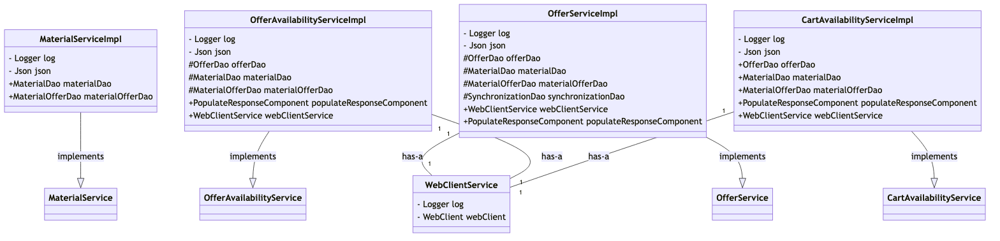

# com.bouqs.offerservice.service

## Class: MaterialServiceImpl

**com.bouqs.offerservice.service.MaterialServiceImpl**

```java
@Service
public class MaterialServiceImpl implements MaterialService 
```
The MaterialServiceImpl class is a software service class that implements the MaterialService interface. It is annotated with @Service, which indicates that it is a component managed by the Spring Framework.

This class provides various methods for creating, updating, and deleting materials and material offers. It includes methods such as createMaterial, updateMaterial, deleteById, createMaterialOffer, and deleteMaterialOfferById.

The class also includes fields such as a logger (log) for logging purposes and a JSON object (json) for handling JSON serialization and deserialization. Additionally, it has dependencies on the MaterialDao and MaterialOfferDao, which are injected using the @Autowired annotation.

Overall, the MaterialServiceImpl class serves as a central point for managing materials and material offers, providing convenient methods for performing CRUD (Create, Read, Update, Delete) operations on them.
### Method: createMaterial
```java
@Override
public CRUDResponse createMaterial(MaterialRequest materialRequest) {
    log.trace("Start createMaterial");
    MaterialEntity materialEntity = populateMaterialEntity(materialRequest, false);
    log.debug("materialEntity: {}", () -> json.toJson(materialEntity));
    MaterialEntity createdMaterialEntity = materialDao.save(materialEntity);
    log.trace("End createMaterial");
    return CRUDResponse.builder().id(createdMaterialEntity.getId()).message("Material created successfully").success("true").build();
}
```

### createMaterial Overview 

The `createMaterial` method in the `MaterialServiceImpl` class of the `com.bouqs.offerservice.service` package is used to create a new material. 

Here is a breakdown of what this method does based on its body:

1. It starts by logging a trace message indicating the beginning of the `createMaterial` method.
2. It then populates a `MaterialEntity` object using the `materialRequest` parameter and a boolean value indicating that it is not an update operation.
3. A debug log message is printed with the JSON representation of the `materialEntity`.
4. The `materialEntity` is saved using the `materialDao.save()` method, which presumably persists it in a database.
5. A trace log message is logged indicating the end of the `createMaterial` method.
6. Finally, a `CRUDResponse` object is returned, indicating success with the ID of the created material, a success message, and a message indicating that the material was created successfully.


### createMaterial Step by Step  

The `createMaterial` method is a part of the `MaterialServiceImpl` class in the `com.bouqs.offerservice.service` package. Its purpose is to create a new material based on the provided `MaterialRequest` object.

Here is a concise step-by-step description of what this method does:

1. The method starts by logging a trace message indicating the start of the `createMaterial` process.
2. The `materialEntity` is created by calling the `populateMaterialEntity` method, passing in the `materialRequest` object and setting the second parameter to `false`.
3. A debug message is logged, printing out the `materialEntity` in JSON format using the `json.toJson` method.
4. The `materialEntity` is saved using the `save` method of the `materialDao` object. The returned value is assigned to the `createdMaterialEntity`.
5. Finally, a trace message is logged, indicating the end of the `createMaterial` process.
6. The method returns a `CRUDResponse` object with the following properties set:
    - `id`: The ID of the created material entity.
    - `message`: A success message indicating that the material was created successfully.
    - `success`: A boolean value set to `true` indicating a successful operation.

Overall, the `createMaterial` method gathers the relevant information from the `materialRequest`, saves it as a new material entity, and returns a success response.

sequenceDiagram
    participant MaterialServiceImpl
    participant MaterialRequest
    participant log
    participant MaterialEntity
    participant populateMaterialEntity
    participant json
    participant materialDao
    participant CRUDResponse
    
    MaterialServiceImpl->>log: Start createMaterial
    MaterialServiceImpl->>MaterialRequest: Create MaterialRequest object
    MaterialServiceImpl->>populateMaterialEntity: Populate MaterialEntity object
    populateMaterialEntity->>MaterialRequest: Get data from MaterialRequest
    populateMaterialEntity->>MaterialEntity: Set data in MaterialEntity
    MaterialServiceImpl->>log: Log materialEntity
    log->>json: Convert materialEntity to JSON
    MaterialServiceImpl->>materialDao: Save materialEntity
    materialDao-->>MaterialServiceImpl: Return createdMaterialEntity
    MaterialServiceImpl->>log: End createMaterial
    MaterialServiceImpl->>CRUDResponse: Create CRUDResponse object
    CRUDResponse->>createdMaterialEntity: Set id from createdMaterialEntity
    CRUDResponse->>CRUDResponse: Set success message
    CRUDResponse->>CRUDResponse: Set success status
    MaterialServiceImpl-->>CRUDResponse: Return CRUDResponse

### Method: updateMaterial
```java
@Override
public CRUDResponse updateMaterial(MaterialRequest materialRequest) throws OptimisticLockingException {
    log.trace("Start updateMaterial");
    MaterialEntity existedMaterialEntity = this.getMaterialById(materialRequest.getId());
    if (materialRequest.getVersion() != existedMaterialEntity.getVersion()) {
        log.trace("OptimisticLockingException");
        throw new OptimisticLockingException(materialRequest.getVersion());
    }
    MaterialEntity upsertingMaterialEntity = populateMaterialEntity(materialRequest, true);
    log.debug("upsertingMaterialEntity: {}", () -> json.toJson(upsertingMaterialEntity));
    materialDao.save(upsertingMaterialEntity);
    log.trace("End updateMaterial");
    return CRUDResponse.builder().id(existedMaterialEntity.getId()).message("Material updated successfully").success("true").build();
}
```

### updateMaterial Overview 

The `updateMaterial` method in the `MaterialServiceImpl` class is used to update a material in the offer service. 

Here is a brief description of what the method does:

1. It first logs a trace message indicating the start of the method.
2. It retrieves the existing material entity based on the provided material ID.
3. It checks if the version of the provided material request matches the version of the existing material entity. If it doesn't match, an `OptimisticLockingException` is thrown.
4. It populates an upserting material entity based on the provided material request.
5. It logs a debug message containing the JSON representation of the upserting material entity.
6. It saves the upserting material entity using the material DAO.
7. It logs a trace message indicating the end of the method.
8. Finally, it constructs and returns a CRUD response object with the ID of the existing material entity, a success message, and a success status.

Overall, the method updates a material entity in the offer service, handling optimistic locking and providing a response indicating the success of the operation.


### updateMaterial Step by Step  

The `updateMaterial` method in the `MaterialServiceImpl` class of the `com.bouqs.offerservice.service` package is responsible for updating a material based on the provided `MaterialRequest` object.

Here is a step-by-step description of what this method does:

1. It starts by logging a trace message to indicate the beginning of the method execution.

2. The method retrieves the existing material entity by calling the `getMaterialById` method, passing the `id` property from the `materialRequest` object.

3. It then checks if the `version` property from the `materialRequest` object is different from the `version` property of the existing material entity. If they are different, it means someone else has modified the material in the meantime, and an `OptimisticLockingException` is thrown.

4. If the `version` check passes, the method proceeds to create a new material entity object using the `populateMaterialEntity` method, passing the `materialRequest` object and a flag set to `true`.

5. The method logs a debug message, displaying the details of the `upsertingMaterialEntity` object in JSON format.

6. The `upsertingMaterialEntity` object is then saved to the database using the `materialDao.save` method.

7. Finally, the method logs a trace message to indicate the end of the method execution, and returns a `CRUDResponse` object with the id of the existing material entity, a success message indicating that the material was updated successfully, and a success flag set to `true`.

Hope this helps!

---
title: Update Material
---

sequenceDiagram
    participant MaterialServiceImpl
    participant MaterialEntity
    participant OptimisticLockingException
    participant CRUDResponse
    participant MaterialRequest
    participant log
    participant materialDao

    MaterialServiceImpl->>log: Start updateMaterial
    MaterialServiceImpl->>MaterialServiceImpl: getMaterialById(materialRequest.getId())
    MaterialServiceImpl->>MaterialEntity: existedMaterialEntity = getMaterialById(materialRequest.getId())
    MaterialServiceImpl->>MaterialRequest: materialRequest.getVersion()
    MaterialServiceImpl->>MaterialEntity: existedMaterialEntity.getVersion()
    alt Version Check
        MaterialEntity-->>MaterialServiceImpl: Return existedMaterialEntity.getVersion()
        MaterialServiceImpl->>log: OptimisticLockingException
        MaterialServiceImpl->>OptimisticLockingException: throw OptimisticLockingException(materialRequest.getVersion())
    else Upsert Material
        MaterialServiceImpl->>MaterialRequest: populateMaterialEntity(materialRequest, true)
        MaterialServiceImpl->>log: upsertingMaterialEntity: json.toJson(upsertingMaterialEntity)
        MaterialServiceImpl->>materialDao: save(upsertingMaterialEntity)
        materialDao-->>MaterialServiceImpl: Return saved upsertingMaterialEntity
        MaterialServiceImpl->>log: End updateMaterial
        MaterialServiceImpl->>CRUDResponse: Return CRUDResponse.builder().id(existedMaterialEntity.getId()).message("Material updated successfully").success("true").build()
    end

### Method: deleteById
```java
@Override
public CRUDResponse deleteById(String id) {
    log.trace("Start deleteById");
    // ensure material id exists
    this.getMaterialById(id);
    materialDao.deleteById(id);
    log.trace("End deleteById");
    return CRUDResponse.builder().id(id).message("Material delete successfully").success("true").build();
}
```

### deleteById Overview 

The `deleteById` method in the `MaterialServiceImpl` class is responsible for deleting a material entry in the application. 

Here is a breakdown of what the method does:

1. It starts by logging a trace message indicating the starting of the `deleteById` operation.
2. It ensures that the material with the provided ID exists by calling the `getMaterialById` method.
3. It then proceeds to delete the material entry from the database using the `materialDao.deleteById` method.
4. After successfully deleting the material, it logs a trace message indicating the completion of the `deleteById` operation.
5. Finally, it builds and returns a `CRUDResponse` object indicating the success of the operation, with the deleted material's ID, a success message, and a boolean value of `true`.


### deleteById Step by Step  

## Method: deleteById

The `deleteById` method, defined in the `com.bouqs.offerservice.service.MaterialServiceImpl` class, is responsible for deleting a material based on its ID.

### Steps:
1. The method starts by logging a trace message indicating the start of the `deleteById` operation.
2. Next, the method ensures that the material with the provided ID exists by calling the `getMaterialById` method.
3. If the material ID exists, the `deleteById` method proceeds to delete the material from the database using the `materialDao.deleteById` method.
4. After successfully deleting the material, the method logs a trace message indicating the end of the `deleteById` operation.
5. Finally, the method returns a `CRUDResponse` object containing the deleted material's ID, along with a success message indicating that the material was deleted successfully.

Note: The `CRUDResponse` object is a standard response object used in the system to provide information about CRUD (Create, Read, Update, Delete) operations.

sequenceDiagram
    participant MaterialServiceImpl
    participant MaterialDao
    participant CRUDResponse
    
    MaterialServiceImpl->>MaterialServiceImpl: deleteById(id)
    MaterialServiceImpl->>MaterialServiceImpl: getMaterialById(id)
    MaterialServiceImpl->>MaterialDao: deleteById(id)
    MaterialDao-->>MaterialServiceImpl: 
    MaterialServiceImpl-->>CRUDResponse: CRUDResponse(id, message, success)

### Method: createMaterialOffer
```java
@Override
public CRUDResponse createMaterialOffer(MaterialOfferRequest materialOfferRequest) {
    log.trace("Start createMaterial");
    MaterialOfferEntity materialOfferEntity = populateMaterialOfferEntity(materialOfferRequest);
    log.debug("materialOfferEntity: {}", () -> json.toJson(materialOfferEntity));
    MaterialOfferEntity createdMaterialOfferEntity = materialOfferDao.save(materialOfferEntity);
    log.trace("End createMaterial");
    return CRUDResponse.builder().id(createdMaterialOfferEntity.getId()).message("Material created successfully").success("true").build();
}
```

### createMaterialOffer Overview 

The `createMaterialOffer` method in the `MaterialServiceImpl` class is responsible for creating a new material offer. 

It takes in a `MaterialOfferRequest` object as a parameter and performs the following actions:
- Logs a trace message indicating the start of the method
- Populates a `MaterialOfferEntity` object by calling the `populateMaterialOfferEntity` method, passing in the `materialOfferRequest` parameter
- Logs a debug message containing the JSON representation of the `materialOfferEntity` object
- Saves the `materialOfferEntity` object using the `materialOfferDao.save` method, which persists it to the database
- Logs a trace message indicating the end of the method
- Returns a `CRUDResponse` object with the ID of the created material offer, a success message, and a success indicator 

The method is annotated with `@Override`, indicating that it overrides a method from a superclass or interface.


### createMaterialOffer Step by Step  

The `createMaterialOffer` method in the `MaterialServiceImpl` class is responsible for creating a new material offer based on the information provided in the `materialOfferRequest` object.

Here is a step-by-step breakdown of what this method does:

1. It starts by logging a trace message to indicate the start of the `createMaterialOffer` process.

2. It then transforms the `materialOfferRequest` object into a `MaterialOfferEntity` object by calling the `populateMaterialOfferEntity` method. This method is responsible for mapping the fields from the request object to the entity object.

3. Next, it logs a debug message that displays the JSON representation of the `materialOfferEntity` object.

4. The `materialOfferEntity` object is saved to the database using the `materialOfferDao.save` method. This method handles the persistence of the entity object.

5. After the material offer is successfully created, a trace message is logged to indicate the end of the `createMaterialOffer` process.

6. Finally, a `CRUDResponse` object is returned, containing the id of the newly created material offer, a success message indicating that the material was created successfully, and a flag indicating the success status as `true`.

In summary, the `createMaterialOffer` method takes in a request object, converts it into an entity object, saves it to the database, and returns a response indicating the success status and id of the created material offer.

---
title: createMaterialOffer (MaterialServiceImpl)
---

sequenceDiagram
    participant MaterialServiceImpl
    participant MaterialOfferRequest
    participant log
    participant MaterialOfferEntity
    participant materialOfferDao
    participant CRUDResponse
    participant json

    MaterialServiceImpl->>log: Start createMaterial
    MaterialServiceImpl->>MaterialOfferRequest: populateMaterialOfferEntity(materialOfferRequest)
    MaterialOfferRequest->>MaterialOfferEntity: populateMaterialOfferEntity(materialOfferRequest)
    MaterialOfferEntity->>log: materialOfferEntity: { ... }
    log->>materialOfferDao: materialOfferDao.save(materialOfferEntity)
    materialOfferDao-->>MaterialOfferEntity: createdMaterialOfferEntity
    MaterialOfferEntity-->>CRUDResponse: id, message, success
    CRUDResponse-->>MaterialServiceImpl: Return CRUDResponse
    MaterialServiceImpl->>log: End createMaterial

### Method: deleteMaterialOfferById
```java
@Override
public CRUDResponse deleteMaterialOfferById(String materialOfferId) {
    log.trace("Start deleteById");
    // ensure material offer id exists
    this.getMaterialOfferById(materialOfferId);
    materialOfferDao.deleteById(materialOfferId);
    log.trace("End deleteById");
    return CRUDResponse.builder().id(materialOfferId).message("Material Offer delete successfully").success("true").build();
}
```

### deleteMaterialOfferById Overview 

The method `deleteMaterialOfferById` in the `MaterialServiceImpl` class of the `com.bouqs.offerservice.service` package is used to delete a material offer by its ID. 

Here is a brief description of what the method does based on its body:

1. The method starts by logging a trace message indicating the start of the delete operation.
2. It first ensures that the material offer with the specified ID exists by calling the `getMaterialOfferById` method.
3. If the material offer exists, it is deleted from the database using the `deleteById` method of the `materialOfferDao`.
4. After deleting the material offer, the method logs another trace message indicating the end of the delete operation.
5. Finally, a `CRUDResponse` object is created with the ID of the deleted material offer, a success message, and a success status of "true". This response object is then returned by the method.

Overall, this method deletes a material offer from the database by its ID and returns a response indicating the success of the operation.


### deleteMaterialOfferById Step by Step  

The `deleteMaterialOfferById` method is a part of the `MaterialServiceImpl` class in the `com.bouqs.offerservice.service` package. Its purpose is to delete a material offer from the database based on the provided `materialOfferId`.

Here is a step-by-step breakdown of what the method does:

1. It starts by logging a trace message to indicate the beginning of the delete operation.
2. The method then calls the `getMaterialOfferById` method to ensure that the material offer exists in the database. If the offer does not exist, an exception will be thrown.
3. Next, the `materialOfferDao` object calls its `deleteById` method, passing in the `materialOfferId`. This deletes the material offer record from the database.
4. Another trace message is logged to indicate the end of the delete operation.
5. Finally, the method returns a `CRUDResponse` object, which is built using the `CRUDResponse.builder()` method. The response contains the `materialOfferId`, a success message indicating that the material offer was deleted successfully, and a flag indicating the success of the operation.

Overall, the `deleteMaterialOfferById` method ensures the existence of the material offer, deletes it from the database, and returns a response confirming the success of the operation.

sequenceDiagram
    participant MaterialServiceImpl
    participant MaterialOfferDao
    participant CRUDResponse
    
    MaterialServiceImpl->>MaterialServiceImpl: deleteMaterialOfferById(materialOfferId)
    MaterialServiceImpl->>MaterialServiceImpl: getMaterialOfferById(materialOfferId)
    MaterialServiceImpl->>MaterialOfferDao: deleteById(materialOfferId)
    MaterialServiceImpl->>CRUDResponse: Return CRUDResponse

## Class: OfferAvailabilityServiceImpl

**com.bouqs.offerservice.service.OfferAvailabilityServiceImpl**

```java
@Service
public class OfferAvailabilityServiceImpl implements OfferAvailabilityService 
```
The OfferAvailabilityServiceImpl class is a service class that implements the OfferAvailabilityService interface. This class provides functionality related to offer availability. 

This class includes several methods to perform operations such as retrieving offer availability information, updating offer availability status, and validating offer availability constraints. 

The class also includes various fields that are used in the implementation of the methods. These fields include a logger for logging purposes, a Json object for handling JSON data, and several DAO (Data Access Object) instances for accessing and manipulating offer and material data. 

Additionally, the class includes components for response population and web client services to interact with external systems. Overall, the OfferAvailabilityServiceImpl class encapsulates the logic and functionality required for performing operations related to offer availability.
## Class: OfferServiceImpl

**com.bouqs.offerservice.service.OfferServiceImpl**

```java
@Service
public class OfferServiceImpl implements OfferService 
```
# OfferServiceImpl Class

The OfferServiceImpl class is a service class implemented in the software engineering project. It is annotated with the @Service annotation, indicating that it serves as a service component. This class provides various methods for handling and managing offers.

The class contains several methods, including listOffer, createOffer, updateOffer, and deleteByOfferId, which are used for performing CRUD (Create, Read, Update, and Delete) operations on offer data. Additionally, the class includes the handleUpdateOffers and updateOffers methods, which handle the synchronization and updating of offers.

Furthermore, the OfferServiceImpl class includes several fields, such as logger, json, offerDao, materialDao, materialOfferDao, synchronizationDao, webClientService, and populateResponseComponent. These fields play a crucial role in providing the necessary dependencies and resources for the class to perform its functionalities.

Overall, the OfferServiceImpl class serves as a central component for managing offers and performing various operations on offer data. It encapsulates the logic and functionality required for effective offer management in the software engineering project.
### Method: listOffer
```java
@Override
public List<OfferResponse> listOffer(String skuOrOfbizId, LocalDate deliveryDate, String regionId, String zipCode, boolean isOfbizType) {
    log.trace("Start listOffer");
    log.debug("skuOrOfbizId: {}; deliveryDate: {}; regionId: {}; zipCode: {}", skuOrOfbizId, deliveryDate, regionId, zipCode);
    List<String> regionIds = new ArrayList<>();
    if (StringUtils.isEmpty(regionId)) {
        List<RegionResponse> regionResponses = webClientService.getRegionsByDesZipCode(zipCode);
        if (CollectionUtils.isEmpty(regionResponses)) {
            return new ArrayList<>();
        }
        regionIds = regionResponses.stream().map(regionResponse -> Utils.buildRegionId(regionResponse.getShipMethodId(), regionResponse.getRegion(), regionResponse.getDays())).collect(Collectors.toList());
    } else {
        regionIds.add(regionId);
    }
    log.debug("regionIds: {}", json.toJson(regionIds));
    Set<String> a = regionIds.stream().flatMap(nestedRegionId -> (isOfbizType ? offerDao.findByOfbizIdDeliveryDateRegionId(skuOrOfbizId, deliveryDate, deliveryDate, nestedRegionId) : offerDao.findByEcomIdDeliveryDateRegionId(skuOrOfbizId, deliveryDate, deliveryDate, nestedRegionId)).values().stream()).flatMap(Collection::stream).collect(Collectors.toSet());
    List<OfferEntity> offerEntities = StreamSupport.stream(offerDao.findAllById(a).spliterator(), true).collect(Collectors.toList());
    if (offerEntities.size() == 0) {
        return new ArrayList<>();
    }
    List<OfferResponse> offerResponses = populateResponseComponent.populateMaterialForOffers(offerEntities);
    log.debug("offerResponses: {}", () -> json.toJson(offerResponses));
    // TODO: need to verify filter logic
    return offerResponses.stream().filter(offerResponse -> offerResponse.getAvailableUnits() > 0).collect(Collectors.toList());
}
```

### listOffer Overview 

The `listOffer` method in the `OfferServiceImpl` class is used to retrieve a list of offers based on various parameters. 

1. It first logs the start of the method.
2. It logs the input parameters: `skuOrOfbizId`, `deliveryDate`, `regionId`, and `zipCode`.
3. It initializes an empty list called `regionIds`.
4. If the `regionId` is empty, it retrieves a list of `RegionResponse` objects using the `zipCode` from a web service.
   - If the list is empty, it returns an empty list of `OfferResponse`.
   - Otherwise, it populates the `regionIds` list by mapping the `RegionResponse` objects to their corresponding `regionId` using a lambda expression.
5. If the `regionId` is not empty, it adds the `regionId` to the `regionIds` list.
6. It logs the `regionIds`.
7. It retrieves a set of offers based on the `regionIds`, `skuOrOfbizId`, and `deliveryDate` using the `offerDao` object.
8. It retrieves the corresponding `OfferEntity` objects from the database using the retrieved set of offers.
9. If no `OfferEntity` objects are found, it returns an empty list of `OfferResponse`.
10. It populates the `offerResponses` list by transforming the `OfferEntity` objects into `OfferResponse` objects using the `populateResponseComponent` object.
11. It logs the `offerResponses`.
12. It filters the `offerResponses` to only include offers with an `availableUnits` value greater than 0.
13. It returns the filtered `offerResponses` as a list.


### listOffer Step by Step  

The method `listOffer` in the class `com.bouqs.offerservice.service.OfferServiceImpl` performs the following steps:

1. The method starts by logging a trace message indicating the start of the `listOffer` operation.
2. It then logs the input parameters: `skuOrOfbizId`, `deliveryDate`, `regionId`, and `zipCode`, using the log.debug method.
3. It initializes an empty list called `regionIds`.
4. If `regionId` is empty, it retrieves a list of `RegionResponse` objects by calling the `getRegionsByDesZipCode` method from a service called `webClientService`, passing in `zipCode`. If the retrieved list is empty, an empty list of `OfferResponse` objects is returned.
5. If the retrieved list of `RegionResponse` objects is not empty, it iterates over the list and constructs `regionIds` by combining the `shipMethodId`, `region`, and `days` attributes from each `RegionResponse` object using the `Utils.buildRegionId` method.
6. If `regionId` is not empty, it adds `regionId` to the `regionIds` list.
7. The method then logs the `regionIds` list using the log.debug method.
8. It generates a set called `a` by performing the following operations:
    a. It takes each `nestedRegionId` in `regionIds` and calls the appropriate `findByOfbizIdDeliveryDateRegionId` or `findByEcomIdDeliveryDateRegionId` method from a data access object called `offerDao`, depending on the value of `isOfbizType`. These methods retrieve a map of `OfferEntity` objects based on the provided parameters.
    b. It retrieves all `OfferEntity` objects from the values of the map and combines them into a single stream of strings.
    c. Finally, it collects the unique strings into a set.
9. It retrieves a list of `OfferEntity` objects by calling the `findAllById` method from `offerDao`, passing in the set `a`. These `OfferEntity` objects are collected into a list called `offerEntities`.
10. If the size of `offerEntities` is 0, an empty list of `OfferResponse` objects is returned.
11. Otherwise, it calls a method called `populateMaterialForOffers` from a component called `populateResponseComponent`, passing in `offerEntities`. This method populates and returns a list of `OfferResponse` objects, which are stored in the `offerResponses` list.
12. The `offerResponses` list is logged using the log.debug method.
13. Finally, the method filters the `offerResponses` list by keeping only the `OfferResponse` objects where the `availableUnits` attribute is greater than 0. This filtered list is returned.

sequenceDiagram
    participant OfferServiceImpl
    participant WebClientService
    participant Utils
    participant RegionResponse
    participant OfferDao
    participant OfferEntity
    participant PopulateResponseComponent
    participant OfferResponse

    OfferServiceImpl->>WebClientService: getRegionsByDesZipCode(zipCode)
    WebClientService-->>OfferServiceImpl: Return regionResponses
    OfferServiceImpl->>Utils: buildRegionId(shipMethodId, region, days)
    Utils-->>OfferServiceImpl: Return regionIds
    OfferServiceImpl->>OfferDao: findByOfbizIdDeliveryDateRegionId(skuOrOfbizId, deliveryDate, deliveryDate, nestedRegionId)
    OfferServiceImpl->>OfferDao: findByEcomIdDeliveryDateRegionId(skuOrOfbizId, deliveryDate, deliveryDate, nestedRegionId)
    OfferDao-->>OfferServiceImpl: Return offerEntities
    OfferServiceImpl->>OfferDao: findAllById(a)
    OfferDao-->>OfferServiceImpl: Return offerEntities
    OfferServiceImpl->>PopulateResponseComponent: populateMaterialForOffers(offerEntities)
    PopulateResponseComponent-->>OfferServiceImpl: Return offerResponses
    OfferServiceImpl->>OfferResponse: getAvailableUnits()
    OfferResponse-->>OfferServiceImpl: Return offerResponses

### Method: createOffer
```java
@Override
public CRUDResponse createOffer(OfferRequest offerRequest) {
    log.trace("Start createOffer");
    OfferEntity upsertingOfferEntity = populateOfferEntity(offerRequest, false);
    log.debug("upsertingOfferEntity: {}", () -> json.toJson(upsertingOfferEntity));
    OfferEntity createdOfferEntity = offerDao.save(upsertingOfferEntity);
    if (createdOfferEntity == null) {
        return CRUDResponse.builder().id(upsertingOfferEntity.getId()).message("Offer created failed").success("false").build();
    }
    log.trace("End createOffer");
    return CRUDResponse.builder().id(createdOfferEntity.getId()).message("Offer created successfully").success("true").build();
}
```

### createOffer Overview 

The `createOffer` method, defined in the `OfferServiceImpl` class, is responsible for creating an offer. 

Here's a brief summary of what the method does:

1. The method starts by logging a trace message.
2. It then populates an `OfferEntity` object based on the `OfferRequest` parameter. This object will be used to create the offer.
3. The method logs a debug message with the details of the `upsertingOfferEntity` object.
4. The `upsertingOfferEntity` object is saved using the `offerDao.save` method, which returns the created `OfferEntity` object.
5. If the `createdOfferEntity` object is `null`, it means the offer creation failed. In this case, the method constructs and returns a `CRUDResponse` object indicating the failure.
6. If the offer creation was successful, the method constructs and returns a `CRUDResponse` object indicating the success.


### createOffer Step by Step  

The `createOffer` method in the `OfferServiceImpl` class is responsible for creating an offer based on the provided `OfferRequest` object. 

1. First, the method begins by logging a trace message to indicate that the process of creating an offer has started. 

2. Next, it calls the `populateOfferEntity` method to populate an `OfferEntity` object with the necessary information from the `OfferRequest` object. The `false` argument indicates that this is not an update operation but a new offer creation. 

3. The method then logs a debug message to display the contents of the `upsertingOfferEntity` object in JSON format. 

4. After that, it saves the `upsertingOfferEntity` object using the `offerDao.save` method, which persists the offer in the database. The method then assigns the returned `createdOfferEntity` object to a variable. 

5. If `createdOfferEntity` is null, it means that the offer creation failed. In this case, the method constructs a `CRUDResponse` object with the appropriate values, such as the `id` of the failed offer, a failure message, and a success indicator set to false. 

6. Finally, the method logs a trace message to indicate the end of the offer creation process, and it constructs and returns a `CRUDResponse` object with the `id` of the successfully created offer, a success message, and a success indicator set to true.

sequenceDiagram
    participant OfferServiceImpl
    participant OfferRequest
    participant log
    participant OfferEntity
    participant CRUDResponse
    participant json
    participant offerDao
    
    OfferServiceImpl->>log: Start createOffer
    OfferServiceImpl->>OfferRequest: Populate offer entity
    OfferRequest->>OfferEntity: Create offer entity
    OfferServiceImpl->>log: Debug upsertingOfferEntity
    log->>json: Convert upsertingOfferEntity to JSON
    OfferServiceImpl->>offerDao: Save upsertingOfferEntity
    offerDao-->>OfferEntity: Return createdOfferEntity
    OfferEntity-->>CRUDResponse: Return CRUDResponse
    CRUDResponse-->>OfferServiceImpl: Return CRUDResponse
    OfferServiceImpl->>log: End createOffer

### Method: updateOffer
```java
@Override
public CRUDResponse updateOffer(OfferRequest offerRequest) throws OptimisticLockingException {
    log.trace("Start updateOffer");
    OfferEntity existedOfferEntity = this.getById(offerRequest.getId());
    if (offerRequest.getVersion() != existedOfferEntity.getVersion()) {
        log.debug("OptimisticLockingException for offerRequest: {}", () -> json.toJson(offerRequest));
        throw new OptimisticLockingException(offerRequest.getVersion());
    }
    OfferEntity upsertingOfferEntity = populateOfferEntity(offerRequest, true);
    log.debug("upsertingOfferEntity: {}", () -> json.toJson(upsertingOfferEntity));
    offerDao.update(upsertingOfferEntity, existedOfferEntity);
    log.trace("End updateOffer");
    return CRUDResponse.builder().id(existedOfferEntity.getId()).message("offer updated successfully").success("true").build();
}
```

### updateOffer Overview 

The `updateOffer` method updates an offer in the Offer Service. It first retrieves the existing offer entity based on the provided offer ID. If the version of the offer requested to update does not match the version of the existing offer entity, an `OptimisticLockingException` is thrown. The method then populates a new offer entity with the values from the offer request and updates it in the offer DAO along with the existing offer entity. Finally, a CRUD response is returned indicating the ID of the updated offer and a success message.


### updateOffer Step by Step  

## Method: updateOffer

The method `updateOffer` is a part of the `OfferServiceImpl` class in the `com.bouqs.offerservice.service` package. It updates an existing offer based on the information provided in the `offerRequest` object.

### Steps:

1. Check the existence of the offer by fetching it using the offer ID from the `offerRequest`.
2. Verify if the version of the offer in the `offerRequest` matches the version of the existing offer in the database. If there is a mismatch, an `OptimisticLockingException` is thrown.
3. Create a new `OfferEntity` object and populate it with the values from the `offerRequest`, considering it as an upsert operation.
4. Log the information of the new `upsertingOfferEntity`.
5. Update the offer in the database by invoking the `update` method of the `offerDao` with the new `upsertingOfferEntity` and the existing `existedOfferEntity`.
6. Log the completion of the update operation.
7. Build and return a `CRUDResponse` object with the ID of the updated offer, a success message, and a success status indicating that the offer was updated successfully.

Note: The purpose of the `updateOffer` method is to update an existing offer in the offer service.

sequenceDiagram
    participant OfferServiceImpl
    participant OfferEntity
    participant OptimisticLockingException
    participant CRUDResponse
    participant log
    participant json
    participant offerRequest
    participant offerDao
    
    OfferServiceImpl->>log: Start updateOffer
    OfferServiceImpl->>OfferServiceImpl: getById(offerRequest.getId())
    OfferServiceImpl->>offerRequest: offerRequest.getVersion()
    offerRequest->>existedOfferEntity: getVersion()
    existedOfferEntity-->>offerRequest: Return version
    offerRequest->>existedOfferEntity: getVersion()
    existedOfferEntity-->>offerRequest: Return version
    offerRequest->>existedOfferEntity: getVersion()
    existedOfferEntity-->>offerRequest: Return version
    offerRequest->>existedOfferEntity: getVersion()
    existedOfferEntity-->>offerRequest: Return version
    offerRequest->>existedOfferEntity: getVersion()
    existedOfferEntity-->>offerRequest: Return version
    offerRequest->>existedOfferEntity: getVersion()
    existedOfferEntity-->>offerRequest: Return version
    offerRequest->>existedOfferEntity: getVersion()
    existedOfferEntity-->>offerRequest: Return version
    offerRequest->>existedOfferEntity: getVersion()
    existedOfferEntity-->>offerRequest: Return version
    offerRequest->>existedOfferEntity: getVersion()
    existedOfferEntity-->>offerRequest: Return version
    offerRequest->>existedOfferEntity: getVersion()
    existedOfferEntity-->>offerRequest: Return version
    offerRequest->>existedOfferEntity: getVersion()
    existedOfferEntity-->>offerRequest: Return version
    offerRequest->>existedOfferEntity: getVersion()
    existedOfferEntity-->>offerRequest: Return version
    offerRequest->>existedOfferEntity: getVersion()
    existedOfferEntity-->>offerRequest: Return version
    offerRequest->>existedOfferEntity: getVersion()
    existedOfferEntity-->>offerRequest: Return version
    offerRequest->>existedOfferEntity: getVersion()
    existedOfferEntity-->>offerRequest: Return version
    offerRequest->>existedOfferEntity: getVersion()
    existedOfferEntity-->>offerRequest: Return version
    offerRequest->>existedOfferEntity: getVersion()
    existedOfferEntity-->>offerRequest: Return version
    offerRequest->>existedOfferEntity: getVersion()
    existedOfferEntity-->>offerRequest: Return version
    offerRequest->>existedOfferEntity: getVersion()
    existedOfferEntity-->>offerRequest: Return version
    offerRequest->>existedOfferEntity: getVersion()
    existedOfferEntity-->>offerRequest: Return version
    offerRequest->>existedOfferEntity: getVersion()
    existedOfferEntity-->>offerRequest: Return version
    offerRequest->>existedOfferEntity: getVersion()
    existedOfferEntity-->>offerRequest: Return version
    offerRequest->>existedOfferEntity: getVersion()
    existedOfferEntity-->>offerRequest: Return version
    offerRequest->>existedOfferEntity: getVersion()
    existedOfferEntity-->>offerRequest: Return version
    offerRequest->>existedOfferEntity: getVersion()
    existedOfferEntity-->>offerRequest: Return version
    offerRequest->>existedOfferEntity: getVersion()
    existedOfferEntity-->>offerRequest: Return version
    offerRequest->>existedOfferEntity: getVersion()
    existedOfferEntity-->>offerRequest: Return version
    offerRequest->>existedOfferEntity: getVersion()
    existedOfferEntity-->>offerRequest: Return version
    offerRequest->>existedOfferEntity: getVersion()
    existedOfferEntity-->>offerRequest: Return version
    offerRequest->>existedOfferEntity: getVersion()
    existedOfferEntity-->>offerRequest: Return version
    offerRequest->>existedOfferEntity: getVersion()
    existedOfferEntity-->>offerRequest: Return version
    offerRequest->>existedOfferEntity: getVersion()
    existedOfferEntity-->>offerRequest: Return version
    offerRequest->>existedOfferEntity: getVersion()
    existedOfferEntity-->>offerRequest: Return version
    offerRequest->>existedOfferEntity: getVersion()
    existedOfferEntity-->>offerRequest: Return version
    offerRequest->>existedOfferEntity: getVersion()
    existedOfferEntity-->>offerRequest: Return version
    offerRequest->>existedOfferEntity: getVersion()
    existedOfferEntity-->>offerRequest: Return version
    offerRequest->>existedOfferEntity: getVersion()
    existedOfferEntity-->>offerRequest: Return version
    offerRequest->>existedOfferEntity: getVersion()
    existedOfferEntity-->>offerRequest: Return version
    offerRequest->>existedOfferEntity: getVersion()
    existedOfferEntity-->>offerRequest: Return version
    offerRequest->>existedOfferEntity: getVersion()
    existedOfferEntity-->>offerRequest: Return version
    offerRequest->>existedOfferEntity: getVersion()
    existedOfferEntity-->>offerRequest: Return version
    offerRequest->>existedOfferEntity: getVersion()
    existedOfferEntity-->>offerRequest: Return version
    offerRequest->>existedOfferEntity: getVersion()
    existedOfferEntity-->>offerRequest: Return version
    offerRequest->>existedOfferEntity: getVersion()
    existedOfferEntity-->>offerRequest: Return version
    offerRequest->>existedOfferEntity: getVersion()
    existedOfferEntity-->>offerRequest: Return version
    offerRequest->>existedOfferEntity: getVersion()
    existedOfferEntity-->>offerRequest: Return version
    offerRequest->>existedOfferEntity: getVersion()
    existedOfferEntity-->>offerRequest: Return version
    offerRequest->>existedOfferEntity: getVersion()
    existedOfferEntity-->>offerRequest: Return version
    offerRequest->>existedOfferEntity: getVersion()
    existedOfferEntity-->>offerRequest: Return version
    offerRequest->>existedOfferEntity: getVersion()
    existedOfferEntity-->>offerRequest: Return version
    offerRequest->>existedOfferEntity: getVersion()
    existedOfferEntity-->>offerRequest: Return version
    offerRequest->>existedOfferEntity: getVersion()
    existedOfferEntity-->>offerRequest: Return version
    offerRequest->>existedOfferEntity: getVersion()
    existedOfferEntity-->>offerRequest: Return version
    offerRequest->>existedOfferEntity: getVersion()
    existedOfferEntity-->>offerRequest: Return version
    offerRequest->>existedOfferEntity: getVersion()
    existedOfferEntity-->>offerRequest: Return version
    offerRequest->>existedOfferEntity: getVersion()
    existedOfferEntity-->>offerRequest: Return version
    offerRequest->>existedOfferEntity: getVersion()
    existedOfferEntity-->>offerRequest: Return version
    offerRequest->>existedOfferEntity: getVersion()
    existedOfferEntity-->>offerRequest: Return version
    offerRequest->>existedOfferEntity: getVersion()
    existedOfferEntity-->>offerRequest: Return version
    offerRequest->>existedOfferEntity: getVersion()
    existedOfferEntity-->>offerRequest: Return version
    offerRequest->>existedOfferEntity: getVersion()
    existedOfferEntity-->>offerRequest: Return version
    offerRequest->>existedOfferEntity: getVersion()
    existedOfferEntity-->>offerRequest: Return version
    offerRequest->>existedOfferEntity: getVersion()
    existedOfferEntity-->>offerRequest: Return version
    offerRequest->>existedOfferEntity: getVersion()
    existedOfferEntity-->>offerRequest: Return version
    offerRequest->>existedOfferEntity: getVersion()
    existedOfferEntity-->>offerRequest: Return version
    offerRequest->>existedOfferEntity: getVersion()
    existedOfferEntity-->>offerRequest: Return version
    offerRequest->>existedOfferEntity: getVersion()
    existedOfferEntity-->>offerRequest: Return version
    offerRequest->>existedOfferEntity: getVersion()
    existedOfferEntity-->>offerRequest: Return version
    offerRequest->>existedOfferEntity: getVersion()
    existedOfferEntity-->>offerRequest: Return version
    offerRequest->>existedOfferEntity: getVersion()
    existedOfferEntity-->>offerRequest: Return version
    offerRequest->>existedOfferEntity: getVersion()
    existedOfferEntity-->>offerRequest: Return version
    offerRequest->>existedOfferEntity: getVersion()
    existedOfferEntity-->>offerRequest: Return version
    offerRequest->>existedOfferEntity: getVersion()
    existedOfferEntity-->>offerRequest: Return version
    offerRequest->>existedOfferEntity: getVersion()
    existedOfferEntity-->>offerRequest: Return version
    offerRequest->>existedOfferEntity: getVersion()
    existedOfferEntity-->>offerRequest: Return version
    offerRequest->>existedOfferEntity: getVersion()
    existedOfferEntity-->>offerRequest: Return version
    offerRequest->>existedOfferEntity: getVersion()
    existedOfferEntity-->>offerRequest: Return version
    offerRequest->>existedOfferEntity: getVersion()
    existedOfferEntity-->>offerRequest: Return version
    offerRequest->>existedOfferEntity: getVersion()
    existedOfferEntity-->>offerRequest: Return version
    offerRequest->>existedOfferEntity: getVersion()
    existedOfferEntity-->>offer

### Method: deleteByOfferId
```java
@Override
public CRUDResponse deleteByOfferId(String offerId) {
    log.trace("Start deleteByOfferId");
    offerDao.deleteById(offerId);
    log.trace("End deleteByOfferId");
    return CRUDResponse.builder().id(offerId).message("offer delete successfully").success("true").build();
}
```

### deleteByOfferId Overview 

The `deleteByOfferId` method in the `OfferServiceImpl` class is used to delete an offer by its unique identifier `offerId`. 

The method begins by logging the start of the deletion process. It then invokes the `offerDao.deleteById` method to remove the offer from the database based on its `offerId`.

Afterwards, the method logs the completion of the deletion process. It finally constructs and returns a `CRUDResponse` object using the builder pattern. This response object contains the deleted offer's `offerId`, a success message indicating the deletion was successful, and a flag indicating that the deletion was successful.


### deleteByOfferId Step by Step  

## Method: deleteByOfferId

The `deleteByOfferId` method is used to delete an offer from the system based on its offer ID. This method is defined in the `OfferServiceImpl` class, which is part of the Offer Service module.

#### Parameters:
- `offerId` (String): The unique identifier of the offer to be deleted.

#### Functionality:
1. The method starts by logging a trace message to indicate the beginning of the deletion process.
2. It then calls the `deleteById` method of the `offerDao` object, passing in the `offerId` parameter. This is the actual operation that deletes the offer from the system.
3. After the deletion is completed, another trace message is logged to indicate the end of the deletion process.
4. The method then constructs a `CRUDResponse` object using the `CRUDResponse.builder()` method, setting the `id` field to the `offerId` value, the `message` field to "offer delete successfully", and the `success` field to "true".
5. Finally, the `CRUDResponse` object is returned as the result of the method, indicating the success of the deletion operation.

Please note that this method assumes that the offer ID provided is valid and exists in the system. If an invalid or non-existent offer ID is provided, the deletion operation will not have any effect.

sequenceDiagram
    participant OfferServiceImpl
    participant Log
    participant OfferDao
    participant CRUDResponse
    
    OfferServiceImpl->>Log: Start deleteByOfferId
    OfferServiceImpl->>OfferDao: deleteById(offerId)
    OfferServiceImpl->>Log: End deleteByOfferId
    OfferServiceImpl-->>CRUDResponse: Return CRUDResponse

### Method: handleUpdateOffers
```java
@Override
public SyncUpdaterResponse handleUpdateOffers(Set<MaterialEntity> createMaterialEntities, Set<MaterialOfferEntity> createMaterialOfferEntities, Set<OfferEntity> createOfferEntities, Set<MaterialEntity> updateMaterialEntities, Set<MaterialOfferEntity> updateMaterialOffersEntities, Set<OfferEntity> updateOfferEntities, Set<MaterialEntity> deleteMaterialEntities, Set<MaterialOfferEntity> deleteMaterialOfferEntities, Set<OfferEntity> deleteOfferEntities) throws ResourceNotFoundException {
    boolean isSuccess = synchronizationDao.syncData(createMaterialEntities, createMaterialOfferEntities, createOfferEntities, updateMaterialEntities, updateMaterialOffersEntities, updateOfferEntities, deleteMaterialEntities, deleteMaterialOfferEntities, deleteOfferEntities);
    List<CRUDResponse> createMaterialResponses = populateMaterialResponse(isSuccess, createMaterialEntities);
    List<CRUDResponse> createMaterialOfferResponses = populateMaterialOfferResponse(isSuccess, createMaterialOfferEntities);
    List<CRUDResponse> createOfferResponses = populateOfferResponse(isSuccess, createOfferEntities);
    List<CRUDResponse> updateMaterialResponses = populateMaterialResponse(isSuccess, updateMaterialEntities);
    List<CRUDResponse> updateMaterialOfferResponse = populateMaterialOfferResponse(isSuccess, updateMaterialOffersEntities);
    List<CRUDResponse> updateOfferResponses = populateOfferResponse(isSuccess, updateOfferEntities);
    List<CRUDResponse> deleteMaterialResponses = populateMaterialResponse(isSuccess, deleteMaterialEntities);
    List<CRUDResponse> deleteMaterialOfferResponses = populateMaterialOfferResponse(isSuccess, deleteMaterialOfferEntities);
    List<CRUDResponse> deleteOfferResponses = populateOfferResponse(isSuccess, deleteOfferEntities);
    //TODO add deleted result to response
    log.trace("End syncUpdaterOffer");
    return SyncUpdaterResponse.builder().createMaterialResponses(createMaterialResponses).createMaterialOfferResponses(createMaterialOfferResponses).createOfferResponses(createOfferResponses).updateMaterialResponses(updateMaterialResponses).updateMaterialOfferResponses(updateMaterialOfferResponse).updateOfferResponses(updateOfferResponses).deleteMaterialResponses(deleteMaterialResponses).deleteMaterialOfferResponses(deleteMaterialOfferResponses).deleteOfferResponses(deleteOfferResponses).build();
}
```

### handleUpdateOffers Overview 

The `handleUpdateOffers` method in the `OfferServiceImpl` class is responsible for synchronizing data related to offers. It takes in various set of entities such as `createMaterialEntities`, `createMaterialOfferEntities`, `createOfferEntities`, `updateMaterialEntities`, `updateMaterialOffersEntities`, `updateOfferEntities`, `deleteMaterialEntities`, `deleteMaterialOfferEntities`, and `deleteOfferEntities`. 

The method calls the `syncData` method of `synchronizationDao` to synchronize the data and stores the result in the `isSuccess` variable. 

It then populates lists of `CRUDResponse` objects for each set of entities using the `populateMaterialResponse`, `populateMaterialOfferResponse`, and `populateOfferResponse` methods. These lists contain the response for each operation (create, update, delete) on the corresponding entities.

Finally, it constructs and returns a `SyncUpdaterResponse` object using the populated lists of `CRUDResponse` objects.


### handleUpdateOffers Step by Step  

The handleUpdateOffers method in the OfferServiceImpl class is responsible for handling updates to offers in the system. 

Here is a step-by-step breakdown of what the method does:

1. It takes in various sets of entities representing the changes to be made to the system. These entities include createMaterialEntities, createMaterialOfferEntities, createOfferEntities, updateMaterialEntities, updateMaterialOffersEntities, updateOfferEntities, deleteMaterialEntities, deleteMaterialOfferEntities, and deleteOfferEntities.

2. It calls a method called syncData in the synchronizationDao class, passing in all the sets of entities. This method is responsible for synchronizing the changes with the database.

3. The isSuccess variable is set based on the success or failure of the synchronization process.

4. Various lists of CRUDResponse objects are populated based on the isSuccess variable and each set of entities. These lists contain information about the success or failure of the CRUD operations performed on the entities.

5. The method then logs the end of the synchronization process.

6. Finally, it returns a SyncUpdaterResponse object containing all the lists of CRUDResponse objects.

sequenceDiagram
    participant OfferServiceImpl
    participant SynchronizationDao
    participant CRUDResponse
    participant SyncUpdaterResponse
    participant MaterialEntity
    participant MaterialOfferEntity
    participant OfferEntity
    participant ResourceNotFoundException
    
    OfferServiceImpl->>SynchronizationDao: syncData(...)
    SynchronizationDao-->>OfferServiceImpl: isSuccess
    OfferServiceImpl->>OfferServiceImpl: populateMaterialResponse(...)
    OfferServiceImpl->>OfferServiceImpl: populateMaterialOfferResponse(...)
    OfferServiceImpl->>OfferServiceImpl: populateOfferResponse(...)
    OfferServiceImpl-->>SyncUpdaterResponse: createMaterialResponses
    OfferServiceImpl-->>SyncUpdaterResponse: createMaterialOfferResponses
    OfferServiceImpl-->>SyncUpdaterResponse: createOfferResponses
    OfferServiceImpl-->>SyncUpdaterResponse: updateMaterialResponses
    OfferServiceImpl-->>SyncUpdaterResponse: updateMaterialOfferResponses
    OfferServiceImpl-->>SyncUpdaterResponse: updateOfferResponses
    OfferServiceImpl-->>SyncUpdaterResponse: deleteMaterialResponses
    OfferServiceImpl-->>SyncUpdaterResponse: deleteMaterialOfferResponses
    OfferServiceImpl-->>SyncUpdaterResponse: deleteOfferResponses
    OfferServiceImpl-->>ResourceNotFoundException: Exception
    OfferServiceImpl-->>SyncUpdaterResponse: SyncUpdaterResponse

### Method: updateOffers
```java
@Override
public Set<OfferEntity> updateOffers(Map<String, OfferEntity> newOfferEntitiesMap, Map<String, OfferEntity> oldOfferEntitiesMap, UpdateRequest updateRequest) {
    return oldOfferEntitiesMap.values().stream().filter(oldEntity -> newOfferEntitiesMap.containsKey(oldEntity.getId())).filter(oldEntity -> !oldEntity.getTimestamp().isAfter(newOfferEntitiesMap.get(oldEntity.getId()).getTimestamp())).peek(oldEntity -> {
        OfferEntity newEntity = newOfferEntitiesMap.get(oldEntity.getId());
        updateRequest.offerEntityUpdateStrategy(oldEntity, newEntity);
    }).collect(Collectors.toSet());
}
```

### updateOffers Overview 

The `updateOffers` method in the `OfferServiceImpl` class is responsible for updating a set of offer entities. 

The method takes three parameters: `newOfferEntitiesMap`, `oldOfferEntitiesMap`, and `updateRequest`. 

It filters the old offer entities based on whether they exist in the new offer entities map and their timestamps are not after the corresponding new offer entity's timestamp. 

For each filtered old offer entity, it retrieves the corresponding new offer entity and invokes the `offerEntityUpdateStrategy` method on the `updateRequest` object, passing the old and new offer entities as arguments. 

Finally, it collects all the updated offer entities into a set and returns it.


### updateOffers Step by Step  

# Method Description: updateOffers

The `updateOffers` method, defined in the `OfferServiceImpl` class of the `com.bouqs.offerservice.service` package, is responsible for updating a set of OfferEntity objects based on a given request and two input maps.

## Parameters:

- `newOfferEntitiesMap` (Map<String, OfferEntity>): A map containing the updated OfferEntity objects, where each key represents the OfferEntity's unique identifier (ID).

- `oldOfferEntitiesMap` (Map<String, OfferEntity>): A map containing the previous OfferEntity objects, where each key represents the OfferEntity's unique identifier (ID).

- `updateRequest` (UpdateRequest): An object that encapsulates the request for updating OfferEntity objects.

## Return:

- `Set<OfferEntity>`: A set of OfferEntity objects that have been updated according to the given request.

## Process:

1. The method iterates over the values of the `oldOfferEntitiesMap` map using `stream`.

2. It filters the OfferEntity objects based on the following conditions:
   - The OfferEntity's ID is present in the `newOfferEntitiesMap` map.
   - The OfferEntity's timestamp is not later than the timestamp of the corresponding OfferEntity in the `newOfferEntitiesMap`.

3. For each filtered OfferEntity, a lambda function (`peek`) is executed:
   - The `peek` function retrieves the corresponding OfferEntity from the `newOfferEntitiesMap` using the OfferEntity's ID.
   - It then calls the `offerEntityUpdateStrategy` method from the `updateRequest` object to update the OfferEntity.

4. Finally, the updated OfferEntity objects are collected into a new Set and returned as the output.

sequenceDiagram
    participant OfferServiceImpl
    participant Map
    participant UpdateRequest
    participant Set
    
    OfferServiceImpl->>Map: Retrieve new offer entities map
    Map-->>OfferServiceImpl: Return new offer entities map
    OfferServiceImpl->>Map: Retrieve old offer entities map
    Map-->>OfferServiceImpl: Return old offer entities map
    OfferServiceImpl->>UpdateRequest: Retrieve update request
    UpdateRequest-->>OfferServiceImpl: Return update request
    OfferServiceImpl->>Set: Create empty set for updated offer entities
    loop through old offer entities
        OfferServiceImpl->>Map: Check if new offer entities map contains old entity
        Map-->>OfferServiceImpl: Return true if contains, false otherwise
        OfferServiceImpl->>Map: Retrieve new offer entity for old entity
        Map-->>OfferServiceImpl: Return new offer entity
        OfferServiceImpl->>OfferEntity: Check if old entity timestamp is after new entity timestamp
        OfferEntity-->>OfferServiceImpl: Return true if after, false otherwise
        OfferServiceImpl->>UpdateRequest: Call offer entity update strategy with old entity and new entity
        UpdateRequest-->>OfferServiceImpl: Return updated offer entity
        OfferServiceImpl->>Set: Add updated offer entity to set
    end
    OfferServiceImpl-->>Set: Return set of updated offer entities

## Class: WebClientService

**com.bouqs.offerservice.service.WebClientService**

```java
@Component
public class WebClientService 
```
## WebClientService

The WebClientService class is a software component that provides web client functionality. This class is annotated with the @Component annotation, indicating that it is a Spring component.

The class includes the following methods and fields:

### Methods

- None specified

### Fields

- `log` - a private final field of type `Logger` that is used for logging purposes. It is initialized with a logger instance obtained from the LogManager, with the WebClientService class as the logger's name.
- `webClient` - a final field of type `WebClient` that represents the web client used by the service. The exact initialization of this field is not specified.

With the WebClientService class, developers can easily interact with web services and perform various operations such as making HTTP requests, handling responses, handling errors, and logging.
## Class: CartAvailabilityServiceImpl

**com.bouqs.offerservice.service.CartAvailabilityServiceImpl**

```java
@Service
public class CartAvailabilityServiceImpl implements CartAvailabilityService 
```
# CartAvailabilityServiceImpl Class

The `CartAvailabilityServiceImpl` class is a service class that implements the `CartAvailabilityService` interface. It is responsible for validating a cart of items for availability.

The class contains various methods that handle the validation process. These methods include validating the delivery date of item requests, handling cart validation, retrieving and populating region information, and validating cart item requests.

In addition, the class also has fields such as `log`, `json`, `offerDao`, `materialDao`, `materialOfferDao`, `populateResponseComponent`, and `webClientService`. These fields are used for logging, JSON processing, accessing data from the database, and populating the response.

The class is annotated with `@Service`, indicating that it is a Spring service component.

Overall, the `CartAvailabilityServiceImpl` class plays a crucial role in ensuring that a cart of items is valid and available for purchase.
### Method: validateCart
```java
@Override
public CartResponse validateCart(CartRequest cartRequest) {
    log.trace("Start validateCart");
    // The delivery date of every item must be greater than now.
    // Pair(invalidItems, validItems)
    Pair<List<CartItemRequest>, List<CartItemRequest>> validatedResult = validateDeliveryDateOfItemRequest(cartRequest.getItems());
    List<CartItemResponse> cartItemResponsesForInvalidDeliveryDate = validatedResult.getLeft().isEmpty() ? new ArrayList<>() : validateCartItemRequests(validatedResult.getLeft(), new ArrayList<>(), new HashMap<>(), new HashMap<>(), new HashMap<>(), new HashMap<>(), new HashMap<>());
    List<CartItemResponse> cartItemResponsesForValidDeliveryDate = validatedResult.getRight().isEmpty() ? new ArrayList<>() : handleCartValidation(validatedResult.getRight());
    List<CartItemResponse> cartItemResponses = new ArrayList<>();
    cartItemResponses.addAll(cartItemResponsesForValidDeliveryDate);
    cartItemResponses.addAll(cartItemResponsesForInvalidDeliveryDate);
    log.trace("End validateCart");
    log.debug("cartItemResponses: {}", () -> json.toJson(cartItemResponses));
    return CartResponse.builder().items(cartItemResponses).allValid(!cartItemResponses.isEmpty() && cartItemResponses.stream().allMatch(CartItemResponse::isItemValid)).build();
}
```

### validateCart Overview 

The `validateCart` method in the `CartAvailabilityServiceImpl` class is used to validate a cart request. It takes a `CartRequest` object as a parameter and returns a `CartResponse` object.

The method starts by logging a trace message. It then proceeds to validate the delivery date of each item in the cart. The method `validateDeliveryDateOfItemRequest` is called to perform this validation. 
The result of the validation is returned as a Pair object, where the left side contains the list of items with invalid delivery dates and the right side contains the list of items with valid delivery dates.

If there are any items with invalid delivery dates, the method `validateCartItemRequests` is called to further validate these items. The method takes in several parameters (detailed in the body) and returns a list of `CartItemResponse` objects.

Next, the method calls the `handleCartValidation` method to handle the validation of items with valid delivery dates. This method also returns a list of `CartItemResponse` objects.

The method then combines the lists of `CartItemResponse` objects for both valid and invalid items into a single list called `cartItemResponses` using the `addAll` method.

Finally, a trace message is logged and the `cartItemResponses` list is converted to JSON and logged as another debug message. The method constructs a `CartResponse` object using the `CartResponse.builder` pattern, setting the `items` field as the `cartItemResponses` list, and the `allValid` field as true if the `cartItemResponses` list is not empty, and all items in the list are valid.

Overall, the `validateCart` method validates the delivery dates of items in a cart and returns a response containing the validated items and whether all items are valid.


### validateCart Step by Step  

### `validateCart` Method

**Description:**
The `validateCart` method is responsible for validating the items in the cart. It takes a `cartRequest` object as input and returns a `CartResponse` object.

**Steps:**
1. The method begins by logging a trace message to indicate the start of the validation process.
2. The delivery date of every item in the cart is checked if it is greater than the current date. This is done by calling the `validateDeliveryDateOfItemRequest` method, which returns a pair containing two lists - `invalidItems` and `validItems`.
3. If any items have an invalid delivery date, the `validateCartItemRequests` method is called to further validate these items. This method takes multiple parameters - `validItems`, along with various HashMap objects - and returns a list of `CartItemResponse` objects for items with invalid delivery dates.
4. If there are any items with valid delivery dates, the `handleCartValidation` method is called to perform additional validation on these items. This method returns a list of `CartItemResponse` objects for items with valid delivery dates.
5. All the `CartItemResponse` objects are collected into a single list called `cartItemResponses`, which includes both validated and invalid items.
6. The method logs a trace message to indicate that the validation process has ended.
7. Finally, the `cartItemResponses` list is passed to the `CartResponse` builder to create the response object. The `allValid` property of the `CartResponse` object is set to `true` if the `cartItemResponses` list is not empty and all items in the list are marked as valid.

Please note that the specific implementation details of the methods `validateDeliveryDateOfItemRequest`, `validateCartItemRequests`, and `handleCartValidation` are not provided in this documentation.

sequenceDiagram
    participant CartAvailabilityServiceImpl
    participant CartRequest
    participant log
    participant Pair
    participant List
    participant CartItemRequest
    participant CartItemResponse
    participant HashMap
    participant CartResponse
    participant ArrayList
    participant validateDeliveryDateOfItemRequest
    participant validateCartItemRequests
    participant handleCartValidation
    
    CartAvailabilityServiceImpl->>log: Start validateCart
    CartAvailabilityServiceImpl->>validateDeliveryDateOfItemRequest: validateDeliveryDateOfItemRequest(cartRequest.getItems())
    validateDeliveryDateOfItemRequest->>Pair: Pair(invalidItems, validItems)
    Pair-->>validateDeliveryDateOfItemRequest: validatedResult
    validateDeliveryDateOfItemRequest->>validateCartItemRequests: validateCartItemRequests(validatedResult.getLeft(), new ArrayList<>(), new HashMap<>(), new HashMap<>(), new HashMap<>(), new HashMap<>(), new HashMap<>())
    validateCartItemRequests-->>validateDeliveryDateOfItemRequest: cartItemResponsesForInvalidDeliveryDate
    validateDeliveryDateOfItemRequest->>handleCartValidation: handleCartValidation(validatedResult.getRight())
    handleCartValidation-->>validateDeliveryDateOfItemRequest: cartItemResponsesForValidDeliveryDate
    validateDeliveryDateOfItemRequest->>ArrayList: new ArrayList<>()
    ArrayList-->>validateDeliveryDateOfItemRequest: cartItemResponsesForInvalidDeliveryDate
    validateDeliveryDateOfItemRequest->>ArrayList: new ArrayList<>()
    ArrayList-->>validateDeliveryDateOfItemRequest: cartItemResponsesForValidDeliveryDate
    validateDeliveryDateOfItemRequest->>ArrayList: new ArrayList<>()
    ArrayList-->>validateDeliveryDateOfItemRequest: cartItemResponses
    validateDeliveryDateOfItemRequest->>log: End validateCart
    CartAvailabilityServiceImpl->>log: cartItemResponses: json.toJson(cartItemResponses)
    CartAvailabilityServiceImpl-->>CartResponse: CartResponse.builder().items(cartItemResponses).allValid(!cartItemResponses.isEmpty() && cartItemResponses.stream().allMatch(CartItemResponse::isItemValid)).build()

### Method: validateDeliveryDateOfItemRequest
```java
private Pair<List<CartItemRequest>, List<CartItemRequest>> validateDeliveryDateOfItemRequest(List<CartItemRequest> cartItemRequests) {
    List<CartItemRequest> deliveryDateValidItems = new ArrayList<>();
    List<CartItemRequest> deliveryDateInvalidItems = new ArrayList<>();
    if (cartItemRequests != null) {
        cartItemRequests.forEach(cartItemRequest -> {
            if (cartItemRequest.getDeliveryDate().isAfter(LocalDate.now())) {
                deliveryDateValidItems.add(cartItemRequest);
            } else {
                deliveryDateInvalidItems.add(cartItemRequest);
            }
        });
    }
    return Pair.of(deliveryDateInvalidItems, deliveryDateValidItems);
}
```

### validateDeliveryDateOfItemRequest Overview 

## Method Description

The `validateDeliveryDateOfItemRequest` method, defined in the `CartAvailabilityServiceImpl` class, takes a list of `CartItemRequest` objects as input and validates their delivery dates. 

It creates two separate lists, `deliveryDateValidItems` and `deliveryDateInvalidItems`, to store the `CartItemRequest` objects based on whether their delivery dates are after the current date or not.

The method iterates through each `CartItemRequest` in the input list and checks if its delivery date is after the current date using the `isAfter` method of the `LocalDate` class. If the delivery date is after the current date, the `CartItemRequest` is added to the `deliveryDateValidItems` list. Otherwise, it is added to the `deliveryDateInvalidItems` list.

Finally, the method returns a `Pair` object containing the two lists (`deliveryDateInvalidItems` and `deliveryDateValidItems`) as the result.


### validateDeliveryDateOfItemRequest Step by Step  

## Method validateDeliveryDateOfItemRequest()

The method `validateDeliveryDateOfItemRequest()` is a part of the `CartAvailabilityServiceImpl` class in the `com.bouqs.offerservice.service` package. Its purpose is to validate the delivery date of a list of item requests.

### Method Signature
```
private Pair<List<CartItemRequest>, List<CartItemRequest>> validateDeliveryDateOfItemRequest(List<CartItemRequest> cartItemRequests)
```

### Description
This method takes a list of item requests (`cartItemRequests`) as input. It iterates through each item request and checks if the delivery date specified in the request is after the current date. 

If the delivery date is after the current date, the item request is considered valid and added to the `deliveryDateValidItems` list. If the delivery date is on or before the current date, the item request is considered invalid and added to the `deliveryDateInvalidItems` list.

Finally, the method returns a Pair object containing both the `deliveryDateInvalidItems` and `deliveryDateValidItems` lists.

### Parameters
- `cartItemRequests`: A list of item requests to be validated for their delivery dates.

### Return Type
- `Pair<List<CartItemRequest>, List<CartItemRequest>>`: A Pair object containing two lists - `deliveryDateInvalidItems` and `deliveryDateValidItems`.

sequenceDiagram
    participant CartAvailabilityServiceImpl
    participant List<CartItemRequest>
    participant Pair<List<CartItemRequest>, List<CartItemRequest>>
    participant ArrayList<CartItemRequest>
    participant LocalDate
    
    CartAvailabilityServiceImpl->>List<CartItemRequest>: validateDeliveryDateOfItemRequest(cartItemRequests)
    List<CartItemRequest]-->>CartAvailabilityServiceImpl: cartItemRequests
    CartAvailabilityServiceImpl->>ArrayList<CartItemRequest>: deliveryDateValidItems = new ArrayList<>()
    CartAvailabilityServiceImpl->>ArrayList<CartItemRequest>: deliveryDateInvalidItems = new ArrayList<>()
    CartAvailabilityServiceImpl->>LocalDate: LocalDate.now()
    loop for each cartItemRequest
        CartAvailabilityServiceImpl->>CartItemRequest: cartItemRequest.getDeliveryDate()
        CartItemRequest-->>CartAvailabilityServiceImpl: deliveryDate
        CartAvailabilityServiceImpl->>LocalDate: deliveryDate.isAfter(LocalDate.now())
        LocalDate-->>CartAvailabilityServiceImpl: isAfter
        alt deliveryDate is after current date
            CartAvailabilityServiceImpl->>ArrayList<CartItemRequest>: deliveryDateValidItems.add(cartItemRequest)
        else
            CartAvailabilityServiceImpl->>ArrayList<CartItemRequest>: deliveryDateInvalidItems.add(cartItemRequest)
        end
    end
    CartAvailabilityServiceImpl->>Pair<List<CartItemRequest>, List<CartItemRequest>>: Pair.of(deliveryDateInvalidItems, deliveryDateValidItems)
    Pair<List<CartItemRequest>, List<CartItemRequest>>-->>CartAvailabilityServiceImpl: Pair<deliveryDateInvalidItems, deliveryDateValidItems>

### Method: handleCartValidation
```java
private List<CartItemResponse> handleCartValidation(List<CartItemRequest> cartItemRequests) {
    log.trace("------------------START handleCartValidation ------------------");
    // 1. Get all regions for the zipCode(PostalCode) -> Map(postalCode - > List { regionId })
    Map<String, List<String>> regionByZipcodeMap = retrieveAndPopulateRegion(cartItemRequests);
    log.debug("regionByZipcodeMap: {}", () -> json.toJson(regionByZipcodeMap));
    if (regionByZipcodeMap.isEmpty()) {
        return validateCartItemRequests(cartItemRequests, new ArrayList<>(), new HashMap<>(), new HashMap<>(), new HashMap<>(), new HashMap<>(), new HashMap<>());
    }
    // 2. Build Set(List{ofbizId, deliveryDate, regionId}) from CartRequest
    Set<Triple<LocalDate, String, String>> ofbizIdDeliveryDateRegionIdSet = populateParamsFromItemRequests(cartItemRequests, regionByZipcodeMap);
    // 3. Get all offers for deliveryDate, ofbizId, regionId
    List<OfferEntity> offerEntities = getOffersForIsCartValid(ofbizIdDeliveryDateRegionIdSet);
    log.debug("offerEntities: {}", () -> json.toJson(offerEntities));
    if (offerEntities.isEmpty()) {
        return validateCartItemRequests(cartItemRequests, new ArrayList<>(), new HashMap<>(), new HashMap<>(), new HashMap<>(), new HashMap<>(), new HashMap<>());
    }
    // 4. Get all materialOffers for ofbizId
    List<MaterialOfferEntity> materialOfferEntities = getMaterialOffersForIsCartValid(offerEntities);
    log.debug("materialOfferEntities: {}", () -> json.toJson(materialOfferEntities));
    if (materialOfferEntities.isEmpty()) {
        return validateCartItemRequests(cartItemRequests, new ArrayList<>(), new HashMap<>(), new HashMap<>(), new HashMap<>(), new HashMap<>(), new HashMap<>());
    }
    // 5. Get all materials for facilityId, shipDate, materialId with facilityId and shipDate get from offer, materialId get from materialOffer
    List<MaterialEntity> materialEntities = getMaterialsForIsCartValid(materialOfferEntities);
    log.debug("materialEntities: {}", () -> json.toJson(materialEntities));
    if (materialEntities.isEmpty()) {
        return validateCartItemRequests(cartItemRequests, new ArrayList<>(), new HashMap<>(), new HashMap<>(), new HashMap<>(), new HashMap<>(), new HashMap<>());
    }
    // 6. From offers -> Pair(Map(ofbizId_deliveryDate_regionId -> List[OfferEntity]) | Map(ofbizId_deliveryDate_regionId_shipDate_facilityId_shipMethodId -> List[OfferEntity]))
    Pair<Map<String, List<OfferEntity>>, Map<String, List<OfferEntity>>> populatedOfferPair = populateOfferPairForIsValidCart(offerEntities);
    log.debug("populatedOfferPair: {}", () -> json.toJson(populatedOfferPair));
    // 7. From materialOfferEntities and materialEntities -> Pair(Map(ofbizId_facilityId_shipDate -> List[MaterialEntity]) | Map(ofbizId_materialId -> materialUsage))
    Pair<Map<String, List<MaterialEntity>>, Map<String, Integer>> populatedMaterialOfferPair = populateMaterialOfferPairForIsValidCart(offerEntities, materialOfferEntities, materialEntities);
    log.debug("populatedMaterialOfferPair: {}", () -> json.toJson(populatedMaterialOfferPair));
    log.trace("------------------END handleCartValidation ------------------");
    return validateCartItemRequests(cartItemRequests, new ArrayList<>(), regionByZipcodeMap, populatedOfferPair.getLeft(), populatedOfferPair.getRight(), populatedMaterialOfferPair.getLeft(), populatedMaterialOfferPair.getRight());
}
```

### handleCartValidation Overview 

The `handleCartValidation` method in the `CartAvailabilityServiceImpl` class is responsible for performing various validations on a list of cart items. It takes in a list of `CartItemRequest` objects and performs the following steps:

1. Retrieves and populates a map of regions based on the zip code of each cart item.
2. Builds a set of triplets containing the delivery date, region ID, and ofbiz ID from the cart item requests.
3. Retrieves the offers that are valid for the given delivery date, region ID, and ofbiz ID.
4. Retrieves the material offers for the previously retrieved offers.
5. Retrieves the materials for the facility ID, ship date, and material ID associated with the offers and material offers.
6. Populates two pairs of maps, one for offers and one for material offers, grouping them by different criteria.
7. Finally, it calls the `validateCartItemRequests` method with the original cart item requests, empty lists, the region map, and the populated offers and material offers maps.

The method outputs a list of `CartItemResponse` objects based on the validations performed.


### handleCartValidation Step by Step  

## Method: handleCartValidation

The `handleCartValidation` method in the `CartAvailabilityServiceImpl` class is responsible for validating the items in a shopping cart. It performs the following steps:

1. Retrieve and populate the regions associated with each item's zip code (postal code).
2. Build a set of triples containing the delivery date, ofbiz ID, and region ID for each item.
3. Retrieve all the offers that match the delivery date, ofbiz ID, and region ID from step 2.
4. Retrieve all the material offers associated with the offers from step 3.
5. Retrieve all the materials associated with the facility ID, ship date, and material ID from the offers and material offers.
6. Populate two maps: one for offers and one for material offers, with different key-value pairs based on the information gathered from the previous steps.
7. Finally, validate the cart item requests by passing all the gathered information to the `validateCartItemRequests` method.

If any of the steps result in an empty list, the `validateCartItemRequests` method is called with empty lists and maps as parameters.

Please note that this method also includes logging statements to provide trace and debug information.


---
title: handleCartValidation (CartAvailabilityServiceImpl)
---

sequenceDiagram
    participant CartAvailabilityServiceImpl
    participant Logger
    participant retrieveAndPopulateRegion
    participant validateCartItemRequests
    participant populateParamsFromItemRequests
    participant getOffersForIsCartValid
    participant getMaterialOffersForIsCartValid
    participant getMaterialsForIsCartValid
    participant populateOfferPairForIsValidCart
    participant populateMaterialOfferPairForIsValidCart

    CartAvailabilityServiceImpl->>Logger: Log start of handleCartValidation
    CartAvailabilityServiceImpl->>retrieveAndPopulateRegion: Retrieve and populate region by zipcode
    retrieveAndPopulateRegion-->>CartAvailabilityServiceImpl: Return regionByZipcodeMap
    CartAvailabilityServiceImpl->>Logger: Log regionByZipcodeMap
    alt regionByZipcodeMap is empty
        CartAvailabilityServiceImpl->>validateCartItemRequests: Validate cart item requests with empty regionByZipcodeMap
        validateCartItemRequests-->>CartAvailabilityServiceImpl: Return validated cart item requests
    else
        CartAvailabilityServiceImpl->>populateParamsFromItemRequests: Populate params from item requests
        populateParamsFromItemRequests-->>CartAvailabilityServiceImpl: Return ofbizIdDeliveryDateRegionIdSet
        CartAvailabilityServiceImpl->>getOffersForIsCartValid: Get offers for isCartValid
        getOffersForIsCartValid-->>CartAvailabilityServiceImpl: Return offerEntities
        alt offerEntities is empty
            CartAvailabilityServiceImpl->>validateCartItemRequests: Validate cart item requests with empty offerEntities
            validateCartItemRequests-->>CartAvailabilityServiceImpl: Return validated cart item requests
        else
            CartAvailabilityServiceImpl->>getMaterialOffersForIsCartValid: Get material offers for isCartValid
            getMaterialOffersForIsCartValid-->>CartAvailabilityServiceImpl: Return materialOfferEntities
            alt materialOfferEntities is empty
                CartAvailabilityServiceImpl->>validateCartItemRequests: Validate cart item requests with empty materialOfferEntities
                validateCartItemRequests-->>CartAvailabilityServiceImpl: Return validated cart item requests
            else
                CartAvailabilityServiceImpl->>getMaterialsForIsCartValid: Get materials for isCartValid
                getMaterialsForIsCartValid-->>CartAvailabilityServiceImpl: Return materialEntities
                alt materialEntities is empty
                    CartAvailabilityServiceImpl->>validateCartItemRequests: Validate cart item requests with empty materialEntities
                    validateCartItemRequests-->>CartAvailabilityServiceImpl: Return validated cart item requests
                else
                    CartAvailabilityServiceImpl->>populateOfferPairForIsValidCart: Populate offer pair for isValidCart
                    populateOfferPairForIsValidCart-->>CartAvailabilityServiceImpl: Return populatedOfferPair
                    CartAvailabilityServiceImpl->>populateMaterialOfferPairForIsValidCart: Populate material offer pair for isValidCart
                    populateMaterialOfferPairForIsValidCart-->>CartAvailabilityServiceImpl: Return populatedMaterialOfferPair
                    CartAvailabilityServiceImpl->>Logger: Log end of handleCartValidation
                    CartAvailabilityServiceImpl->>validateCartItemRequests: Validate cart item requests with all data
                    validateCartItemRequests-->>CartAvailabilityServiceImpl: Return validated cart item requests
    CartAvailabilityServiceImpl-->>CartAvailabilityServiceImpl: Return validated cart item requests

### Method: retrieveAndPopulateRegion
```java
private Map<String, List<String>> retrieveAndPopulateRegion(List<CartItemRequest> cartItemRequests) {
    log.trace("Start retrieveAndPopulateRegion");
    return cartItemRequests.stream().map(cartItemRequest -> cartItemRequest.getDestination().getPostalCode()).distinct().collect(Collectors.toMap(String::toString, postalCode -> {
        List<RegionResponse> regionResponses = webClientService.getRegionsByDesZipCode(postalCode);
        return regionResponses.stream().map(item -> Utils.buildRegionId(item.getShipMethodId(), item.getRegion(), item.getDays())).collect(Collectors.toList());
    }));
}
```

### retrieveAndPopulateRegion Overview 

The `retrieveAndPopulateRegion` method is a private method in the `CartAvailabilityServiceImpl` class that takes a list of `CartItemRequest` objects as input. 

This method iterates over each `CartItemRequest` in the input list and retrieves the postal code of its destination. It collects all the distinct postal codes and maps them to a list of regions.

For each distinct postal code, it calls a `webClientService` to retrieve a list of `RegionResponse` objects. It then maps each `RegionResponse` object to a specific region using a helper method called `Utils.buildRegionId`. These regions are collected into a list and returned as the value in the map, with the postal code as the key. 

In summary, this method retrieves postal codes from a list of `CartItemRequest` objects, calls a service to retrieve region information based on these postal codes, and returns a map where each postal code is mapped to a list of regions.


### retrieveAndPopulateRegion Step by Step  

## Function: retrieveAndPopulateRegion

This function is defined in the `CartAvailabilityServiceImpl` class of the `com.bouqs.offerservice.service` package.

### Purpose
The purpose of this function is to retrieve and populate a map of regions based on a list of cart item requests.

### Parameters
- `cartItemRequests`: A list of cart item requests.

### Return Value
The function returns a map where the keys are postal codes and the values are lists of region information.

### Steps
1. The function starts by logging a trace message.
2. It then processes each cart item request in the `cartItemRequests` list.
3. For each cart item request, the function retrieves the postal code of the destination and ensures that there are no duplicates in the list.
4. The function then uses a web client service to get a list of region responses based on the postal code.
5. For each region response, the function builds a region ID using the ship method ID, region, and days information.
6. Finally, the function collects all the region IDs into a list, which is then associated with the postal code in the map.
7. The function returns the populated map of regions.

---
title: retrieveAndPopulateRegion
---

sequenceDiagram
    participant CartAvailabilityServiceImpl
    participant List<CartItemRequest>
    participant log
    participant Stream
    participant Collectors
    participant String
    participant postalCode
    participant List<RegionResponse>
    participant webClientService
    participant Utils
    participant item

    CartAvailabilityServiceImpl->>log: Start retrieveAndPopulateRegion
    CartAvailabilityServiceImpl->>List<CartItemRequest>: cartItemRequests
    List<CartItemRequest]->>Stream: stream()
    Stream->>map: map(cartItemRequest -> cartItemRequest.getDestination().getPostalCode())
    map->>distinct: distinct()
    distinct->>Collectors: collect(Collectors.toMap(String::toString, postalCode -> {...}))
    Collectors->>String: String::toString
    Collectors->>postalCode: postalCode -> {...}
    postalCode->>webClientService: getRegionsByDesZipCode(postalCode)
    webClientService->>List<RegionResponse>: regionResponses
    List<RegionResponse]->>Stream: stream()
    Stream->>map: map(item -> Utils.buildRegionId(item.getShipMethodId(), item.getRegion(), item.getDays()))
    map->>Collectors: collect(Collectors.toList())
    Collectors->>List<String>: Collectors.toList()
    List<String]-->>Collectors: Return regionIds
    Collectors-->>map: Return regionIds
    map-->>Stream: Return regionIds
    Stream-->>Collectors: Return regionIds
    Collectors-->>distinct: Return regionIds
    distinct-->>map: Return regionIds
    map-->>Stream: Return regionIds
    Stream-->>List<CartItemRequest>: Return regionIds
    List<CartItemRequest]-->>CartAvailabilityServiceImpl: Return regionIds

### Method: populateParamsFromItemRequests
```java
private Set<Triple<LocalDate, String, String>> populateParamsFromItemRequests(List<CartItemRequest> cartItemRequests, Map<String, List<String>> regionByZipcodeMap) {
    log.trace("Start populateParamsFromItemRequests");
    Instant start = Instant.now();
    Set<Triple<LocalDate, String, String>> ofbizIdDeliveryDateRegionIdSet = cartItemRequests.stream().flatMap(cartItemRequest -> {
        LocalDate deliveryDate = cartItemRequest.getDeliveryDate();
        String postalCode = cartItemRequest.getDestination().getPostalCode();
        List<String> regionIds = regionByZipcodeMap.getOrDefault(postalCode, Collections.emptyList());
        return Stream.concat(Stream.of(cartItemRequest.getPrimaryProduct()), Optional.ofNullable(cartItemRequest.getAddOnProducts()).orElse(new ArrayList<>()).stream()).flatMap(itemRequest -> regionIds.stream().map(regionId -> Triple.of(deliveryDate, itemRequest.getSku(), regionId)));
    }).collect(Collectors.toSet());
    log.trace("End populateParamsFromItemRequests With Total Time :" + Duration.between(start, Instant.now()).toMillis() + "ms");
    return ofbizIdDeliveryDateRegionIdSet;
}
```

### populateParamsFromItemRequests Overview 

The method `populateParamsFromItemRequests` is used to populate a set of parameters from a list of `CartItemRequest` objects. It takes two parameters: `cartItemRequests`, which is a list of `CartItemRequest` objects, and `regionByZipcodeMap`, which is a map of postal codes to regions.

The method starts by logging a trace message and recording the start time using `Instant.now()`.

Then, it uses stream operations to iterate over each `cartItemRequest` in the `cartItemRequests` list. For each `cartItemRequest`, it extracts the delivery date and postal code. It then retrieves the corresponding region IDs from the `regionByZipcodeMap`.

Next, it concatenates the stream of the primary product and the stream of add-on products for each `cartItemRequest`. It then flat maps each item request to a combination of delivery date, SKU, and region ID using the `map` operation.

Finally, it collects the resulting stream of triples into a `Set` and logs a trace message with the total time taken by the method.

The method returns the populated set of triples containing the delivery date, SKU, and region ID for each item request.


### populateParamsFromItemRequests Step by Step  

The `populateParamsFromItemRequests` method, defined in class `com.bouqs.offerservice.service.CartAvailabilityServiceImpl`, is responsible for populating a set of parameters based on a list of `CartItemRequests` and a map of regions by zipcode.

Here are the steps that this method follows:

1. It starts by logging a trace message to indicate the start of the method.

2. It captures the current time using `Instant.now()` to measure the method's execution time.

3. It then performs a series of operations using streams to populate the set of parameters.

4. For each `CartItemRequest` in the input `cartItemRequests` list, it retrieves the delivery date and postal code.

5. It looks up the corresponding list of region IDs based on the postal code using the `regionByZipcodeMap`.

6. It creates a stream of triples (consisting of delivery date, product SKU, and region ID) by combining the delivery date, item SKU, and each region ID.

7. It collects these triples into a set using `Collectors.toSet()`.

8. Finally, it logs a trace message indicating the end of the method and the total execution time in milliseconds.

9. The method then returns the set of triples.

This method efficiently populates the parameters based on the input `cartItemRequests` and the `regionByZipcodeMap`. It leverages Java streams to perform the necessary computations in a concise and readable manner.

Please note that the method assumes that the `CartItemRequest` class has appropriate getter methods for accessing the delivery date, destination postal code, primary product, and additional products.

sequenceDiagram
    participant CartAvailabilityServiceImpl
    participant CartItemRequest
    participant Map
    participant log
    participant Instant
    participant Set
    participant LocalDate
    participant String
    participant List
    participant Stream
    participant Optional
    participant Triple
    participant Collections
    participant Collectors
    
    Note over CartAvailabilityServiceImpl: populateParamsFromItemRequests
    
    CartAvailabilityServiceImpl->>log: Start populateParamsFromItemRequests
    CartAvailabilityServiceImpl->>Instant: Get current time
    Instant-->>CartAvailabilityServiceImpl: Return current time
    CartAvailabilityServiceImpl->>Set: Create empty set
    CartAvailabilityServiceImpl->>CartItemRequest: Iterate over cart item requests
    CartItemRequest->>CartItemRequest: Get delivery date
    CartItemRequest->>CartItemRequest: Get destination postal code
    CartAvailabilityServiceImpl->>Map: Get region IDs by postal code
    Map-->>CartAvailabilityServiceImpl: Return region IDs
    CartItemRequest->>CartItemRequest: Get primary product
    CartItemRequest->>Optional: Get add-on products
    Optional-->>CartItemRequest: Return add-on products
    CartItemRequest->>Stream: Concatenate primary product and add-on products
    Stream->>regionIds: Iterate over region IDs
    regionIds->>Triple: Create triple with delivery date, SKU, and region ID
    Triple-->>Stream: Return triple
    Stream-->>Set: Collect triples into set
    Set-->>CartAvailabilityServiceImpl: Return set
    CartAvailabilityServiceImpl->>log: End populateParamsFromItemRequests With Total Time : <duration>ms
    log-->>CartAvailabilityServiceImpl: Return success status
    CartAvailabilityServiceImpl-->>CartAvailabilityServiceImpl: Return set

### Method: populateOfferPairForIsValidCart
```java
private Pair<Map<String, List<OfferEntity>>, Map<String, List<OfferEntity>>> populateOfferPairForIsValidCart(List<OfferEntity> offerEntities) {
    log.trace("Start populateOfferPairForIsValidCart");
    Map<String, List<OfferEntity>> ofbizIdDeliveryDateRegionIdMap = offerEntities.stream().collect(Collectors.groupingBy(offerEntity -> Utils.buildSkuIdOrOfbizIdDeliveryDateRegionId(offerEntity.getOfbizId(), offerEntity.getDeliveryDate().toString(), offerEntity.getRegionId()), Collectors.toList()));
    Map<String, List<OfferEntity>> ofbizIdDeliveryDateRegionIdShipDateMap = offerEntities.stream().collect(Collectors.groupingBy(offerEntity -> Utils.buildSkuIdOrOfbizIdDeliveryDateRegionIdShipDateFacilityIdShipMethodId(offerEntity.getOfbizId(), offerEntity.getDeliveryDate().toString(), offerEntity.getRegionId(), offerEntity.getShipDate().toString(), offerEntity.getFacilityId(), offerEntity.getShipMethodId()), Collectors.toList()));
    return Pair.of(ofbizIdDeliveryDateRegionIdMap, ofbizIdDeliveryDateRegionIdShipDateMap);
}
```

### populateOfferPairForIsValidCart Overview 

This method, `populateOfferPairForIsValidCart`, is used to populate a pair of maps based on a provided list of `OfferEntity` objects. The method takes in a list of `OfferEntity` objects and performs the following steps:

1. It starts by logging a trace message to indicate the start of the method execution.

2. Then, it creates a map called `ofbizIdDeliveryDateRegionIdMap` by grouping the `offerEntities` list based on a unique key generated using the `Utils.buildSkuIdOrOfbizIdDeliveryDateRegionId` method. This key is composed of the `OfbizId`, `DeliveryDate`, and `RegionId` properties of each `OfferEntity` object. The values in this map are lists of `OfferEntity` objects that have the same key.

3. Next, it creates another map called `ofbizIdDeliveryDateRegionIdShipDateMap` by grouping the `offerEntities` list based on a different unique key generated using the `Utils.buildSkuIdOrOfbizIdDeliveryDateRegionIdShipDateFacilityIdShipMethodId` method. This key is composed of additional properties such as `ShipDate`, `FacilityId`, and `ShipMethodId`. Similarly, the values in this map are lists of `OfferEntity` objects that have the same key.

4. Finally, the method returns a pair of maps, where the first map is `ofbizIdDeliveryDateRegionIdMap` and the second map is `ofbizIdDeliveryDateRegionIdShipDateMap`. These maps contain the grouped `OfferEntity` objects based on the different keys.

Overall, this method is responsible for grouping the `OfferEntity` objects based on specific properties and returning a pair of maps where each map contains the grouped objects based on different key structures.


### populateOfferPairForIsValidCart Step by Step  

The method `populateOfferPairForIsValidCart` in the class `com.bouqs.offerservice.service.CartAvailabilityServiceImpl` is used to populate a pair of maps, which are used to store and group a list of `OfferEntity` objects. Here are the steps performed by this method:

1. The method begins by logging a trace message to indicate the start of the `populateOfferPairForIsValidCart` operation.

2. The method then processes the list of `offerEntities` using the Java 8 stream API and collects the `OfferEntity` objects into separate maps based on certain grouping criteria.

3. The first map, `ofbizIdDeliveryDateRegionIdMap`, is created by grouping the `offerEntities` based on a combination of the `ofbizId`, `deliveryDate`, and `regionId` properties of each `OfferEntity`. This map is used to group offers with the same combination of these properties.

4. The second map, `ofbizIdDeliveryDateRegionIdShipDateMap`, is created by grouping the `offerEntities` based on a combination of the `ofbizId`, `deliveryDate`, `regionId`, `shipDate`, `facilityId`, and `shipMethodId` properties of each `OfferEntity`. This map is used to group offers with the same combination of these properties.

5. Finally, the method returns a pair of maps, consisting of `ofbizIdDeliveryDateRegionIdMap` and `ofbizIdDeliveryDateRegionIdShipDateMap`, using the `Pair.of` method.

This method serves to organize the `OfferEntity` objects into two different maps based on specific grouping criteria, providing a convenient way for further processing and analysis of the offer data.

sequenceDiagram
    participant CartAvailabilityServiceImpl
    participant Utils
    participant OfferEntity
    participant Map
    participant List
    participant Collectors
    participant Pair
    participant log
    
    CartAvailabilityServiceImpl->>Utils: buildSkuIdOrOfbizIdDeliveryDateRegionId()
    CartAvailabilityServiceImpl->>Utils: buildSkuIdOrOfbizIdDeliveryDateRegionIdShipDateFacilityIdShipMethodId()
    CartAvailabilityServiceImpl->>log: trace("Start populateOfferPairForIsValidCart")
    CartAvailabilityServiceImpl->>offerEntities: stream()
    offerEntities->>Collectors: groupingBy()
    offerEntities->>Collectors: groupingBy()
    Collectors-->>Map: Return ofbizIdDeliveryDateRegionIdMap
    Collectors-->>Map: Return ofbizIdDeliveryDateRegionIdShipDateMap
    Pair-->>CartAvailabilityServiceImpl: Return populated offer pair

### Method: populateMaterialOfferPairForIsValidCart
```java
private Pair<Map<String, List<MaterialEntity>>, Map<String, Integer>> populateMaterialOfferPairForIsValidCart(List<OfferEntity> offerEntities, List<MaterialOfferEntity> materialOfferEntities, List<MaterialEntity> materialEntities) {
    log.trace("Start populateMaterialOfferPairForIsValidCart");
    // Map<ofbizID#facilityId#shipDate, List<MaterialEntity>
    Map<String, List<MaterialEntity>> populatedMaterialOfferLeftMap = offerEntities.stream().flatMap(offerEntity -> {
        Set<String> materialOfferEntityIds = materialOfferEntities.stream().filter(materialOfferEntity -> StringUtils.equals(offerEntity.getId(), materialOfferEntity.getSkuOfferId())).map(MaterialOfferEntity::getMaterialOfferId).collect(Collectors.toSet());
        return materialEntities.stream().filter(materialEntity -> materialOfferEntityIds.contains(materialEntity.getId())).map(materialEntity -> Map.entry(Utils.buildSkuIdOrOfbizIdFacilityIdShipDate(offerEntity.getOfbizId(), offerEntity.getFacilityId(), offerEntity.getShipDate().toString()), materialEntity));
    }).collect(Collectors.groupingBy(Map.Entry::getKey, Collectors.mapping(Map.Entry::getValue, Collectors.toList())));
    // Map<ofbizID#facilityId#shipDate, MaterialEntity::getMaterialUnit
    //        Map<String, Integer> populatedMaterialRightMap = offerEntities.stream().flatMap(offerEntity -> {
    //            Map<String, Map<String, Integer>> materialOfferEntityIds = materialOfferEntities.stream()
    //                    .filter(materialOfferEntity -> StringUtils.equals(offerEntity.getId(), materialOfferEntity.getSkuOfferId()))
    //                    .map(materialOfferEntity -> Map.entry(materialOfferEntity.getMaterialOfferId(),
    //                            Map.entry(materialOfferEntity.getSkuOfferId(), materialOfferEntity.getMaterialUnit())))
    //                    .collect(Collectors.groupingBy(Map.Entry::getKey, Collectors.mapping(Map.Entry::getValue,
    //                            Collectors.toMap(Map.Entry::getKey, Map.Entry::getValue))));
    //
    //            log.trace("materialOfferEntityIds: {}", gson.toJson(materialEntities));
    //
    //            return materialEntities.stream().filter(materialEntity -> materialOfferEntityIds.containsKey(materialEntity.getId()))
    //                    .collect(Collectors.groupingBy(materialEntity -> Utils.buildSkuIdOrOfbizIdMaterialId(offerEntity.getOfbizId(), materialEntity.getMaterialId()),
    //                            Collectors.mapping(materialEntity -> materialOfferEntityIds.get(materialEntity.getId()).get(offerEntity.getId()),
    //                                    Collectors.summingInt(Integer::intValue)))).entrySet().stream();
    //        }).collect(Collectors.groupingBy(Map.Entry::getKey, Collectors.mapping(Map.Entry::getValue, Collectors.summingInt(Integer::intValue))));
    // Map<ofbizID#facilityId#shipDate, MaterialEntity::getMaterialUnit
    Map<String, Integer> populatedMaterialRightMap = offerEntities.stream().// for each offer, find the material offers, and map the material offer id with material unit
    flatMap(offerEntity -> materialOfferEntities.stream().filter(materialOfferEntity -> StringUtils.equals(offerEntity.getId(), materialOfferEntity.getSkuOfferId())).map(materialOfferEntity -> Map.entry(materialOfferEntity.getMaterialOfferId(), materialOfferEntity.getMaterialUnit()))).// here just in case materialOfferEntities contains duplicate entries
    distinct().collect(Collectors.groupingBy(Map.Entry::getKey, Collectors.mapping(Map.Entry::getValue, Collectors.summingInt(Integer::intValue))));
    return Pair.of(populatedMaterialOfferLeftMap, populatedMaterialRightMap);
}
```

### populateMaterialOfferPairForIsValidCart Overview 

The method `populateMaterialOfferPairForIsValidCart` is used to populate and return a pair of maps based on the given lists of `offerEntities`, `materialOfferEntities`, and `materialEntities`. 

The first map, `populatedMaterialOfferLeftMap`, is created by mapping each `offerEntity` to a list of `materialEntities` based on matching `materialOfferEntityIds`. These mappings are then grouped by the key `Utils.buildSkuIdOrOfbizIdFacilityIdShipDate(offerEntity.getOfbizId(), offerEntity.getFacilityId(), offerEntity.getShipDate().toString())`. 

The second map, `populatedMaterialRightMap`, is created by mapping each `offerEntity` to a distinct set of `materialOfferEntities` and summing up their `materialUnit` values. The mappings are grouped by the `materialOfferId`. 

The method returns a `Pair` object, consisting of `populatedMaterialOfferLeftMap` as the first element and `populatedMaterialRightMap` as the second element.


### populateMaterialOfferPairForIsValidCart Step by Step  

The method `populateMaterialOfferPairForIsValidCart` is a private method defined in the `CartAvailabilityServiceImpl` class. Its purpose is to populate a pair of maps containing information about materials and offers for a valid cart.

Here are the steps performed by this method:

1. The method starts by logging a trace message to indicate its start.

2. The method takes three input parameters: `offerEntities`, `materialOfferEntities`, and `materialEntities`. These parameters represent lists of offer entities, material offer entities, and material entities respectively.

3. The method then processes these input parameters to populate two maps: `populatedMaterialOfferLeftMap` and `populatedMaterialRightMap`.

4. The `populatedMaterialOfferLeftMap` is populated by iterating over each offer entity in `offerEntities`. For each offer entity, it filters the material offer entities using the SKU offer ID and collects the material offer IDs. Then, it filters the material entities using the collected material offer IDs and maps the material entities to a key-value pair, where the key is a string constructed using the offer's OFBiz ID, facility ID, and ship date, and the value is the corresponding material entity. Finally, it groups these key-value pairs by the key.

5. The commented-out code is an alternative implementation that is currently not used. It also populates the `populatedMaterialOfferLeftMap` but uses a different approach.

6. The `populatedMaterialRightMap` is populated by iterating over each offer entity in `offerEntities`. For each offer entity, it filters the material offer entities using the SKU offer ID and maps the material offer ID to the material unit. Then, it collects distinct entries and groups them by the material offer ID, summing the material units. Finally, it returns the result as a map.

7. The method then returns a `Pair` object, which contains the populated `populatedMaterialOfferLeftMap` as the first value and the `populatedMaterialRightMap` as the second value.

That's a concise explanation of what the `populateMaterialOfferPairForIsValidCart` method does based on its body.

---
title: populateMaterialOfferPairForIsValidCart (CartAvailabilityServiceImpl)
---

sequenceDiagram
    participant CartAvailabilityServiceImpl
    participant List<OfferEntity>
    participant List<MaterialOfferEntity>
    participant List<MaterialEntity>
    participant log

    Note over CartAvailabilityServiceImpl: populateMaterialOfferPairForIsValidCart method

    CartAvailabilityServiceImpl->>log: Start populateMaterialOfferPairForIsValidCart
    CartAvailabilityServiceImpl->>List<OfferEntity>: offerEntities
    CartAvailabilityServiceImpl->>List<MaterialOfferEntity>: materialOfferEntities
    CartAvailabilityServiceImpl->>List<MaterialEntity>: materialEntities
    CartAvailabilityServiceImpl->>log: log.trace("Start populateMaterialOfferPairForIsValidCart")
    CartAvailabilityServiceImpl->>List<OfferEntity>: offerEntities.stream()
    List<OfferEntity>->>List<MaterialOfferEntity>: materialOfferEntities.stream()
    List<MaterialOfferEntity>->>List<MaterialEntity>: materialEntities.stream()
    List<MaterialEntity>-->>List<MaterialOfferEntity>: materialOfferEntityIds.contains(materialEntity.getId())
    List<MaterialEntity]-->>List<OfferEntity>: materialEntity
    List<OfferEntity]-->>List<MaterialEntity]: materialEntity
    List<MaterialEntity]-->>List<MaterialEntity]: materialEntity
    List<MaterialEntity]-->>List<MaterialEntity]: materialEntity
    List<MaterialEntity]-->>List<MaterialEntity]: materialEntity
    List<MaterialEntity]-->>List<MaterialEntity]: materialEntity
    List<MaterialEntity]-->>List<MaterialEntity]: materialEntity
    List<MaterialEntity]-->>List<MaterialEntity]: materialEntity
    List<MaterialEntity]-->>List<MaterialEntity]: materialEntity
    List<MaterialEntity]-->>List<MaterialEntity]: materialEntity
    List<MaterialEntity]-->>List<MaterialEntity]: materialEntity
    List<MaterialEntity]-->>List<MaterialEntity]: materialEntity
    List<MaterialEntity]-->>List<MaterialEntity]: materialEntity
    List<MaterialEntity]-->>List<MaterialEntity]: materialEntity
    List<MaterialEntity]-->>List<MaterialEntity]: materialEntity
    List<MaterialEntity]-->>List<MaterialEntity]: materialEntity
    List<MaterialEntity]-->>List<MaterialEntity]: materialEntity
    List<MaterialEntity]-->>List<MaterialEntity]: materialEntity
    List<MaterialEntity]-->>List<MaterialEntity]: materialEntity
    List<MaterialEntity]-->>List<MaterialEntity]: materialEntity
    List<MaterialEntity]-->>List<MaterialEntity]: materialEntity
    List<MaterialEntity]-->>List<MaterialEntity]: materialEntity
    List<MaterialEntity]-->>List<MaterialEntity]: materialEntity
    List<MaterialEntity]-->>List<MaterialEntity]: materialEntity
    List<MaterialEntity]-->>List<MaterialEntity]: materialEntity
    List<MaterialEntity]-->>List<MaterialEntity]: materialEntity
    List<MaterialEntity]-->>List<MaterialEntity]: materialEntity
    List<MaterialEntity]-->>List<MaterialEntity]: materialEntity
    List<MaterialEntity]-->>List<MaterialEntity]: materialEntity
    List<MaterialEntity]-->>List<MaterialEntity]: materialEntity
    List<MaterialEntity]-->>List<MaterialEntity]: materialEntity
    List<MaterialEntity]-->>List<MaterialEntity]: materialEntity
    List<MaterialEntity]-->>List<MaterialEntity]: materialEntity
    List<MaterialEntity]-->>List<MaterialEntity]: materialEntity
    List<MaterialEntity]-->>List<MaterialEntity]: materialEntity
    List<MaterialEntity]-->>List<MaterialEntity]: materialEntity
    List<MaterialEntity]-->>List<MaterialEntity]: materialEntity
    List<MaterialEntity]-->>List<MaterialEntity]: materialEntity
    List<MaterialEntity]-->>List<MaterialEntity]: materialEntity
    List<MaterialEntity]-->>List<MaterialEntity]: materialEntity
    List<MaterialEntity]-->>List<MaterialEntity]: materialEntity
    List<MaterialEntity]-->>List<MaterialEntity]: materialEntity
    List<MaterialEntity]-->>List<MaterialEntity]: materialEntity
    List<MaterialEntity]-->>List<MaterialEntity]: materialEntity
    List<MaterialEntity]-->>List<MaterialEntity]: materialEntity
    List<MaterialEntity]-->>List<MaterialEntity]: materialEntity
    List<MaterialEntity]-->>List<MaterialEntity]: materialEntity
    List<MaterialEntity]-->>List<MaterialEntity]: materialEntity
    List<MaterialEntity]-->>List<MaterialEntity]: materialEntity
    List<MaterialEntity]-->>List<MaterialEntity]: materialEntity
    List<MaterialEntity]-->>List<MaterialEntity]: materialEntity
    List<MaterialEntity]-->>List<MaterialEntity]: materialEntity
    List<MaterialEntity]-->>List<MaterialEntity]: materialEntity
    List<MaterialEntity]-->>List<MaterialEntity]: materialEntity
    List<MaterialEntity]-->>List<MaterialEntity]: materialEntity
    List<MaterialEntity]-->>List<MaterialEntity]: materialEntity
    List<MaterialEntity]-->>List<MaterialEntity]: materialEntity
    List<MaterialEntity]-->>List<MaterialEntity]: materialEntity
    List<MaterialEntity]-->>List<MaterialEntity]: materialEntity
    List<MaterialEntity]-->>List<MaterialEntity]: materialEntity
    List<MaterialEntity]-->>List<MaterialEntity]: materialEntity
    List<MaterialEntity]-->>List<MaterialEntity]: materialEntity
    List<MaterialEntity]-->>List<MaterialEntity]: materialEntity
    List<MaterialEntity]-->>List<MaterialEntity]: materialEntity
    List<MaterialEntity]-->>List<MaterialEntity]: materialEntity
    List<MaterialEntity]-->>List<MaterialEntity]: materialEntity
    List<MaterialEntity]-->>List<MaterialEntity]: materialEntity
    List<MaterialEntity]-->>List<MaterialEntity]: materialEntity
    List<MaterialEntity]-->>List<MaterialEntity]: materialEntity
    List<MaterialEntity]-->>List<MaterialEntity]: materialEntity
    List<MaterialEntity]-->>List<MaterialEntity]: materialEntity
    List<MaterialEntity]-->>List<MaterialEntity]: materialEntity
    List<MaterialEntity]-->>List<MaterialEntity]: materialEntity
    List<MaterialEntity]-->>List<MaterialEntity]: materialEntity
    List<MaterialEntity]-->>List<MaterialEntity]: materialEntity
    List<MaterialEntity]-->>List<MaterialEntity]: materialEntity
    List<MaterialEntity]-->>List<MaterialEntity]: materialEntity
    List<MaterialEntity]-->>List<MaterialEntity]: materialEntity
    List<MaterialEntity]-->>List<MaterialEntity]: materialEntity
    List<MaterialEntity]-->>List<MaterialEntity]: materialEntity
    List<MaterialEntity]-->>List<MaterialEntity]: materialEntity
    List<MaterialEntity]-->>List<MaterialEntity]: materialEntity
    List<MaterialEntity]-->>List<MaterialEntity]: materialEntity
    List<MaterialEntity]-->>List<MaterialEntity]: materialEntity
    List<MaterialEntity]-->>List<MaterialEntity]: materialEntity
    List<MaterialEntity]-->>List<MaterialEntity]: materialEntity
    List<MaterialEntity]-->>List<MaterialEntity]: materialEntity
    List<MaterialEntity]-->>List<MaterialEntity]: materialEntity
    List<MaterialEntity]-->>List<MaterialEntity]: materialEntity
    List<MaterialEntity]-->>List<MaterialEntity]: materialEntity
    List<MaterialEntity]-->>List<MaterialEntity]: materialEntity
    List<MaterialEntity]-->>List<MaterialEntity]: materialEntity
    List<MaterialEntity]-->>List<MaterialEntity]: materialEntity
    List<MaterialEntity]-->>List<MaterialEntity]: materialEntity
    List<MaterialEntity]-->>List<MaterialEntity]: materialEntity
    List<MaterialEntity]-->>List<MaterialEntity]: materialEntity
    List<MaterialEntity]-->>List<MaterialEntity]: materialEntity
    List<MaterialEntity]-->>List<MaterialEntity]: materialEntity
    List<MaterialEntity]-->>List<MaterialEntity]: materialEntity
    List<MaterialEntity]-->>List<MaterialEntity]: materialEntity
    List<MaterialEntity]-->>List<MaterialEntity]: materialEntity
    List<MaterialEntity]-->>List<MaterialEntity]: materialEntity
    List<MaterialEntity]-->>List<MaterialEntity]: materialEntity
    List<MaterialEntity]-->>List<MaterialEntity]: materialEntity
    List<MaterialEntity]-->>List<MaterialEntity]: materialEntity
    List<MaterialEntity]-->>List<MaterialEntity]: materialEntity
    List<MaterialEntity]-->>List<MaterialEntity]: materialEntity
    List<MaterialEntity]-->>List<MaterialEntity]: materialEntity
    List<MaterialEntity]-->>List<MaterialEntity]: materialEntity
    List<MaterialEntity]-->>List<MaterialEntity]: materialEntity
    List<MaterialEntity]-->>List<MaterialEntity]: material

### Method: validateCartItemRequests
```java
private List<CartItemResponse> validateCartItemRequests(List<CartItemRequest> cartItemRequests, List<CartItemResponse> finalResult, Map<String, List<String>> regionIdByZipcodeMap, Map<String, List<OfferEntity>> populatedOfferShortMap, Map<String, List<OfferEntity>> populatedOfferFullMap, Map<String, List<MaterialEntity>> populatedMaterialMap, Map<String, Integer> populatedMaterialUsageMap) {
    log.trace("Start validateCartItemRequests");
    if (cartItemRequests.size() == 0) {
        log.trace("The cartItemRequests is empty");
        return finalResult;
    }
    // get offers for cartItemRequests.get[0]
    CartItemRequest currentCartItemRequest = cartItemRequests.get(0);
    log.trace("Start orderItemNumber: " + currentCartItemRequest.getOrderItemNumber());
    // Default all itemRequest will fail before validating
    CartItemResponse cartItemResponse = populateDefaultCartItemResponse(currentCartItemRequest);
    if (regionIdByZipcodeMap.isEmpty() || populatedOfferShortMap.isEmpty() || populatedOfferFullMap.isEmpty() || populatedMaterialMap.isEmpty() || populatedMaterialUsageMap.isEmpty()) {
        log.trace("The regionIdByZipcode|OfferEntity|MaterialEntity is empty for orderItemNumber: " + currentCartItemRequest.getOrderItemNumber());
        finalResult.add(cartItemResponse);
        cartItemRequests.remove(0);
        // Don't need to clone OfferEntity and MaterialEntity because, we don't update data of these maps
        return validateCartItemRequests(cartItemRequests, finalResult, regionIdByZipcodeMap, populatedOfferShortMap, populatedOfferFullMap, populatedMaterialMap, populatedMaterialUsageMap);
    }
    String deliveryDate = currentCartItemRequest.getDeliveryDate().toString();
    String postalCode = currentCartItemRequest.getDestination().getPostalCode();
    ItemRequest primaryItemRequest = currentCartItemRequest.getPrimaryProduct();
    List<ItemRequest> addonItemRequests = Optional.of(currentCartItemRequest.getAddOnProducts()).orElse(new ArrayList<>());
    Map<String, List<String>> addOnAvailabilityMap = new HashMap<>();
    // 1. From PrimaryItemRequest
    // -> Get List[OfferEntity] for ofbizId, deliveryDate, regionId
    // -> Check facility usage and carrier method usage
    List<OfferEntity> offerEntitiesForPrimary = regionIdByZipcodeMap.getOrDefault(postalCode, new ArrayList<>()).stream().map(regionId -> populatedOfferShortMap.getOrDefault(Utils.buildSkuIdOrOfbizIdDeliveryDateRegionId(primaryItemRequest.getSku(), deliveryDate, regionId), new ArrayList<>())).flatMap(List::stream).filter(offerEntity -> {
        int facilityCapacityRemaining = offerEntity.getFacilityCapacity() - offerEntity.getFacilityCapacityUsage();
        int carrierCapacityRemaining = offerEntity.getCarrierMethodCapacity() - offerEntity.getCarrierMethodCapacityUsage();
        return Integer.min(facilityCapacityRemaining, carrierCapacityRemaining) - primaryItemRequest.getQuantity() >= 0;
    }).collect(Collectors.toList());
    if (offerEntitiesForPrimary.isEmpty()) {
        log.trace("Cannot find any OfferEntity for primaryItem: " + primaryItemRequest.getSku() + " of orderItemNumber: " + currentCartItemRequest.getOrderItemNumber());
        finalResult.add(cartItemResponse);
        cartItemRequests.remove(0);
        // Don't need to clone OfferEntity and MaterialEntity because, we don't update data of these maps
        return validateCartItemRequests(cartItemRequests, finalResult, regionIdByZipcodeMap, populatedOfferShortMap, populatedOfferFullMap, populatedMaterialMap, populatedMaterialUsageMap);
    }
    Triple<ItemResponse, List<ItemResponse>, List<CartItemResponse>> validatedResult = null;
    // 2. From List[OfferEntity] (step 1) and List[MaterialOfferEntity]
    // -> Foreach OfferEntity pass a new clone of current map
    for (OfferEntity offerEntityForPrimary : offerEntitiesForPrimary) {
        Map<String, List<OfferEntity>> clonedPopulatedOfferFullMap = deepCloneOfferEntityMap(populatedOfferFullMap);
        Map<String, List<OfferEntity>> clonedPopulatedOfferShortMap = clonedPopulatedOfferFullMap.values().stream().flatMap(List::stream).collect(Collectors.groupingBy(offerEntity -> Utils.buildSkuIdOrOfbizIdDeliveryDateRegionId(offerEntity.getOfbizId(), offerEntity.getDeliveryDate().toString(), offerEntity.getRegionId()), Collectors.toList()));
        log.trace("Start validate cartItemRequest with OfferEntity: " + offerEntityForPrimary.getId() + " for primaryItem: " + primaryItemRequest.getSku());
        Map<String, List<MaterialEntity>> clonedPopulatedMaterialMap = deepCloneMaterialEntityMap(populatedMaterialMap);
        Map<String, Integer> clonedPopulatedMaterialUsageMap = deepCloneMaterialEntityQuantityMap(populatedMaterialUsageMap);
        List<CartItemResponse> result = new ArrayList<>();
        // Pair{PrimaryItemResponse | List[AddonItemResponse]}
        Pair<ItemResponse, List<ItemResponse>> validatedItemResponse = validateCartItemRequest(offerEntityForPrimary, primaryItemRequest, addonItemRequests, clonedPopulatedOfferShortMap, clonedPopulatedOfferFullMap, clonedPopulatedMaterialMap, clonedPopulatedMaterialUsageMap);
        log.trace("End validate cartItemRequest with OfferEntity: " + offerEntityForPrimary.getId() + " for primaryItem: " + primaryItemRequest.getSku());
        if (validatedItemResponse.getLeft().isValid()) {
            log.trace("The primaryItem is valid with OfferEntity: " + offerEntityForPrimary.getId() + " of orderItemNumber: " + currentCartItemRequest.getOrderItemNumber());
            // handle addon availability
            List<String> nestedAddOnAvailability = validatedItemResponse.getRight().stream().filter(ItemResponse::isValid).map(BaseItem::getSku).distinct().collect(Collectors.toList());
            List<String> previousAddonAvailability = addOnAvailabilityMap.getOrDefault(offerEntityForPrimary.getFacilityId(), new ArrayList<>());
            nestedAddOnAvailability.addAll(previousAddonAvailability);
            addOnAvailabilityMap.put(offerEntityForPrimary.getFacilityId(), nestedAddOnAvailability.stream().distinct().collect(Collectors.toList()));
            // Backtrack
            List<CartItemRequest> cloneCartItemRequests = new ArrayList<>(cartItemRequests);
            cloneCartItemRequests.remove(0);
            result = validateCartItemRequests(cloneCartItemRequests, result, regionIdByZipcodeMap, clonedPopulatedOfferShortMap, clonedPopulatedOfferFullMap, clonedPopulatedMaterialMap, clonedPopulatedMaterialUsageMap);
        }
        // We need to check previous to get the best result
        // The logic:
        // -> get the largest valid primary and addons item
        // -> recursive check for next cartItemRequest
        if (validatedResult == null || !validatedResult.getLeft().isValid()) {
            validatedResult = Triple.of(validatedItemResponse.getLeft(), validatedItemResponse.getRight(), result);
        } else {
            long previousValidAddons = validatedResult.getMiddle().stream().filter(ItemResponse::isValid).count();
            long currentValidAddons = validatedItemResponse.getRight().stream().filter(ItemResponse::isValid).count();
            if (validatedItemResponse.getLeft().isValid() && currentValidAddons > previousValidAddons) {
                validatedResult = Triple.of(validatedItemResponse.getLeft(), validatedItemResponse.getRight(), result);
            }
        }
    }
    // In case the first cartItemRequest is invalid, we need to run recursive for the next item
    if (!validatedResult.getLeft().isValid()) {
        log.trace("Can find OfferEntities for primaryItem: " + primaryItemRequest.getSku() + " of orderItemNumber: " + currentCartItemRequest.getOrderItemNumber() + " but all OfferEntities are invalid for primaryItem: " + primaryItemRequest.getId());
        finalResult.add(cartItemResponse);
        cartItemRequests.remove(0);
        // Don't need to clone OfferEntity and MaterialEntity because, we don't update data of these maps, we only update for clone map
        return validateCartItemRequests(cartItemRequests, finalResult, regionIdByZipcodeMap, populatedOfferShortMap, populatedOfferFullMap, populatedMaterialMap, populatedMaterialUsageMap);
    }
    // Populate ItemResponse and put to finalResult
    log.trace("Start populate ItemResponse of orderItemNumber: " + currentCartItemRequest.getOrderItemNumber());
    // Update primary and addons
    cartItemResponse.setPrimaryProduct(validatedResult.getLeft());
    cartItemResponse.setAddOnProducts(validatedResult.getMiddle());
    // Update addOnAvailability
    cartItemResponse.setAddOnAvailability(addOnAvailabilityMap);
    // Update isAllValid
    boolean allValid = cartItemResponse.getPrimaryProduct().isValid() && cartItemResponse.getAddOnProducts().stream().allMatch(ItemResponse::isValid);
    cartItemResponse.setItemValid(allValid);
    cartItemResponse.setErrorMessage(allValid ? "" : "The delivery date you selected is no longer available.");
    // Update finalResult
    finalResult.add(cartItemResponse);
    finalResult.addAll(validatedResult.getRight());
    log.trace("End populate ItemResponse of orderItemNumber: " + currentCartItemRequest.getOrderItemNumber());
    return finalResult;
}
```

### validateCartItemRequests Overview 

The `validateCartItemRequests` method is a recursive method that validates a list of `CartItemRequest` objects and creates a list of `CartItemResponse` objects based on certain conditions and calculations. 

Here is a breakdown of what the method does:

1. It checks if the `cartItemRequests` list is empty. If it is, it returns the final result.
2. It retrieves the first `CartItemRequest` from the list.
3. It populates a `CartItemResponse` object with default values based on the current `CartItemRequest`.
4. It checks if the required data (regionIdByZipcodeMap, populatedOfferShortMap, populatedOfferFullMap, populatedMaterialMap, populatedMaterialUsageMap) is available. If any of these maps is empty, it adds the current `CartItemResponse` to the final result and removes the first `CartItemRequest` from the list. Then, it recursively calls the `validateCartItemRequests` method with the updated list and the same maps.
5. If the required data is available, it performs several calculations and checks to validate the current `CartItemRequest` and determine if any offer can be applied to it.
6. It performs these calculations and checks on each available offer for the current `CartItemRequest` and creates a cloned version of the necessary maps for each offer.
7. It uses the `validateCartItemRequest` method to validate the current `CartItemRequest` for each offer and returns a pair containing the primary item response and a list of addon item responses.
8. If the primary item is valid, it updates the `addOnAvailabilityMap` with the available addon items for the current offer.
9. It recursively calls the `validateCartItemRequests` method for the next `CartItemRequest` in the list.
10. It compares the results from the recursive calls and selects the best result based on the primary and addon item validations.
11. If none of the available offers for the primary item are valid, it adds the current `CartItemResponse` to the final result, removes the first `CartItemRequest` from the list, and recursively calls the `validateCartItemRequests` method with the updated list and the same maps.
12. It populates the `CartItemResponse` object with the validated primary and addon items, as well as the addon availability map.
13. It adds the current `CartItemResponse` to the final result and adds the result from the recursive calls to the final result as well.
14. It returns the final result.


### validateCartItemRequests Step by Step  

The method `validateCartItemRequests` in the class `com.bouqs.offerservice.service.CartAvailabilityServiceImpl` is responsible for validating a list of cart item requests. It takes in several parameters, including the list of cart item requests, a list of final results, and various maps of data needed for validation.

Here is a step-by-step explanation of what this method does:

1. It starts by logging a trace message indicating the start of the validation process.

2. It checks if the list of cart item requests is empty. If it is, it logs a trace message and returns the final results as is.

3. If the list of cart item requests is not empty, it retrieves the first cart item request from the list.

4. It populates a default cart item response object based on the current cart item request.

5. It then checks if the necessary data maps (regionIdByZipcodeMap, populatedOfferShortMap, populatedOfferFullMap, populatedMaterialMap, populatedMaterialUsageMap) are empty. If any of them are empty, it logs a trace message and adds the cart item response object to the final results. It then removes the first cart item request from the list and recursively calls the `validateCartItemRequests` method again with the updated parameters.

6. If all the necessary data maps are not empty, it retrieves the delivery date and postal code from the current cart item request, as well as the primary item request and addon item requests.

7. It creates a new map called `addOnAvailabilityMap` to keep track of the availability of addon items.

8. It retrieves a list of offer entities for the primary item request based on the delivery date, postal code, and region.

9. If there are no offer entities for the primary item, it logs a trace message and adds the cart item response object to the final results. It then removes the first cart item request from the list and recursively calls the `validateCartItemRequests` method again with the updated parameters.

10. If there are offer entities for the primary item, the method proceeds to validate each offer entity.

11. It creates cloned versions of the populatedOfferFullMap, populatedOfferShortMap, populatedMaterialMap, and populatedMaterialUsageMap. These cloned maps are used to keep track of the data changes made during validation.

12. It validates the cart item request using the cloned maps and retrieves a pair of item responses for the primary item and addon items.

13. If the primary item is valid, it logs a trace message and updates the `addOnAvailabilityMap` with the availability of addon items from the current offer entity.

14. It creates a clone of the cart item requests list without the first item and recursively calls the `validateCartItemRequests` method with the updated parameters to validate the remaining cart item requests.

15. The method checks the validity of the previous results and the results from the current offer entity. It keeps track of the best validation result based on the number of valid addon items.

16. After validating all offer entities, the method checks if the first cart item request is invalid. If it is, it logs a trace message, adds the cart item response object to the final results, removes the first cart item request from the list, and recursively calls the `validateCartItemRequests` method with the updated parameters.

17. Finally, the method populates the item response for the current cart item request, updates the final results with the item response, and recursively calls the `validateCartItemRequests` method with the updated parameters to validate the remaining cart item requests.

18. The method ends by returning the final results after all cart item requests have been validated.

This method is essential for validating cart item requests and ensuring that the selected items are available for delivery. It uses various data maps and recursive calls to handle the validation process effectively.

sequenceDiagram
    participant CartAvailabilityServiceImpl
    participant List<CartItemRequest>
    participant List<CartItemResponse>
    participant Map<String, List<String>>
    participant Map<String, List<OfferEntity>>
    participant Map<String, List<OfferEntity>>
    participant Map<String, List<MaterialEntity>>
    participant Map<String, Integer>
    participant log
    
    CartAvailabilityServiceImpl->>log: Start validateCartItemRequests
    CartAvailabilityServiceImpl->>List<CartItemRequest>: Check if cartItemRequests is empty
    List<CartItemRequest]->>CartAvailabilityServiceImpl: Return finalResult if empty
    CartAvailabilityServiceImpl->>List<CartItemRequest>: Get currentCartItemRequest
    CartAvailabilityServiceImpl->>log: Start orderItemNumber: currentCartItemRequest.getOrderItemNumber()
    CartAvailabilityServiceImpl->>CartAvailabilityServiceImpl: Populate default cartItemResponse
    CartAvailabilityServiceImpl->>log: Check if regionIdByZipcodeMap, populatedOfferShortMap, populatedOfferFullMap, populatedMaterialMap, populatedMaterialUsageMap are empty
    CartAvailabilityServiceImpl->>List<CartItemResponse>: Add cartItemResponse to finalResult
    CartAvailabilityServiceImpl->>List<CartItemRequest>: Remove currentCartItemRequest from cartItemRequests
    CartAvailabilityServiceImpl->>CartAvailabilityServiceImpl: Recursive call with updated parameters
    CartAvailabilityServiceImpl->>log: Cannot find any OfferEntity for primaryItem
    CartAvailabilityServiceImpl->>List<CartItemResponse>: Add cartItemResponse to finalResult
    CartAvailabilityServiceImpl->>List<CartItemRequest>: Remove currentCartItemRequest from cartItemRequests
    CartAvailabilityServiceImpl->>CartAvailabilityServiceImpl: Recursive call with updated parameters
    CartAvailabilityServiceImpl->>log: Start validate cartItemRequest with OfferEntity
    CartAvailabilityServiceImpl->>CartAvailabilityServiceImpl: Deep clone populatedOfferFullMap
    CartAvailabilityServiceImpl->>CartAvailabilityServiceImpl: Deep clone populatedOfferShortMap
    CartAvailabilityServiceImpl->>CartAvailabilityServiceImpl: Deep clone populatedMaterialMap
    CartAvailabilityServiceImpl->>CartAvailabilityServiceImpl: Deep clone populatedMaterialUsageMap
    CartAvailabilityServiceImpl->>List<CartItemResponse>: Create result list
    CartAvailabilityServiceImpl->>List<CartItemResponse>: Recursive call with updated parameters
    CartAvailabilityServiceImpl->>log: End validate cartItemRequest with OfferEntity
    CartAvailabilityServiceImpl->>List<CartItemResponse>: Add cartItemResponse to result
    CartAvailabilityServiceImpl->>List<CartItemRequest>: Remove currentCartItemRequest from cartItemRequests
    CartAvailabilityServiceImpl->>CartAvailabilityServiceImpl: Recursive call with updated parameters
    CartAvailabilityServiceImpl->>log: Can find OfferEntities for primaryItem
    CartAvailabilityServiceImpl->>List<CartItemResponse>: Add cartItemResponse to finalResult
    CartAvailabilityServiceImpl->>List<CartItemRequest>: Remove currentCartItemRequest from cartItemRequests
    CartAvailabilityServiceImpl->>CartAvailabilityServiceImpl: Recursive call with updated parameters
    CartAvailabilityServiceImpl->>log: Start populate ItemResponse of orderItemNumber
    CartAvailabilityServiceImpl->>List<CartItemResponse>: Update primary and addons
    CartAvailabilityServiceImpl->>List<CartItemResponse>: Update addOnAvailability
    CartAvailabilityServiceImpl->>List<CartItemResponse>: Update isAllValid
    CartAvailabilityServiceImpl->>List<CartItemResponse>: Update errorMessage
    CartAvailabilityServiceImpl->>List<CartItemResponse>: Add cartItemResponse to finalResult
    CartAvailabilityServiceImpl->>List<CartItemResponse>: Add validatedResult.getRight() to finalResult
    CartAvailabilityServiceImpl->>log: End populate ItemResponse of orderItemNumber
    CartAvailabilityServiceImpl->>List<CartItemResponse>: Return finalResult

### Method: validateCartItemRequest
```java
private Pair<ItemResponse, List<ItemResponse>> validateCartItemRequest(OfferEntity offerEntityForPrimary, ItemRequest primaryItemRequest, List<ItemRequest> addonItemRequests, Map<String, List<OfferEntity>> populatedOfferShortMap, Map<String, List<OfferEntity>> populatedOfferFullMap, Map<String, List<MaterialEntity>> populatedMaterialMap, Map<String, Integer> populatedMaterialUsageMap) {
    ItemResponse primaryItemResponse = populateItemResponse(primaryItemRequest, false);
    List<ItemResponse> addonItemResponses = Optional.of(addonItemRequests).orElse(new ArrayList<>()).stream().map(addonItemRequest -> populateItemResponse(addonItemRequest, false)).collect(Collectors.toList());
    log.trace("Start validate MaterialEntity for primaryItem: " + primaryItemRequest.getSku());
    // 2. From List[OfferEntity] and List[MaterialOfferEntity]
    // -> Get List[MaterialEntity] for materialId, facilityId, shipDate
    // -> Check materialUsage(in MaterialOfferEntity) * primaryItemRequestQuantity with inventory usage
    Map<String, List<MaterialEntity>> materialEntitiesForPrimary = populatedMaterialMap.getOrDefault(Utils.buildSkuIdOrOfbizIdFacilityIdShipDate(primaryItemRequest.getSku(), offerEntityForPrimary.getFacilityId(), offerEntityForPrimary.getShipDate().toString()), new ArrayList<>()).stream().collect(Collectors.groupingBy(MaterialEntity::getMaterialId));
    Map<String, Optional<MaterialEntity>> requireMaterialEntities = materialEntitiesForPrimary.entrySet().stream().map(entry -> Map.entry(entry.getKey(), entry.getValue().stream().filter(materialEntity -> {
        //                    String ofbizIdMaterialIdKey = Utils.buildSkuIdOrOfbizIdMaterialId(primaryItemRequest.getSku(),
        //                            materialEntity.getMaterialId());
        //                    int materialUsage = populatedMaterialUsageMap.getOrDefault(ofbizIdMaterialIdKey, 0);
        int materialUsage = populatedMaterialUsageMap.getOrDefault(materialEntity.getId(), 0);
        if (materialUsage == 0) {
            //                        log.warn("Data Error: Usage for " + ofbizIdMaterialIdKey + " is zero");
            log.warn("Data Error: Usage for " + materialEntity.getId() + " is zero");
        }
        int totalMaterialUsageByOfbizIdDeliveryDate = materialUsage * primaryItemRequest.getQuantity();
        int inventoryLotCapacityRemaining = (StringUtils.isBlank(materialEntity.getInventoryLotStart()) ? materialEntity.getBaseAPD() : materialEntity.getInventoryLotCapacity()) - materialEntity.getCapacityUsage();
        // Check materialUsage(in MaterialOfferEntity) * primaryItemRequestQuantity with inventory usage
        return inventoryLotCapacityRemaining >= totalMaterialUsageByOfbizIdDeliveryDate;
    }).findFirst())).collect(Collectors.toMap(Map.Entry::getKey, Map.Entry::getValue));
    // 3.a. If List[MaterialEntity] is empty -> build PrimaryItemResponse invalid and List[AddonItemResponses] invalid -> return result
    if (requireMaterialEntities.isEmpty() || requireMaterialEntities.values().stream().anyMatch(Optional::isEmpty)) {
        log.trace("Cannot find any valid MaterialEntity for primaryItem: " + primaryItemRequest.getSku());
        return Pair.of(primaryItemResponse, addonItemResponses);
    }
    // 3.b. If List[MaterialEntity] is not empty build PrimaryItemResponse invalid and start validate addonItemRequests
    primaryItemResponse = populateItemResponse(primaryItemRequest, true);
    // (1).a. Increase usage of OfferEntity(facility and carrier usage)
    // We only update OfferEntity in clone map
    log.trace("Increase usage of OfferEntity(facility and carrier usage) for primaryItem: " + primaryItemRequest.getSku());
    // TODO: what is optionalCloneOfferEntityForPrimary used for?
    Optional<OfferEntity> optionalCloneOfferEntityForPrimary = populatedOfferShortMap.get(Utils.buildSkuIdOrOfbizIdDeliveryDateRegionId(offerEntityForPrimary.getOfbizId(), offerEntityForPrimary.getDeliveryDate().toString(), offerEntityForPrimary.getRegionId())).stream().filter(offerEntity -> offerEntity.getId().equals(offerEntityForPrimary.getId())).findFirst();
    OfferEntity cloneOfferEntityForPrimary = optionalCloneOfferEntityForPrimary.orElse(OfferEntity.builder().build());
    cloneOfferEntityForPrimary.setFacilityCapacityUsage(cloneOfferEntityForPrimary.getFacilityCapacityUsage() + primaryItemRequest.getQuantity());
    cloneOfferEntityForPrimary.setCarrierMethodCapacityUsage(cloneOfferEntityForPrimary.getCarrierMethodCapacityUsage() + primaryItemRequest.getQuantity());
    // (1).b. Increase usage in MaterialEntity(InventoryLot usage).CapacityUsage
    requireMaterialEntities.forEach((key, value) -> {
        //            String ofbizIdMaterialIdKey = Utils.buildSkuIdOrOfbizIdMaterialId(primaryItemRequest.getSku(), key);
        //            value.ifPresent(materialEntity -> materialEntity
        //                    .setCapacityUsage(materialEntity.getCapacityUsage() + populatedMaterialUsageMap.get(ofbizIdMaterialIdKey)));
        value.ifPresent(materialEntity -> materialEntity.setCapacityUsage(materialEntity.getCapacityUsage() + Optional.ofNullable(populatedMaterialUsageMap.get(materialEntity.getId())).orElse(0)));
    });
    // Start validate addonItemRequests
    addonItemResponses = validateAddonItemRequests(addonItemRequests, cloneOfferEntityForPrimary, populatedOfferFullMap, populatedMaterialMap, populatedMaterialUsageMap);
    return Pair.of(primaryItemResponse, addonItemResponses);
}
```

### validateCartItemRequest Overview 

The `validateCartItemRequest` method is responsible for validating a cart item request. It takes multiple parameters including an offer entity for the primary item, the primary item request, a list of addon item requests, and several maps related to populated offers and materials. 

The method begins by populating an item response for the primary item and a list of item responses for the addon items. It then proceeds to validate the material entity for the primary item by checking its availability in the inventory. This involves checking the material usage and inventory capacity to ensure that there is enough material available for the requested quantity.

If the material entity is not available or there are no valid material entities, the method returns the primary item response and addon item responses as invalid.

If the material entity is available, the method continues by increasing the usage of the offer entity for the primary item and updating the capacity usage of the material entity. It then proceeds to validate the addon item requests by calling the `validateAddonItemRequests` method.

Finally, the method returns the primary item response and addon item responses as a pair of results.

Note: The method includes some commented out code and TODOs that might require further investigation to understand their purpose.


### validateCartItemRequest Step by Step  

The `validateCartItemRequest` method, defined in the `com.bouqs.offerservice.service.CartAvailabilityServiceImpl` class, performs the following steps:

1. It receives parameters `offerEntityForPrimary`, `primaryItemRequest`, `addonItemRequests`, `populatedOfferShortMap`, `populatedOfferFullMap`, `populatedMaterialMap`, and `populatedMaterialUsageMap`.
2. It calls the `populateItemResponse` method to populate the primary item response using the `primaryItemRequest` and sets the flag `false`.
3. It creates a list of addon item responses by iterating through the `addonItemRequests` list, calling the `populateItemResponse` method for each item in the list, and sets the flag `false`.
4. It logs a trace message indicating that it is starting the validation of `MaterialEntity` for the primary item.
5. It retrieves a map of `MaterialEntity` objects for the primary item using the `Utils.buildSkuIdOrOfbizIdFacilityIdShipDate` method with the appropriate parameters, and groups them by material ID.
6. It maps the `MaterialEntity` objects to a new map (`requireMaterialEntities`) by filtering them based on certain conditions. It checks if the material usage (obtained from the `populatedMaterialUsageMap`) multiplied by the primary item's quantity does not exceed the inventory usage. It also checks if the remaining inventory lot capacity is sufficient.
7. If the `requireMaterialEntities` map is empty or if any of its values are empty, it logs a trace message indicating that it cannot find any valid `MaterialEntity` for the primary item and returns a pair of the primary item response and the addon item responses.
8. If the `requireMaterialEntities` map is not empty, it updates the primary item response by calling the `populateItemResponse` method again with the flag `true`.
9. It logs a trace message indicating that it is increasing the usage of offer entity (facility and carrier usage) for the primary item. It retrieves the clone offer entity for the primary item from the `populatedOfferShortMap` using the `Utils.buildSkuIdOrOfbizIdDeliveryDateRegionId` method with the appropriate parameters. If the clone offer entity is not found, a new instance is created.
10. It increases the facility and carrier method capacity usage of the clone offer entity by the quantity of the primary item.
11. It iterates over the `requireMaterialEntities` map and increases the capacity usage of each material entity by the corresponding material usage from the `populatedMaterialUsageMap`.
12. It calls the `validateAddonItemRequests` method to validate the addon item requests, passing the `addonItemRequests`, the clone offer entity for the primary item, the `populatedOfferFullMap`, the `populatedMaterialMap`, and the `populatedMaterialUsageMap`.
13. It returns a pair of the updated primary item response and the addon item responses.

---
title: validateCartItemRequest (CartAvailabilityServiceImpl)
---

sequenceDiagram
    participant OfferEntity
    participant ItemRequest
    participant ItemResponse
    participant List
    participant Map
    participant Pair
    participant log
    participant Utils
    participant StringUtils
    participant Optional
    participant MaterialEntity
    participant Map.Entry
    participant Stream
    participant Collectors
    participant Pair.of
    participant populateItemResponse
    participant log.trace
    participant Utils.buildSkuIdOrOfbizIdFacilityIdShipDate
    participant Map.getOrDefault
    participant Map.entrySet
    participant Map.stream
    participant Map.entry
    participant Stream.filter
    participant Stream.findFirst
    participant Collectors.groupingBy
    participant StringUtils.isBlank
    participant populateItemResponse
    participant log.warn
    participant StringUtils.isBlank
    participant StringUtils.isBlank
    participant StringUtils.isBlank
    participant StringUtils.isBlank
    participant StringUtils.isBlank
    participant StringUtils.isBlank
    participant StringUtils.isBlank
    participant StringUtils.isBlank
    participant StringUtils.isBlank
    participant StringUtils.isBlank
    participant StringUtils.isBlank
    participant StringUtils.isBlank
    participant StringUtils.isBlank
    participant StringUtils.isBlank
    participant StringUtils.isBlank
    participant StringUtils.isBlank
    participant StringUtils.isBlank
    participant StringUtils.isBlank
    participant StringUtils.isBlank
    participant StringUtils.isBlank
    participant StringUtils.isBlank
    participant StringUtils.isBlank
    participant StringUtils.isBlank
    participant StringUtils.isBlank
    participant StringUtils.isBlank
    participant StringUtils.isBlank
    participant StringUtils.isBlank
    participant StringUtils.isBlank
    participant StringUtils.isBlank
    participant StringUtils.isBlank
    participant StringUtils.isBlank
    participant StringUtils.isBlank
    participant StringUtils.isBlank
    participant StringUtils.isBlank
    participant StringUtils.isBlank
    participant StringUtils.isBlank
    participant StringUtils.isBlank
    participant StringUtils.isBlank
    participant StringUtils.isBlank
    participant StringUtils.isBlank
    participant StringUtils.isBlank
    participant StringUtils.isBlank
    participant StringUtils.isBlank
    participant StringUtils.isBlank
    participant StringUtils.isBlank
    participant StringUtils.isBlank
    participant StringUtils.isBlank
    participant StringUtils.isBlank
    participant StringUtils.isBlank
    participant StringUtils.isBlank
    participant StringUtils.isBlank
    participant StringUtils.isBlank
    participant StringUtils.isBlank
    participant StringUtils.isBlank
    participant StringUtils.isBlank
    participant StringUtils.isBlank
    participant StringUtils.isBlank
    participant StringUtils.isBlank
    participant StringUtils.isBlank
    participant StringUtils.isBlank
    participant StringUtils.isBlank
    participant StringUtils.isBlank
    participant StringUtils.isBlank
    participant StringUtils.isBlank
    participant StringUtils.isBlank
    participant StringUtils.isBlank
    participant StringUtils.isBlank
    participant StringUtils.isBlank
    participant StringUtils.isBlank
    participant StringUtils.isBlank
    participant StringUtils.isBlank
    participant StringUtils.isBlank
    participant StringUtils.isBlank
    participant StringUtils.isBlank
    participant StringUtils.isBlank
    participant StringUtils.isBlank
    participant StringUtils.isBlank
    participant StringUtils.isBlank
    participant StringUtils.isBlank
    participant StringUtils.isBlank
    participant StringUtils.isBlank
    participant StringUtils.isBlank
    participant StringUtils.isBlank
    participant StringUtils.isBlank
    participant StringUtils.isBlank
    participant StringUtils.isBlank
    participant StringUtils.isBlank
    participant StringUtils.isBlank
    participant StringUtils.isBlank
    participant StringUtils.isBlank
    participant StringUtils.isBlank
    participant StringUtils.isBlank
    participant StringUtils.isBlank
    participant StringUtils.isBlank
    participant StringUtils.isBlank
    participant StringUtils.isBlank
    participant StringUtils.isBlank
    participant StringUtils.isBlank
    participant StringUtils.isBlank
    participant StringUtils.isBlank
    participant StringUtils.isBlank
    participant StringUtils.isBlank
    participant StringUtils.isBlank
    participant StringUtils.isBlank
    participant StringUtils.isBlank
    participant StringUtils.isBlank
    participant StringUtils.isBlank
    participant StringUtils.isBlank
    participant StringUtils.isBlank
    participant StringUtils.isBlank
    participant StringUtils.isBlank
    participant StringUtils.isBlank
    participant StringUtils.isBlank
    participant StringUtils.isBlank
    participant StringUtils.isBlank
    participant StringUtils.isBlank
    participant StringUtils.isBlank
    participant StringUtils.isBlank
    participant StringUtils.isBlank
    participant StringUtils.isBlank
    participant StringUtils.isBlank
    participant StringUtils.isBlank
    participant StringUtils.isBlank
    participant StringUtils.isBlank
    participant StringUtils.isBlank
    participant StringUtils.isBlank
    participant StringUtils.isBlank
    participant StringUtils.isBlank
    participant StringUtils.isBlank
    participant StringUtils.isBlank
    participant StringUtils.isBlank
    participant StringUtils.isBlank
    participant StringUtils.isBlank
    participant StringUtils.isBlank
    participant StringUtils.isBlank
    participant StringUtils.isBlank
    participant StringUtils.isBlank
    participant StringUtils.isBlank
    participant StringUtils.isBlank
    participant StringUtils.isBlank
    participant StringUtils.isBlank
    participant StringUtils.isBlank
    participant StringUtils.isBlank
    participant StringUtils.isBlank
    participant StringUtils.isBlank
    participant StringUtils.isBlank
    participant StringUtils.isBlank
    participant StringUtils.isBlank
    participant StringUtils.isBlank
    participant StringUtils.isBlank
    participant StringUtils.isBlank
    participant StringUtils.isBlank
    participant StringUtils.isBlank
    participant StringUtils.isBlank
    participant StringUtils.isBlank
    participant StringUtils.isBlank
    participant StringUtils.isBlank
    participant StringUtils.isBlank
    participant StringUtils.isBlank
    participant StringUtils.isBlank
    participant StringUtils.isBlank
    participant StringUtils.isBlank
    participant StringUtils.isBlank
    participant StringUtils.isBlank
    participant StringUtils.isBlank
    participant StringUtils.isBlank
    participant StringUtils.isBlank
    participant StringUtils.isBlank
    participant StringUtils.isBlank
    participant StringUtils.isBlank
    participant StringUtils.isBlank
    participant StringUtils.isBlank
    participant StringUtils.isBlank
    participant StringUtils.isBlank
    participant StringUtils.isBlank
    participant StringUtils.isBlank
    participant StringUtils.isBlank
    participant StringUtils.isBlank
    participant StringUtils.isBlank
    participant StringUtils.isBlank
    participant StringUtils.isBlank
    participant StringUtils.isBlank
    participant StringUtils.isBlank
    participant StringUtils.isBlank
    participant StringUtils.isBlank
    participant StringUtils.isBlank
    participant StringUtils.isBlank
    participant StringUtils.isBlank
    participant StringUtils.isBlank
    participant StringUtils.isBlank
    participant StringUtils.isBlank
    participant StringUtils.isBlank
    participant StringUtils.isBlank
    participant StringUtils.isBlank
    participant StringUtils.isBlank
    participant StringUtils.isBlank
    participant StringUtils.isBlank
    participant StringUtils.isBlank
    participant StringUtils.isBlank
    participant StringUtils.isBlank
    participant StringUtils.isBlank
    participant StringUtils.isBlank
    participant StringUtils.isBlank
    participant StringUtils.isBlank
    participant StringUtils.isBlank
    participant StringUtils.isBlank
    participant StringUtils.isBlank
    participant StringUtils.isBlank
    participant StringUtils.isBlank
    participant StringUtils.isBlank
    participant StringUtils.isBlank
    participant StringUtils.isBlank
    participant StringUtils.isBlank
    participant StringUtils.isBlank
    participant StringUtils.isBlank
    participant StringUtils.isBlank
    participant StringUtils.isBlank
    participant StringUtils.isBlank
    participant StringUtils.isBlank
    participant StringUtils.isBlank
    participant StringUtils.isBlank
    participant StringUtils.isBlank
    participant StringUtils.isBlank
    participant StringUtils.isBlank
    participant StringUtils.isBlank
    participant StringUtils.isBlank
    participant StringUtils.isBlank
    participant StringUtils.isBlank
    participant StringUtils.isBlank
    participant StringUtils.isBlank
    participant StringUtils.isBlank
    participant StringUtils.isBlank
    participant StringUtils.isBlank
    participant StringUtils.isBlank
    participant StringUtils.isBlank
    participant StringUtils.isBlank
    participant StringUtils.isBlank
    participant StringUtils.isBlank
    participant StringUtils.isBlank
    participant StringUtils.isBlank
    participant StringUtils.isBlank
    participant StringUtils.isBlank
    participant StringUtils.isBlank
    participant StringUtils.isBlank
    participant StringUtils.isBlank
    participant StringUtils.isBlank
    participant StringUtils.isBlank
    participant StringUtils.isBlank
    participant StringUtils.isBlank
    participant StringUtils.isBlank
    participant StringUtils.isBlank
    participant StringUtils.isBlank
    participant StringUtils.isBlank
    participant StringUtils.isBlank
    participant StringUtils.isBlank
    participant StringUtils.isBlank
    participant StringUtils.isBlank
    participant StringUtils.isBlank
    participant StringUtils.isBlank
    participant StringUtils.isBlank
    participant StringUtils.isBlank
    participant StringUtils.isBlank
    participant StringUtils.isBlank
    participant StringUtils.isBlank
    participant StringUtils.isBlank
    participant StringUtils.isBlank
    participant StringUtils.isBlank
    participant StringUtils.isBlank
    participant StringUtils.isBlank
    participant StringUtils.isBlank
    participant StringUtils.isBlank
    participant StringUtils.isBlank
    participant StringUtils.isBlank
    participant StringUtils.isBlank
    participant StringUtils.isBlank
    participant StringUtils.isBlank
    participant StringUtils.isBlank
    participant StringUtils.isBlank
    participant StringUtils.isBlank
    participant StringUtils.isBlank
    participant StringUtils.isBlank
    participant StringUtils.isBlank
    participant StringUtils.isBlank
    participant StringUtils.isBlank
    participant StringUtils.isBlank
    participant StringUtils.isBlank
    participant StringUtils.isBlank
    participant StringUtils.isBlank
    participant StringUtils.isBlank
    participant StringUtils.isBlank
    participant StringUtils.isBlank
    participant StringUtils.isBlank
    participant StringUtils.isBlank
    participant StringUtils.isBlank
    participant StringUtils.isBlank
    participant StringUtils.isBlank
    participant StringUtils.isBlank
    participant StringUtils.isBlank
    participant StringUtils.isBlank
    participant StringUtils.isBlank
    participant StringUtils.isBlank
    participant StringUtils.isBlank
    participant StringUtils.isBlank
    participant StringUtils.isBlank
    participant StringUtils.isBlank
    participant StringUtils.isBlank
    participant StringUtils.isBlank
    participant StringUtils.isBlank
    participant StringUtils.isBlank
    participant StringUtils.isBlank
    participant StringUtils.isBlank
    participant StringUtils.isBlank
    participant StringUtils.isBlank
    participant StringUtils.isBlank
    participant StringUtils.isBlank
    participant StringUtils.isBlank
    participant StringUtils.isBlank
    participant StringUtils.isBlank
    participant StringUtils.isBlank
    participant StringUtils.isBlank
    participant StringUtils.isBlank
    participant StringUtils.isBlank
    participant StringUtils.isBlank
    participant StringUtils.isBlank
    participant StringUtils.isBlank
    participant StringUtils.isBlank
    participant StringUtils.isBlank
    participant StringUtils.isBlank
    participant StringUtils.isBlank
    participant StringUtils.isBlank
    participant StringUtils.isBlank
    participant StringUtils.isBlank
    participant StringUtils.isBlank
    participant StringUtils.isBlank
    participant StringUtils.isBlank
    participant StringUtils.isBlank
    participant StringUtils.isBlank
    participant StringUtils.isBlank
    participant StringUtils.isBlank
    participant StringUtils.isBlank
    participant StringUtils.isBlank
    participant StringUtils.isBlank
    participant StringUtils.isBlank
    participant StringUtils.isBlank
    participant StringUtils.isBlank
    participant StringUtils.isBlank
    participant StringUtils.isBlank
    participant StringUtils.isBlank
    participant StringUtils.isBlank
    participant StringUtils.isBlank
    participant StringUtils.isBlank
    participant StringUtils.isBlank
    participant StringUtils.isBlank
    participant StringUtils.isBlank
    participant StringUtils.isBlank
    participant StringUtils.isBlank
    participant StringUtils.isBlank
    participant StringUtils.isBlank
    participant StringUtils.isBlank
    participant StringUtils.isBlank
    participant StringUtils.isBlank
    participant StringUtils.isBlank
    participant StringUtils.isBlank
    participant StringUtils.isBlank
    participant StringUtils.isBlank
    participant StringUtils.isBlank

### Method: validateAddonItemRequests
```java
private List<ItemResponse> validateAddonItemRequests(List<ItemRequest> addonItemRequests, OfferEntity offerEntityForPrimary, Map<String, List<OfferEntity>> populatedOfferFullMap, Map<String, List<MaterialEntity>> populatedMaterialMap, Map<String, Integer> populatedMaterialUsageMap) {
    log.trace("Start validate addonItems");
    List<ItemResponse> addonItemResponses = new ArrayList<>();
    for (ItemRequest addonItemRequest : addonItemRequests) {
        // 3) Get List[OfferEntity] for ofbizId, deliveryDate, regionId, shipDate
        List<OfferEntity> offerEntitiesForAddon = populatedOfferFullMap.getOrDefault(Utils.buildSkuIdOrOfbizIdDeliveryDateRegionIdShipDateFacilityIdShipMethodId(addonItemRequest.getSku(), offerEntityForPrimary.getDeliveryDate().toString(), offerEntityForPrimary.getRegionId(), offerEntityForPrimary.getShipDate().toString(), offerEntityForPrimary.getFacilityId(), offerEntityForPrimary.getShipMethodId()), new ArrayList<>());
        if (offerEntitiesForAddon.isEmpty()) {
            log.trace("Cannot find any valid OfferEntity for addonItem: " + addonItemRequest.getSku());
            addonItemResponses.add(populateItemResponse(addonItemRequest, false));
            continue;
        }
        // (4) Foreach OfferEntity pass a new clone of current map
        boolean isValidOfferAndMaterial = false;
        for (OfferEntity offerEntityForAddon : offerEntitiesForAddon) {
            isValidOfferAndMaterial = validateAddonOffer(addonItemRequest, offerEntityForAddon, populatedMaterialMap, populatedMaterialUsageMap);
            if (isValidOfferAndMaterial) {
                log.trace("Cannot find any valid MaterialEntity for addonItem: " + addonItemRequest.getSku());
                break;
            }
        }
        addonItemResponses.add(populateItemResponse(addonItemRequest, isValidOfferAndMaterial));
    }
    return addonItemResponses;
}
```

### validateAddonItemRequests Overview 

The `validateAddonItemRequests` method is used to validate a list of addon item requests. It takes in several parameters including `addonItemRequests` (a list of item requests for addons), `offerEntityForPrimary` (an offer entity for the primary item), `populatedOfferFullMap` (a map of populated offer entities), `populatedMaterialMap` (a map of populated material entities), and `populatedMaterialUsageMap` (a map of populated material usage). 

The method iterates over each addon item request and performs the following steps:
1. It retrieves a list of offer entities corresponding to the addon item request from the `populatedOfferFullMap`.
2. If no valid offer entities are found for the addon item, it adds a response indicating that the addon item is invalid.
3. For each offer entity, it validates the addon offer by passing it to the `validateAddonOffer` method along with the populated material map and material usage map.
4. If a valid offer and material are found for the addon item, it adds a response indicating that the addon item is valid.
5. It returns a list of item responses indicating the validity of each addon item.


### validateAddonItemRequests Step by Step  

The `validateAddonItemRequests` method, which is defined in the `CartAvailabilityServiceImpl` class in the `com.bouqs.offerservice.service` package, performs the following steps based on its body:

1. It initializes an empty list called `addonItemResponses` to store the results.

2. It iterates through each `ItemRequest` object in the `addonItemRequests` list.

3. For each `addonItemRequest`, it retrieves a list of `OfferEntity` objects based on the `sku`, `deliveryDate`, `regionId`, `shipDate`, `facilityId`, and `shipMethodId` properties of the `offerEntityForPrimary`.

4. If no valid `OfferEntity` objects are found for the `addonItemRequest`, it adds an `ItemResponse` object to the `addonItemResponses` list with a valid flag set to false, indicating that the addon item cannot be added.

5. For each `OfferEntity` object retrieved in step 3, it calls the `validateAddonOffer` method to validate the addon offer.

6. If a valid `OfferEntity` is found for the `addonItemRequest` and the `validateAddonOffer` method returns true, it adds an `ItemResponse` object to the `addonItemResponses` list with a valid flag set to true, indicating that the addon item can be added.

7. Finally, it returns the `addonItemResponses` list containing the results of the validation process.

sequenceDiagram
    participant CartAvailabilityServiceImpl
    participant ItemRequest
    participant OfferEntity
    participant Map
    participant List
    participant ItemResponse
    participant Utils
    participant MaterialEntity

    CartAvailabilityServiceImpl->>ItemRequest: validateAddonItemRequests(addonItemRequests, offerEntityForPrimary, populatedOfferFullMap, populatedMaterialMap, populatedMaterialUsageMap)
    loop for each addonItemRequest
        ItemRequest->>Map: populatedOfferFullMap.getOrDefault(key, new ArrayList<>())
        Map-->>ItemRequest: offerEntitiesForAddon
        alt offerEntitiesForAddon is empty
            ItemRequest->>CartAvailabilityServiceImpl: addonItemResponses.add(populateItemResponse(addonItemRequest, false))
        else offerEntitiesForAddon is not empty
            loop for each offerEntityForAddon in offerEntitiesForAddon
                ItemRequest->>CartAvailabilityServiceImpl: validateAddonOffer(addonItemRequest, offerEntityForAddon, populatedMaterialMap, populatedMaterialUsageMap)
                alt isValidOfferAndMaterial is true
                    ItemRequest->>CartAvailabilityServiceImpl: addonItemResponses.add(populateItemResponse(addonItemRequest, isValidOfferAndMaterial))
                else isValidOfferAndMaterial is false
                    ItemRequest->>CartAvailabilityServiceImpl: log.trace("Cannot find any valid MaterialEntity for addonItem: " + addonItemRequest.getSku())
            end
        end
    end
    CartAvailabilityServiceImpl-->>ItemRequest: return addonItemResponses

### Method: validateAddonOffer
```java
private boolean validateAddonOffer(ItemRequest addonItemRequest, OfferEntity offerEntityForAddon, Map<String, List<MaterialEntity>> populatedMaterialMap, Map<String, Integer> populatedMaterialUsageMap) {
    // (5) From List[OfferEntity] (step (3)) get List[MaterialEntity] for materialId, facilityId, shipDate
    List<MaterialEntity> optionalMaterialEntitiesForAddon = populatedMaterialMap.getOrDefault(Utils.buildSkuIdOrOfbizIdFacilityIdShipDate(addonItemRequest.getSku(), offerEntityForAddon.getFacilityId(), offerEntityForAddon.getShipDate().toString()), new ArrayList<>()).stream().// (6) Check materialUsage(in MaterialOfferEntity) * addonItemRequestQuantity with inventory usage
    filter(materialEntityForAddon -> {
        //                    String ofbizIdMaterialIdKey = Utils.buildSkuIdOrOfbizIdMaterialId(addonItemRequest.getSku(), materialEntityForAddon.getMaterialId());
        //                    int materialUsage = populatedMaterialUsageMap.getOrDefault(ofbizIdMaterialIdKey, 0);
        int materialUsage = populatedMaterialUsageMap.getOrDefault(materialEntityForAddon.getId(), 0);
        if (materialUsage == 0) {
            return false;
        }
        int totalMaterialUsageByOfbizIdDeliveryDate = materialUsage * addonItemRequest.getQuantity();
        int inventoryLotCapacityRemaining = (StringUtils.isBlank(materialEntityForAddon.getInventoryLotStart()) ? materialEntityForAddon.getBaseAPD() : materialEntityForAddon.getInventoryLotCapacity()) - materialEntityForAddon.getCapacityUsage();
        // Check materialUsage(in MaterialOfferEntity) * primaryItemRequestQuantity with inventory usage
        return inventoryLotCapacityRemaining >= totalMaterialUsageByOfbizIdDeliveryDate;
    }).collect(Collectors.toList());
    // (8.a) If List[MaterialEntity] is empty -> build addonItemResponse invalid and add to addonItemResponses list
    if (optionalMaterialEntitiesForAddon.isEmpty()) {
        return false;
    }
    // (8.b) If List[MaterialEntity] is not empty -> build addonItemResponse valid and add to addonItemResponses list
    // (8.b.i) Increase usage of MaterialEntity(InventoryLot usage)
    optionalMaterialEntitiesForAddon.forEach(materialEntity -> {
        //            String ofbizIdMaterialIdKeyForAddon = Utils.buildSkuIdOrOfbizIdMaterialId(addonItemRequest.getSku(), materialEntity.getMaterialId());
        //            materialEntity.setCapacityUsage(materialEntity.getCapacityUsage() + populatedMaterialUsageMap.get(ofbizIdMaterialIdKeyForAddon));
        materialEntity.setCapacityUsage(materialEntity.getCapacityUsage() + Optional.ofNullable(populatedMaterialUsageMap.get(materialEntity.getId())).orElse(0));
    });
    return true;
}
```

### validateAddonOffer Overview 

The `validateAddonOffer` method in the `CartAvailabilityServiceImpl` class is responsible for validating an add-on offer for a given `ItemRequest`. 

Here is a breakdown of what the method does:

1. It takes in an `addonItemRequest` (the add-on item to validate), an `offerEntityForAddon` (the offer associated with the add-on), a `populatedMaterialMap` (a map of material entities), and a `populatedMaterialUsageMap` (a map of material usages).
2. It retrieves a list of `MaterialEntity` objects from the `populatedMaterialMap` based on the `sku`, `facilityId`, and `shipDate` of the `addonItemRequest`.
3. It filters the list of `MaterialEntity` objects by checking their `materialUsage` multiplied by the `addonItemRequestQuantity` against the remaining inventory capacity.
4. If the filtered list is empty, it returns `false` indicating that the add-on offer is not valid.
5. If the filtered list is not empty, it updates the `capacityUsage` of each `MaterialEntity` object and returns `true`, indicating that the add-on offer is valid.

The method essentially checks if the add-on item has enough available inventory capacity to fulfill the add-on offer.


### validateAddonOffer Step by Step  

### Method: validateAddonOffer

The `validateAddonOffer` method, defined in the `CartAvailabilityServiceImpl` class, is responsible for validating an addon offer item request. This method takes in several parameters and performs the following steps:

1. Retrieves the list of material entities (`MaterialEntity`) associated with the given addon item request and offer entity. This is determined based on the material ID, facility ID, and ship date.
2. Checks each material entity obtained in step 1 to determine if the material usage (defined in `MaterialOfferEntity`) multiplied by the addon item request quantity exceeds the inventory usage.
3. Filters the material entities based on the condition mentioned in step 2 and collects them into a list.
4. If the list of filtered material entities is empty, the method returns `false`, indicating that the addon item request is invalid. Otherwise, it moves to the next step.
5. Increases the usage of each material entity in the filtered list by adding the corresponding value from `populatedMaterialUsageMap`.
6. Finally, the method returns `true`, indicating that the addon item request is valid.

Note: Business domain verbiage has been used in the description to make it more understandable for non-tech business people.

---
title: validateAddonOffer (CartAvailabilityServiceImpl)
---

sequenceDiagram
    participant CartAvailabilityServiceImpl
    participant ItemRequest
    participant OfferEntity
    participant Map
    participant List
    participant MaterialEntity
    participant Utils
    participant StringUtils
    participant Collectors

    Note over CartAvailabilityServiceImpl: validateAddonOffer method

    CartAvailabilityServiceImpl->>Map: populatedMaterialMap.getOrDefault()
    Map-->>List: Return List[MaterialEntity]
    List-->>MaterialEntity: Stream and filter
    MaterialEntity->>MaterialEntity: Check materialUsage
    MaterialEntity-->>MaterialEntity: Return filtered List[MaterialEntity]
    MaterialEntity-->>List: Return optionalMaterialEntitiesForAddon
    List-->>CartAvailabilityServiceImpl: Return optionalMaterialEntitiesForAddon
    CartAvailabilityServiceImpl-->>Boolean: Return true/false

