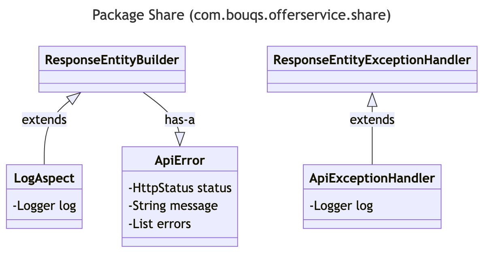

# com.bouqs.offerservice.share

## Class: ResponseEntityBuilder

**com.bouqs.offerservice.share.ResponseEntityBuilder**

```java
public class ResponseEntityBuilder 
```
The ResponseEntityBuilder class is a public class that is used to build response entities. It provides methods to create and customize response entities based on various attributes such as status code, headers, and body. It is designed to be used by software engineers to simplify the process of constructing response entities for HTTP requests in their applications. The class does not have any fields or specific state, but instead focuses on providing a set of methods for creating response entities.
## Class: LogAspect

**com.bouqs.offerservice.share.LogAspect**

```java
@Aspect
@Component
public class LogAspect 
```
# LogAspect Class

The LogAspect class is a software component that acts as an aspect for logging purposes. It is annotated with the @Aspect and @Component annotations, indicating its role in handling cross-cutting concerns related to logging.

This class provides methods and fields to facilitate logging functionality within an application. The primary purpose of the LogAspect class is to intercept specific join points in the program flow and perform logging actions either before or after the execution of those join points.

With a logBefore method and a logExecutionTime method, the LogAspect class enables the logging of relevant information before and during the execution of specific code blocks, respectively. These methods can be customized to record relevant data, such as method parameters, execution times, or any other pertinent information useful for debugging and monitoring purposes.

Internally, the LogAspect class utilizes a Logger instance, implemented using the LogManager.getLogger method. This logger is responsible for capturing and outputting log messages associated with the LogAspect class.

Overall, the LogAspect class acts as a valuable tool for software engineers to introduce logging functionality in their applications, allowing for improved analysis, troubleshooting, and performance monitoring capabilities.
### Method: logBefore
```java
@Before("controller()")
public void logBefore(JoinPoint joinPoint) {
    ServletRequestAttributes attributes = (ServletRequestAttributes) RequestContextHolder.getRequestAttributes();
    HttpServletRequest request = attributes.getRequest();
    log.debug("IP = {}; URL = {}; METHOD = {}; CLASS_METHOD = {}; ARGS = {}", request::getRemoteAddr, request::getRequestURL, request::getMethod, () -> String.join(".", joinPoint.getSignature().getDeclaringTypeName(), joinPoint.getSignature().getName()), joinPoint::getArgs);
}
```

### logBefore Overview 

The `logBefore` method, defined in the `LogAspect` class of the `com.bouqs.offerservice.share` package, serves as an advice to be executed before the execution of any method annotated with the `@Controller` aspect. 

In the method's body, it first obtains the `ServletRequestAttributes` from the `RequestContextHolder`. It then retrieves the `HttpServletRequest` object from the attributes. 

The method then logs debug information including the remote IP address, the request URL, the request method, the class and method being intercepted, and the arguments being passed to the method. 

This method is used to log information before the execution of controller methods for debugging and monitoring purposes.


### logBefore Step by Step  

The `logBefore` method in the `LogAspect` class is a method that gets executed before the execution of any controller method. Its purpose is to log relevant information about the incoming request.

Here are the steps involved in the `logBefore` method:

1. The method is annotated with `@Before("controller()")`, which ensures that this method will be executed before any controller method.
2. The first line of code retrieves the request attributes using `ServletRequestAttributes` and stores them in the `attributes` variable.
3. The second line of code gets the `HttpServletRequest` object from the `attributes` variable, which represents the current request.
4. The next line of code logs the following information using the `log.debug` method:
   - The IP address of the requester (`request::getRemoteAddr`)
   - The URL of the request (`request::getRequestURL`)
   - The HTTP method used (`request::getMethod`)
   - The name of the class and method being called (`() -> String.join(".", joinPoint.getSignature().getDeclaringTypeName(), joinPoint.getSignature().getName())`)
   - The arguments passed to the method (`joinPoint::getArgs`)

By executing this method before any controller method, you can conveniently log important details about each incoming request to aid in debugging and tracking.

sequenceDiagram
    participant LogAspect
    participant JoinPoint
    participant ServletRequestAttributes
    participant HttpServletRequest
    
    LogAspect->>ServletRequestAttributes: getRequestAttributes()
    ServletRequestAttributes-->>LogAspect: Return attributes
    LogAspect->>HttpServletRequest: getRequest()
    HttpServletRequest-->>LogAspect: Return request
    LogAspect->>JoinPoint: getSignature()
    JoinPoint-->>LogAspect: Return signature
    LogAspect->>JoinPoint: getArgs()
    JoinPoint-->>LogAspect: Return args
    LogAspect->>HttpServletRequest: getRemoteAddr()
    HttpServletRequest-->>LogAspect: Return remote address
    LogAspect->>HttpServletRequest: getRequestURL()
    HttpServletRequest-->>LogAspect: Return request URL
    LogAspect->>HttpServletRequest: getMethod()
    HttpServletRequest-->>LogAspect: Return request method
    LogAspect->>JoinPoint: getSignature().getDeclaringTypeName()
    JoinPoint-->>LogAspect: Return declaring type name
    LogAspect->>JoinPoint: getSignature().getName()
    JoinPoint-->>LogAspect: Return method name
    LogAspect->>Log: debug()

### Method: logExecutionTime
```java
private Object logExecutionTime(ProceedingJoinPoint pjp, String type) throws Throwable {
    CodeSignature signature = (CodeSignature) pjp.getSignature();
    String methodName = signature.getName();
    Class<?> clz = signature.getDeclaringType();
    String className = clz.getSimpleName();
    Instant start = Instant.now();
    Object o = pjp.proceed();
    log.debug("Start Repository: {}; Result: {}; Total Time: {}", () -> String.join(".", className, methodName), () -> o, () -> String.join(" ", String.valueOf(Duration.between(start, Instant.now()).toMillis()), "ms"));
    //logger.info("End " + type + ":Result :" + o);
    //logger.info("End " + type + ":Total Time :" + Duration.between(start, Instant.now()).toMillis() + "ms");
    return o;
}
```

### logExecutionTime Overview 

The `logExecutionTime` method in the `LogAspect` class is a method used for logging the execution time of a specific method. 

Here's a breakdown of what the method does:

1. It takes two parameters: `pjp`, which is a ProceedingJoinPoint object that represents the method being executed, and `type`, which is a string representing the type of the method being executed.
2. It retrieves the name of the method and the declaring class using the `getSignature()` method of the `ProceedingJoinPoint` object.
3. It gets the current timestamp using `Instant.now()` to track the start time of the method execution.
4. It then proceeds with the execution of the method by calling `pjp.proceed()` and stores the return value in the variable `o`.
5. It logs the relevant information using the `log.debug()` method, including the class name, method name, method result, and the total execution time calculated by subtracting the start time from the current time.
6. Finally, it returns the result of the method execution.

Note: There are two commented lines in the method (`logger.info()`) which suggest that there might be alternative logging implementations, but they are currently not being used.


### logExecutionTime Step by Step  

The logExecutionTime method is a part of the com.bouqs.offerservice.share.LogAspect class. It serves the purpose of logging the execution time of a specific method.

Here are the steps that this method follows:

1. It takes two parameters: the ProceedingJoinPoint object, pjp, and a String type.
2. It retrieves the signature information of the method being executed using the pjp object. The method name and the declaring class name are extracted from the signature.
3. The start time of the method execution is recorded using the Instant.now() method.
4. The method execution is then proceeded using the pjp object, and the result is stored in the Object o.
5. A debug log statement is generated using the logging framework, which includes the following information:
   - Start Repository: [className.methodName] - representing the fully qualified method name.
   - Result: [o] - representing the result of the method execution.
   - Total Time: [duration] ms - representing the duration of the method execution in milliseconds.
6. Finally, the method returns the result of the method execution, stored in the object o.

Note: There are two logger.info() statements in the original code, which are currently commented out. They provide similar information to the debug log statement but use a different log level and format.

sequenceDiagram
    participant ProceedingJoinPoint
    participant CodeSignature
    participant Object
    participant String
    participant Class
    participant Instant
    participant Logger
    
    ProceedingJoinPoint->>CodeSignature: getSignature()
    CodeSignature->>String: getName()
    CodeSignature->>Class: getDeclaringType()
    Class-->>String: getSimpleName()
    Instant->>Instant: now()
    ProceedingJoinPoint->>Object: proceed()
    Object->>Logger: debug()

## Class: ApiExceptionHandler

**com.bouqs.offerservice.share.ApiExceptionHandler**

```java
@RestControllerAdvice
public class ApiExceptionHandler extends ResponseEntityExceptionHandler 
```
## Class Description: 

The `ApiExceptionHandler` class is a software component that handles exceptions and provides error responses for the API. It is annotated with `@RestControllerAdvice`, indicating that it is responsible for providing advice to all REST controllers in the application. This class extends `ResponseEntityExceptionHandler`, which is a base class provided by Spring Framework for handling common exception scenarios in a RESTful way.

The `ApiExceptionHandler` class contains several methods for handling different types of exceptions. These methods receive an exception as input and return a `ResponseEntity` object that encapsulates the error response. 

The purpose of this class is to centralize exception handling logic and provide consistent error responses across the API. By using `ApiExceptionHandler`, developers can easily handle and customize exceptions, ensuring a uniform and user-friendly experience for API clients. 

The class also includes a private field, `log`, which is an instance of `Logger` from the Apache `LogManager` framework. This logger is used for logging any relevant information or debugging messages related to exception handling.

Overall, the `ApiExceptionHandler` class plays a crucial role in handling exceptions and providing error responses in a RESTful API, enhancing the reliability and usability of the application.
### Method: handleResourceNotFoundException
```java
@ExceptionHandler(ResourceNotFoundException.class)
public ResponseEntity<Object> handleResourceNotFoundException(ResourceNotFoundException ex) {
    List<String> details = new ArrayList<String>();
    details.add(ex.getMessage());
    log.error(ex.getMessage(), ex);
    ApiError err = new ApiError(LocalDateTime.now(), HttpStatus.NOT_FOUND, "Resource Not Found", details);
    return ResponseEntityBuilder.build(err);
}
```

### handleResourceNotFoundException Overview 

The method `handleResourceNotFoundException` is a exception handler method defined in the `ApiExceptionHandler` class. It specifically handles the `ResourceNotFoundException` exception.
 
When an occurrence of `ResourceNotFoundException` is encountered in the application, this method is called to handle it. 

The method takes the `ResourceNotFoundException` object as an argument and creates an `ApiError` object. It logs the exception message and error, and then sets the `HttpStatus` to `NOT_FOUND` and the error message to "Resource Not Found". 

Finally, it returns a `ResponseEntity` object using `ResponseEntityBuilder.build(err)` with the `ApiError` object as the body.


### handleResourceNotFoundException Step by Step  

The method `handleResourceNotFoundException` is a part of the `ApiExceptionHandler` class in the `com.bouqs.offerservice.share` package. It handles exceptions of type `ResourceNotFoundException` and returns an appropriate `ResponseEntity` object.

Here is a step-by-step explanation of what this method does:

1. It is annotated with `@ExceptionHandler(ResourceNotFoundException.class)`, indicating that it is the handler for exceptions of the `ResourceNotFoundException` type.

2. The method takes a single parameter, `ex`, which represents the exception that was thrown.

3. It creates an empty `details` list to store additional error details.

4. It adds the exception's message to the `details` list using the `add` method.

5. It logs an error message using the `log` object, including the exception's message and the exception itself.

6. It creates a new `ApiError` object, passing the current timestamp, `HttpStatus.NOT_FOUND`, a suitable message ("Resource Not Found"), and the `details` list.

7. It returns the `ApiError` object encapsulated in a `ResponseEntity` object. The `ResponseEntityBuilder.build` method is used to build the `ResponseEntity` object.

Overall, this method handles the `ResourceNotFoundException` by creating an `ApiError` object with the appropriate details and returning it as a `ResponseEntity` object.

---
title: Handle ResourceNotFoundException (ApiExceptionHandler)
---

sequenceDiagram
    participant ResourceNotFoundException
    participant List
    participant ArrayList
    participant log
    participant ApiError
    participant LocalDateTime
    participant HttpStatus
    participant ResponseEntityBuilder
    participant ResponseEntity
    
    ResourceNotFoundException->>List: Create list of details
    List->>ArrayList: Add exception message to details list
    ResourceNotFoundException->>log: Log exception message
    log-->>ResourceNotFoundException: Return logged error
    ResourceNotFoundException->>ApiError: Create ApiError object
    LocalDateTime-->>ApiError: Get current date and time
    HttpStatus-->>ApiError: Set HTTP status as NOT_FOUND
    ArrayList-->>ApiError: Set details list in ApiError
    ApiError-->>ResponseEntityBuilder: Build ResponseEntity
    ResponseEntityBuilder-->>ResponseEntity: Return ResponseEntity

### Method: handleInvalidInputException
```java
@ExceptionHandler(InvalidInputException.class)
public ResponseEntity<Object> handleInvalidInputException(InvalidInputException ex) {
    List<String> details = new ArrayList<String>();
    details.add(ex.getMessage());
    log.error(ex.getMessage(), ex);
    ApiError err = new ApiError(LocalDateTime.now(), HttpStatus.BAD_REQUEST, "Bad Request", details);
    return ResponseEntityBuilder.build(err);
}
```

### handleInvalidInputException Overview 

The method `handleInvalidInputException` is a method defined in the class `com.bouqs.offerservice.share.ApiExceptionHandler`. This method is annotated with `@ExceptionHandler(InvalidInputException.class)`, indicating that it handles exceptions of type `InvalidInputException`.

The method takes an `InvalidInputException` as a parameter and returns a `ResponseEntity<Object>`. 

Inside the method, a new `ArrayList` called `details` is created. The exception message is added to this list using the `add` method.

Then, the exception message is logged using the `log.error` method. The exception itself is also logged for further debugging purposes.

An `ApiError` object is created, with the current date and time, a HTTP status code of `BAD_REQUEST`, a message of "Bad Request", and the `details` list.

Finally, the `ApiError` object is passed to a `ResponseEntityBuilder.build` method to create a `ResponseEntity` object, which is then returned by the method.

This method essentially handles the `InvalidInputException` by creating and returning a `ResponseEntity` object containing an `ApiError` object, which encapsulates the error details.


### handleInvalidInputException Step by Step  

The `handleInvalidInputException` method in the `ApiExceptionHandler` class is responsible for capturing and handling any invalid input exceptions that occur during the execution of the code.

Here is a step-by-step explanation of what this method does:

1. The `@ExceptionHandler` annotation specifies that this method should be invoked when an `InvalidInputException` occurs.

2. The method takes an `InvalidInputException` object as a parameter, which represents the exception that was thrown.

3. Inside the method, a new `ArrayList` called `details` is created to store the error message.

4. The error message from the `InvalidInputException` is added to the `details` list using the `add` method.

5. The `log.error` statement is used to log the error message and the exception stack trace.

6. A new `ApiError` object is created with the current timestamp, `HttpStatus.BAD_REQUEST`, and a generic error message of "Bad Request". The `details` list is passed as a parameter to the constructor of the `ApiError` class.

7. Finally, the `ApiError` object is passed to a `ResponseEntityBuilder.build` method, which generates a `ResponseEntity` object. This `ResponseEntity` object encapsulates the `ApiError` object and is returned as the result of the method.

By following this approach, any invalid input exceptions thrown within the code will be caught by this method and transformed into a custom `ApiError` object, which can be utilized to generate a meaningful response to the client.

---
title: handleInvalidInputException (ApiExceptionHandler)
---

sequenceDiagram
    participant InvalidInputException
    participant List
    participant String
    participant ArrayList
    participant log
    participant ApiError
    participant LocalDateTime
    participant HttpStatus
    participant ResponseEntityBuilder
    participant ResponseEntity

    InvalidInputException->>List: Create list of details
    List->>String: Add exception message to details
    String->>ArrayList: Create new ArrayList
    ArrayList-->>List: Return ArrayList
    InvalidInputException->>log: Log exception message
    log-->>ApiError: Create new ApiError
    LocalDateTime-->>ApiError: Get current date and time
    HttpStatus-->>ApiError: Set HTTP status to BAD_REQUEST
    ArrayList-->>ApiError: Set details in ApiError
    ApiError->>ResponseEntityBuilder: Build ResponseEntity
    ResponseEntityBuilder-->>ResponseEntity: Return ResponseEntity

### Method: handleException
```java
@ExceptionHandler(value = { Exception.class })
public ResponseEntity<Object> handleException(Exception ex) {
    List<String> details = new ArrayList<String>();
    details.add(ex.getMessage());
    log.error(ex.getMessage(), ex);
    ApiError err = new ApiError(LocalDateTime.now(), HttpStatus.INTERNAL_SERVER_ERROR, "Internal Server Error", details);
    return ResponseEntityBuilder.build(err);
}
```

### handleException Overview 

The method `handleException` in the class `com.bouqs.offerservice.share.ApiExceptionHandler` is designed to handle any exception that occurs and return an appropriate response.

The method is annotated with `@ExceptionHandler(value = { Exception.class })` which means it will catch any exception of type `Exception` or its subclasses.

The method takes an `Exception` object as a parameter and creates a new `ApiError` object. It first creates an empty list called `details` and adds the exception message to it using `ex.getMessage()`. 

Then, the method logs the error using the `log.error` method, passing the exception message and the exception object itself as parameters.

Finally, the method creates an `ApiError` object that includes the current timestamp, an `HttpStatus.INTERNAL_SERVER_ERROR` status code, a default error message of "Internal Server Error", and the details list. 

The method then returns a `ResponseEntity` object by calling `ResponseEntityBuilder.build(err)`, where `err` is the `ApiError` object that was created earlier. The `ResponseEntity` object represents the HTTP response that will be sent back to the client.

Overall, this method is responsible for handling exceptions, logging the error, and returning an appropriate HTTP response with an error message and other relevant details.


### handleException Step by Step  

The `handleException` method in the `com.bouqs.offerservice.share.ApiExceptionHandler` class is responsible for handling exceptions that occur during the execution of the code. 

Here is a step-by-step breakdown of what this method does:

1. The `@ExceptionHandler` annotation specifies that this method will handle exceptions of type `Exception`.
2. The method takes an `Exception` object as a parameter.
3. It creates an empty list called `details` to store additional details about the exception.
4. The exception message is retrieved using the `getMessage()` method and added to the `details` list.
5. The exception and its stack trace are logged using the `log.error()` method.
6. A new `ApiError` object is created with the following parameters:
   - `LocalDateTime.now()`: The current date and time.
   - `HttpStatus.INTERNAL_SERVER_ERROR`: The HTTP status code indicating an internal server error.
   - "Internal Server Error": A description of the error.
   - `details`: The list containing the exception message.
7. The `build()` method of the `ResponseEntityBuilder` class is called with the `ApiError` object as a parameter to create a `ResponseEntity` object.
8. The `ResponseEntity` object is returned to the caller.

This method ensures that any exception received is logged, and a standardized error response is returned to the client indicating that an internal server error has occurred. The response includes the exception message for further investigation.

---
title: Handle Exception (ApiExceptionHandler)
---

sequenceDiagram
    participant Exception
    participant List
    participant log
    participant ApiError
    participant LocalDateTime
    participant HttpStatus
    participant ResponseEntityBuilder
    participant ResponseEntity
    
    Exception->>List: Create details list
    List-->>Exception: Return details list
    Exception->>log: Log error message
    log-->>Exception: Return logged error message
    LocalDateTime-->>ApiError: Get current date and time
    HttpStatus-->>ApiError: Set HTTP status code
    ApiError->>List: Set error details
    List-->>ApiError: Return error details
    ApiError-->>ResponseEntityBuilder: Build response entity
    ResponseEntityBuilder-->>ResponseEntity: Return response entity
    ResponseEntity-->>Exception: Return response entity

## Class: ApiError

**com.bouqs.offerservice.share.ApiError**

```java
@Getter
@Setter
@AllArgsConstructor
public class ApiError 
```
# ApiError Class

The `ApiError` class is a representation of an error that can occur in an API. It provides information about the error such as the timestamp, status code, error message, and any additional detailed error messages.

The class has the following fields:

- **timestamp**: A `LocalDateTime` object representing the date and time when the error occurred.
- **status**: An `HttpStatus` object representing the HTTP status code of the error.
- **message**: A string representing a concise description of the error.
- **errors**: A list of strings containing additional detailed error messages.

The `ApiError` class is annotated with `@Getter`, `@Setter`, and `@AllArgsConstructor` annotations, which generate getter and setter methods for all the fields and a constructor with arguments for all the fields.

Additionally, the class is annotated with `@JsonFormat` to specify the format of the `timestamp` field when it is serialized to JSON.

Overall, the `ApiError` class provides a convenient and standardized way to represent and handle errors in an API, making it easier for clients to understand and handle error responses.
