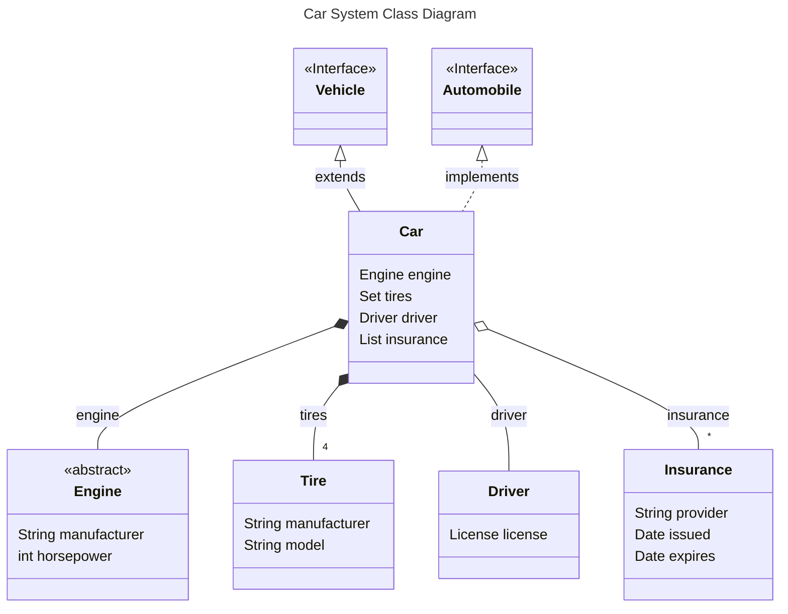
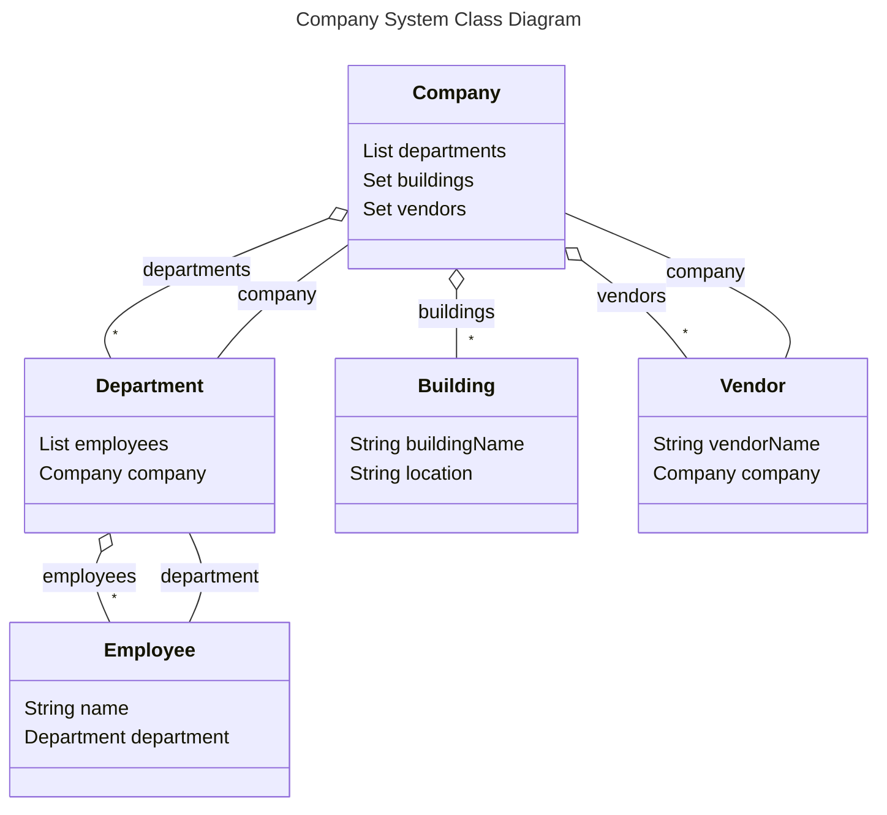
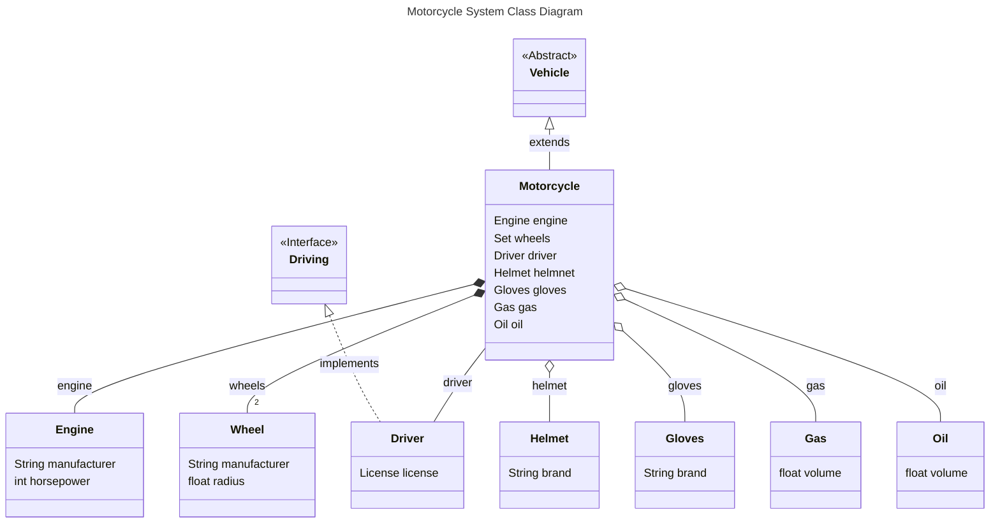
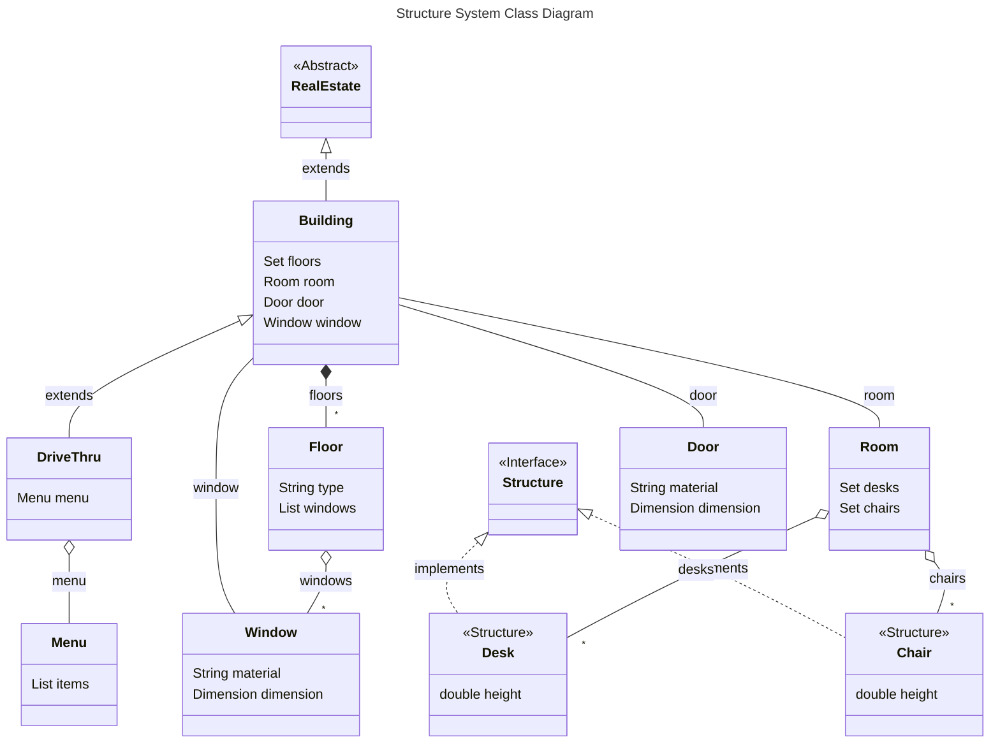
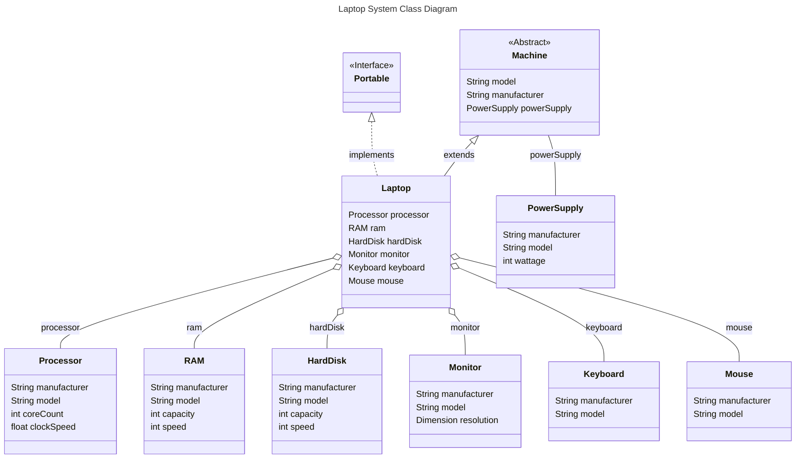

# Input 1
```
public class Car extends Vehicle implements Automobile
Fields:
- private Engine engine
- private Set<Tire> tires
- private Driver driver
- private List<Insurance> insurance

public interface Vehicle
Fields:
- No fields

public interface Automobile
Fields:
- No fields

public abstract class Engine
Fields:
- private String manufacturer
- private int horsepower

public class Tire
Fields:
- private String manufacturer
- private String model

public class Driver
Fields:
- private License license

public class Insurance
Fields:
- private String provider
- private Date issued
- private Date expires
```

# Output 1


# Input 2
```
public class Company
Fields:
- private List<Department> departments
- private Set<Building> buildings
- private Set<Vendor> vendors


public class Department
Fields:
- private List<Employee> employees
- private Company company

public class Building
Fields:
- private String buildingName
- private String location

public class Employee
Fields:
- private String name
- private Department department

public class Vendor
Fields:
- private String vendorName
- private Company company
```

# Output 2


# Input 3
```
public class Motorcycle extends Vehicle
Fields:
- private Engine engine
- private Set<Wheel> wheels
- private Driver driver
- private Helmet helmet
- private Gloves gloves
- private Gas gas
- private Oil oil

public abstract class Vehicle
Fields:
- No fields

public interface Driving
Fields:
- No fields

public class Engine
Fields:
- private String manufacturer
- private int horsepower

public class Wheel
Fields:
- private String manufacturer
- private float radius

public class Driver implements Driving
Fields:
- private License license

public class Helmet
Fields:
- private String brand

public class Gloves
Fields:
- private String brand

public class Gas
Fields:
- private float volume

public class Oil
Fields:
- private float volume
```

# Output 3


# Input 4
```
public class Building extends RealEstate
Fields:
- private Set<Floor> floors
- private Room room
- private Door door
- private Window window

public DriveThru extends Building
Fields:
- private Menu menu

public abstract RealEstate
Fields:
- private String address
- private double price

public interface Structure
Fields:
- No fields


public class Room
Fields:
- private Set<Desk> desks
- private Set<Chair> chairs

public class Door
Fields:
- private String material
- private Dimension dimension

public class Window
Fields:
- private String material
- private Dimension dimension

public class Floor
Fields:
- private String type
- private List<Window> windows

public class Desk
Fields:
- private double height

public class Chair
Fields:
- private double height

public class Menu 
Fields:
- private List<Item> items
```

# Output 4


# Input 5
```
public abstract class Machine
Fields:
- private String model
- private String manufacturer
- private PowerSupply powerSupply

public class Laptop extends Machine
Fields:
- private Processor processor
- private RAM ram
- private HardDisk hardDisk
- private Monitor monitor
- private Keyboard keyboard
- private Mouse mouse

public interface Portable
Fields:
- No fields

public class Processor
Fields:
- private String manufacturer
- private String model
- private int coreCount
- private float clockSpeed

public class RAM
Fields:
- private String manufacturer
- private String model
- private int capacity
- private int speed

public class HardDisk
Fields:
- private String manufacturer
- private String model
- private int capacity
- private float speed

public class Monitor
Fields:
- private String manufacturer
- private String model
- private Dimension resolution

public class Keyboard
Fields:
- private String manufacturer
- private String model

public class PowerSupply
Fields:
- private String manufacturer
- private String model
- private int wattage

public class Mouse
Fields:
- private String manufacturer
- private String model
```

# Output 5

