## Desirable Participants:
1. NewsService
2. ArticleSorter
3. AudioTranscriber
4. ChatBot
5. PaymentProcessor
6. OrderManager
7. EmailSender
8. NotificationService
9. UserService
10. DatabaseManager
11. FileUploader
12. ImageProcessor
13. VideoEncoder
14. AuthenticationManager
15. LoggingService
16. RecommendationEngine
17. SearchIndexer
18. ReportGenerator
19. AnalyticsService
20. CacheManager
21. QueueProcessor
22. PDFGenerator
23. EncryptionService
24. ValidationService
25. ImageDownloader

## Undesirable Participants:
1. File
2. ChatRequest
3. EmbeddingRequest
4. AudioResponse
5. Article
6. Queue
7. String
8. ObjectNode
9. Json
10. StringNode
11. Throwable
12. Exception
13. System.out
14. byte[]
15. float
16. int
17. boolean
18. char
19. double
20. long
21. short
22. void
23. Object
24. List
25. Map

# Now let's proceed with the five illustrative Mermaid sequence diagrams and their associated Java methods.

## Sequence Diagram 1

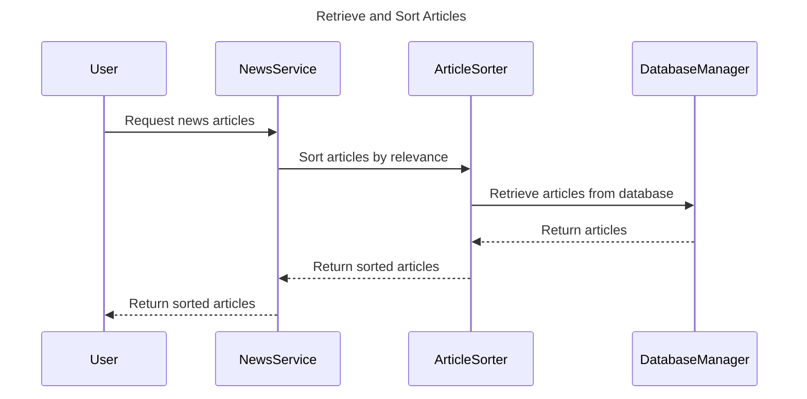

Java Method:

```java
public List<Article> getSortedArticles() {
    List<Article> articles = databaseManager.retrieveArticles();
    List<Article> sortedArticles = articleSorter.sortArticles(articles);
    return sortedArticles;
}
```

## Sequence Diagram 2

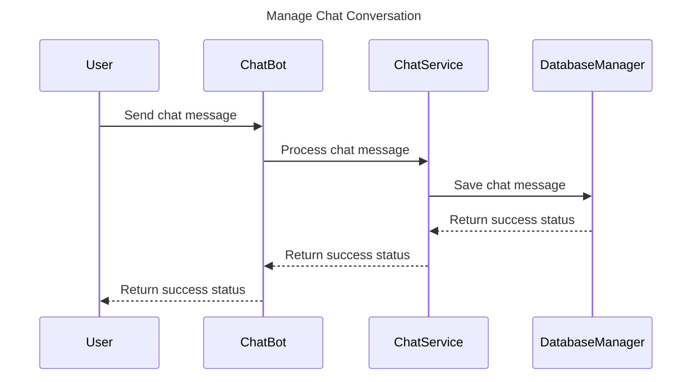

Java Method:

```java
public boolean saveChatMessage(String message) {
    boolean success = chatService.processMessage(message);
    if (success) {
        boolean saved = databaseManager.saveMessage(message);
        return saved;
    }
    return false;
}
```

## Sequence Diagram 3

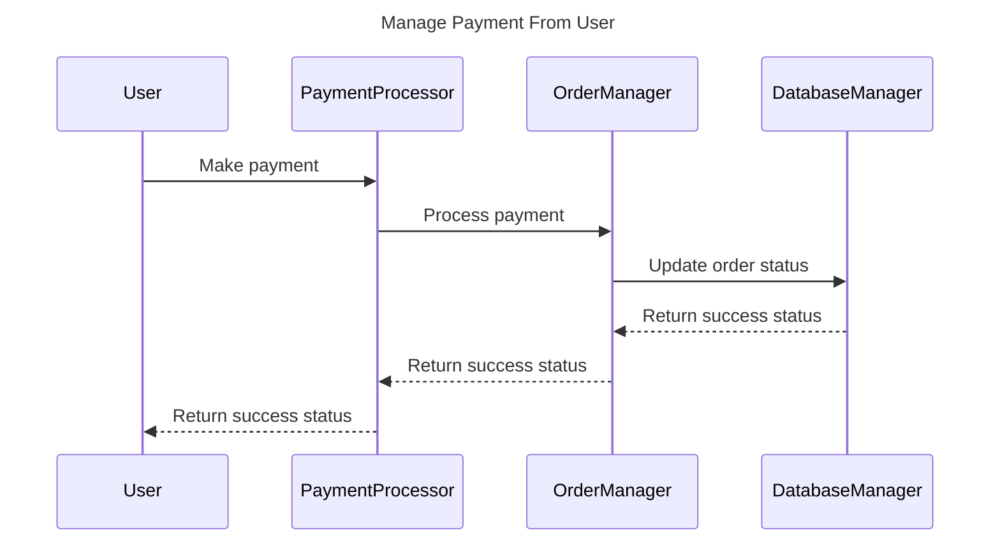

Java Method:

```java
public boolean processPayment(double amount) {
    boolean success = paymentProcessor.makePayment(amount);
    if (success) {
        boolean updated = orderManager.updateOrderStatus();
        return updated;
    }
    return false;
}
```

## Sequence Diagram 4

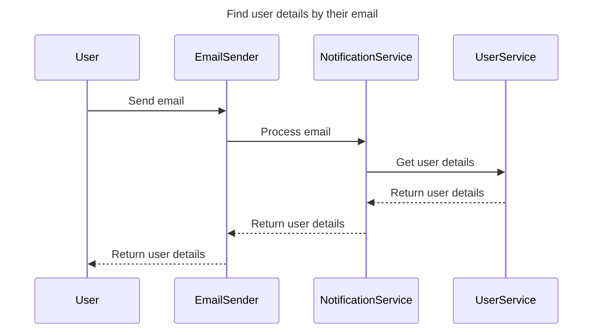

Java Method:

```java
public User getUserDetailsForEmail(String email) {
    User user = userService.getUserByEmail(email);
    if (user != null) {
        boolean sent = emailSender.sendEmail(user.getEmail());
        if (sent) {
            return user;
        }
    }
    return null;
}
```

## Sequence Diagram 5

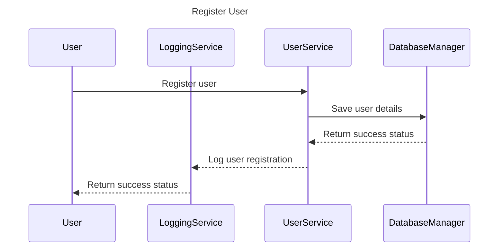

Java Method:

```java
public boolean registerUser(User user) {
    boolean saved = databaseManager.saveUser(user);
    if (saved) {
        boolean logged = userService.logUserRegistration(user);
        return logged;
    }
    return false;
}
```

# Now let's generate five Mermaid sequence diagrams from different Java methods.

## Java Method 1

```java
public void processOrder(Order order) {
    boolean validated = validationService.validateOrder(order);
    if (validated) {
        boolean processed = orderProcessor.processOrder(order);
        if (processed) {
            emailService.sendOrderConfirmation(order);
        }
    }
}
```

Sequence Diagram:

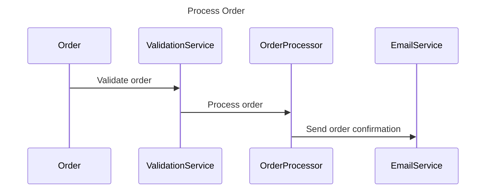

## Java Method 2

```java
public void generateReport(String reportType) {
    Report report = reportGenerator.generate(reportType);
    if (report != null) {
        fileUploader.upload(report);
        emailService.sendReport(report);
    }
}
```

Sequence Diagram:

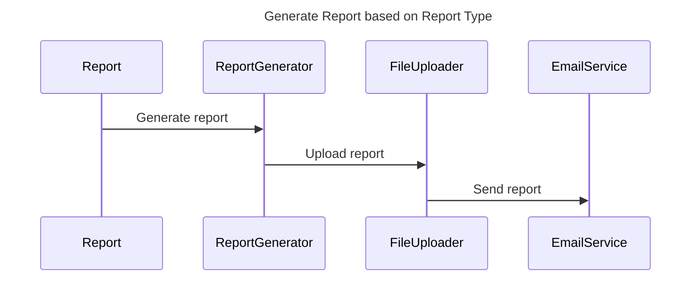

## Java Method 3

```java
public void processPayment(double amount) {
    boolean authorized = paymentService.authorizePayment(amount);
    if (authorized) {
        boolean processed = paymentProcessor.processPayment(amount);
        if (processed) {
            notificationService.sendPaymentConfirmation(amount);
        }
    }
}
```

Sequence Diagram:

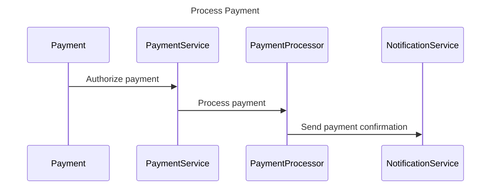

## Java Method 4

```java
public void processChatMessage(ChatMessage message) {
    boolean filtered = chatFilter.filterMessage(message);
    if (filtered) {
        boolean processed = chatProcessor.processMessage(message);
        if (processed) {
            chatHistory.saveMessage(message);
        }
    }
}
```

Sequence Diagram:

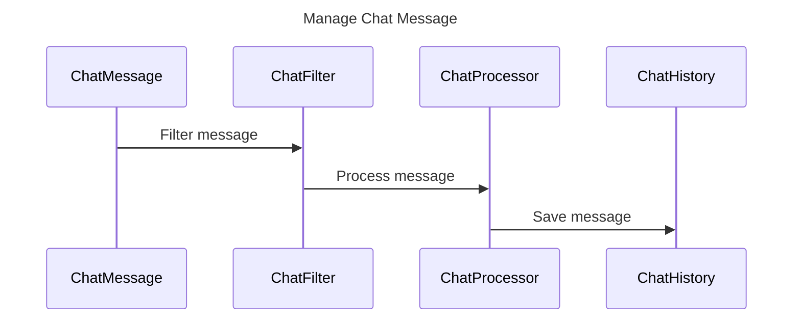

## Java Method 5

```java
public void processImage(Image image) {
    Image processedImage = imageProcessor.process(image);
    if (processedImage != null) {
        fileUploader.upload(processedImage);
        notificationService.sendImageProcessedNotification(processedImage);
    }
}
```

Sequence Diagram:

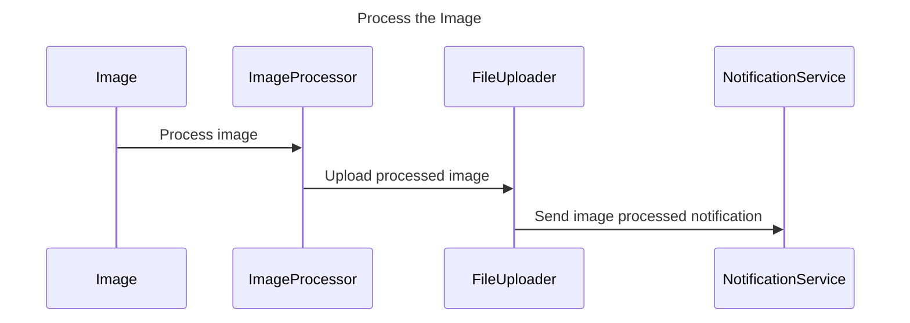

# Error Handling Example:

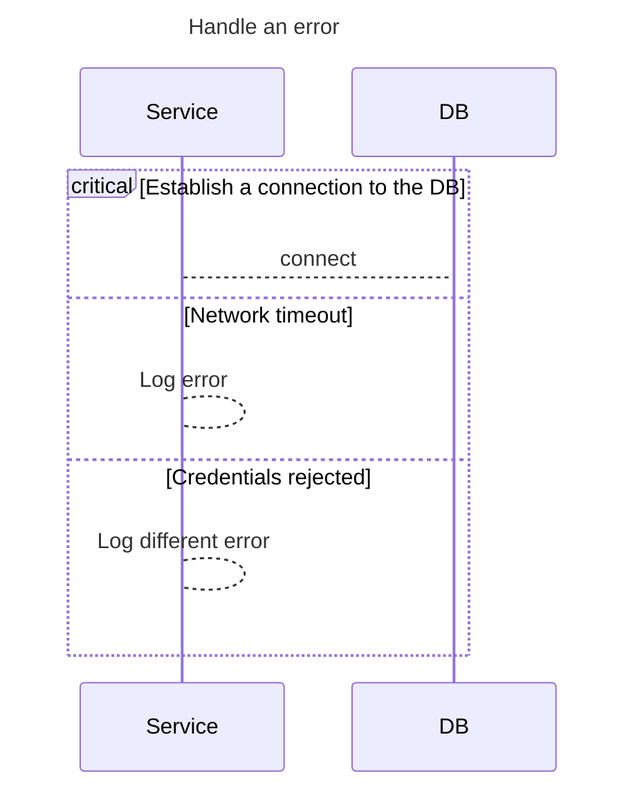

# Show alt and opt example 
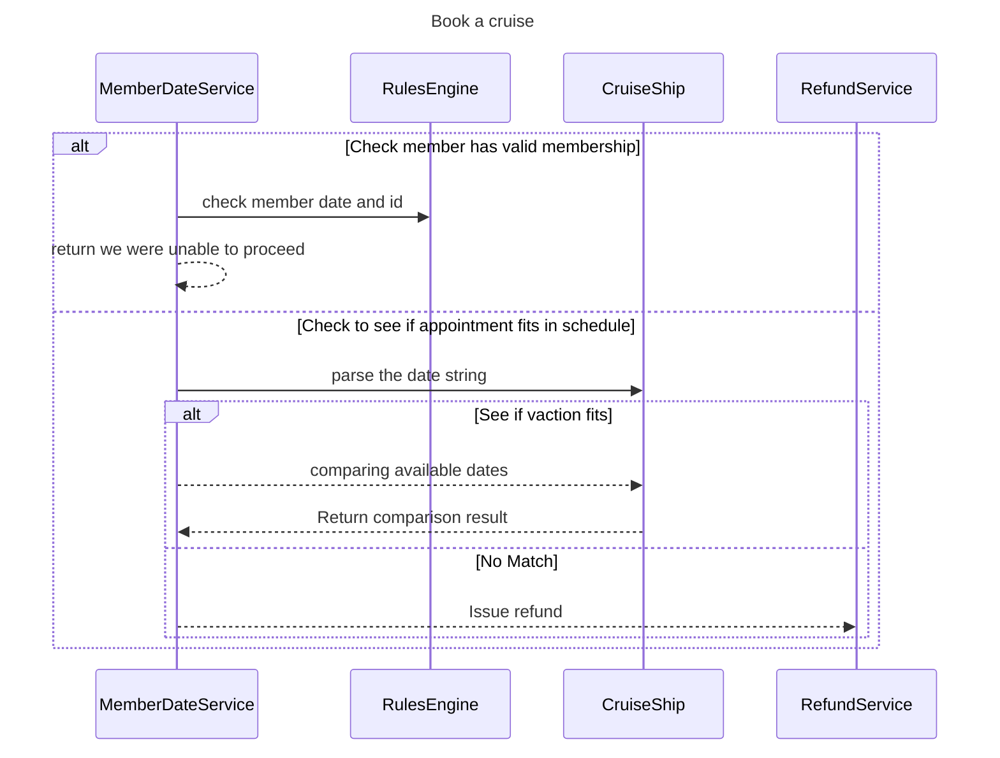
